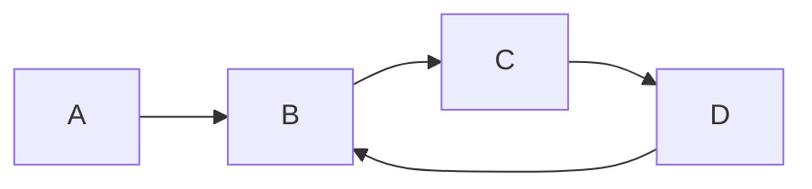

# 基于社交网络推荐学术合作者

## 1. 背景介绍

### 1.1 学术合作的重要性

在当今科学研究领域，学术合作已成为推动知识进步和创新的关键因素。有效的学术合作可以：

* **汇集不同领域的专业知识：** 不同研究背景的学者可以带来独特的视角和方法，促进跨学科研究和创新。
* **提高研究效率：** 合作可以分担研究任务，共享资源，加速研究进程。
* **扩大研究影响力：** 合作发表的论文更容易被高影响因子期刊收录，并获得更多引用。

### 1.2 传统寻找合作者方式的局限性

传统的寻找学术合作者的方式主要依赖于以下几种：

* **熟人推荐：** 通过导师、同事或朋友介绍潜在的合作者。这种方式受限于个人社交圈，难以发现圈子以外的优秀学者。
* **学术会议和研讨会：**  学者可以在会议上结识同行，但会议时间有限，难以进行深入交流。
* **阅读文献：** 通过阅读相关领域的论文，寻找潜在的合作者。这种方式效率较低，且难以评估学者的合作意愿和能力。

### 1.3 社交网络推荐的优势

社交网络的兴起为寻找学术合作者提供了新的思路。基于社交网络的推荐系统可以：

* **突破地理限制：**  帮助学者发现全球范围内的潜在合作者。
* **挖掘潜在联系：**  通过分析学者之间的关系网络，识别出潜在的合作机会。
* **个性化推荐：**  根据学者的研究兴趣和需求，推荐最匹配的合作者。


## 2. 核心概念与联系

### 2.1  社交网络分析

社交网络分析（SNA）是研究社会结构的一种方法，它将社会关系表示为节点和边，并使用图论和网络科学的方法来分析节点之间的关系。

* **节点：**  代表网络中的个体，例如学者。
* **边：**  代表节点之间的关系，例如合作关系、共同作者关系、引用关系等。

### 2.2  推荐系统

推荐系统是一种信息过滤系统，旨在根据用户的兴趣和行为，预测用户对特定项目的偏好。

* **协同过滤：**  根据用户对其他项目的评分来预测用户对目标项目的评分。
* **基于内容的过滤：**  根据用户过去喜欢的项目的特征来预测用户对目标项目的偏好。
* **混合推荐：**  结合协同过滤和基于内容的过滤方法。

### 2.3  学术社交网络

学术社交网络是指由学者及其之间的学术关系构成的网络。常见的学术社交网络数据来源包括：

* **文献数据库：**  例如 Web of Science、Scopus 等。
* **学术社交平台：**  例如 ResearchGate、Academia.edu 等。
* **机构网站：**  例如大学和研究机构的网站。


## 3. 核心算法原理具体操作步骤

### 3.1  数据收集与预处理

* 从文献数据库、学术社交平台和机构网站等数据源收集学者信息和学术关系数据。
* 对数据进行清洗和预处理，例如去除重复数据、处理缺失值等。
* 构建学术社交网络图，将学者表示为节点，将学术关系表示为边。

### 3.2  特征工程

* 从学者信息和学术关系数据中提取特征，例如：
    * **学者特征：**  研究领域、发表论文数量、h-index 等。
    * **关系特征：**  合作次数、共同作者数量、引用次数等。
* 对特征进行标准化或归一化处理，以消除不同特征之间的量纲差异。

### 3.3  推荐模型训练

* 选择合适的推荐算法，例如：
    * **基于图的推荐算法：**  例如 Personalized PageRank、Node2Vec 等。
    * **矩阵分解：**  例如 SVD、NMF 等。
    * **深度学习：**  例如 Graph Neural Networks (GNNs) 等。
* 使用历史数据训练推荐模型，并使用交叉验证等方法评估模型性能。

### 3.4  推荐结果生成与评估

* 根据用户的研究兴趣和需求，使用训练好的推荐模型生成推荐列表。
* 使用指标评估推荐结果的质量，例如：
    * **准确率：**  推荐列表中用户真正感兴趣的合作者的比例。
    * **召回率：**  用户真正感兴趣的合作者中被推荐出来的比例。
    * **F1-score：**  准确率和召回率的调和平均数。


## 4. 数学模型和公式详细讲解举例说明

### 4.1  Personalized PageRank 算法

Personalized PageRank 算法是一种基于图的推荐算法，它可以根据用户的兴趣个性化地计算节点的重要性。

**算法步骤：**

1. 初始化所有节点的重要性为 1/N，其中 N 是网络中节点的数量。
2. 迭代计算每个节点的重要性，直到收敛：
   
   $$PR(i) = (1-d)/N + d * \sum_{j \in In(i)} PR(j)/Out(j)$$

   其中：
   * $PR(i)$ 是节点 i 的 PageRank 值。
   * $d$ 是阻尼系数，通常设置为 0.85。
   * $In(i)$ 是指向节点 i 的节点集合。
   * $Out(j)$ 是节点 j 指向的节点数量。

3. 根据节点的 PageRank 值对节点进行排序，推荐 PageRank 值最高的节点。

**举例说明：**

假设有一个学术社交网络，其中包含 4 个学者 A、B、C 和 D，他们的合作关系如下图所示：



使用 Personalized PageRank 算法计算学者 B 的 PageRank 值：

```
PR(B) = (1-0.85)/4 + 0.85 * (PR(A)/1 + PR(D)/1)
```

假设初始时所有节点的 PageRank 值都为 1/4，则：

```
PR(B) = (1-0.85)/4 + 0.85 * (1/4 + 1/4) = 0.425
```

### 4.2  矩阵分解

矩阵分解是一种将矩阵分解成多个矩阵的乘积的数学方法。在推荐系统中，可以使用矩阵分解将用户-项目评分矩阵分解成用户特征矩阵和项目特征矩阵。

**算法步骤：**

1. 将用户-项目评分矩阵表示为 $R$，其中 $R_{ij}$ 表示用户 i 对项目 j 的评分。
2. 将 $R$ 分解成用户特征矩阵 $P$ 和项目特征矩阵 $Q$ 的乘积：

   $$R \approx P Q^T$$

   其中：
   * $P$ 是一个 $m \times k$ 的矩阵，表示 $m$ 个用户在 $k$ 个特征上的得分。
   * $Q$ 是一个 $n \times k$ 的矩阵，表示 $n$ 个项目在 $k$ 个特征上的得分。

3. 使用梯度下降等优化算法学习 $P$ 和 $Q$ 的值，使得 $P Q^T$ 尽可能接近 $R$。

**举例说明：**

假设有一个用户-电影评分矩阵，其中包含 4 个用户和 5 部电影：

```
R = [
    [5, 3, 0, 1, 4],
    [4, 0, 0, 2, 0],
    [0, 1, 4, 4, 0],
    [2, 0, 5, 0, 0]
]
```

使用矩阵分解将 $R$ 分解成用户特征矩阵 $P$ 和电影特征矩阵 $Q$ 的乘积：

```
P = [
    [1.2, 0.8],
    [1.0, 0.0],
    [0.0, 1.0],
    [0.5, 1.5]
]

Q = [
    [2.0, 1.0],
    [1.5, 0.5],
    [0.0, 2.0],
    [1.0, 1.0],
    [2.5, 0.5]
]
```

则预测用户 1 对电影 3 的评分为：

```
P[1] * Q[3] = [1.2, 0.8] * [0.0, 2.0] = 1.6
```


## 5. 项目实践：代码实例和详细解释说明

### 5.1 使用 Python 实现基于 Personalized PageRank 的学术合作者推荐

```python
import networkx as nx

# 创建学术社交网络图
G = nx.DiGraph()
G.add_edges_from([
    ('A', 'B'),
    ('B', 'C'),
    ('C', 'D'),
    ('D', 'B')
])

# 计算 Personalized PageRank 值
personalization = {'B': 1}
pr = nx.pagerank(G, personalization=personalization)

# 打印推荐结果
print(pr)
```

**代码解释：**

1. 使用 `networkx` 库创建有向图 `G`，并添加学者之间的合作关系。
2. 使用 `nx.pagerank()` 函数计算 Personalized PageRank 值，其中 `personalization` 参数指定目标节点为 'B'。
3. 打印推荐结果，即每个学者的 PageRank 值。

### 5.2 使用 Python 实现基于矩阵分解的学术合作者推荐

```python
import numpy as np
from surprise import Dataset, Reader, SVD
from surprise.model_selection import cross_validate

# 创建用户-电影评分矩阵
ratings_data = [
    [1, 1, 5],
    [1, 2, 3],
    [1, 5, 4],
    [2, 1, 4],
    [2, 4, 2],
    [3, 2, 1],
    [3, 3, 4],
    [3, 4, 4],
    [4, 1, 2],
    [4, 3, 5]
]

# 定义数据读取器
reader = Reader(rating_scale=(1, 5))
data = Dataset.load_from_tuples(ratings_data, reader=reader)

# 使用 SVD 算法进行矩阵分解
algo = SVD()

# 使用交叉验证评估模型性能
cross_validate(algo, data, measures=['RMSE', 'MAE'], cv=5, verbose=True)

# 训练模型
trainset = data.build_full_trainset()
algo.fit(trainset)

# 预测用户 1 对电影 3 的评分
prediction = algo.predict(1, 3)
print(prediction.est)
```

**代码解释：**

1. 使用 `surprise` 库加载用户-电影评分数据，并定义数据读取器。
2. 使用 `SVD` 算法进行矩阵分解。
3. 使用 `cross_validate()` 函数进行交叉验证，评估模型性能。
4. 使用 `fit()` 方法训练模型。
5. 使用 `predict()` 方法预测用户 1 对电影 3 的评分。


## 6. 实际应用场景

### 6.1  科研项目合作

* 研究人员可以利用基于社交网络的推荐系统，快速找到与自己研究方向匹配的合作者，共同申请科研项目。
* 科研机构可以利用该系统，分析研究人员之间的合作网络，识别出潜在的合作机会，促进跨学科研究。

### 6.2  论文合作

* 作者可以使用该系统，找到与自己研究领域相关的学者，邀请其合作撰写论文。
* 期刊可以利用该系统，向审稿人推荐合适的审稿专家。

### 6.3  学术交流

* 学术会议组织者可以利用该系统，向参会者推荐潜在的合作者，促进学术交流。
* 学术机构可以利用该系统，组织线上或线下的学术交流活动，促进学者之间的合作。


## 7. 总结：未来发展趋势与挑战

### 7.1  未来发展趋势

* **更加精准的推荐：**  随着数据的积累和算法的改进，推荐系统的精度将会越来越高。
* **多源数据的融合：**  将来自不同数据源的信息融合到推荐系统中，可以提高推荐的全面性和准确性。
* **个性化推荐：**  根据用户的个性化需求，提供更加精准的推荐结果。

### 7.2  挑战

* **数据稀疏性：**  学术社交网络数据通常比较稀疏，这会影响推荐系统的性能。
* **冷启动问题：**  对于新用户或新项目，由于缺乏历史数据，推荐系统难以给出准确的推荐。
* **可解释性：**  推荐系统需要提供可解释的推荐结果，以增强用户对系统的信任度。


## 8. 附录：常见问题与解答

### 8.1  问：如何评估推荐系统的性能？

答：可以使用以下指标评估推荐系统的性能：

* **准确率：**  推荐列表中用户真正感兴趣的项目的比例。
* **召回率：**  用户真正感兴趣的项目中被推荐出来的比例。
* **F1-score：**  准确率和召回率的调和平均数。
* **NDCG：**  考虑推荐列表顺序的指标，排名靠前的项目对 NDCG 的贡献更大。

### 8.2  问：如何解决数据稀疏性问题？

答：可以使用以下方法解决数据稀疏性问题：

* **基于内容的过滤：**  根据项目本身的特征进行推荐，可以缓解数据稀疏性问题。
* **矩阵分解：**  可以将稀疏的评分矩阵分解成稠密的特征矩阵，从而提高推荐系统的性能。
* **深度学习：**  深度学习模型可以学习到数据中的复杂模式，从而提高推荐系统的性能。

### 8.3  问：如何解决冷启动问题？

答：可以使用以下方法解决冷启动问题：

* **利用用户属性信息：**  例如用户的年龄、性别、职业等信息，可以用于推荐新项目。
* **利用项目属性信息：**  例如项目的类别、标签、描述等信息，可以用于推荐给新用户。
* **利用社交网络信息：**  例如用户的关注关系、好友关系等信息，可以用于推荐新项目。
