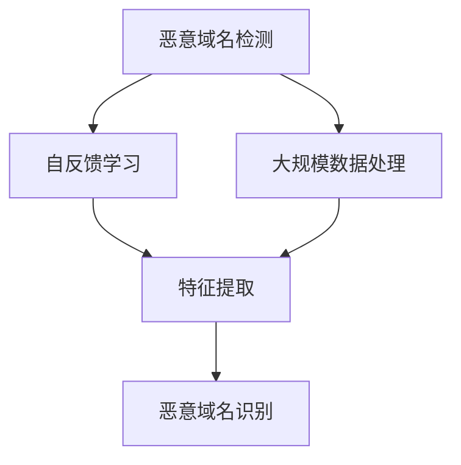

# 基于自反馈学习的大规模恶意域名检测

作者：禅与计算机程序设计艺术

## 1.背景介绍

### 1.1 恶意域名检测的现状

互联网的快速发展带来了信息传播的便利，但也伴随着网络安全威胁的增加。恶意域名检测作为网络安全的重要组成部分，旨在识别和阻止通过域名进行的恶意活动。传统的恶意域名检测方法主要依赖于黑名单和规则匹配，这些方法虽然有效，但也存在一定的局限性，如无法及时应对新出现的恶意域名、误报率高等问题。

### 1.2 自反馈学习的引入

自反馈学习（Self-supervised Learning）是一种在没有人工标注数据的情况下，通过数据本身的特征来进行学习的技术。它在图像处理、自然语言处理等领域取得了显著的成果。将自反馈学习引入到恶意域名检测中，可以有效地解决传统方法的不足，提高检测的准确性和实时性。

### 1.3 大规模检测的挑战

大规模恶意域名检测面临的主要挑战包括数据量大、实时性要求高、恶意域名的多样性和隐蔽性等。如何在海量数据中快速准确地识别出恶意域名，是一个亟待解决的问题。

## 2.核心概念与联系

### 2.1 恶意域名

恶意域名是指被用于网络攻击、钓鱼、恶意软件传播等恶意行为的域名。这些域名通常具有以下特征：
- 注册时间短
- 访问量异常
- 关联的IP地址恶意活动历史
- 域名结构复杂

### 2.2 自反馈学习

自反馈学习是一种通过数据自身的特征进行学习的方法，常见的自反馈学习方法包括对比学习、生成对抗网络（GAN）等。在恶意域名检测中，自反馈学习可以通过域名的历史访问记录、域名结构等特征进行学习，从而识别出潜在的恶意域名。

### 2.3 大规模数据处理

大规模数据处理技术包括分布式计算、并行处理等。在恶意域名检测中，可以利用大数据处理技术对海量的域名数据进行分析和处理，提高检测的效率和准确性。

### 2.4 相关技术联系

恶意域名检测、自反馈学习和大规模数据处理之间的联系如下图所示：



## 3.核心算法原理具体操作步骤

### 3.1 数据预处理

数据预处理是恶意域名检测的第一步，主要包括数据清洗、特征提取和数据增强等步骤。

#### 3.1.1 数据清洗

数据清洗的目的是去除数据中的噪声和无关信息。对于域名数据，常见的数据清洗操作包括去除无效域名、去重、填补缺失值等。

#### 3.1.2 特征提取

特征提取是将原始数据转换为机器学习模型可以处理的特征向量。对于域名数据，可以提取的特征包括域名长度、字符分布、注册时间、访问记录等。

#### 3.1.3 数据增强

数据增强是通过对原始数据进行变换，生成更多的训练样本，以提高模型的泛化能力。常见的数据增强方法包括随机裁剪、旋转、缩放等。

### 3.2 模型训练

模型训练是自反馈学习的核心步骤，主要包括模型选择、训练策略和超参数调优等。

#### 3.2.1 模型选择

常见的自反馈学习模型包括对比学习模型、生成对抗网络（GAN）等。在恶意域名检测中，可以选择适合的模型进行训练。

#### 3.2.2 训练策略

训练策略包括损失函数的选择、优化算法的选择、学习率的设置等。在自反馈学习中，常用的损失函数包括交叉熵损失、对比损失等，常用的优化算法包括梯度下降、Adam等。

#### 3.2.3 超参数调优

超参数调优是通过调整模型的超参数，提高模型性能的过程。常见的超参数包括学习率、批量大小、模型层数等。

### 3.3 模型评估

模型评估是通过一定的指标衡量模型性能的过程。常见的评估指标包括准确率、召回率、F1值等。

#### 3.3.1 准确率

准确率是指模型预测正确的样本数占总样本数的比例。

$$
\text{准确率} = \frac{\text{预测正确的样本数}}{\text{总样本数}}
$$

#### 3.3.2 召回率

召回率是指模型预测正确的正样本数占实际正样本数的比例。

$$
\text{召回率} = \frac{\text{预测正确的正样本数}}{\text{实际正样本数}}
$$

#### 3.3.3 F1值

F1值是准确率和召回率的调和平均数，用于综合衡量模型的性能。

$$
F1 = 2 \cdot \frac{\text{准确率} \cdot \text{召回率}}{\text{准确率} + \text{召回率}}
$$

## 4.数学模型和公式详细讲解举例说明

### 4.1 对比学习

对比学习是一种自反馈学习方法，通过最大化相似样本的相似度，最小化不同样本的相似度来进行学习。其损失函数为对比损失（Contrastive Loss）。

$$
L = \frac{1}{N} \sum_{i=1}^{N} \left( y_i \cdot D(x_i, x_j) + (1 - y_i) \cdot \max(0, m - D(x_i, x_j)) \right)
$$

其中，$y_i$ 表示样本对 $(x_i, x_j)$ 是否相似，$D(x_i, x_j)$ 表示样本对的距离，$m$ 表示一个阈值。

### 4.2 生成对抗网络（GAN）

生成对抗网络（GAN）由生成器（Generator）和判别器（Discriminator）组成，通过生成器生成逼真的样本，判别器判断样本的真实性来进行训练。其损失函数为对抗损失（Adversarial Loss）。

$$
L = \mathbb{E}_{x \sim p_{data}(x)} [\log D(x)] + \mathbb{E}_{z \sim p_{z}(z)} [\log (1 - D(G(z)))]
$$

其中，$D(x)$ 表示判别器对真实样本的判断，$D(G(z))$ 表示判别器对生成样本的判断，$G(z)$ 表示生成器生成的样本。

### 4.3 实例讲解

假设我们有一组域名数据，通过对比学习的方法进行恶意域名检测。首先，我们对域名数据进行特征提取，得到特征向量 $x_i$ 和 $x_j$。然后，计算样本对 $(x_i, x_j)$ 的距离 $D(x_i, x_j)$，并根据对比损失函数进行模型训练。

$$
D(x_i, x_j) = \| x_i - x_j \|
$$

通过不断迭代，模型可以学习到域名数据的特征，从而识别出恶意域名。

## 4.项目实践：代码实例和详细解释说明

### 4.1 数据预处理

以下是Python代码实现的数据预处理过程：

```python
import pandas as pd
from sklearn.preprocessing import StandardScaler

# 读取域名数据
data = pd.read_csv('domain_data.csv')

# 数据清洗
data = data.dropna().drop_duplicates()

# 特征提取
data['length'] = data['domain'].apply(len)
data['num_digits'] = data['domain'].apply(lambda x: sum(c.isdigit() for c in x))
data['num_special_chars'] = data['domain'].apply(lambda x: sum(not c.isalnum() for c in x))

# 数据标准化
scaler = StandardScaler()
features = scaler.fit_transform(data[['length', 'num_digits', 'num_special_chars']])
```

### 4.2 模型训练

以下是Python代码实现的对比学习模型训练过程：

```python
import torch
import torch.nn as nn
import torch.optim as optim

class ContrastiveLoss(nn.Module):
    def __init__(self, margin=1.0):
        super(ContrastiveLoss