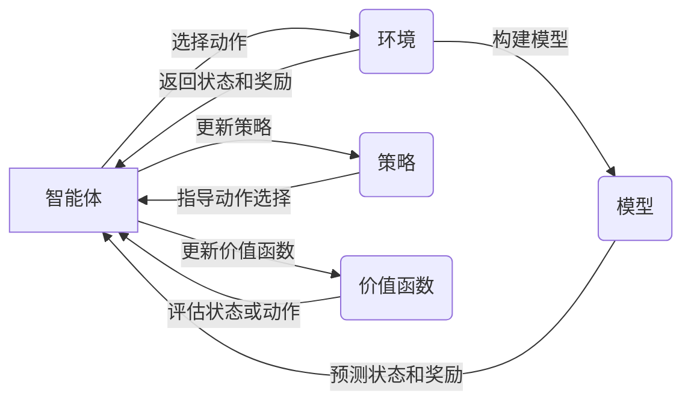

## 1. 背景介绍

### 1.1 什么是增强学习？

增强学习（Reinforcement Learning，RL）是机器学习的一个重要分支，它关注的是智能体（agent）如何在与环境的交互过程中，通过试错的方式学习到最优的策略，从而最大化累积奖励。与监督学习不同，增强学习不需要预先提供任何标签或答案，而是通过不断地尝试和学习来优化自身的决策能力。

### 1.2 增强学习的发展历程

增强学习的发展可以追溯到上世纪50年代，其发展历程大致可以分为以下几个阶段：

- **萌芽阶段（1950s-1960s）：** 这一阶段主要以心理学和控制论的研究为主，代表性工作包括图灵测试、强化学习的数学基础等。
- **发展阶段（1970s-1980s）：** 这一阶段开始出现了一些重要的算法，例如TD学习、Q学习等，并开始应用于机器人控制、游戏等领域。
- **繁荣阶段（1990s-2010s）：** 随着计算机算力的提升和深度学习的兴起，增强学习取得了突破性进展，例如Deep Q-Network (DQN) 成功应用于 Atari 游戏，AlphaGo战胜了人类围棋冠军等。
- **深度融合阶段（2010s至今）：**  增强学习与深度学习、元学习等技术深度融合，不断涌现出新的算法和应用，例如深度强化学习、元强化学习等。

### 1.3 增强学习的应用领域

增强学习的应用领域非常广泛，包括但不限于：

- **游戏AI：** 例如 AlphaGo、OpenAI Five 等。
- **机器人控制：** 例如机械臂控制、无人驾驶等。
- **推荐系统：** 例如电商网站的商品推荐、新闻网站的个性化推荐等。
- **金融交易：** 例如股票交易、量化投资等。
- **医疗健康：** 例如药物研发、个性化治疗等。

## 2. 核心概念与联系

### 2.1 关键要素

增强学习系统主要由以下几个关键要素组成：

- **智能体（Agent）：**  做出决策并与环境交互的主体。
- **环境（Environment）：**  智能体所处的外部世界，它会根据智能体的动作做出相应的响应。
- **状态（State）：**  描述环境在某个时刻的特征信息。
- **动作（Action）：**  智能体在某个状态下可以采取的操作。
- **奖励（Reward）：**  环境根据智能体的动作返回的反馈信号，用于评估智能体行为的好坏。
- **策略（Policy）：**  智能体根据当前状态选择动作的规则。
- **价值函数（Value Function）：**  用于评估某个状态或状态-动作对的长期价值。
- **模型（Model）：**  对环境进行模拟，用于预测环境的下一个状态和奖励。


### 2.2 核心概念之间的关系

下面这张图展示了增强学习中各个核心概念之间的关系：



- 智能体根据当前状态，利用策略选择一个动作，并作用于环境。
- 环境接收到智能体的动作后，会根据自身的运行机制，更新状态并返回相应的奖励给智能体。
- 智能体根据环境返回的奖励，更新自身的策略和价值函数，以便在未来做出更好的决策。
- 模型可以用来模拟环境的运行机制，预测环境的下一个状态和奖励，从而帮助智能体更好地学习。

## 3. 核心算法原理具体操作步骤

### 3.1 基于价值的算法

#### 3.1.1 Q-Learning

Q-Learning 是一种经典的基于价值的算法，其核心思想是学习一个 Q 函数，用于估计在某个状态下采取某个动作的预期累积奖励。

**算法流程：**

1. 初始化 Q 函数，通常将所有状态-动作对的 Q 值初始化为 0。
2. 循环迭代：
    - 在当前状态 $s$ 下，根据 ε-greedy 策略选择一个动作 $a$。
    - 执行动作 $a$，得到下一个状态 $s'$ 和奖励 $r$。
    - 更新 Q 函数：
      $$
      Q(s, a) \leftarrow Q(s, a) + \alpha [r + \gamma \max_{a'} Q(s', a') - Q(s, a)]
      $$
      其中，$\alpha$ 是学习率，$\gamma$ 是折扣因子。
3. 直到 Q 函数收敛。

#### 3.1.2 SARSA

SARSA (State-Action-Reward-State'-Action') 算法与 Q-Learning 类似，也是一种基于价值的算法，但它在更新 Q 函数时使用的是实际采取的下一个动作，而不是 Q 函数估计的最优动作。

**算法流程：**

1. 初始化 Q 函数，通常将所有状态-动作对的 Q 值初始化为 0。
2. 循环迭代：
    - 在当前状态 $s$ 下，根据 ε-greedy 策略选择一个动作 $a$。
    - 执行动作 $a$，得到下一个状态 $s'$ 和奖励 $r$。
    - 在状态 $s'$ 下，根据 ε-greedy 策略选择下一个动作 $a'$。
    - 更新 Q 函数：
      $$
      Q(s, a) \leftarrow Q(s, a) + \alpha [r + \gamma Q(s', a') - Q(s, a)]
      $$
      其中，$\alpha$ 是学习率，$\gamma$ 是折扣因子。
3. 直到 Q 函数收敛。

### 3.2 基于策略的算法

#### 3.2.1 REINFORCE

REINFORCE 是一种经典的基于策略的算法，其核心思想是直接对策略进行参数化表示，并通过梯度上升的方式优化策略参数，使得累积奖励的期望最大化。

**算法流程：**

1. 初始化策略参数 $\theta$。
2. 循环迭代：
    - 根据策略 $\pi_\theta$ 与环境交互，得到一组轨迹数据 $\tau = \{s_1, a_1, r_1, ..., s_T, a_T, r_T\}$。
    - 计算每条轨迹的累积奖励 $R(\tau) = \sum_{t=1}^T \gamma^{t-1} r_t$。
    - 更新策略参数：
      $$
      \theta \leftarrow \theta + \alpha \nabla_\theta \mathbb{E}_{\tau \sim \pi_\theta} [R(\tau)]
      $$
      其中，$\alpha$ 是学习率。
3. 直到策略收敛。

#### 3.2.2 Actor-Critic

Actor-Critic 算法结合了基于价值和基于策略两种算法的优点，使用一个 Actor 网络来表示策略，一个 Critic 网络来估计价值函数。

**算法流程：**

1. 初始化 Actor 网络参数 $\theta$ 和 Critic 网络参数 $\phi$。
2. 循环迭代：
    - 根据 Actor 网络 $\pi_\theta$ 与环境交互，得到一组轨迹数据 $\tau = \{s_1, a_1, r_1, ..., s_T, a_T, r_T\}$。
    - 利用 Critic 网络 $V_\phi$ 估计每个状态的价值 $V_\phi(s_t)$。
    - 计算每个时间步的优势函数 $A(s_t, a_t) = r_t + \gamma V_\phi(s_{t+1}) - V_\phi(s_t)$。
    - 更新 Actor 网络参数：
      $$
      \theta \leftarrow \theta + \alpha \nabla_\theta \log \pi_\theta(a_t | s_t) A(s_t, a_t)
      $$
    - 更新 Critic 网络参数：
      $$
      \phi \leftarrow \phi - \beta \nabla_\phi [V_\phi(s_t) - (r_t + \gamma V_\phi(s_{t+1}))]^2
      $$
      其中，$\alpha$ 和 $\beta$ 分别是 Actor 网络和 Critic 网络的学习率。
3. 直到 Actor 和 Critic 网络收敛。

## 4. 数学模型和公式详细讲解举例说明

### 4.1 马尔科夫决策过程 (Markov Decision Process, MDP)

马尔科夫决策过程是描述增强学习问题的一种常用数学模型，它可以表示为一个五元组 $<S, A, P, R, \gamma>$，其中：

- $S$ 是状态空间，表示所有可能的状态。
- $A$ 是动作空间，表示所有可能的动作。
- $P$ 是状态转移概率矩阵，$P_{ss'}^a$ 表示在状态 $s$ 下采取动作 $a$ 后转移到状态 $s'$ 的概率。
- $R$ 是奖励函数，$R_s^a$ 表示在状态 $s$ 下采取动作 $a$ 后获得的奖励。
- $\gamma$ 是折扣因子，用于平衡当前奖励和未来奖励之间的重要性。

### 4.2 贝尔曼方程 (Bellman Equation)

贝尔曼方程是增强学习中的一个重要方程，它描述了价值函数之间的关系。

#### 4.2.1 状态价值函数

状态价值函数 $V^\pi(s)$ 表示从状态 $s$ 出发，按照策略 $\pi$ 行动，所能获得的累积奖励的期望值：

$$
V^\pi(s) = \mathbb{E}_{\pi} [G_t | S_t = s]
$$

其中，$G_t$ 是从时间步 $t$ 开始的累积奖励：

$$
G_t = R_{t+1} + \gamma R_{t+2} + \gamma^2 R_{t+3} + ... = \sum_{k=0}^\infty \gamma^k R_{t+k+1}
$$

#### 4.2.2 动作价值函数

动作价值函数 $Q^\pi(s, a)$ 表示在状态 $s$ 下采取动作 $a$，然后按照策略 $\pi$ 行动，所能获得的累积奖励的期望值：

$$
Q^\pi(s, a) = \mathbb{E}_{\pi} [G_t | S_t = s, A_t = a]
$$

#### 4.2.3 贝尔曼期望方程

状态价值函数和动作价值函数之间可以通过贝尔曼期望方程进行转换：

$$
V^\pi(s) = \sum_{a \in A} \pi(a|s) Q^\pi(s, a)
$$

$$
Q^\pi(s, a) = R_s^a + \gamma \sum_{s' \in S} P_{ss'}^a V^\pi(s')
$$

#### 4.2.4 贝尔曼最优方程

贝尔曼最优方程描述了最优价值函数之间的关系：

$$
V^*(s) = \max_{a \in A} Q^*(s, a)
$$

$$
Q^*(s, a) = R_s^a + \gamma \sum_{s' \in S} P_{ss'}^a V^*(s')
$$

### 4.3 举例说明

假设有一个迷宫环境，如下图所示：

```
+---+---+---+
| S |   |   |
+---+---+---+
|   | X |   |
+---+---+---+
|   |   | G |
+---+---+---+
```

- 迷宫中有四个状态：起点（S）、障碍物（X）和终点（G）。
- 智能体可以采取四个动作：向上、向下、向左、向右。
- 智能体每走一步会得到 -1 的奖励，到达终点会得到 100 的奖励。

我们可以用一个 MDP 来描述这个迷宫环境：

- 状态空间 $S = \{S, X, G\}$。
- 动作空间 $A = \{上, 下, 左, 右\}$。
- 状态转移概率矩阵 $P$ 可以根据迷宫的地图进行设置，例如 $P_{SX}^{右} = 1$ 表示在起点状态下向右走会到达障碍物状态。
- 奖励函数 $R$ 可以根据奖励的设置进行设置，例如 $R_G = 100$ 表示到达终点会得到 100 的奖励。
- 折扣因子 $\gamma$ 可以根据实际情况进行设置，例如 $\gamma = 0.9$。

我们可以使用 Q-Learning 算法来学习迷宫环境的最优策略。首先，我们需要初始化 Q 函数，将所有状态-动作对的 Q 值初始化为 0。然后，我们可以让智能体不断地与环境交互，并根据 Q-Learning 算法的更新规则来更新 Q 函数。最终，Q 函数会收敛到最优 Q 函数，智能体就可以根据最优 Q 函数来选择最优动作，从而走出迷宫。

## 5. 项目实践：代码实例和详细解释说明

### 5.1 OpenAI Gym 环境搭建

OpenAI Gym 是一个用于开发和比较强化学习算法的工具包，它提供了一系列的模拟环境，例如 Atari 游戏、机器人控制等。

**安装 OpenAI Gym：**

```
pip install gym
```

**测试安装：**

```python
import gym

# 创建 CartPole 环境
env = gym.make('CartPole-v1')

# 重置环境
observation = env.reset()

# 循环迭代
for _ in range(1000):
    # 渲染环境
    env.render()

    # 从动作空间中随机选择一个动作
    action = env.action_space.sample()

    # 执行动作，并获取下一个状态、奖励、是否结束标志等信息
    observation, reward, done, info = env.step(action)

    # 如果游戏结束，则重置环境
    if done:
        observation = env.reset()

# 关闭环境
env.close()
```

### 5.2 Q-Learning 算法实现

```python
import gym
import numpy as np

# 创建 CartPole 环境
env = gym.make('CartPole-v1')

# 定义 Q-Learning 参数
learning_rate = 0.1
discount_factor = 0.95
exploration_rate = 1.0
exploration_decay_rate = 0.995

# 初始化 Q 表
num_states = (1, 1, 6, 12)  # 状态空间离散化
num_actions = env.action_space.n
q_table = np.zeros(num_states + (num_actions,))

# 训练 Q-Learning 模型
for episode in range(1000):
    # 重置环境
    observation = env.reset()
    state = tuple(map(int, observation))

    # 循环迭代
    done = False
    while not done:
        # 选择动作
        if np.random.uniform(0, 1) < exploration_rate:
            action = env.action_space.sample()  # 探索
        else:
            action = np.argmax(q_table[state])  # 利用

        # 执行动作
        next_observation, reward, done, info = env.step(action)
        next_state = tuple(map(int, next_observation))

        # 更新 Q 表
        q_table[state + (action,)] += learning_rate * (
            reward
            + discount_factor * np.max(q_table[next_state])
            - q_table[state + (action,)]
        )

        # 更新状态和探索率
        state = next_state
        exploration_rate *= exploration_decay_rate

    # 打印当前 episode 的奖励
    print(f"Episode {episode + 1}: reward = {reward}")

# 保存 Q 表
np.save("q_table.npy", q_table)

# 关闭环境
env.close()
```

**代码解释：**

- 首先，我们创建了一个 CartPole 环境，并定义了一些 Q-Learning 算法的参数，例如学习率、折扣因子、探索率等。
- 然后，我们初始化了 Q 表，并将所有状态-动作对的 Q 值初始化为 0。
- 在训练过程中，我们让智能体不断地与环境交互，并根据 Q-Learning 算法的更新规则来更新 Q 表。
- 最后，我们将训练好的 Q 表保存到文件中。

## 6. 实际应用场景

### 6.1 游戏AI

- **AlphaGo、AlphaZero：**  DeepMind 开发的围棋 AI，使用增强学习算法战胜了人类世界冠军。
- **OpenAI Five：**  OpenAI 开发的 Dota 2 AI，使用增强学习算法战胜了职业战队。
- **StarCraft II AI：**  DeepMind 开发的星际争霸 II AI，使用增强学习算法达到了职业玩家水平。

### 6.2 机器人控制

- **机械臂控制：**  使用增强学习算法可以训练机器人手臂完成抓取、放置等复杂任务。
- **无人驾驶：**  使用增强学习算法可以训练无人驾驶汽车在复杂路况下安全行驶。
- **无人机控制：**  使用增强学习算法可以训练无人机完成航拍、巡逻等任务。

### 6.3 推荐系统

- **电商网站的商品推荐：**  使用增强学习算法可以根据用户的历史行为和偏好，推荐用户可能感兴趣的商品。
- **新闻网站的个性化推荐：**  使用增强学习算法可以根据用户的阅读历史和兴趣，推荐用户