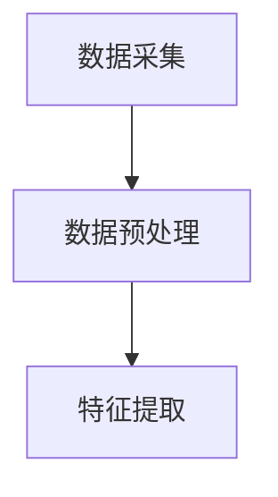
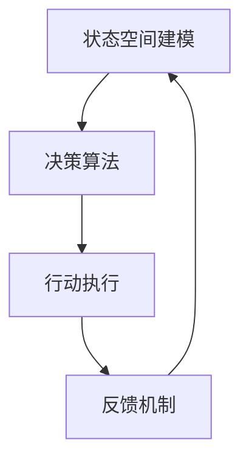

# 增强现实(AR)中AI代理的工作流程设计

作者：禅与计算机程序设计艺术

## 1. 背景介绍

### 1.1 增强现实（AR）的发展概述

增强现实（Augmented Reality, AR）是一种将虚拟信息与真实世界融合的技术。与虚拟现实（Virtual Reality, VR）不同，AR并不完全替代现实，而是将虚拟元素叠加在真实世界之上，从而增强用户的感知体验。近年来，随着计算机视觉、传感器技术和移动计算能力的提升，AR技术得到了快速发展，并在多个领域得到了广泛应用，如教育、医疗、娱乐和工业制造等。

### 1.2 人工智能（AI）在AR中的作用

人工智能（Artificial Intelligence, AI）在AR系统中扮演着至关重要的角色。AI技术可以帮助AR系统理解和处理复杂的现实环境，从而提供更加智能和个性化的用户体验。具体来说，AI可以用于对象识别、手势识别、自然语言处理和路径规划等任务。这些AI功能的集成，使得AR应用能够更好地理解用户的意图和环境，从而提供更加自然和高效的交互体验。

### 1.3 设计AI代理工作流程的重要性

在AR系统中，AI代理（AI Agent）是指能够自主执行特定任务的智能软件实体。设计一个高效的AI代理工作流程，对于提升AR系统的智能化水平和用户体验至关重要。一个良好的工作流程设计可以确保AI代理能够快速、准确地响应用户需求，并在复杂的环境中执行任务。因此，本文将详细探讨如何设计和实现增强现实中AI代理的工作流程。

## 2. 核心概念与联系

### 2.1 AI代理的定义与分类

AI代理是指能够自主感知环境、决策并执行任务的智能软件实体。根据其功能和复杂度，AI代理可以分为以下几类：

- **反应型代理（Reactive Agents）**：这种代理根据当前的感知输入直接做出反应，没有内部状态或历史记忆。
- **基于模型的代理（Model-based Agents）**：这种代理具有内部状态，可以根据历史信息和环境模型进行决策。
- **目标导向代理（Goal-based Agents）**：这种代理不仅考虑当前状态，还根据预定目标进行规划和决策。
- **实用性代理（Utility-based Agents）**：这种代理在决策时不仅考虑目标，还考虑不同选择的效用值，从而做出最优决策。

### 2.2 AR系统中的AI代理角色

在AR系统中，AI代理可以扮演多种角色，主要包括：

- **环境感知者（Environment Perceiver）**：通过传感器和计算机视觉技术，AI代理实时感知和理解周围环境。
- **数据处理者（Data Processor）**：AI代理对感知到的数据进行处理和分析，提取有用信息。
- **交互接口（Interaction Interface）**：AI代理通过自然语言处理、手势识别等技术，与用户进行交互。
- **决策执行者（Decision Executor）**：AI代理根据分析结果和用户需求，执行相应的操作或任务。

### 2.3 AI代理工作流程的关键要素

设计AI代理的工作流程需要考虑以下几个关键要素：

- **感知（Perception）**：AI代理通过传感器和计算机视觉技术，实时感知环境和用户状态。
- **理解（Understanding）**：AI代理对感知到的数据进行处理和分析，理解环境和用户意图。
- **决策（Decision Making）**：AI代理根据理解结果和预定目标，进行规划和决策。
- **执行（Execution）**：AI代理执行决策结果，并通过反馈机制不断优化工作流程。

## 3. 核心算法原理具体操作步骤

### 3.1 感知阶段

#### 3.1.1 数据采集

在感知阶段，AI代理通过各种传感器（如摄像头、麦克风、IMU等）采集环境数据。这些数据包括图像、声音、运动信息等。

#### 3.1.2 数据预处理

采集到的数据通常需要进行预处理，以去除噪声和冗余信息。常见的预处理方法包括滤波、归一化、特征提取等。



### 3.2 理解阶段

#### 3.2.1 计算机视觉技术

AI代理通过计算机视觉技术，对预处理后的图像数据进行分析，识别出环境中的对象和用户的手势。常用的技术包括卷积神经网络（CNN）、目标检测算法（如YOLO、SSD）等。

#### 3.2.2 自然语言处理技术

对于声音数据，AI代理通过自然语言处理技术进行分析，理解用户的语音指令。常用的技术包括语音识别、语义分析等。

### 3.3 决策阶段

#### 3.3.1 状态空间建模

AI代理根据感知和理解阶段的结果，构建当前环境和用户状态的模型。状态空间建模是决策阶段的基础，常用的方法包括马尔可夫决策过程（MDP）、贝叶斯网络等。

#### 3.3.2 决策算法

在决策阶段，AI代理根据状态模型和预定目标，选择最优的行动策略。常用的决策算法包括强化学习（如Q-learning、深度强化学习）、规划算法（如A*、Dijkstra）等。

### 3.4 执行阶段

#### 3.4.1 行动执行

AI代理根据决策结果，执行相应的行动。这些行动可以是显示虚拟对象、播放声音、发送控制信号等。

#### 3.4.2 反馈机制

执行阶段还需要建立反馈机制，实时监控行动效果，并根据反馈信息不断优化工作流程。



## 4. 数学模型和公式详细讲解举例说明

### 4.1 马尔可夫决策过程（MDP）

马尔可夫决策过程（Markov Decision Process, MDP）是一种常用的状态空间建模方法。MDP由一个五元组 $(S, A, P, R, \gamma)$ 组成，其中：

- $S$ 是状态空间
- $A$ 是行动空间
- $P(s'|s, a)$ 是状态转移概率
- $R(s, a)$ 是奖励函数
- $\gamma$ 是折扣因子

MDP的目标是找到最优策略 $\pi^*$，使得累计奖励最大化：

$$
\pi^* = \arg\max_\pi \mathbb{E} \left[ \sum_{t=0}^{\infty} \gamma^t R(s_t, a_t) \right]
$$

### 4.2 强化学习中的Q-learning算法

Q-learning是一种常用的强化学习算法，用于求解MDP中的最优策略。Q-learning通过迭代更新Q值函数来逼近最优策略。Q值函数 $Q(s, a)$ 表示在状态 $s$ 采取行动 $a$ 的期望累计奖励。

Q-learning的更新公式为：

$$
Q(s, a) \leftarrow Q(s, a) + \alpha \left[ R(s, a) + \gamma \max_{a'} Q(s', a') - Q(s, a) \right]
$$

其中，$\alpha$ 是学习率，$\gamma$ 是折扣因子，$s'$ 是执行行动 $a$ 后的下一个状态。

### 4.3 卷积神经网络（CNN）

卷积神经网络（Convolutional Neural Network, CNN）是一种常用的计算机视觉技术，用于图像分类和对象检测。CNN通过卷积层、池化层和全连接层对图像进行特征提取和分类。

卷积层的计算公式为：

$$
y_{i,j} = \sum_{m,n} x_{i+m,j+n} \cdot w_{m,n} + b
$$

其中，$x$ 是输入图像，$w$ 是卷积核，$b$ 是偏置，$y$ 是卷积输出。

## 5. 项目实践：代码实例和详细解释说明

### 5.1 数据采集与预处理

以下是一个简单的Python代码示例，用于从摄像头采集图像数据并进行预处理：

```python
import cv2

# 打开摄像头
cap = cv2.VideoCapture(0)

while True:
    # 读取一帧图像
    ret, frame = cap.read()
    
    # 转换