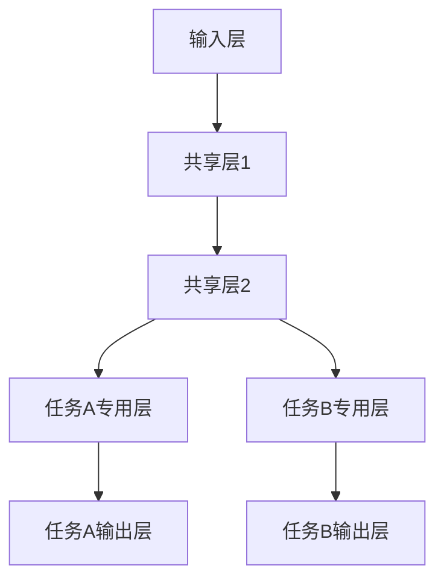

# 多任务学习 原理与代码实例讲解

作者：禅与计算机程序设计艺术

## 1. 背景介绍

### 1.1 什么是多任务学习

多任务学习（Multi-Task Learning, MTL）是机器学习中的一种方法，旨在同时解决多个相关任务。通过共享表示和参数，多任务学习可以提高每个任务的性能，减少过拟合，并在数据稀缺的情况下提升模型的泛化能力。多任务学习的理念源自人类学习的方式：我们在学习新任务时，往往会利用之前学到的知识。

### 1.2 多任务学习的发展历程

多任务学习的概念最早可以追溯到20世纪90年代。Caruana在1997年的研究中首次系统地提出了多任务学习的框架，并展示了其在多种应用中的有效性。随着深度学习的兴起，多任务学习再次受到关注，尤其是在自然语言处理（NLP）、计算机视觉和推荐系统等领域。

### 1.3 多任务学习的优势

1. **共享表示**：通过共享不同任务的表示，模型可以捕捉到任务间的共性，从而提升每个任务的性能。
2. **数据高效**：多任务学习可以利用多个任务的数据，从而在数据稀缺的情况下提升模型的泛化能力。
3. **减少过拟合**：通过共享参数，多任务学习可以减少单任务模型的过拟合现象。

## 2. 核心概念与联系

### 2.1 任务相关性

多任务学习的核心在于任务之间的相关性。如果任务之间没有相关性，共享表示和参数可能会导致负迁移（Negative Transfer），即模型性能反而下降。因此，选择相关的任务进行多任务学习至关重要。

### 2.2 参数共享

在多任务学习中，参数共享是实现多个任务共同学习的关键。参数共享可以显式地通过共享网络层实现，也可以隐式地通过正则化方法实现。

### 2.3 损失函数设计

多任务学习中的损失函数设计需要综合考虑各个任务的损失。常见的方法有加权损失和自适应损失加权。加权损失通过人为设定各个任务的权重，而自适应损失加权则通过算法自动调整各个任务的权重。

### 2.4 网络结构

多任务学习的网络结构通常分为硬共享和软共享两种。硬共享网络在前几层共享参数，后几层为各个任务独立的网络层。软共享网络则通过共享部分参数和特征实现多任务学习。



## 3. 核心算法原理具体操作步骤

### 3.1 数据预处理

多任务学习的数据预处理步骤与单任务学习类似，但需要对多个任务的数据进行统一处理。具体步骤包括数据清洗、特征提取和数据归一化等。

### 3.2 模型构建

1. **选择网络结构**：根据任务相关性选择合适的网络结构（硬共享或软共享）。
2. **定义损失函数**：根据任务的重要性设定各个任务的损失权重。
3. **参数初始化**：初始化网络参数，通常使用随机初始化或预训练模型。

### 3.3 模型训练

1. **前向传播**：通过共享层和任务专用层计算每个任务的输出。
2. **计算损失**：根据定义的损失函数计算总损失。
3. **反向传播**：通过反向传播算法更新共享层和任务专用层的参数。
4. **迭代训练**：重复前向传播和反向传播，直到损失收敛。

### 3.4 模型评估

1. **单任务评估**：分别评估每个任务的性能，例如准确率、精确率、召回率等。
2. **整体评估**：综合考虑各个任务的性能，评估模型的整体表现。

## 4. 数学模型和公式详细讲解举例说明

### 4.1 基本公式

假设有 $T$ 个任务，每个任务的损失函数为 $L_t$，多任务学习的总损失函数可以表示为：

$$
L_{total} = \sum_{t=1}^{T} \alpha_t L_t
$$

其中，$\alpha_t$ 是任务 $t$ 的损失权重。

### 4.2 参数共享

在硬共享网络中，假设前 $k$ 层为共享层，后 $m$ 层为任务 $t$ 的专用层，网络的输出可以表示为：

$$
h_{shared} = f_{shared}(x; \theta_{shared})
$$

$$
h_t = f_t(h_{shared}; \theta_t)
$$

其中，$x$ 是输入，$\theta_{shared}$ 是共享层的参数，$\theta_t$ 是任务 $t$ 的专用层参数。

### 4.3 反向传播

在多任务学习中，反向传播算法需要同时更新共享层和任务专用层的参数。对于总损失函数 $L_{total}$，其梯度可以表示为：

$$
\frac{\partial L_{total}}{\partial \theta_{shared}} = \sum_{t=1}^{T} \alpha_t \frac{\partial L_t}{\partial \theta_{shared}}
$$

$$
\frac{\partial L_{total}}{\partial \theta_t} = \alpha_t \frac{\partial L_t}{\partial \theta_t}
$$

### 4.4 举例说明

假设有两个任务：任务A是分类任务，任务B是回归任务。其损失函数分别为交叉熵损失和均方误差损失。总损失函数可以表示为：

$$
L_{total} = \alpha_1 L_{A} + \alpha_2 L_{B}
$$

其中，

$$
L_{A} = -\sum_{i=1}^{N} y_i \log(\hat{y}_i)
$$

$$
L_{B} = \frac{1}{N} \sum_{i=1}^{N} (y_i - \hat{y}_i)^2
$$

通过反向传播算法，可以同时更新共享层和任务专用层的参数。

## 5. 项目实践：代码实例和详细解释说明

### 5.1 数据集准备

在本项目中，我们将使用MNIST数据集和Fashion MNIST数据集进行多任务学习。MNIST数据集是手写数字分类数据集，Fashion MNIST数据集是服装图像分类数据集。

```python
from tensorflow.keras.datasets import mnist, fashion_mnist

# 加载数据集
(mnist_train_images, mnist_train_labels), (mnist_test_images, mnist_test_labels) = mnist.load_data()
(fashion_train_images, fashion_train_labels), (fashion_test_images, fashion_test_labels) = fashion_mnist.load_data()

# 数据预处理
mnist_train_images = mnist_train_images / 255.0
mnist_test_images = mnist_test_images / 255.0
fashion_train_images = fashion_train_images / 255.0
fashion_test_images = fashion_test_images / 255.0
```

### 5.2 模型构建

我们将构建一个硬共享的多任务学习模型，前几层为共享层，后几层为任务专用层。

```python
from tensorflow.keras import layers, models, losses, optimizers

# 构建共享层
input_layer = layers.Input(shape=(28, 28, 1))
shared_layer = layers.Conv2D(32, (3, 3), activation='relu')(input_layer)
shared_layer = layers.MaxPooling2D((2, 2))(shared_layer)
shared_layer = layers.Conv2D(64, (3, 3), activation='relu')(shared_layer)
shared_layer = layers.MaxPooling2D((2, 2))(shared_layer)
shared_layer = layers.Flatten()(shared_layer)

# 构建任务A的专用层
taskA_layer = layers.Dense(64, activation='relu')(shared_layer)
taskA_output = layers.Dense(10, activation='softmax', name='taskA_output')(taskA_layer)

# 构建任务B的专用层
taskB_layer = layers.Dense(64, activation='relu')(shared_layer)
taskB_output = layers.Dense(10, activation='softmax', name='taskB_output')(taskB_layer)

# 构建多任务模型
model = models.Model(inputs=input_layer, outputs=[taskA_output, taskB_output])

# 编译模型
model.compile(optimizer='adam',
              loss={'taskA_output': 'sparse_categorical_crossentropy', 'taskB_output': 'sparse_categorical_crossentropy'},
              metrics={'taskA_output