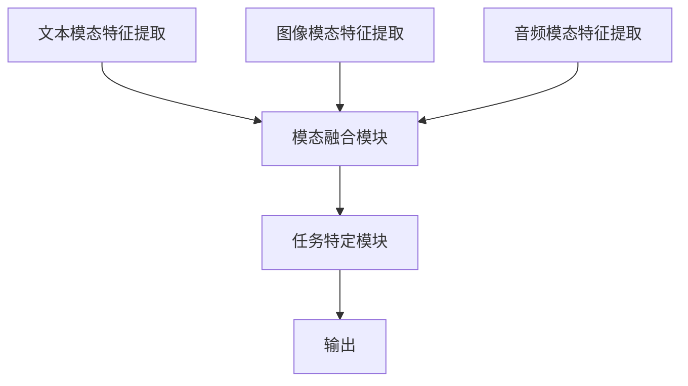

# 多模态大模型：技术原理与实战 多模态大模型的应用图谱

作者：禅与计算机程序设计艺术

## 1. 背景介绍

### 1.1 多模态大模型的崛起

在过去的几年中，人工智能（AI）技术取得了显著进展，尤其是在深度学习领域。单模态模型（如仅处理文本或图像的模型）已经在各自的领域中展示了强大的能力。然而，现实世界中的许多应用场景需要处理多种类型的数据，如文本、图像、音频和视频。多模态大模型应运而生，旨在处理和理解这些多样化的数据源。

### 1.2 多模态大模型的定义

多模态大模型是一种能够同时处理多个模态（如文本、图像、音频等）的深度学习模型。这些模型通过融合不同模态的信息，能够更好地理解复杂的场景和任务。例如，在自动驾驶中，车辆需要同时处理摄像头图像、雷达数据和GPS信息，以做出准确的决策。

### 1.3 多模态大模型的应用场景

多模态大模型在多个领域中展示了其强大的潜力，包括但不限于：

- **医疗诊断**：结合影像数据和文本报告进行疾病预测和诊断。
- **自动驾驶**：融合摄像头、雷达和激光雷达数据进行环境感知和决策。
- **智能家居**：通过处理语音指令和视频监控数据，实现智能家居设备的控制。
- **娱乐**：在视频推荐系统中结合用户的观看历史和文本评论，提供个性化推荐。

## 2. 核心概念与联系

### 2.1 模态与多模态

#### 2.1.1 模态的定义

模态（Modality）指的是数据的类型或形式。在AI和深度学习中，常见的模态包括：

- **文本**：如自然语言处理（NLP）中的文本数据。
- **图像**：如计算机视觉（CV）中的图像数据。
- **音频**：如语音识别中的音频数据。
- **视频**：如视频分析中的视频数据。

#### 2.1.2 多模态的定义

多模态指的是同时处理多个模态的数据。例如，在自动驾驶中，车辆需要同时处理来自摄像头、雷达和GPS的数据。

### 2.2 多模态大模型的基本架构

多模态大模型通常由以下几个部分组成：

- **模态特征提取器**：用于从每个模态中提取特征。
- **模态融合模块**：将不同模态的特征进行融合。
- **任务特定模块**：用于处理特定任务（如分类、回归等）。

### 2.3 模态融合技术

#### 2.3.1 早期融合与晚期融合

- **早期融合**：在特征提取之前进行模态融合。
- **晚期融合**：在特征提取之后进行模态融合。

#### 2.3.2 交叉模态注意力机制

交叉模态注意力机制是近年来多模态大模型中的一种重要技术。它通过在不同模态之间引入注意力机制，使模型能够更好地捕捉模态之间的关系。



## 3. 核心算法原理具体操作步骤

### 3.1 数据预处理

#### 3.1.1 文本数据预处理

- **分词**：将文本分割成单词或子词。
- **词向量表示**：使用Word2Vec、GloVe或BERT等模型将单词转化为向量。

#### 3.1.2 图像数据预处理

- **图像缩放**：将图像缩放到统一尺寸。
- **数据增强**：使用旋转、翻转等技术增强数据。

#### 3.1.3 音频数据预处理

- **采样率调整**：统一音频的采样率。
- **特征提取**：提取梅尔频谱、MFCC等特征。

### 3.2 特征提取

#### 3.2.1 文本特征提取

使用预训练的语言模型（如BERT、GPT）提取文本特征。

#### 3.2.2 图像特征提取

使用预训练的卷积神经网络（如ResNet、VGG）提取图像特征。

#### 3.2.3 音频特征提取

使用预训练的音频模型（如WaveNet、VGGish）提取音频特征。

### 3.3 特征融合

#### 3.3.1 线性融合

将不同模态的特征进行线性组合。

$$
f_{\text{fused}} = W_1 f_{\text{text}} + W_2 f_{\text{image}} + W_3 f_{\text{audio}}
$$

#### 3.3.2 注意力机制融合

使用注意力机制对不同模态的特征进行加权融合。

$$
f_{\text{fused}} = \sum_{i} \alpha_i f_i
$$

其中，$\alpha_i$ 是通过注意力机制计算得到的权重。

### 3.4 任务特定模块

根据具体任务的需求，设计特定的网络结构。例如，对于分类任务，可以使用全连接层和Softmax层。

## 4. 数学模型和公式详细讲解举例说明

### 4.1 模态特征提取

#### 4.1.1 文本特征提取

使用BERT模型提取文本特征。BERT模型的输入是一个句子，输出是每个词的向量表示。

$$
\text{BERT}(x) = [h_1, h_2, \ldots, h_n]
$$

其中，$h_i$ 是第 $i$ 个词的向量表示。

#### 4.1.2 图像特征提取

使用ResNet模型提取图像特征。ResNet模型的输入是一个图像，输出是一个特征向量。

$$
\text{ResNet}(x) = f_{\text{image}}
$$

#### 4.1.3 音频特征提取

使用WaveNet模型提取音频特征。WaveNet模型的输入是一个音频信号，输出是一个特征向量。

$$
\text{WaveNet}(x) = f_{\text{audio}}
$$

### 4.2 特征融合

#### 4.2.1 线性融合

线性融合方法将不同模态的特征进行线性组合。

$$
f_{\text{fused}} = W_1 f_{\text{text}} + W_2 f_{\text{image}} + W_3 f_{\text{audio}}
$$

其中，$W_1, W_2, W_3$ 是权重矩阵。

#### 4.2.2 注意力机制融合

注意力机制融合方法通过计算不同模态特征的注意力权重进行加权融合。

$$
\alpha_i = \frac{\exp(e_i)}{\sum_{j} \exp(e_j)}
$$

其中，$e_i$ 是通过注意力机制计算得到的注意力得分。

$$
f_{\text{fused}} = \sum_{i} \alpha_i f_i
$$

### 4.3 任务特定模块

对于分类任务，使用全连接层和Softmax层进行分类。

$$
\text{Softmax}(x) = \frac{\exp(x_i)}{\sum_{j} \exp(x_j)}
$$

## 4. 项目实践：代码实例和详细解释说明

### 4.1 数据预处理

```python
import numpy as np
import cv2
import librosa
import transformers

# 文本数据预处理
def preprocess_text(text):
    tokenizer = transformers.BertTokenizer.from_pretrained('bert-base-uncased')
    inputs = tokenizer(text, return_tensors='pt', max_length=512, truncation=True, padding='max_length')
    return inputs

# 图像数据预处理
def preprocess_image(image_path):
    image = cv2.imread(image_path)
    image = cv2.resize(image, (224, 224))
    image = image / 255.0
    return np.expand_dims(image, axis=0)

# 音频数据预处理
def preprocess_audio(audio_path):
    y, sr = librosa.load(audio_path, sr=16000)
    mfcc = librosa.feature.mfcc(y=y, sr=sr, n_mfcc=13)
    return np.expand_dims(mfcc, axis=0