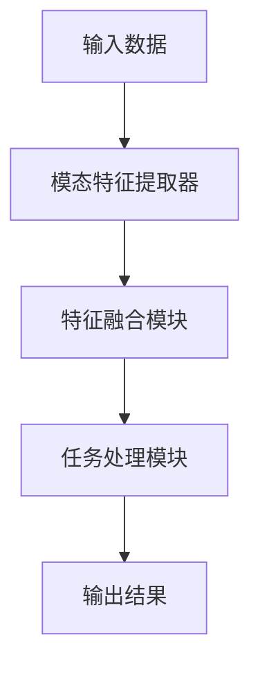

# 多模态大模型：技术原理与实战 文本多模态技术

作者：禅与计算机程序设计艺术

## 1. 背景介绍

### 1.1 多模态技术的兴起

在过去的几十年里，计算机科学和人工智能领域取得了显著的进展。特别是深度学习的崛起，使得我们能够处理和分析大量的非结构化数据，如图像、文本、语音等。然而，单一模态的数据处理能力已经不能满足日益复杂的实际需求。多模态技术应运而生，通过结合不同类型的数据，提供更为全面和准确的信息处理能力。

### 1.2 多模态大模型的定义

多模态大模型是一种能够同时处理多种数据模态（如文本、图像、音频等）的深度学习模型。这些模型通过融合不同模态的数据，能够在理解、生成和交互方面展现出超越单一模态模型的能力。多模态大模型在自然语言处理、计算机视觉、语音识别等领域都有广泛的应用。

### 1.3 发展历程

多模态技术的发展经历了从简单的特征融合到复杂的深度学习模型的演变。早期的多模态技术主要依赖于特征工程，将不同模态的数据通过简单的连接或加权融合。然而，随着深度学习的兴起，特别是卷积神经网络（CNN）和循环神经网络（RNN）的发展，多模态大模型开始展现出强大的数据融合和理解能力。

## 2. 核心概念与联系

### 2.1 模态与多模态

模态（Modality）指的是数据的不同类型或形式，如文本、图像、音频等。多模态（Multimodal）技术则是指同时处理和融合多种模态的数据，以实现更为复杂和智能的任务。

### 2.2 多模态大模型的基本结构

多模态大模型通常由以下几个部分组成：

- **模态特征提取器**：用于提取各个模态的数据特征，例如卷积神经网络（CNN）用于图像特征提取，循环神经网络（RNN）用于文本特征提取。
- **特征融合模块**：将不同模态的特征进行融合，常见的方法包括加权平均、注意力机制等。
- **任务处理模块**：根据具体任务的需求，对融合后的特征进行处理，例如分类、生成、预测等。



### 2.3 多模态技术的优势

- **信息互补**：不同模态的数据可以提供互补的信息，增强模型的理解和处理能力。
- **鲁棒性**：多模态技术可以提高模型的鲁棒性，减少单一模态数据的噪声和缺失对结果的影响。
- **丰富的表达能力**：通过融合多种模态的数据，多模态大模型可以生成更加丰富和自然的输出，例如生成带有图像描述的文本。

## 3. 核心算法原理具体操作步骤

### 3.1 特征提取

#### 3.1.1 文本特征提取

文本特征提取通常使用嵌入层（Embedding Layer）和循环神经网络（RNN）等技术。常见的方法包括词向量（Word2Vec）、词嵌入（GloVe）、BERT等。

```python
from transformers import BertTokenizer, BertModel
import torch

tokenizer = BertTokenizer.from_pretrained('bert-base-uncased')
model = BertModel.from_pretrained('bert-base-uncased')

text = "Hello, how are you?"
inputs = tokenizer(text, return_tensors='pt')
outputs = model(**inputs)
text_features = outputs.last_hidden_state
```

#### 3.1.2 图像特征提取

图像特征提取通常使用卷积神经网络（CNN），如VGG、ResNet等。通过卷积层和池化层提取图像的高级特征。

```python
import torchvision.models as models
import torch

model = models.resnet50(pretrained=True)
model.eval()

image = torch.randn(1, 3, 224, 224)  # Example image tensor
image_features = model(image)
```

### 3.2 特征融合

#### 3.2.1 简单融合方法

简单融合方法包括特征连接、加权平均等。这些方法实现简单，但效果有限。

```python
import torch

text_features = torch.randn(1, 768)  # Example text features
image_features = torch.randn(1, 2048)  # Example image features

# Feature concatenation
fused_features = torch.cat((text_features, image_features), dim=1)
```

#### 3.2.2 注意力机制

注意力机制通过分配不同的权重来融合特征，可以有效地捕捉不同模态之间的关系。

```python
import torch.nn as nn

class AttentionFusion(nn.Module):
    def __init__(self, text_dim, image_dim, hidden_dim):
        super(AttentionFusion, self).__init__()
        self.text_fc = nn.Linear(text_dim, hidden_dim)
        self.image_fc = nn.Linear(image_dim, hidden_dim)
        self.attention = nn.Linear(hidden_dim, 1)

    def forward(self, text_features, image_features):
        text_hidden = torch.relu(self.text_fc(text_features))
        image_hidden = torch.relu(self.image_fc(image_features))
        attention_weights = torch.softmax(self.attention(text_hidden + image_hidden), dim=1)
        fused_features = attention_weights * text_hidden + (1 - attention_weights) * image_hidden
        return fused_features

text_features = torch.randn(1, 768)  # Example text features
image_features = torch.randn(1, 2048)  # Example image features

fusion_model = AttentionFusion(768, 2048, 512)
fused_features = fusion_model(text_features, image_features)
```

### 3.3 任务处理

#### 3.3.1 分类任务

对于分类任务，可以使用全连接层和Softmax激活函数来进行分类。

```python
class ClassificationModel(nn.Module):
    def __init__(self, input_dim, num_classes):
        super(ClassificationModel, self).__init__()
        self.fc = nn.Linear(input_dim, num_classes)

    def forward(self, fused_features):
        logits = self.fc(fused_features)
        return torch.softmax(logits, dim=1)

fused_features = torch.randn(1, 512)  # Example fused features
classification_model = ClassificationModel(512, 10)
predictions = classification_model(fused_features)
```

#### 3.3.2 生成任务

对于生成任务，可以使用循环神经网络（RNN）或变分自编码器（VAE）等技术。

```python
class GenerationModel(nn.Module):
    def __init__(self, input_dim, hidden_dim, output_dim):
        super(GenerationModel, self).__init__()
        self.rnn = nn.LSTM(input_dim, hidden_dim, batch_first=True)
        self.fc = nn.Linear(hidden_dim, output_dim)

    def forward(self, fused_features, sequence_length):
        h0 = torch.zeros(1, fused_features.size(0), hidden_dim).to(fused_features.device)
        c0 = torch.zeros(1, fused_features.size(0), hidden_dim).to(fused_features.device)
        outputs, _ = self.rnn(fused_features.unsqueeze(1).repeat(1, sequence_length, 1), (h0, c0))
        outputs = self.fc(outputs)
        return outputs

fused_features = torch.randn(1, 512)  # Example fused features
generation_model = GenerationModel(512, 256, 100)
generated_sequence = generation_model(fused_features, sequence_length=10)
```

## 4. 数学模型和公式详细讲解举例说明

### 4.1 特征提取的数学原理

#### 4.1.1 文本特征提取

文本特征提取通常基于嵌入向量。假设我们有一个词汇表 $V$，每个词 $w_i$ 映射到一个 $d$ 维的向量空间，即 $\mathbf{e}(w_i) \in \mathbb{R}^d$。通过嵌入矩阵 $\mathbf{E} \in \mathbb{R}^{|V| \times d}$，我们可以将文本序列 $\{w_1, w_2, \ldots, w_n\}$ 转化为向量序列 $\{\mathbf{e}(w_1), \mathbf{e}(w_2), \ldots, \mathbf{e}(w_n)\}$。

$$
\mathbf{E} = [\mathbf{e}(w_1); \mathbf{e}(w_2); \ldots; \mathbf{e}(w_n)]
$$

#### 4.1.2 图像特征提