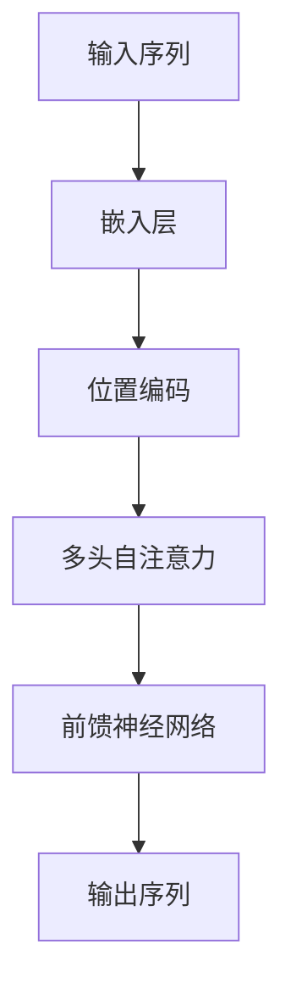

# 大规模语言模型从理论到实践 大语言模型的构建流程

作者：禅与计算机程序设计艺术

## 1.背景介绍

### 1.1 大规模语言模型的兴起
近年来，人工智能领域尤其是自然语言处理（NLP）领域取得了显著的进展。大规模语言模型（Large Language Models, LLMs）如GPT-3、BERT等的出现，彻底改变了我们与计算机交互的方式。这些模型不仅在各种NLP任务中表现出色，还展示了跨领域的应用潜力。

### 1.2 语言模型的发展历程
语言模型的发展可以追溯到早期的统计语言模型（例如n-gram模型），随后是基于神经网络的方法（如RNN、LSTM）。近年来，Transformer架构的提出使得大规模语言模型成为可能，极大地提升了模型的性能和可扩展性。

### 1.3 大规模语言模型的重要性
大规模语言模型在多个领域有着广泛的应用，包括但不限于自动翻译、文本生成、情感分析、对话系统等。这些模型不仅能够理解和生成自然语言，还能进行复杂的推理和问题解决，极大地推动了人工智能的发展。

## 2.核心概念与联系

### 2.1 语言模型的定义
语言模型是一种能够预测一个句子中下一个词的概率分布的模型。其目标是通过学习大量文本数据，理解语言的结构和语义，从而生成符合语言规律的文本。

### 2.2 Transformer架构
Transformer架构是大规模语言模型的核心。它通过自注意力机制（Self-Attention）和多头注意力机制（Multi-Head Attention）实现了并行计算，极大地提高了训练效率和模型性能。



### 2.3 预训练与微调
大规模语言模型的训练通常分为两个阶段：预训练和微调。在预训练阶段，模型在大规模无监督文本数据上进行训练；而在微调阶段，模型在特定任务的有监督数据上进行训练，以提高其在特定任务上的表现。

## 3.核心算法原理具体操作步骤

### 3.1 数据收集与预处理
数据是大规模语言模型的基础。收集和预处理高质量的文本数据是构建模型的第一步。数据预处理包括文本清洗、分词、去除停用词等步骤。

### 3.2 模型架构设计
选择合适的模型架构是构建大规模语言模型的关键。Transformer架构由于其高效的并行计算能力和优秀的性能，成为了大多数大规模语言模型的首选。

### 3.3 训练过程
训练过程包括模型初始化、损失函数定义、优化器选择和训练过程的监控。训练大规模语言模型需要大量的计算资源，因此分布式训练和混合精度训练技术被广泛应用。

### 3.4 模型评估与优化
模型训练完成后，需要通过一系列评估指标（如Perplexity、BLEU、ROUGE等）对模型进行评估。根据评估结果，进一步优化模型参数和训练策略，以提升模型性能。

## 4.数学模型和公式详细讲解举例说明

### 4.1 自注意力机制
自注意力机制是Transformer架构的核心，其计算公式如下：

$$
\text{Attention}(Q, K, V) = \text{softmax}\left(\frac{QK^T}{\sqrt{d_k}}\right) V
$$

其中，$Q$、$K$、$V$分别表示查询矩阵、键矩阵和值矩阵，$d_k$表示键矩阵的维度。

### 4.2 多头注意力机制
多头注意力机制通过并行计算多个自注意力机制来提升模型的表达能力，其计算公式如下：

$$
\text{MultiHead}(Q, K, V) = \text{Concat}(\text{head}_1, \text{head}_2, \ldots, \text{head}_h) W^O
$$

其中，$\text{head}_i = \text{Attention}(Q W_i^Q, K W_i^K, V W_i^V)$，$W_i^Q$、$W_i^K$、$W_i^V$和$W^O$为可学习的参数矩阵。

### 4.3 前馈神经网络
前馈神经网络用于对每个位置的表示进行进一步处理，其计算公式如下：

$$
\text{FFN}(x) = \text{max}(0, xW_1 + b_1) W_2 + b_2
$$

其中，$W_1$、$W_2$、$b_1$和$b_2$为可学习的参数。

## 5.项目实践：代码实例和详细解释说明

### 5.1 数据预处理

```python
import re
import nltk
from nltk.corpus import stopwords

nltk.download('stopwords')
stop_words = set(stopwords.words('english'))

def preprocess_text(text):
    # 转换为小写
    text = text.lower()
    # 移除标点符号
    text = re.sub(r'[^\w\s]', '', text)
    # 移除停用词
    text = ' '.join([word for word in text.split() if word not in stop_words])
    return text

# 示例文本
text = "Hello World! This is a test text."
processed_text = preprocess_text(text)
print(processed_text)
```

### 5.2 模型定义

```python
import torch
import torch.nn as nn
import torch.optim as optim

class TransformerModel(nn.Module):
    def __init__(self, vocab_size, d_model, nhead, num_layers, dim_feedforward, max_seq_length):
        super(TransformerModel, self).__init__()
        self.embedding = nn.Embedding(vocab_size, d_model)
        self.pos_encoder = PositionalEncoding(d_model, max_seq_length)
        self.transformer = nn.Transformer(d_model, nhead, num_layers, num_layers, dim_feedforward)
        self.fc = nn.Linear(d_model, vocab_size)
    
    def forward(self, src):
        src = self.embedding(src) * math.sqrt(self.d_model)
        src = self.pos_encoder(src)
        output = self.transformer(src)
        output = self.fc(output)
        return output
```

### 5.3 模型训练

```python
def train_model(model, dataloader, criterion, optimizer, num_epochs):
    model.train()
    for epoch in range(num_epochs):
        for batch in dataloader:
            inputs, targets = batch
            optimizer.zero_grad()
            outputs = model(inputs)
            loss = criterion(outputs.view(-1, outputs.size(-1)), targets.view(-1))
            loss.backward()
            optimizer.step()
        print(f'Epoch {epoch+1}/{num_epochs}, Loss: {loss.item()}')

# 示例训练
# dataloader = ...  # 定义数据加载器
# model = TransformerModel(vocab_size=10000, d_model=512, nhead=8, num_layers=6, dim_feedforward=2048, max_seq_length=100)
# criterion = nn.CrossEntropyLoss()
# optimizer = optim.Adam(model.parameters(), lr=0.001)
# train_model(model, dataloader, criterion, optimizer, num_epochs=10)
```

### 5.4 模型评估

```python
def evaluate_model(model, dataloader, criterion):
    model.eval()
    total_loss = 0
    with torch.no_grad():
        for batch in dataloader:
            inputs, targets = batch
            outputs = model(inputs)
            loss = criterion(outputs.view(-1, outputs.size(-1)), targets.view(-1))
            total_loss += loss.item()
    return total_loss / len(dataloader)

# 示例评估
# test_dataloader = ...  # 定义测试数据加载器
# test_loss = evaluate_model(model, test_dataloader, criterion)
# print(f'Test Loss: {test_loss}')
```

## 6.实际应用场景

### 6.1 自动文本生成
大规模语言模型可以用于自动生成高质量的文本内容，如新闻文章、博客、技术文档等。这些模型能够根据给定的主题和上下文生成连贯且具有逻辑性的文本。

### 6.2 对话系统
大规模语言模型在对话系统中的应用非常广泛。它们能够理解用户的输入，并生成自然且有意义的回复，从而提升用户体验。

### 6.3 机器翻译
通过训练大规模语言模型在多语言数据集上，可以实现高质量的机器翻译。这些模型能够在不同语言之间进行准确的翻译，极大地促进了跨语言交流。

### 6.4 情感分析
大规模语言模型可以用于情感分析