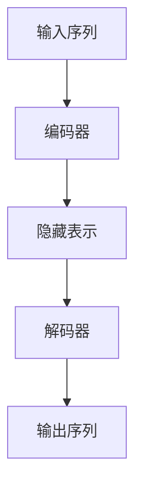

# 大语言模型原理与工程实践：Encoder 的代表：BERT

作者：禅与计算机程序设计艺术

## 1. 背景介绍

### 1.1 自然语言处理的演变

自然语言处理（NLP）是人工智能领域的一个重要分支，旨在实现人与计算机之间自然语言的有效通信。随着深度学习技术的发展，NLP在过去十年中取得了巨大的进步。从早期的基于规则的方法，到统计学习，再到如今的深度学习模型，NLP技术的演变展示了技术的不断进步和应用场景的不断扩展。

### 1.2 语言模型的发展

语言模型是NLP的核心组件之一，用于理解和生成自然语言。传统的语言模型，如n-gram模型，依赖于统计方法，存在数据稀疏性和上下文信息不足的问题。随着神经网络的引入，尤其是RNN（循环神经网络）和LSTM（长短期记忆网络）的出现，语言模型的性能得到了显著提升。然而，这些模型仍然面临着长距离依赖问题和计算复杂度高的问题。

### 1.3 Transformer模型的引入

2017年，Vaswani等人提出了Transformer模型，这是NLP领域的一个里程碑。Transformer模型通过自注意力机制（Self-Attention）和多头注意力机制（Multi-Head Attention）解决了传统RNN模型的长距离依赖问题，并极大地提高了计算效率。基于Transformer模型，许多强大的语言模型被提出，其中最具代表性的就是BERT（Bidirectional Encoder Representations from Transformers）。

## 2. 核心概念与联系

### 2.1 Transformer架构

Transformer模型由编码器（Encoder）和解码器（Decoder）两部分组成。编码器负责将输入序列转换为隐藏表示，解码器则将隐藏表示转换为输出序列。每个编码器和解码器层都包含自注意力机制和前馈神经网络。



### 2.2 自注意力机制

自注意力机制允许模型在处理当前词语时，关注输入序列中的其他位置，从而捕捉长距离依赖关系。自注意力机制的核心思想是通过计算输入序列中每个词语与其他词语的相似度，来决定其对当前词语的贡献。

### 2.3 BERT模型的创新

BERT模型是基于Transformer编码器架构的双向语言模型。与传统的单向语言模型不同，BERT通过掩码语言模型（Masked Language Model, MLM）和下一句预测（Next Sentence Prediction, NSP）任务进行训练，从而能够更好地理解上下文信息。

## 3. 核心算法原理具体操作步骤

### 3.1 输入表示

BERT模型的输入表示包括词嵌入（Token Embeddings）、位置嵌入（Position Embeddings）和段落嵌入（Segment Embeddings）。这些嵌入表示被加和后作为Transformer编码器的输入。

### 3.2 掩码语言模型（MLM）

掩码语言模型任务是通过随机掩盖输入序列中的一些词语，并预测这些词语的原始词汇。具体步骤如下：

1. 随机选择输入序列中的一些词语进行掩盖。
2. 将掩盖后的序列输入BERT模型。
3. 通过模型输出预测被掩盖的词语。

### 3.3 下一句预测（NSP）

下一句预测任务是通过给定的句子对，预测第二个句子是否是第一个句子的下一句。具体步骤如下：

1. 将两个句子拼接，并添加特殊标记（[CLS]和[SEP]）。
2. 将拼接后的序列输入BERT模型。
3. 通过模型输出的[CLS]标记的表示，预测第二个句子的正确性。

## 4. 数学模型和公式详细讲解举例说明

### 4.1 自注意力机制计算

自注意力机制的计算过程如下：

$$
Attention(Q, K, V) = softmax\left(\frac{QK^T}{\sqrt{d_k}}\right)V
$$

其中，$Q$（Query）、$K$（Key）和$V$（Value）是通过输入序列的嵌入表示线性变换得到的，$d_k$是Key的维度。

### 4.2 掩码语言模型损失函数

掩码语言模型的损失函数定义为：

$$
L_{MLM} = -\sum_{i \in M} \log P(x_i | \hat{x})
$$

其中，$M$表示被掩盖的词语集合，$x_i$是被掩盖的词语，$\hat{x}$是掩盖后的输入序列。

### 4.3 下一句预测损失函数

下一句预测的损失函数定义为：

$$
L_{NSP} = -\left[y \log P(y=1 | \mathbf{h}_{[CLS]}) + (1-y) \log P(y=0 | \mathbf{h}_{[CLS]})\right]
$$

其中，$y$是标签，$\mathbf{h}_{[CLS]}$是[CLS]标记的表示。

## 5. 项目实践：代码实例和详细解释说明

### 5.1 环境配置

首先，我们需要配置BERT模型的运行环境。可以使用Hugging Face的Transformers库来加载和使用BERT模型。

```python
!pip install transformers
```

### 5.2 加载预训练模型

接下来，我们加载预训练的BERT模型和分词器。

```python
from transformers import BertTokenizer, BertModel

tokenizer = BertTokenizer.from_pretrained('bert-base-uncased')
model = BertModel.from_pretrained('bert-base-uncased')
```

### 5.3 文本预处理

然后，我们对输入文本进行分词和编码。

```python
text = "Hello, my name is GPT-4."
inputs = tokenizer(text, return_tensors="pt")
```

### 5.4 模型推理

将编码后的输入序列传入BERT模型，获取输出表示。

```python
outputs = model(**inputs)
last_hidden_states = outputs.last_hidden_state
```

### 5.5 代码示例解释

上述代码首先安装了Transformers库，然后加载了预训练的BERT模型和分词器。接着，对输入文本进行分词和编码，并将编码后的输入序列传入BERT模型，获取最后一层的隐藏状态表示。

## 6. 实际应用场景

### 6.1 文本分类

BERT模型可以用于文本分类任务，如情感分析、垃圾邮件检测等。通过在预训练的BERT模型基础上，添加一个分类层，并对特定任务进行微调，可以实现高效的文本分类。

### 6.2 问答系统

BERT在问答系统中表现出色。通过在SQuAD等数据集上进行微调，BERT能够理解问题的语义，并从文档中提取出准确的答案。

### 6.3 机器翻译

尽管BERT主要用于编码任务，但其双向编码能力也可以为机器翻译任务提供有力支持。通过结合解码器，BERT可以用于生成翻译文本。

### 6.4 信息检索

BERT可以用于信息检索系统，通过对查询和文档进行编码，计算其相似度，从而实现高效的文档检索。

## 7. 工具和资源推荐

### 7.1 Hugging Face Transformers

Hugging Face的Transformers库是一个强大的工具，支持多种预训练语言模型，包括BERT。它提供了简单易用的API，方便进行模型加载、训练和推理。

### 7.2 TensorFlow和PyTorch

TensorFlow和PyTorch是两大主流的深度学习框架，均支持BERT模型的训练和部署。选择合适的框架可以根据具体需求和团队技术栈来决定。

### 7.3 数据集

常用的NLP数据集如SQuAD、GLUE、IMDb等，可以用于BERT模型的微调和评估。这些数据集涵盖了问答、文本分类、情感分析等多种任务。

## 8. 总结：未来发展趋势与挑战

### 8.1 发展趋势

随着计算能力的提升和数据量的增加，语言模型将继续向更大规模和更高性能发展。未来，基于BERT的模型将进一步优化，提升在各种NLP任务中的表现。

### 8.2 挑战

尽管BERT在NLP领域取得了显著进展，但仍然面临一些挑战，如计算资源消耗大、训练时间长、模型解释性不足等