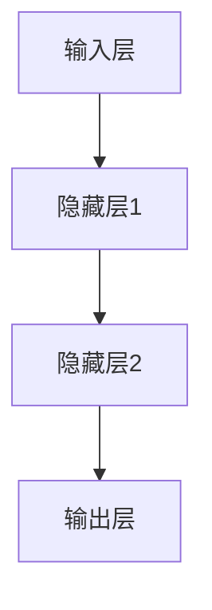

# 大语言模型原理与工程实践：前馈神经网络

作者：禅与计算机程序设计艺术

## 1.背景介绍

### 1.1 大语言模型的崛起

近年来，大语言模型（Large Language Models, LLMs）在自然语言处理（Natural Language Processing, NLP）领域取得了显著的进展。随着计算能力和数据量的增加，基于前馈神经网络（Feedforward Neural Networks, FNNs）的语言模型，如GPT-3、BERT等，展示了强大的语言理解和生成能力。这些模型在机器翻译、文本生成、情感分析等任务中表现出色，推动了人工智能技术的发展。

### 1.2 前馈神经网络的基础

前馈神经网络是构建大语言模型的基础。FNNs是一种简单且有效的神经网络结构，其基本思想是通过一系列的加权和激活函数，将输入数据逐层传递，最终得到输出结果。与循环神经网络（Recurrent Neural Networks, RNNs）不同，FNNs没有循环结构，信息在网络中单向流动，避免了梯度消失和梯度爆炸问题。

### 1.3 本文目标

本文旨在详细探讨前馈神经网络在大语言模型中的应用。我们将从核心概念、算法原理、数学模型、项目实践等多个角度进行深入分析，帮助读者全面理解并掌握前馈神经网络的原理与工程实践。

## 2.核心概念与联系

### 2.1 前馈神经网络的结构

前馈神经网络由输入层、隐藏层和输出层组成。每一层由若干神经元构成，神经元之间通过加权连接。输入层接受原始数据，隐藏层进行特征提取和变换，输出层生成最终结果。



### 2.2 激活函数

激活函数是前馈神经网络的重要组成部分，它决定了神经元的输出。常用的激活函数包括Sigmoid、ReLU、Tanh等。激活函数的选择直接影响网络的性能和训练效果。

### 2.3 损失函数

损失函数用于衡量模型预测值与真实值之间的差异。常用的损失函数有均方误差（Mean Squared Error, MSE）、交叉熵（Cross-Entropy）等。损失函数的优化是模型训练的核心任务。

### 2.4 反向传播算法

反向传播算法（Backpropagation）是训练前馈神经网络的主要方法。通过计算损失函数相对于每个权重的梯度，反向传播算法指导权重更新，从而逐步降低损失函数值。

## 3.核心算法原理具体操作步骤

### 3.1 数据预处理

数据预处理是训练前馈神经网络的第一步。包括数据清洗、归一化、特征提取等步骤，确保输入数据适合网络处理。

### 3.2 初始化权重

权重初始化对网络训练至关重要。常用的方法有随机初始化、Xavier初始化、He初始化等。合理的权重初始化可以加速训练过程，避免陷入局部最优解。

### 3.3 前向传播

前向传播是计算网络输出的过程。输入数据经过各层神经元的加权和激活函数处理，最终得到输出结果。前向传播的公式如下：

$$
z^{(l)} = W^{(l)}a^{(l-1)} + b^{(l)}
$$

$$
a^{(l)} = \sigma(z^{(l)})
$$

其中，$z^{(l)}$ 是第 $l$ 层的加权和，$W^{(l)}$ 是权重矩阵，$a^{(l-1)}$ 是上一层的激活值，$b^{(l)}$ 是偏置，$\sigma$ 是激活函数。

### 3.4 计算损失

损失函数用于评估模型预测的准确性。以均方误差为例，损失函数的计算公式为：

$$
L = \frac{1}{m} \sum_{i=1}^{m} (y_i - \hat{y}_i)^2
$$

其中，$L$ 是损失值，$m$ 是样本数量，$y_i$ 是真实值，$\hat{y}_i$ 是预测值。

### 3.5 反向传播

反向传播算法通过计算损失函数相对于权重的梯度，指导权重更新。反向传播的公式如下：

$$
\frac{\partial L}{\partial W^{(l)}} = \delta^{(l)}a^{(l-1)T}
$$

$$
\delta^{(l)} = \frac{\partial L}{\partial z^{(l)}} \cdot \sigma'(z^{(l)})
$$

其中，$\delta^{(l)}$ 是第 $l$ 层的误差项，$\sigma'$ 是激活函数的导数。

### 3.6 权重更新

权重更新是通过梯度下降算法进行的。常用的优化算法有随机梯度下降（SGD）、Adam等。权重更新的公式为：

$$
W^{(l)} = W^{(l)} - \eta \frac{\partial L}{\partial W^{(l)}}
$$

其中，$\eta$ 是学习率。

## 4.数学模型和公式详细讲解举例说明

### 4.1 前向传播的数学模型

在前向传播过程中，输入数据 $x$ 经过多层神经元的加权和激活函数处理，最终得到输出 $y$。以三层前馈神经网络为例，其数学模型如下：

$$
z^{(1)} = W^{(1)}x + b^{(1)}
$$

$$
a^{(1)} = \sigma(z^{(1)})
$$

$$
z^{(2)} = W^{(2)}a^{(1)} + b^{(2)}
$$

$$
a^{(2)} = \sigma(z^{(2)})
$$

$$
z^{(3)} = W^{(3)}a^{(2)} + b^{(3)}
$$

$$
y = \sigma(z^{(3)})
$$

### 4.2 反向传播的数学模型

反向传播通过链式法则计算损失函数相对于每层权重的梯度。以均方误差损失函数为例，其反向传播的数学模型如下：

$$
\frac{\partial L}{\partial W^{(3)}} = \delta^{(3)}a^{(2)T}
$$

$$
\delta^{(3)} = (y - \hat{y}) \cdot \sigma'(z^{(3)})
$$

$$
\frac{\partial L}{\partial W^{(2)}} = \delta^{(2)}a^{(1)T}
$$

$$
\delta^{(2)} = \delta^{(3)} \cdot W^{(3)T} \cdot \sigma'(z^{(2)})
$$

$$
\frac{\partial L}{\partial W^{(1)}} = \delta^{(1)}x^T
$$

$$
\delta^{(1)} = \delta^{(2)} \cdot W^{(2)T} \cdot \sigma'(z^{(1)})
$$

## 4.项目实践：代码实例和详细解释说明

### 4.1 数据准备

首先，我们需要准备数据集。以经典的MNIST手写数字识别数据集为例，我们将其加载并进行预处理。

```python
import tensorflow as tf
from tensorflow.keras.datasets import mnist
from tensorflow.keras.utils import to_categorical

# 加载数据集
(x_train, y_train), (x_test, y_test) = mnist.load_data()

# 数据预处理
x_train = x_train.reshape(-1, 28*28).astype('float32') / 255
x_test = x_test.reshape(-1, 28*28).astype('float32') / 255
y_train = to_categorical(y_train, 10)
y_test = to_categorical(y_test, 10)
```

### 4.2 构建前馈神经网络

接下来，我们构建一个简单的前馈神经网络模型。

```python
from tensorflow.keras.models import Sequential
from tensorflow.keras.layers import Dense

# 构建模型
model = Sequential([
    Dense(128, input_shape=(784,), activation='relu'),
    Dense(64, activation='relu'),
    Dense(10, activation='softmax')
])

# 编译模型
model.compile(optimizer='adam', loss='categorical_crossentropy', metrics=['accuracy'])
```

### 4.3 模型训练

使用训练数据对模型进行训练。

```python
# 训练模型
model.fit(x_train, y_train, epochs=10, batch_size=