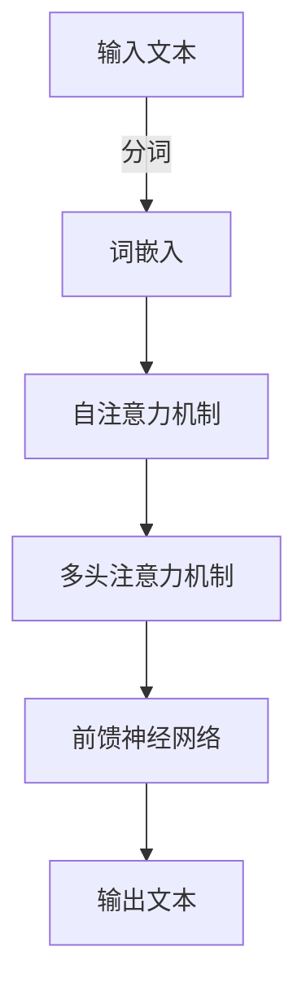

# 大语言模型原理与工程实践：推理引导

作者：禅与计算机程序设计艺术

## 1. 背景介绍

### 1.1 大语言模型的兴起

大语言模型（Large Language Models, LLMs）在近几年的人工智能领域取得了显著的进展，尤其是基于Transformer架构的模型如GPT-3、BERT等。这些模型通过大量的文本数据进行训练，能够生成高质量的自然语言文本，完成诸如翻译、对话生成、文本摘要等任务。

### 1.2 推理引导的重要性

推理引导（Inference Guidance）是提升大语言模型性能的关键技术之一。推理引导不仅仅是模型在生成文本时的一个过程，更是将模型的训练成果应用于实际场景的核心步骤。通过有效的推理引导，模型可以在生成文本时更好地理解上下文，提供更符合用户需求的输出。

### 1.3 本文目的

本文旨在详细探讨大语言模型的原理与工程实践，特别是推理引导的技术细节。通过深入的技术讲解和实际案例分析，帮助读者更好地理解和应用大语言模型。

## 2. 核心概念与联系

### 2.1 大语言模型的基本原理

大语言模型通过大量的文本数据进行训练，学习语言的结构和语义。其核心在于使用深度神经网络，特别是Transformer架构，来捕捉语言中的复杂模式。

### 2.2 Transformer架构简介

Transformer架构是大语言模型的基础。它通过自注意力机制（Self-Attention Mechanism）和多头注意力机制（Multi-Head Attention Mechanism）来处理输入文本，捕捉不同位置的词语之间的关系。



### 2.3 推理引导的概念

推理引导是在模型生成文本时，通过一定的策略和技术手段，引导模型生成符合预期的高质量文本。这包括上下文处理、提示工程（Prompt Engineering）、温度控制等。

### 2.4 核心算法与推理联系

推理引导与核心算法紧密相关。通过优化推理过程，可以显著提升模型的生成质量和效率。例如，使用Beam Search可以在生成过程中保留多个候选，最终选择最佳结果。

## 3. 核心算法原理具体操作步骤

### 3.1 自注意力机制

自注意力机制是Transformer架构的核心，通过计算输入序列中每个词与其他词的关系，生成注意力矩阵。具体步骤如下：

1. **输入序列嵌入**：将输入序列中的每个词转换为词嵌入向量。
2. **计算注意力权重**：通过点积计算每个词与其他词的相似度，并通过Softmax函数归一化。
3. **加权求和**：将注意力权重与词嵌入向量相乘并求和，得到新的词表示。

### 3.2 多头注意力机制

多头注意力机制通过多个自注意力机制的并行计算，捕捉不同子空间的关系。具体步骤如下：

1. **线性变换**：将输入词嵌入向量通过线性变换生成多个头。
2. **独立计算注意力**：对每个头独立计算自注意力。
3. **拼接与线性变换**：将所有头的输出拼接，并通过线性变换生成最终输出。

### 3.3 前馈神经网络

前馈神经网络用于对自注意力机制的输出进行进一步处理，通常包括两个线性变换和一个激活函数（如ReLU）。

### 3.4 推理引导技术

#### 3.4.1 Beam Search

Beam Search是一种广泛使用的推理引导技术，通过保留多个候选序列，选择生成质量最高的文本。具体步骤如下：

1. **初始化**：从起始词开始，生成多个候选词。
2. **扩展候选**：对每个候选词继续生成下一个词，形成新的候选序列。
3. **选择最佳候选**：根据评分函数选择生成质量最高的候选序列。

#### 3.4.2 温度控制

温度控制通过调整Softmax函数的温度参数，影响生成文本的多样性。温度越高，生成的文本越随机；温度越低，生成的文本越确定。

### 3.5 提示工程

提示工程是通过设计合理的提示（Prompt），引导模型生成符合预期的文本。具体步骤包括：

1. **设计提示**：根据任务需求设计合适的提示。
2. **输入模型**：将提示输入模型，生成初始文本。
3. **后处理**：对生成的文本进行后处理，确保符合预期。

## 4. 数学模型和公式详细讲解举例说明

### 4.1 自注意力机制的数学表示

自注意力机制通过以下公式计算注意力权重：

$$
\text{Attention}(Q, K, V) = \text{softmax}\left(\frac{QK^T}{\sqrt{d_k}}\right)V
$$

其中，$Q$、$K$、$V$分别表示查询、键和值，$d_k$表示键的维度。

### 4.2 多头注意力机制的数学表示

多头注意力机制通过以下公式计算输出：

$$
\text{MultiHead}(Q, K, V) = \text{Concat}(\text{head}_1, \ldots, \text{head}_h)W^O
$$

其中，每个头的计算方式为：

$$
\text{head}_i = \text{Attention}(QW_i^Q, KW_i^K, VW_i^V)
$$

### 4.3 前馈神经网络的数学表示

前馈神经网络通过以下公式计算输出：

$$
\text{FFN}(x) = \max(0, xW_1 + b_1)W_2 + b_2
$$

### 4.4 Beam Search的数学表示

Beam Search通过以下公式选择最佳候选：

$$
\text{Score}(y_1, \ldots, y_t) = \sum_{i=1}^t \log P(y_i | y_1, \ldots, y_{i-1})
$$

### 4.5 温度控制的数学表示

温度控制通过以下公式调整Softmax函数：

$$
P(y_i | x) = \frac{\exp(\frac{z_i}{T})}{\sum_{j} \exp(\frac{z_j}{T})}
$$

其中，$T$表示温度参数，$z_i$表示第$i$个词的得分。

## 4. 项目实践：代码实例和详细解释说明

### 4.1 自注意力机制的实现

以下是自注意力机制的代码实现：

```python
import torch
import torch.nn.functional as F

def attention(query, key, value, mask=None, dropout=None):
    d_k = query.size(-1)
    scores = torch.matmul(query, key.transpose(-2, -1)) / math.sqrt(d_k)
    if mask is not None:
        scores = scores.masked_fill(mask == 0, -1e9)
    p_attn = F.softmax(scores, dim=-1)
    if dropout is not None:
        p_attn = dropout(p_attn)
    return torch.matmul(p_attn, value), p_attn
```

### 4.2 多头注意力机制的实现

以下是多头注意力机制的代码实现：

```python
class MultiHeadedAttention(nn.Module):
    def __init__(self, h, d_model, dropout=0.1):
        super(MultiHeadedAttention, self).__init__()
        self.d_k = d_model // h
        self.h = h
        self.linears = clones(nn.Linear(d_model, d_model), 4)
        self.attn = None
        self.dropout = nn.Dropout(p=dropout)

    def forward(self, query, key, value, mask=None):
        if mask is not None:
            mask = mask.unsqueeze(1)
        nbatches = query.size(0)
        query, key, value = [l(x).view(nbatches, -1, self.h, self.d_k).transpose(1, 2)
                             for l, x in zip(self.linears, (query, key, value))]
        x, self.attn = attention(query, key, value, mask=mask, dropout=self.dropout)
        x = x.transpose(1, 2).contiguous().view(nbatches, -1, self.h * self.d_k)
        return self.linears[-1](x)
``