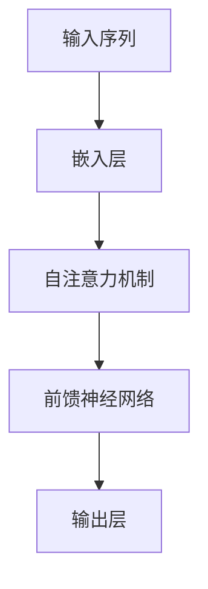

# 大语言模型原理与工程实践：核心架构

作者：禅与计算机程序设计艺术

## 1.背景介绍

### 1.1 大语言模型的兴起
大语言模型（Large Language Models, LLMs）近年来在自然语言处理（NLP）领域取得了显著的进展。自从OpenAI发布GPT系列以来，这些模型已经在文本生成、翻译、对话系统等应用中展现了强大的能力。其核心在于通过大规模的数据训练和复杂的神经网络架构，能够生成连贯且具有上下文语境的文本。

### 1.2 研究与应用的广泛性
大语言模型不仅在研究界引发了广泛关注，也在工业界得到了广泛应用。企业利用LLMs进行自动客服、内容生成、数据分析等，极大地提升了生产力和用户体验。

### 1.3 文章目标
本文旨在深入探讨大语言模型的核心原理与工程实践，从基础概念到具体实现，全面剖析其内部机制，并提供实际的代码示例和应用场景，帮助读者更好地理解和应用大语言模型。

## 2.核心概念与联系

### 2.1 神经网络基础
大语言模型的基础是神经网络，特别是深度神经网络（Deep Neural Networks, DNNs）。这些网络由多个层级的神经元组成，通过层层传递和变换信息，最终实现复杂的功能。

### 2.2 自注意力机制
自注意力机制（Self-Attention Mechanism）是LLMs的核心创新之一。它允许模型在处理每个词时，动态地关注输入序列中的其他词，从而捕捉长距离的依赖关系。

### 2.3 变换器架构
变换器（Transformer）架构是大语言模型的另一个关键组成部分。与传统的循环神经网络（RNNs）不同，变换器可以并行处理输入数据，大大提高了训练效率和效果。



### 2.4 预训练与微调
LLMs通常采用预训练和微调两个阶段。预训练阶段，模型在大规模无监督数据上进行训练；微调阶段，模型在特定任务的有监督数据上进行调整，以提高特定任务的性能。

## 3.核心算法原理具体操作步骤

### 3.1 数据准备
数据是训练大语言模型的基础。数据集需要经过清洗、标注和分词等预处理步骤，确保其质量和一致性。

### 3.2 模型构建
构建大语言模型需要定义其架构，包括嵌入层、自注意力层和前馈神经网络等。以下是一个简化的代码示例，展示了如何使用PyTorch构建一个基本的变换器模型。

```python
import torch
import torch.nn as nn
import torch.optim as optim

class TransformerModel(nn.Module):
    def __init__(self, vocab_size, d_model, nhead, num_encoder_layers, num_decoder_layers):
        super(TransformerModel, self).__init__()
        self.embedding = nn.Embedding(vocab_size, d_model)
        self.transformer = nn.Transformer(d_model, nhead, num_encoder_layers, num_decoder_layers)
        self.fc = nn.Linear(d_model, vocab_size)

    def forward(self, src, tgt):
        src = self.embedding(src)
        tgt = self.embedding(tgt)
        output = self.transformer(src, tgt)
        output = self.fc(output)
        return output

# 参数设置
vocab_size = 10000
d_model = 512
nhead = 8
num_encoder_layers = 6
num_decoder_layers = 6

# 模型实例化
model = TransformerModel(vocab_size, d_model, nhead, num_encoder_layers, num_decoder_layers)
```

### 3.3 模型训练
训练大语言模型需要大量的计算资源和时间。训练过程包括前向传播、计算损失、反向传播和参数更新。以下是一个简化的训练循环示例。

```python
# 损失函数和优化器
criterion = nn.CrossEntropyLoss()
optimizer = optim.Adam(model.parameters(), lr=0.001)

# 训练循环
for epoch in range(num_epochs):
    for src, tgt in data_loader:
        optimizer.zero_grad()
        output = model(src, tgt)
        loss = criterion(output.view(-1, vocab_size), tgt.view(-1))
        loss.backward()
        optimizer.step()
```

### 3.4 模型评估
模型评估是确保其性能和泛化能力的重要步骤。常见的评估指标包括困惑度（Perplexity）、BLEU、ROUGE等。

## 4.数学模型和公式详细讲解举例说明

### 4.1 自注意力机制公式
自注意力机制的核心公式如下：

$$
\text{Attention}(Q, K, V) = \text{softmax}\left(\frac{QK^T}{\sqrt{d_k}}\right)V
$$

其中，$Q$、$K$、$V$分别表示查询矩阵、键矩阵和值矩阵，$d_k$表示键向量的维度。

### 4.2 变换器层公式
变换器层包括多头自注意力机制和前馈神经网络。其核心公式如下：

$$
\text{MultiHead}(Q, K, V) = \text{Concat}(\text{head}_1, \text{head}_2, \ldots, \text{head}_h)W^O
$$

$$
\text{FFN}(x) = \text{max}(0, xW_1 + b_1)W_2 + b_2
$$

### 4.3 预训练目标
预训练阶段常用的目标函数是掩码语言模型（Masked Language Model, MLM）和自回归语言模型（Autoregressive Language Model, ALM）。其公式如下：

$$
\mathcal{L}_{\text{MLM}} = -\sum_{i \in \text{masked}} \log P(x_i | x_{\text{context}})
$$

$$
\mathcal{L}_{\text{ALM}} = -\sum_{t=1}^{T} \log P(x_t | x_{<t})
$$

## 5.项目实践：代码实例和详细解释说明

### 5.1 数据集准备
以下示例展示了如何使用Python从文本文件中加载和预处理数据。

```python
import torch
from torchtext.data.utils import get_tokenizer
from torchtext.vocab import build_vocab_from_iterator

# 加载数据
def yield_tokens(data_iter):
    for text in data_iter:
        yield tokenizer(text)

# 预处理数据
tokenizer = get_tokenizer('basic_english')
vocab = build_vocab_from_iterator(yield_tokens(train_iter), specials=["<unk>"])
vocab.set_default_index(vocab["<unk>"])

# 创建数据加载器
def data_process(raw_text_iter):
    data = [torch.tensor(vocab(tokenizer(item)), dtype=torch.long) for item in raw_text_iter]
    return torch.cat(tuple(filter(lambda t: t.numel() > 0, data)))

train_data = data_process(train_iter)
```

### 5.2 模型训练与评估
以下示例展示了如何训练和评估模型。

```python
# 定义训练函数
def train(model, data, optimizer, criterion):
    model.train()
    total_loss = 0
    for batch in data:
        optimizer.zero_grad()
        output = model(batch['src'], batch['tgt'])
        loss = criterion(output.view(-1, vocab_size), batch['tgt'].view(-1))
        loss.backward()
        optimizer.step()
        total_loss += loss.item()
    return total_loss / len(data)

# 定义评估函数
def evaluate(model, data, criterion):
    model.eval()
    total_loss = 0
    with torch.no_grad():
        for batch in data:
            output = model(batch['src'], batch['tgt'])
            loss = criterion(output.view(-1, vocab_size), batch['tgt'].view(-1))
            total_loss += loss.item()
    return total_loss / len(data)

# 训练和评估模型
for epoch in range(num_epochs):
    train_loss = train(model, train_data, optimizer, criterion)
    val_loss = evaluate(model, val_data, criterion)
    print(f'Epoch {epoch+1}, Train Loss: {train_loss:.4f}, Val Loss: {val_loss:.4f}')
```

### 5.3 模型推理
以下示例展示了如何使用训练好的模型进行文本生成。

```python
# 定义生成函数
def generate(model, start_token, max_len):
    model.eval()
    generated = [start_token]
    for _ in range(max_len):
        input_tensor = torch.tensor(generated, dtype=torch.long).unsqueeze(0)
        output = model(input_tensor, input_tensor)
       