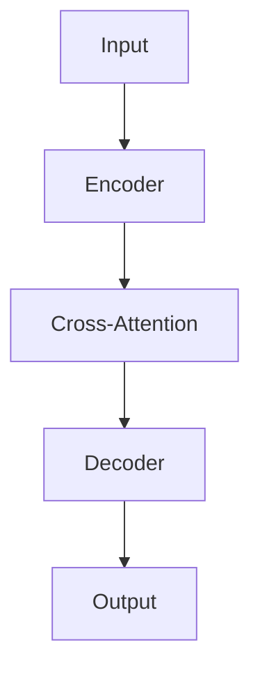

# 大语言模型原理与工程实践：目前的局限

## 1. 背景介绍

### 1.1 大语言模型的兴起

近年来,大型语言模型(Large Language Models, LLMs)在自然语言处理(NLP)领域掀起了一场革命。这些基于transformer架构的模型,如GPT(Generative Pre-trained Transformer)、BERT(Bidirectional Encoder Representations from Transformers)和LLaMA(Large Language Model Antiauthoritarian),通过在大规模语料库上进行预训练,展现出令人印象深刻的语言生成和理解能力。

LLMs的崛起主要源于以下几个关键因素:

1. **计算能力的提升**: 强大的GPU和TPU等加速硬件,加上分布式训练系统,使得训练大规模模型成为可能。
2. **数据的可用性**: 互联网上海量的文本数据为LLMs提供了丰富的训练资源。
3. **transformer架构的革新**: transformer的自注意力机制和并行化设计,有效解决了长期以来困扰序列模型的长程依赖问题。
4. **半监督/自监督学习**: 通过掩码语言模型(Masked Language Modeling)和下一句预测(Next Sentence Prediction)等任务,LLMs可以有效利用大量未标注数据进行预训练。

凭借其出色的泛化能力,LLMs在广泛的下游任务中表现卓越,如机器翻译、问答系统、文本摘要等,引发了学术界和工业界的广泛关注。

### 1.2 LLMs的局限性

尽管LLMs取得了令人瞩目的成就,但它们仍然存在一些重大局限性,这些局限制约了它们在实际应用中的表现和可靠性。本文将重点探讨以下几个方面的局限:

1. **缺乏常识推理能力**
2. **缺乏因果推理能力** 
3. **存在不一致性和偏差**
4. **缺乏可解释性和可控性**
5. **隐私和安全风险**
6. **计算资源需求巨大**
7. **训练数据质量的影响**

在后续章节中,我们将详细阐述这些局限性的根源、表现形式,以及当前的一些缓解方法和未来的研究方向。

## 2. 核心概念与联系

### 2.1 大语言模型的架构

大语言模型通常采用transformer编码器-解码器架构,如下图所示:

编码器(Encoder)将输入序列(如文本)映射为上下文表示,解码器(Decoder)则基于上下文表示和先前生成的tokens,自回归地生成输出序列。编码器和解码器均由多个transformer层组成,每层包含多头自注意力(Multi-Head Attention)和前馈神经网络(Feed-Forward Neural Network)子层。

自注意力机制使transformer能够直接建模输入和输出之间的长程依赖关系,从而有效解决了RNN等序列模型的梯度消失/爆炸问题。此外,transformer的并行化设计也使其在硬件加速下拥有极高的计算效率。

### 2.2 预训练范式

大语言模型通常采用两阶段训练策略:

1. **预训练(Pre-training)**: 在大规模未标注语料库上进行自监督学习,学习通用的语言表示。常见的自监督训练目标包括:
    - 掩码语言模型(Masked Language Modeling, MLM): 基于上下文推测被遮蔽词的标识。
    - 下一句预测(Next Sentence Prediction, NSP): 判断两个句子是否为连续句子。
    - 因果语言模型(Causal Language Modeling, CLM): 基于前文预测下一个词。
    
2. **微调(Fine-tuning)**: 在特定的下游任务上使用监督数据对预训练模型进行微调,使其适应目标任务。

这种预训练+微调的范式使LLMs能够在下游任务上快速收敛,并展现出强大的泛化能力。

### 2.3 生成式和判别式建模

根据输入输出的不同,LLMs可分为生成式模型和判别式模型:

- **生成式模型**(如GPT): 给定上下文,自回归地生成文本序列。常用于文本生成、机器翻译、问答等任务。
- **判别式模型**(如BERT): 对给定的文本对/句子对进行编码,用于分类、序列标注等任务。

生成式模型关注于语言的流畅性(fluency),判别式模型则侧重于语义理解。二者结合可实现强大的双向编码,如BART(Bidirectional and Auto-Regressive Transformers)和T5(Text-to-Text Transfer Transformer)。

### 2.4 大语言模型的能力

经过大规模预训练,LLMs展现出了广泛的能力,包括:

- **文本生成**: 能够生成连贯、多样的文本内容,如新闻、小说、诗歌等。
- **机器翻译**: 在多种语言对之间实现高质量的翻译。
- **问答**: 通过理解上下文回答相关的问题。
- **文本摘要**: 能够捕捉文本的核心内容并生成简明扼要的摘要。
- **代码生成**: 基于自然语言描述生成代码。
- **常识推理**: 能够利用获取的常识知识进行基本的推理。

这些能力使LLMs在自然语言处理的各个领域大放异彩,极大推动了该领域的发展。

## 3. 核心算法原理具体操作步骤  

### 3.1 Transformer 架构

Transformer 架构是大语言模型的核心,其主要由编码器(Encoder)和解码器(Decoder)两部分组成。我们以 Encoder 为例,介绍其内部的具体操作步骤。

1. **输入嵌入(Input Embeddings)**: 将输入序列的每个 token(单词或子词)映射为一个连续的向量表示,即嵌入向量。

2. **位置编码(Positional Encoding)**: 由于 Transformer 没有使用循环或卷积神经网络来捕获序列顺序信息,因此需要将序列的位置信息编码到输入嵌入中。常见的位置编码方法是使用正弦和余弦函数来编码位置信息。

   $$\text{PE}_{(pos, 2i)} = \sin(pos / 10000^{2i/d_\text{model}})$$
   $$\text{PE}_{(pos, 2i+1)} = \cos(pos / 10000^{2i/d_\text{model}})$$

   其中 $pos$ 是 token 的位置, $i$ 是维度的索引, $d_\text{model}$ 是模型的隐藏层大小。

3. **多头自注意力(Multi-Head Attention)**: 自注意力机制是 Transformer 的核心部分,它允许每个输入 token 关注到其他 token,捕获它们之间的依赖关系。具体计算过程如下:

   - 将输入嵌入 $X$ 线性投影到查询(Query)、键(Key)和值(Value)向量: $Q=XW^Q$, $K=XW^K$, $V=XW^V$。
   - 计算注意力权重: $\text{Attention}(Q, K, V) = \text{softmax}(\frac{QK^T}{\sqrt{d_k}})V$, 其中 $d_k$ 是缩放因子。
   - 多头注意力机制将上述过程独立应用于 $h$ 个注意力头,最后将它们的结果拼接: $\text{MultiHead}(Q, K, V) = \text{Concat}(\text{head}_1, ..., \text{head}_h)W^O$。

4. **残差连接和层归一化(Residual Connection & Layer Normalization)**: 为了更好地训练,Transformer 在每个子层之后应用残差连接和层归一化操作,有助于梯度传播和加速收敛。

5. **前馈神经网络(Feed-Forward Network)**: 一个简单的前馈神经网络,包含两个线性变换和一个 ReLU 激活函数: $\text{FFN}(x) = \max(0, xW_1 + b_1)W_2 + b_2$。

6. **输出(Output)**: 重复上述步骤 $N$ 次(堆叠 $N$ 个 Transformer 块),最终输出编码后的序列表示。

解码器(Decoder)的结构与编码器类似,不同之处在于它还包含一个注意力子层,用于关注编码器的输出。

### 3.2 预训练目标

大语言模型通常采用自监督学习的方式进行预训练,常见的预训练目标包括:

1. **掩码语言模型(Masked Language Modeling, MLM)**: 随机遮蔽输入序列中的一些 token,模型需要基于剩余的上下文推测被遮蔽的 token。MLM 目标函数为:

   $$\mathcal{L}_\text{MLM} = -\mathbb{E}_{x, m} \Big[\sum_{i=1}^n \log P(x_i | x \backslash m_i)\Big]$$

   其中 $x$ 是原始序列, $m_i$ 是遮蔽位置, $x \backslash m_i$ 表示去除遮蔽位置后的序列。

2. **下一句预测(Next Sentence Prediction, NSP)**: 判断两个句子是否为连续的句子对。NSP 目标函数为:

   $$\mathcal{L}_\text{NSP} = -\mathbb{E}_{(x_1, x_2, y)} \Big[\log P(y | x_1, x_2)\Big]$$

   其中 $x_1$ 和 $x_2$ 分别是两个句子, $y$ 是它们是否为连续句子对的标签。

3. **因果语言模型(Causal Language Modeling, CLM)**: 基于前文预测下一个 token,常用于生成式模型如 GPT。CLM 目标函数为:

   $$\mathcal{L}_\text{CLM} = -\mathbb{E}_{x} \Big[\sum_{i=1}^n \log P(x_i | x_{<i})\Big]$$

   其中 $x_{<i}$ 表示序列 $x$ 中位于 $i$ 之前的 token。

在实际预训练中,通常会组合使用上述目标,并采用多任务学习的方式联合优化。

### 3.3 微调策略

在完成预训练后,大语言模型需要针对特定的下游任务进行微调(Fine-tuning),以提高模型在该任务上的性能。常见的微调策略包括:

1. **全程微调(Full Fine-tuning)**: 对预训练模型的所有参数进行微调。这种方式简单有效,但计算代价较高。

2. **前馈层微调(Featurized Fine-tuning)**: 只微调预训练模型的前馈层,保持其他层(如自注意力层)的参数固定。这种方式计算代价较低,但效果可能会受到一定影响。

3. **前缀微调(Prefix-tuning)**: 在输入序列前添加一个可训练的"前缀",并在微调时只更新该前缀的参数,而保持预训练模型不变。这种方式计算代价极低,但性能下降较大。

4. **提示微调(Prompt-tuning)**: 将输入reformulated为一个填空式的"提示",微调时只更新与提示相关的参数。这种方式灵活性较高,但需要人工设计合适的提示。

5. **LoRA(Low-Rank Adaptation)**: 通过在每层添加两个低秩矩阵,对预训练模型进行高效的微调。这种方式计算代价低,但需要额外的内存开销。

不同的微调策略在计算效率、性能和灵活性之间存在权衡。在实践中,需要根据具体任务和资源约束选择合适的策略。

## 4. 数学模型和公式详细讲解举例说明

在大语言模型中,自注意力机制是捕捉长程依赖关系的关键。我们将通过一个具体例子,详细解释自注意力的计算过程及其数学原理。

假设我们有一个长度为 4 的输入序列 $X = (x_1, x_2, x_3, x_4)$,其中每个 $x_i$ 是一个 $d_\text{model}$ 维的向量。我们希望计算第三个单词 $x_3$ 对其他单词的注意力分数,以捕捉它们之间的依赖关系。

1. **查询、键和值的计算**

   我们首先需要将输入序列 $X$ 线性投影到查询(Query)、键(Key)和值(Value)向量:

   $$Q = XW^Q, \quad K = XW^K, \quad V = XW^V$$

   其中 