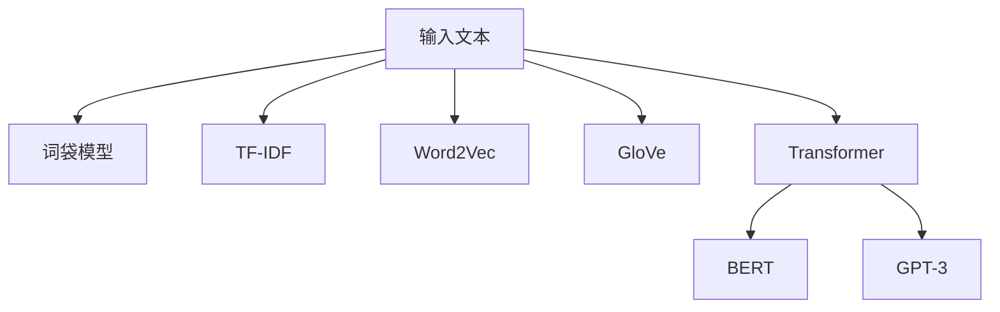

# 大语言模型原理与工程实践：词表示技术

作者：禅与计算机程序设计艺术

## 1. 背景介绍

### 1.1 自然语言处理的崛起

近年来，自然语言处理（NLP）领域取得了长足的进步。大语言模型（Large Language Models, LLMs）的出现，尤其是基于深度学习的模型，如GPT-3、BERT等，彻底改变了我们处理和理解自然语言的方式。这些模型不仅在学术界引起了广泛关注，也在工业界得到了广泛应用。

### 1.2 词表示技术的演变

词表示技术是自然语言处理的核心之一。早期的词表示技术，如词袋模型（Bag-of-Words, BOW）和TF-IDF，虽然简单易用，但存在诸多局限性。随着深度学习技术的发展，词向量（Word Embeddings）如Word2Vec、GloVe等逐渐成为主流。这些技术能够捕捉词语之间的语义关系，大大提升了NLP任务的性能。

### 1.3 大语言模型中的词表示

在大语言模型中，词表示技术进一步演进。Transformer架构的引入，使得模型能够更好地捕捉上下文信息，从而生成更加精确的词表示。本文将深入探讨大语言模型中的词表示技术，解析其核心算法原理，并通过实际代码实例展示其工程实践。

## 2. 核心概念与联系

### 2.1 词表示的定义

词表示是将词语映射到向量空间的过程，使得词语在数学上可以被处理。理想的词表示应能够捕捉词语的语义和语法信息，使得相似词语在向量空间中距离较近。

### 2.2 词袋模型与TF-IDF

词袋模型和TF-IDF是早期的词表示技术。词袋模型将文本表示为词语的无序集合，而TF-IDF通过词频和逆文档频率来衡量词语的重要性。这些方法虽然简单，但无法捕捉词语的语义关系。

### 2.3 词向量：Word2Vec与GloVe

词向量技术通过训练神经网络，将词语映射到低维向量空间。Word2Vec通过Skip-gram和CBOW模型训练词向量，GloVe则通过全局词共现矩阵进行训练。这些方法能够捕捉词语的语义关系，使得相似词语在向量空间中距离较近。

### 2.4 Transformer与大语言模型

Transformer架构的引入，使得大语言模型能够更好地捕捉上下文信息。通过自注意力机制（Self-Attention），模型能够动态地调整词语之间的关系，从而生成更加精确的词表示。BERT、GPT-3等模型都是基于Transformer架构的典型代表。



## 3. 核心算法原理具体操作步骤

### 3.1 词袋模型与TF-IDF

#### 3.1.1 词袋模型

词袋模型将文本表示为词语的无序集合。具体操作步骤如下：

1. **文本预处理**：去除标点符号、停用词等。
2. **词汇表构建**：统计文本中出现的所有词语，构建词汇表。
3. **词频统计**：统计每个词语在文本中出现的频率。

```python
from sklearn.feature_extraction.text import CountVectorizer

texts = ["I love machine learning", "Machine learning is great"]
vectorizer = CountVectorizer()
X = vectorizer.fit_transform(texts)

print(vectorizer.get_feature_names_out())
print(X.toarray())
```

#### 3.1.2 TF-IDF

TF-IDF通过词频和逆文档频率来衡量词语的重要性。具体操作步骤如下：

1. **词频计算**：统计每个词语在文本中出现的频率。
2. **逆文档频率计算**：计算每个词语在所有文档中出现的频率。
3. **TF-IDF计算**：将词频和逆文档频率结合，计算每个词语的TF-IDF值。

```python
from sklearn.feature_extraction.text import TfidfVectorizer

texts = ["I love machine learning", "Machine learning is great"]
vectorizer = TfidfVectorizer()
X = vectorizer.fit_transform(texts)

print(vectorizer.get_feature_names_out())
print(X.toarray())
```

### 3.2 Word2Vec与GloVe

#### 3.2.1 Word2Vec

Word2Vec通过训练神经网络，将词语映射到低维向量空间。具体操作步骤如下：

1. **文本预处理**：去除标点符号、停用词等。
2. **构建训练数据**：通过滑动窗口构建词对。
3. **模型训练**：通过Skip-gram或CBOW模型训练词向量。

```python
from gensim.models import Word2Vec

sentences = [["I", "love", "machine", "learning"], ["Machine", "learning", "is", "great"]]
model = Word2Vec(sentences, vector_size=100, window=5, min_count=1, workers=4)

print(model.wv['machine'])
```

#### 3.2.2 GloVe

GloVe通过全局词共现矩阵进行训练。具体操作步骤如下：

1. **文本预处理**：去除标点符号、停用词等。
2. **构建共现矩阵**：统计词语在不同上下文中的共现次数。
3. **模型训练**：通过优化目标函数训练词向量。

```python
import numpy as np
from glove import Glove, Corpus

sentences = [["I", "love", "machine", "learning"], ["Machine", "learning", "is", "great"]]
corpus = Corpus()
corpus.fit(sentences, window=10)

glove = Glove(no_components=100, learning_rate=0.05)
glove.fit(corpus.matrix, epochs=10, no_threads=4, verbose=True)
glove.add_dictionary(corpus.dictionary)

print(glove.word_vectors[glove.dictionary['machine']])
```

### 3.3 Transformer与大语言模型

#### 3.3.1 Transformer架构

Transformer架构通过自注意力机制捕捉上下文信息。具体操作步骤如下：

1. **输入嵌入**：将词语转换为向量表示。
2. **位置编码**：添加位置信息，使模型能够识别词序。
3. **自注意力机制**：计算词语之间的相关性。
4. **前馈神经网络**：通过全连接层进行非线性变换。
5. **层归一化**：对每一层输出进行归一化处理。

```python
import torch
import torch.nn as nn

class TransformerModel(nn.Module):
    def __init__(self, ntoken, ninp, nhead, nhid, nlayers, dropout=0.5):
        super(TransformerModel, self).__init__()
        self.model_type = 'Transformer'
        self.pos_encoder = PositionalEncoding(ninp, dropout)
        self.encoder_layers = nn.TransformerEncoderLayer(ninp, nhead, nhid, dropout)
        self.transformer_encoder = nn.TransformerEncoder(self.encoder_layers, nlayers)
        self.encoder = nn.Embedding(ntoken, ninp)
        self.ninp = ninp
        self.decoder = nn.Linear(ninp, ntoken)

    def forward(self, src, src_mask):
        src = self.encoder(src) * math.sqrt(self.ninp)
        src = self.pos_encoder(src)
        output = self.transformer_encoder(src, src_mask)
        output = self.decoder(output)
        return output
```

#### 3.3.2 BERT与GPT-3

BERT和GPT-3是基于Transformer架构的典型代表。BERT通过双向编码器捕捉上下文信息，GPT-3则通过自回归模型生成文本。

```python
from transformers import BertTokenizer, BertModel

tokenizer = BertTokenizer.from_pretrained('bert-base-uncased')
model = BertModel.from_pretrained('bert-base-uncased')

inputs = tokenizer("Hello, my dog is cute", return_tensors="pt")
outputs = model(**inputs)

last_hidden_states = outputs.last_hidden_state
print(last_hidden_states)
```

## 4. 数学模型和公式详细讲解举例说明

### 4.1 词袋模型与TF-IDF

#### 4.1.1 词袋模型

词袋模型将文本表示为词语的无序集合，其数学表示如下：

$$
\mathbf{X}_{ij} = \text{count}(