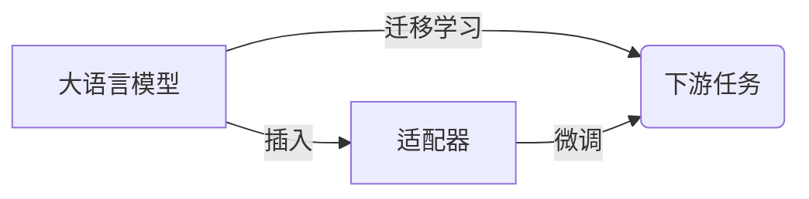

# 大语言模型原理与工程实践：适配器微调

作者：禅与计算机程序设计艺术

## 1. 背景介绍

### 1.1 大语言模型的兴起
近年来,自然语言处理(NLP)领域飞速发展,大语言模型(LLM)以其强大的语言理解和生成能力引领了这一浪潮。从 GPT-1 到 GPT-3,从 BERT 到 XLNet,LLM 的参数规模和性能不断刷新着记录。

### 1.2 大语言模型面临的挑战
尽管 LLM 展现出了惊人的能力,但在实际应用中,我们仍需考虑以下问题:
1. 模型体积庞大,难以在资源受限的设备上部署
2. 预训练数据与下游任务领域存在差异,导致泛化能力不足
3. 从头训练LLM成本高昂,需要大量数据、算力和时间投入

### 1.3 适配器微调的提出
针对上述问题,适配器(Adapter)微调应运而生。通过在LLM中插入少量可训练参数,并使用较少的领域数据进行微调,我们可以在保留LLM强大能力的同时,显著降低部署难度和训练成本,并提升模型在特定领域的表现。

## 2. 核心概念与联系

### 2.1 大语言模型
- 定义:以自回归或自编码为主的大规模预训练语言模型
- 代表: GPT系列, BERT, XLNet, RoBERTa 等
- 特点:参数量巨大(数亿到上千亿)、语言理解能力强、可通过微调应用于下游任务

### 2.2 迁移学习
- 定义:将已训练好的模型应用到相关但不同的新任务上
- 优势:提升模型泛化能力、降低训练成本、缓解标注数据稀缺问题
- 分类:特征提取(Frozen)、微调(Fine-tuning)、少样本学习(Few-shot Learning)等

### 2.3 适配器 
- 定义:插入在预训练模型各层之间的轻量级模块,包含少量可训练参数
- 结构:通常由两个全连接层(Down-projection和Up-projection)组成
- 作用:在微调阶段聚焦学习任务相关的特征,降低过拟合风险

### 2.4 微调
- 定义:利用目标任务的标注数据,对预训练模型进行二次训练,使其适应新任务
- 对比:传统微调需调整LLM全部参数,适配器微调仅训练新增模块,冻结原始参数
- 优势:所需数据少、计算资源省、调优过程快、效果好

### 2.5 核心概念关系图


## 3. 核心算法原理与具体操作步骤

### 3.1 适配器的数学描述
设大语言模型的第 $l$ 层隐状态为 $h^{(l)}$,适配器可表示为：

$$
\begin{aligned}
h'^{(l)} &= f(h^{(l)},\theta_l) \\
&= U_l(R(D_l(h^{(l)}))) + h^{(l)}
\end{aligned}
$$

其中 $\theta_l=\{D_l,U_l\}$ 为适配器的参数,包括:
- $D_l \in \mathbb{R}^{d \times r}, d$为隐状态维度,$r$为瓶颈维度且$r<<d$
- $U_l \in \mathbb{R}^{r \times d}$, 与$D_l$对称
- $R$ 为非线性激活函数,通常为ReLU

上式体现了:
1. 通过投影矩阵$D_l$将隐状态$h^{(l)}$压缩至低维空间 
2. 通过升维矩阵$U_l$恢复至原始维度
3. 残差连接确保适配器可学习到$h^{(l)}$的增量表示

### 3.2 适配器微调的训练流程
给定预训练的大语言模型$LLM$,带标签的目标任务数据集$D=\{(x_i,y_i)\}_{i=1}^N$,适配器微调的具体步骤如下:

1. **插入适配器**: 
   - 对$LLM$中的每个Transformer块(编码器或解码器层)
   - 在Self-Attention和Feed-Forward子层之后,各插入一个适配器模块
   - 初始化适配器参数$\theta=\{\theta_l\}_{l=1}^L$

2. **微调适配器**:
   - 冻结$LLM$的原始参数,只更新适配器参数$\theta$ 
   - 将数据$(x_i,y_i)$喂入插入适配器后的模型,计算损失:
     $$\mathcal{L}(\theta)=\sum_{i=1}^N \ell(f_{LLM}(x_i;\theta),y_i)$$
   - 通过梯度下降等优化算法最小化损失,迭代更新$\theta$

3. **推理阶段**:
   - 固定优化后的适配器参数$\theta^*$
   - 利用插入适配器后的模型$f_{LLM}(·;\theta^*)$进行推理预测

### 3.3 适配器结构的变体与改进
在实践中,研究者提出了多种适配器结构变体,以平衡性能和效率:
- **П-adapter**: 用一层非线性层替换Up-Projection,减小参数量
- **Low-rank adapter**: 将$D_l$和$U_l$初始化为低秩矩阵,进一步压缩
- **Parallel adapter**: 并行插入多个适配器,学习不同的特征模式
- **AdapterBias**: 用可学习bias项替代Up-Projection,简化结构

此外,针对Transformer的不同子层(Self-Attention,FFN)设计定制化的适配器,也是一大研究方向。

## 4. 数学模型与公式详解

### 4.1 Self-Attention 适配器
对于第$l$层Transformer块的Self-Attention:

$$
\begin{aligned}
Q^{(l)} &= h^{(l-1)}W_q^{(l)} \\  
K^{(l)} &= h^{(l-1)}W_k^{(l)} \\ 
V^{(l)} &= h^{(l-1)}W_v^{(l)} \\
h^{(l)} &= \text{Softmax}(\frac{Q^{(l)}K^{(l)T}}{\sqrt{d}})V^{(l)}
\end{aligned}
$$

其中$W_q,W_k,W_v \in \mathbb{R}^{d \times d}$为投影矩阵。插入适配器后的Self-Attention为:

$$
h'^{(l)} = U_{sa}^{(l)} (R(D_{sa}^{(l)}(h^{(l)}))) + h^{(l)}
$$

其中$D_{sa}^{(l)} \in \mathbb{R}^{d \times r},U_{sa}^{(l)} \in \mathbb{R}^{r \times d}$是Self-Attention适配器的参数。

### 4.2 FFN 适配器
对于第$l$层Transformer块的FFN:

$$
\begin{aligned}
h^{(l+\frac{1}{2})} &= \text{ReLU}(h'^{(l)}W_1^{(l)} + b_1^{(l)}) \\
h^{(l+1)} &= h^{(l+\frac{1}{2})}W_2^{(l)} + b_2^{(l)}
\end{aligned}
$$

其中$W_1 \in \mathbb{R}^{d \times 4d},W_2 \in \mathbb{R}^{4d \times d}$为权重矩阵,$4d$为FFN隐藏层维度。插入适配器后的FFN为:

$$
\begin{aligned}
h''^{(l+\frac{1}{2})} &= U_{ffn}^{(l)} (R(D_{ffn}^{(l)}(h^{(l+\frac{1}{2})}))) + h^{(l+\frac{1}{2})} \\
h^{(l+1)} &= h''^{(l+\frac{1}{2})}W_2^{(l)} + b_2^{(l)} 
\end{aligned}
$$

其中$D_{ffn}^{(l)} \in \mathbb{R}^{4d \times r},U_{ffn}^{(l)} \in \mathbb{R}^{r \times 4d}$是FFN适配器的参数。

综上,适配器参数的总量为:

$$|\theta|= \sum_{l=1}^L (|D_{sa}^{(l)}|+|U_{sa}^{(l)}| +|D_{ffn}^{(l)}| +|U_{ffn}^{(l)}|) \approx 8Lrd << |LLM|$$

通过控制适配器数目$L$和瓶颈维度$r$,我们可以灵活调节计算效率和表示能力

## 5. 项目实践：代码实例与详解

以下以PyTorch为例,展示如何为BERT实现和训练适配器。核心代码如下:

```python
class BertAdapterLayer(nn.Module):
    def __init__(self, config):
        super().__init__()
        self.down_proj = nn.Linear(config.hidden_size, config.adapter_size) 
        self.up_proj = nn.Linear(config.adapter_size, config.hidden_size)

    def forward(self, hidden_states):
        x = self.down_proj(hidden_states)
        x = F.relu(x) 
        x = self.up_proj(x)
        x = x + hidden_states  # 残差连接
        return x

class BertAdapterModel(BertPreTrainedModel):
    def __init__(self, config):
        super().__init__(config)
        self.bert = BertModel(config)  # 加载预训练BERT
        # 在每个编码器层后插入适配器
        for i, layer in enumerate(self.bert.encoder.layer):
            layer.output = BertAdapterLayer(config)

    def forward(self, **kwargs):
        return self.bert(**kwargs)
```

上述代码主要步骤:
1. 定义`BertAdapterLayer`表示适配器模块,包含`down_proj`和`up_proj`两个线性层
2. 定义`BertAdapterModel`,继承自`BertPreTrainedModel`,内部加载预训练BERT模型
3. 遍历BERT的12层编码器,在每层后插入`BertAdapterLayer`
4. `BertAdapterModel`的前向过程`forward`等价于插入适配器后的BERT的前向计算

在训练阶段,只需实例化`BertAdapterModel`,并通过`AdamW`等优化器训练其适配器参数即可:

```python
model = BertAdapterModel.from_pretrained('bert-base-uncased') 
for name, param in model.named_parameters():
    if 'adapter' not in name:
        param.requires_grad = False  # 冻结BERT原始参数

optimizer = AdamW(model.parameters(), lr=1e-4)
```

推理时,直接使用微调后的`BertAdapterModel`进行预测。相比从头训练BERT,适配器方法的训练代价和推理延迟要低上一个量级,却能取得相近的性能。

## 6. 实际应用场景

适配器微调在工业界已得到广泛应用,典型场景包括:

### 6.1 领域自适应
利用适配器将通用LLM快速适配到特定领域(如医疗、法律、金融等),显著提升垂直场景下模型的效果。例如,为BERT插入医学领域适配器,可使其在医疗实体识别、关系抽取等任务上取得SOTA表现。

### 6.2 多任务学习
不同任务插入不同适配器,可实现单个LLM高效服务多个下游任务。例如,同时将分类、阅读理解、摘要等任务的适配器整合到GPT模型中,既减少部署开销,又能保证各任务性能。

### 6.3 低资源语言建模
对于标注数据稀缺的非通用语料,适配器微调可最大化利用LLM学到的语言知识,显著降低标注成本。例如,利用多语言BERT和少量平行语料,快速构建高质量的非英语机器翻译系统。

### 6.4 跨模态学习
为视觉-语言预训练模型(如CLIP)引入适配器,可实现图像字幕、视觉问答等多模态任务的轻量级迁移学习。例如,在CLIP的视觉编码器中加入适配器并微调,即可适应新的视觉领域。

## 7. 工具与资源推荐

为方便研究者和从业者开展适配器相关工作,这里推荐一些流行的工具库和模型资源:

- **AdapterHub**: 基于Huggingface Transformers的开源适配器训练库,支持100+预训练模型
- **AdapterDrop**: 用适配器压缩BERT的工具包,在12到36