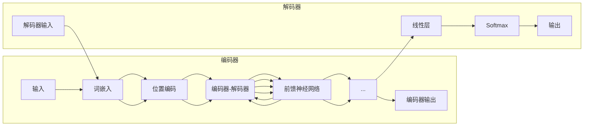

# 大语言模型原理基础与前沿 减少偏见和有害性

作者：禅与计算机程序设计艺术

## 1. 背景介绍

### 1.1 大语言模型的兴起

近年来，自然语言处理领域取得了突破性进展，特别是大语言模型（LLM）的出现，如 OpenAI 的 GPT-3、Google 的 BERT 和 Facebook 的 BART，它们在各种 NLP 任务中展现出惊人的能力，例如：

* **文本生成:**  撰写创意故事、生成不同风格的代码、翻译语言等。
* **问答系统:**  理解复杂问题并提供准确答案。
* **代码生成:**  根据自然语言描述生成代码。
* **对话系统:**  进行流畅自然的对话，模拟人类交流。

这些模型的成功得益于深度学习算法的进步、海量数据的可用性以及计算能力的提升。

### 1.2 偏见和有害性的挑战

然而，LLM 也暴露出一些潜在问题，其中最令人担忧的是**偏见和有害性**。由于训练数据中存在社会偏见，LLM 可能会生成带有歧视性、仇恨性或不公平内容的输出，例如：

* **性别偏见:**  将女性与家庭主妇、护士等职业联系起来，而将男性与 CEO、工程师等职业联系起来。
* **种族偏见:**  对某些种族群体表现出负面刻板印象。
* **宗教偏见:**  传播对特定宗教的仇恨或歧视。

这些偏见和有害性输出会对个人和社会造成严重伤害，因此，研究如何减少 LLM 中的偏见和有害性至关重要。

## 2. 核心概念与联系

### 2.1 大语言模型的结构

LLM 通常基于 Transformer 架构，这是一种强大的神经网络结构，特别擅长处理序列数据，例如文本。Transformer 模型的核心是自注意力机制，它允许模型关注输入序列中不同部分之间的关系，从而捕捉到长距离依赖关系。



### 2.2 偏见和有害性的来源

LLM 中的偏见和有害性主要来源于训练数据。如果训练数据包含大量带有偏见或有害性的内容，模型就会学习到这些模式并将其反映在输出中。

**偏见和有害性来源的例子:**

* **网络文本:**  网络论坛、社交媒体评论等网络文本 often contain offensive language and stereotypes.
* **新闻报道:**  新闻报道可能包含对某些事件或群体的偏见性描述。
* **书籍和电影:**  虚构作品可能包含强化社会偏见的刻板印象。

### 2.3 偏见和有害性的影响

LLM 中的偏见和有害性会对个人和社会造成多种负面影响：

* **强化社会偏见:**  LLM 生成的带有偏见的内容会加剧现有的社会不平等现象。
* **传播仇恨和歧视:**  LLM 生成的有害内容会煽动对某些群体或个人的仇恨和歧视。
* **损害个人声誉:**  LLM 生成的虚假或诽谤性内容会损害个人声誉。
* **影响决策:**  LLM 被用于越来越多的决策场景，例如招聘、贷款和司法判决，如果模型存在偏见，可能会导致不公平的结果。

## 3. 核心算法原理具体操作步骤

### 3.1 数据预处理

数据预处理是减少 LLM 偏见和有害性的第一步，它涉及清理和准备训练数据，以减少模型接触到有害内容的可能性。

**数据预处理技术:**

* **数据清洗:**  识别和删除训练数据中的有害内容，例如仇恨言论、脏话和个人信息。
* **数据增强:**  使用数据增强技术来增加训练数据的多样性，例如，可以使用反向翻译或同义词替换来创建原始文本的变体。
* **数据平衡:**  确保训练数据在不同群体和观点之间保持平衡，以减少模型对特定群体的偏见。

### 3.2 模型训练

在模型训练阶段，可以使用多种技术来减少 LLM 中的偏见和有害性。

**模型训练技术:**

* **对抗训练:**  在训练过程中引入对抗样本，这些样本被设计用来欺骗模型，使其产生带有偏见或有害性的输出。通过对抗训练，模型可以学习到如何识别和避免这些类型的输出。
* **公平性约束:**  在模型训练过程中添加公平性约束，以限制模型对不同群体的差异化对待。例如，可以要求模型在预测某些结果时，对不同种族或性别的个体表现出相似的准确率。
* **多任务学习:**  将 LLM 与其他任务联合训练，例如情感分析或仇恨言论检测。通过学习其他任务，模型可以更好地理解语言中的细微差别，并减少产生有害输出的可能性。

### 3.3 模型评估和监控

在模型部署之后，持续评估和监控模型的性能至关重要，以确保模型不会随着时间的推移而产生偏见或有害性。

**模型评估和监控技术:**

* **定量评估:**  使用 benchmark 数据集来评估模型在各种任务上的性能，例如偏见检测、仇恨言论检测和公平性评估。
* **定性评估:**  人工评估模型输出，以识别潜在的偏见和有害性问题。
* **模型监控:**  持续监控模型的性能，并在检测到问题时及时采取措施。

## 4. 数学模型和公式详细讲解举例说明

### 4.1 词嵌入中的偏见

词嵌入是将单词映射到向量空间的技术。然而，由于训练数据中的偏见，词嵌入可能会编码社会偏见。

**举例说明:**

假设我们使用一个大型语料库来训练词嵌入模型，并且该语料库包含大量将女性与家庭主妇联系起来的文本。在这种情况下，"女性" 的词嵌入向量可能会与 "家庭主妇" 的词嵌入向量非常接近，而与 "CEO" 或 "工程师" 的词嵌入向量相距较远。

**数学公式:**

可以使用余弦相似度来衡量两个词嵌入向量之间的相似性:

```
cosine_similarity(u, v) = (u . v) / (||u|| * ||v||)
```

其中：

* u 和 v 是两个词嵌入向量。
* . 表示点积。
* ||u|| 表示向量 u 的范数。

### 4.2  对抗训练的数学原理

对抗训练是一种用于提高模型鲁棒性的技术，它通过在训练数据中添加对抗样本来实现。

**数学公式:**

对抗样本可以通过以下公式生成：

```
x' = x + epsilon * sign(grad(L(x, y, theta)))
```

其中：

* x 是原始输入样本。
* x' 是对抗样本。
* epsilon 是一个控制扰动大小的超参数。
* grad(L(x, y, theta)) 是损失函数关于输入样本 x 的梯度。
* sign() 是符号函数。

通过将对抗样本添加到训练数据中，模型可以学习到如何更好地识别和抵抗对抗攻击。

## 5. 项目实践：代码实例和详细解释说明

### 5.1 使用 Fairseq 训练一个去偏见的语言模型

Fairseq 是一个开源的序列建模工具包，它提供了一些用于训练去偏见语言模型的工具。

**代码实例:**

```python
from fairseq.models.transformer import TransformerModel

# 加载预训练的语言模型
model = TransformerModel.from_pretrained('transformer.wmt19.en-de')

# 定义去偏见目标函数
def debias_loss(model, sample):
    # 计算模型输出的偏见分数
    bias_score = model.get_bias_score(sample)
    # 将偏见分数添加到模型的损失函数中
    loss = model.get_loss(sample) + bias_score
    return loss

# 使用去偏见目标函数训练模型
model.train(train_data, loss_fn=debias_loss)
```

### 5.2 使用 Hugging Face Transformers 库进行偏见分析

Hugging Face Transformers 库提供了一些用于分析预训练语言模型中偏见的工具。

**代码实例:**

```python
from transformers import pipeline

# 加载预训练的语言模型
model_name = 'bert-base-uncased'
nlp = pipeline('fill-mask', model=model_name)

# 定义一个包含性别偏见的句子
sentence = 'The [MASK] is a doctor.'

# 使用语言模型预测掩码词
results = nlp(sentence)

# 打印预测结果
print(results)
```

## 6. 实际应用场景

### 6.1 内容审核

LLM 可以用于自动识别和标记带有偏见或有害性的内容，例如仇恨言论、网络欺凌和虚假信息。

### 6.2  个性化推荐

LLM 可以用于构建个性化推荐系统，这些系统可以根据用户的兴趣和偏好推荐内容，同时避免强化现有的社会偏见。

### 6.3  机器翻译

LLM 可以用于构建更准确和自然的机器翻译系统，同时避免在翻译过程中引入或放大偏见。

## 7. 总结：未来发展趋势与挑战

### 7.1 未来发展趋势

* **更强大的去偏见技术:**  随着研究的深入，将会出现更强大和有效的去偏见技术，用于减少 LLM 中的偏见和有害性。
* **更加注重数据质量:**  人们将更加重视训练数据的质量，并采取措施来确保数据的多样性、平衡性和代表性。
* **更加强调伦理和社会责任:**  在开发和部署 LLM 时，将更加强调伦理和社会责任，以确保这些技术被用于造福社会。

### 7.2  挑战

* **技术挑战:**  开发有效的去偏见技术仍然是一个挑战，因为 LLM 非常复杂，并且训练数据中存在各种形式的偏见。
* **数据挑战:**  收集高质量、多样化和平衡的训练数据非常困难，尤其是在某些领域，例如医疗保健和法律。
* **伦理挑战:**  如何平衡言论自由和防止有害内容传播是一个持续的伦理挑战。

## 8. 附录：常见问题与解答

### 8.1  什么是社会偏见？

社会偏见是指对特定群体或个体的非理性或不公平的看法或态度。

### 8.2  为什么减少 LLM 中的偏见和有害性很重要？

LLM 中的偏见和有害性会对个人和社会造成严重伤害，例如强化社会偏见、传播仇恨和歧视、损害个人声誉以及影响决策。

### 8.3  如何判断一个 LLM 是否存在偏见或有害性？

可以通过定量评估、定性评估和模型监控来评估 LLM 中的偏见和有害性。

### 8.4  如何减少 LLM 中的偏见和有害性？

可以通过数据预处理、模型训练和模型评估与监控来减少 LLM 中的偏见和有害性。

### 8.5  有哪些工具和资源可以帮助我减少 LLM 中的偏见和有害性？

一些开源工具包，例如 Fairseq 和 Hugging Face Transformers，提供了一些用于训练去偏见语言模型和分析预训练语言模型中偏见的工具。