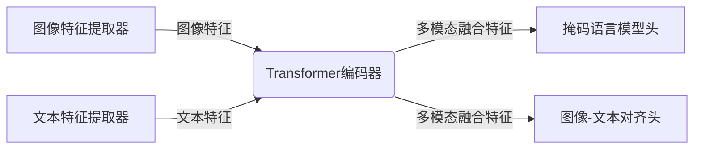

# 大语言模型原理基础与前沿 图文联合训练

## 1. 背景介绍

### 1.1 大语言模型的兴起

近年来,大型语言模型(Large Language Models, LLMs)在自然语言处理(Natural Language Processing, NLP)领域取得了令人瞩目的进展。这些模型通过在海量文本数据上进行预训练,能够捕捉到丰富的语言知识和上下文信息,从而在广泛的下游任务中表现出色。

随着计算能力和数据量的不断增长,LLMs的规模也在不断扩大。从早期的GPT、BERT,到后来的GPT-3、PaLM等,模型参数已经达到了数十亿甚至数百亿的规模。这些大规模的模型展现出了惊人的泛化能力,能够在看似不相关的任务中表现出色,引发了学术界和工业界的广泛关注。

### 1.2 图文联合建模的重要性

尽管LLMs在纯文本任务中表现卓越,但纯文本信息往往是有限的,无法充分捕捉现实世界的复杂语义。相比之下,图像等视觉信息能够提供更加直观和丰富的语义补充。因此,将文本和图像等多模态信息融合,发展图文联合建模技术,成为了当前人工智能领域的一个重要研究方向。

图文联合建模不仅能够增强模型对语义的理解能力,还能促进不同模态之间的相互增强,提高模型的泛化和鲁棒性。此外,在诸如视觉问答、图像描述生成、视觉导航等跨模态任务中,图文联合建模技术也展现出了优异的性能。

### 1.3 本文概述

本文将系统地介绍大语言模型和图文联合训练的基础理论和前沿技术。我们将首先回顾大语言模型的发展历程和核心原理,然后深入探讨图文联合建模的关键挑战和主流解决方案。此外,我们还将介绍一些成功的应用案例,并对未来的发展趋势和挑战进行展望。

通过本文的学习,读者将能够全面了解大语言模型和图文联合训练的理论基础和实践技术,为相关研究和应用奠定坚实的基础。

## 2. 核心概念与联系

### 2.1 大语言模型的核心概念

#### 2.1.1 自回归语言模型

自回归语言模型(Autoregressive Language Model, ALM)是大语言模型的核心组成部分。它旨在学习一个条件概率分布 $P(x_t|x_{<t})$,即给定历史上下文 $x_{<t}$,预测下一个词 $x_t$ 的概率。

最典型的自回归模型是基于Transformer的GPT系列模型。它们采用编码器-解码器架构,将输入序列作为解码器的历史上下文,自回归地生成下一个词。通过最大化下式的对数似然,模型可以学习到语言的潜在规律:

$$\mathcal{L}=\sum_{i=1}^{N} \log P\left(x_{i} | x_{<i}\right)$$

其中 $N$ 是序列长度, $x_i$ 是第 $i$ 个词。

#### 2.1.2 掩码语言模型

掩码语言模型(Masked Language Model, MLM)是另一种常见的大语言模型范式。不同于自回归模型,MLM旨在预测被掩码的词,即学习条件概率 $P(x_m|x_{\backslash m})$,其中 $x_m$ 是被掩码的词, $x_{\backslash m}$ 是其余的上下文词。

BERT是最著名的MLM模型,它在预训练阶段随机掩码输入序列中的某些词,然后通过最大化掩码词的条件对数似然来学习模型参数:

$$\mathcal{L}=\sum_{x_{m} \in \mathcal{M}} \log P\left(x_{m} | x_{\backslash m}\right)$$

其中 $\mathcal{M}$ 是所有被掩码词的集合。

#### 2.1.3 序列到序列建模

除了语言建模任务,大语言模型还可以用于序列到序列(Sequence-to-Sequence, Seq2Seq)建模,如机器翻译、文本摘要等。在这种情况下,模型需要学习条件概率 $P(y|x)$,即给定源序列 $x$,生成目标序列 $y$。

T5等模型就采用了编码器-解码器的Seq2Seq架构,可以在统一的框架下完成多种不同的任务。通过最大化目标序列的条件对数似然,模型可以学习到输入和输出之间的映射关系:

$$\mathcal{L}=\sum_{i=1}^{M} \log P\left(y_{i} | y_{<i}, x\right)$$

其中 $M$ 是目标序列长度, $y_i$ 是第 $i$ 个目标词。

#### 2.1.4 预训练与微调

无论是自回归语言模型、掩码语言模型还是序列到序列模型,它们都采用了预训练与微调的范式。在预训练阶段,模型在大规模无监督文本数据上学习通用的语言知识;在微调阶段,模型在特定的下游任务数据上进行进一步的参数调整,以适应该任务的特征。

这种预训练与微调的范式能够有效地利用大规模无标注数据,提高模型的泛化能力。同时,通过在特定任务上进行微调,模型也可以学习到该任务的特殊语义和模式,从而取得更好的性能。

### 2.2 图文联合建模的关键挑战

虽然大语言模型在文本领域取得了巨大的成功,但将其扩展到图文多模态场景仍然面临着一些关键挑战:

#### 2.2.1 模态差异性

文本和图像属于截然不同的模态,它们的表示形式和语义特征存在明显差异。如何有效地融合这两种异质信息,捕捉不同模态之间的相关性,是图文联合建模需要解决的首要问题。

#### 2.2.2 跨模态对齐

除了模态差异性,另一个挑战是如何实现文本和图像之间的精准对齐。例如,在图像描述生成任务中,模型需要学习到图像中不同区域与文本描述之间的对应关系,从而生成准确的描述。

#### 2.2.3 多模态表示学习

为了有效地融合多模态信息,模型需要学习统一的跨模态表示空间,在该空间中,不同模态的信息可以被有效地编码和关联。如何设计合适的多模态表示学习机制,是图文联合建模所面临的另一个重大挑战。

#### 2.2.4 大规模预训练

与纯文本预训练相比,图文多模态预训练需要更大的计算资源和数据量。如何高效地进行大规模多模态预训练,同时确保预训练质量,是图文联合建模所面临的一个实际挑战。

### 2.3 图文联合建模与大语言模型的联系

尽管图文联合建模面临诸多挑战,但它与大语言模型之间也存在着密切的联系。事实上,大多数图文联合建模方法都是基于现有的大语言模型架构,通过适当的扩展和改进来实现多模态融合。

例如,ViLBERT、VisualBERT等模型直接借鉴了BERT的掩码语言模型架构,在输入层将图像特征与文本特征拼接,然后在统一的多头注意力机制下进行交互和融合。

另一些模型则借鉴了GPT等自回归语言模型的架构,将图像特征作为额外的条件信息输入到解码器中,实现图像到文本的生成任务。

此外,一些最新的统一模型(如Unified Transformer)则试图在单一架构下完成不同的视觉语言任务,包括视觉问答、图像描述生成等,展现出了大语言模型在多模态场景下的广阔前景。

总的来说,图文联合建模与大语言模型存在着天然的联系,前者可以看作是后者在多模态场景下的延伸和拓展。通过充分利用大语言模型的优势,并针对性地解决多模态fusion的挑战,图文联合建模有望在未来取得更大的进展。

## 3. 核心算法原理具体操作步骤

在上一节中,我们介绍了大语言模型和图文联合建模的核心概念。本节将重点介绍一些主流的图文联合建模算法,并详细阐述其核心原理和具体操作步骤。

### 3.1 ViLBERT

ViLBERT是最早也是最具影响力的图文联合建模方法之一。它直接借鉴了BERT的掩码语言模型架构,并将其扩展到了多模态场景。

#### 3.1.1 模型架构

ViLBERT的模型架构如下图所示:

具体来说,ViLBERT包含以下几个主要组件:

1. **图像特征提取器**:使用预训练的CNN模型(如ResNet)提取图像的视觉特征。
2. **文本特征提取器**:使用BERT的词嵌入层提取文本的语义特征。
3. **Transformer编码器**:将图像特征和文本特征拼接后输入到Transformer编码器中,通过多头注意力机制实现跨模态融合。
4. **掩码语言模型头**:与BERT类似,ViLBERT也包含一个掩码语言模型头,用于预测被掩码的词。
5. **图像-文本对齐头**:一个额外的头,旨在学习图像区域与文本片段之间的对应关系。

在预训练阶段,ViLBERT同时优化掩码语言模型损失和图像-文本对齐损失,实现了有效的多模态融合。在微调阶段,根据不同的下游任务,ViLBERT可以选择性地使用不同的头进行预测。

#### 3.1.2 预训练任务

ViLBERT在预训练阶段采用了两个主要的任务:

1. **掩码语言模型(MLM)**: 与BERT类似,ViLBERT随机掩码输入序列中的一些词,然后通过最大化掩码词的条件对数似然来学习模型参数。

2. **图像-文本对齐(ITM)**: ViLBERT会随机采样图像-文本对,并引入两种对齐损失:
   - 二分类损失:判断给定的图像-文本对是否匹配。
   - 回归损失:预测图像区域与文本片段之间的对应关系。

通过联合优化MLM损失和ITM损失,ViLBERT能够同时捕捉语言和视觉信息,并学习跨模态的相关性。

#### 3.1.3 微调与应用

在下游任务中,ViLBERT可以根据任务的特点选择使用不同的头进行预测。例如,在视觉问答任务中,可以使用掩码语言模型头预测问题的答案;在图像描述生成任务中,则可以使用图像-文本对齐头生成与图像区域相关的文本描述。

ViLBERT的出现为图文联合建模开辟了新的道路,展示了大语言模型在多模态场景下的潜力。尽管它仍存在一些局限性(如对象级别的对齐较差),但其核心思想已被广泛借鉴和扩展。

### 3.2 VisualBERT

VisualBERT是在ViLBERT的基础上进一步改进的模型,它主要解决了ViLBERT在对象级别对齐方面的不足。

#### 3.2.1 模型架构

VisualBERT的整体架构与ViLBERT类似,都是基于Transformer编码器实现多模态融合。不同之处在于,VisualBERT引入了一种新的对象关系表示,用于显式地编码图像中对象之间的空间关系和语义关系。

具体来说,VisualBERT在输入层将图像特征分为三个部分:

1. **对象特征**:使用Faster R-CNN等目标检测模型提取图像中每个对象的视觉特征。
2. **对象