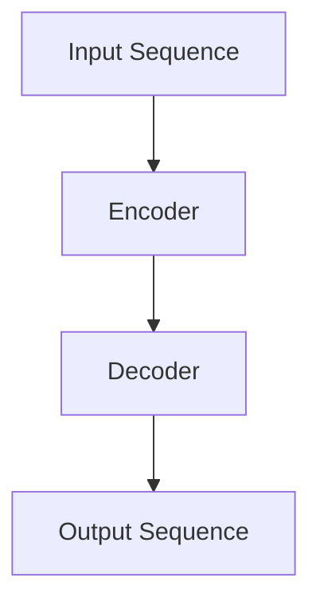

# 大语言模型原理基础与前沿 语言建模的挑战

作者：禅与计算机程序设计艺术

## 1.背景介绍

### 1.1 语言模型的历史

语言模型（Language Model, LM）是自然语言处理（NLP）中的核心技术之一。其主要任务是预测一个句子中下一个词的概率分布。早期的语言模型主要基于统计方法，如N-gram模型，这些模型通过统计词与词之间的共现频率来进行预测。然而，随着数据量的增加和计算能力的提升，基于神经网络的方法逐渐成为主流。

### 1.2 神经网络语言模型的崛起

2000年代中期，神经网络语言模型（Neural Network Language Model, NNLM）开始崭露头角。Bengio等人提出的基于前馈神经网络的语言模型显著提升了语言模型的性能。随后，循环神经网络（RNN）和长短期记忆网络（LSTM）的引入进一步改善了语言模型的效果。

### 1.3 转换模型的革命

2017年，Vaswani等人提出的Transformer模型彻底改变了语言模型的设计。Transformer模型利用自注意力机制（Self-Attention Mechanism）解决了RNN和LSTM在处理长距离依赖时的不足。基于Transformer的模型，如BERT、GPT系列，迅速成为NLP领域的主流。

## 2.核心概念与联系

### 2.1 语言模型的定义

语言模型是用于估计句子的概率分布的模型。给定一个词序列 $w_1, w_2, ..., w_T$，语言模型的目标是计算其联合概率：

$$
P(w_1, w_2, ..., w_T) = P(w_1) P(w_2|w_1) P(w_3|w_1, w_2) ... P(w_T|w_1, w_2, ..., w_{T-1})
$$

### 2.2 自注意力机制

自注意力机制是Transformer模型的核心。它通过计算输入序列中每个词与其他词的相关性来捕捉全局信息。自注意力机制的计算过程如下：

$$
\text{Attention}(Q, K, V) = \text{softmax}\left(\frac{QK^T}{\sqrt{d_k}}\right)V
$$

其中，$Q$、$K$、$V$分别表示查询矩阵、键矩阵和值矩阵，$d_k$是键矩阵的维度。

### 2.3 Transformer架构

Transformer模型由编码器（Encoder）和解码器（Decoder）组成。编码器将输入序列转换为一系列隐状态向量，解码器则利用这些隐状态向量生成输出序列。Transformer的基本单元是多头自注意力机制和前馈神经网络。



## 3.核心算法原理具体操作步骤

### 3.1 数据预处理

数据预处理是语言模型训练的第一步。常见的数据预处理步骤包括分词、去停用词、词干提取和词向量表示。

### 3.2 模型训练

模型训练包括以下几个步骤：

1. **初始化参数**：随机初始化模型参数。
2. **前向传播**：计算输入序列的预测概率分布。
3. **损失计算**：计算预测值与真实值之间的损失。
4. **反向传播**：通过反向传播算法更新模型参数。

### 3.3 模型评估

模型评估通常使用困惑度（Perplexity）作为指标。困惑度越低，模型的性能越好。困惑度的计算公式为：

$$
\text{Perplexity}(P) = 2^{-\frac{1}{N} \sum_{i=1}^{N} \log_2 P(w_i|w_1, w_2, ..., w_{i-1})}
$$

## 4.数学模型和公式详细讲解举例说明

### 4.1 N-gram模型

N-gram模型通过统计词与词之间的共现频率来进行预测。其基本公式为：

$$
P(w_i|w_{i-N+1}, ..., w_{i-1}) = \frac{C(w_{i-N+1}, ..., w_i)}{C(w_{i-N+1}, ..., w_{i-1})}
$$

其中，$C(w_{i-N+1}, ..., w_i)$表示词序列 $w_{i-N+1}, ..., w_i$ 的共现次数。

### 4.2 前馈神经网络语言模型

前馈神经网络语言模型通过将输入词序列映射到高维向量空间来进行预测。其基本公式为：

$$
h = \tanh(W_1 x + b_1)
$$

$$
y = \text{softmax}(W_2 h + b_2)
$$

其中，$x$表示输入词向量，$W_1$和$W_2$是权重矩阵，$b_1$和$b_2$是偏置向量。

### 4.3 Transformer模型

Transformer模型的核心是自注意力机制。其计算公式为：

$$
\text{Attention}(Q, K, V) = \text{softmax}\left(\frac{QK^T}{\sqrt{d_k}}\right)V
$$

其中，$Q$、$K$、$V$分别表示查询矩阵、键矩阵和值矩阵，$d_k$是键矩阵的维度。

## 5.项目实践：代码实例和详细解释说明

### 5.1 数据预处理

```python
import nltk
from nltk.corpus import stopwords
from nltk.tokenize import word_tokenize

# 下载停用词
nltk.download('stopwords')
nltk.download('punkt')

# 读取文本数据
text = "This is an example sentence for language modeling."

# 分词
tokens = word_tokenize(text)

# 去停用词
filtered_tokens = [word for word in tokens if word.lower() not in stopwords.words('english')]

print(filtered_tokens)
```

### 5.2 模型训练

```python
import torch
import torch.nn as nn
import torch.optim as optim

class SimpleNNLM(nn.Module):
    def __init__(self, vocab_size, embed_size, hidden_size):
        super(SimpleNNLM, self).__init__()
        self.embedding = nn.Embedding(vocab_size, embed_size)
        self.fc1 = nn.Linear(embed_size, hidden_size)
        self.tanh = nn.Tanh()
        self.fc2 = nn.Linear(hidden_size, vocab_size)
    
    def forward(self, x):
        x = self.embedding(x)
        x = self.tanh(self.fc1(x))
        x = self.fc2(x)
        return x

# 初始化模型参数
vocab_size = 5000
embed_size = 300
hidden_size = 100
model = SimpleNNLM(vocab_size, embed_size, hidden_size)

# 定义损失函数和优化器
criterion = nn.CrossEntropyLoss()
optimizer = optim.Adam(model.parameters(), lr=0.001)

# 模拟训练过程
for epoch in range(10):
    inputs = torch.randint(0, vocab_size, (32,))
    targets = torch.randint(0, vocab_size, (32,))
    
    outputs = model(inputs)
    loss = criterion(outputs, targets)
    
    optimizer.zero_grad()
    loss.backward()
    optimizer.step()
    
    print(f'Epoch {epoch+1}, Loss: {loss.item()}')
```

### 5.3 模型评估

```python
def calculate_perplexity(model, data_loader):
    model.eval()
    total_loss = 0
    total_count = 0
    
    with torch.no_grad():
        for inputs, targets in data_loader:
            outputs = model(inputs)
            loss = criterion(outputs, targets)
            total_loss += loss.item() * inputs.size(0)
            total_count += inputs.size(0)
    
    perplexity = torch.exp(torch.tensor(total_loss / total_count))
    return perplexity

# 模拟数据加载器
data_loader = [(torch.randint(0, vocab_size, (32,)), torch.randint(0, vocab_size, (32,))) for _ in range(10)]

# 计算困惑度
perplexity = calculate_perplexity(model, data_loader)
print(f'Perplexity: {perplexity.item()}')
```

## 6.实际应用场景

### 6.1 机器翻译

语言模型在机器翻译中扮演着重要角色。通过训练双语数据集，语言模型可以学习到源语言和目标语言之间的映射关系，从而实现自动翻译。

### 6.2 文本生成

基于语言模型的文本生成技术已经广泛应用于新闻生成、对话系统和内容创作等领域。通过给定初始文本，语言模型可以生成连贯且符合语