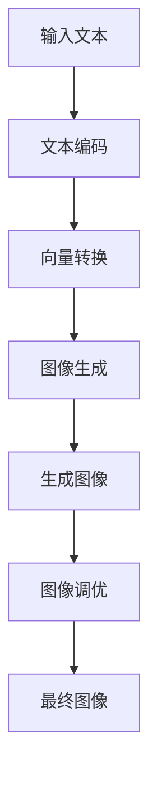

# 大语言模型原理基础与前沿 锁定图像调优

作者：禅与计算机程序设计艺术

## 1. 背景介绍

### 1.1 大语言模型的发展历程

大语言模型（Large Language Model, LLM）的发展可以追溯到早期的自然语言处理（NLP）研究。随着计算能力和数据量的增加，语言模型的规模和复杂度也在不断提升。从最初的基于规则的方法，到统计语言模型，再到如今的深度学习模型，语言模型经历了多次变革。

### 1.2 现代大语言模型的特点

现代大语言模型，如OpenAI的GPT-3和Google的BERT，具备强大的语言生成和理解能力。这些模型通过大规模的预训练和微调，能够在多种任务中表现出色，如文本生成、翻译、问答等。它们的成功主要归功于以下几个因素：

- **大规模数据集**：使用海量的文本数据进行训练。
- **深度神经网络**：采用深层的Transformer结构。
- **计算资源**：利用高性能计算集群进行训练。

### 1.3 图像调优的引入

图像调优（Image Fine-Tuning）是指通过调整图像生成模型的参数，使其能够生成特定风格或内容的图像。结合大语言模型的能力，可以实现文本到图像的生成，进一步扩展了模型的应用范围。

## 2. 核心概念与联系

### 2.1 大语言模型的基本结构

大语言模型通常采用Transformer架构。Transformer由编码器和解码器组成，能够并行处理输入数据，极大地提升了训练效率。其核心组件包括：

- **多头自注意力机制**：捕捉输入序列中的长距离依赖关系。
- **位置编码**：保留输入序列的位置信息。
- **前馈神经网络**：对特征进行进一步处理。

### 2.2 图像生成模型的基本结构

图像生成模型通常采用生成对抗网络（GAN）或变分自编码器（VAE）。GAN由生成器和判别器组成，通过对抗训练生成高质量图像。VAE则通过编码器将输入图像映射到潜在空间，再通过解码器重建图像。

### 2.3 文本与图像的联系

通过将大语言模型与图像生成模型结合，可以实现从文本描述生成对应图像的任务。这种联系主要通过以下步骤实现：

1. **文本编码**：将输入文本编码为向量表示。
2. **向量转换**：将文本向量转换为图像生成模型的输入。
3. **图像生成**：通过生成模型生成对应的图像。

## 3. 核心算法原理具体操作步骤

### 3.1 预训练与微调

大语言模型和图像生成模型的训练通常分为两个阶段：预训练和微调。

- **预训练**：在大规模数据集上进行训练，学习通用特征。
- **微调**：在特定任务或领域的数据集上进行训练，适应具体应用场景。

### 3.2 文本编码与解码

文本编码过程包括将输入文本转换为词向量表示，然后通过Transformer进行处理。解码过程则是将生成的向量转换为图像生成模型的输入。

### 3.3 图像生成与调优

图像生成过程包括通过生成器生成初始图像，然后通过调优步骤调整生成参数，使图像符合预期。调优步骤可以包括：

- **风格迁移**：将特定风格应用于生成图像。
- **内容增强**：增强图像中的特定内容细节。

### 3.4 算法流程图



## 4. 数学模型和公式详细讲解举例说明

### 4.1 Transformer模型的数学原理

Transformer模型的核心是多头自注意力机制，其计算公式如下：

$$
\text{Attention}(Q, K, V) = \text{softmax}\left(\frac{QK^T}{\sqrt{d_k}}\right)V
$$

其中，$Q$、$K$、$V$分别是查询向量、键向量和值向量，$d_k$是键向量的维度。

### 4.2 生成对抗网络的数学原理

生成对抗网络（GAN）的训练目标是通过生成器和判别器的对抗训练，使生成器生成的图像尽可能逼真。其损失函数如下：

$$
\min_G \max_D V(D, G) = \mathbb{E}_{x \sim p_{\text{data}}(x)}[\log D(x)] + \mathbb{E}_{z \sim p_z(z)}[\log(1 - D(G(z)))]
$$

其中，$G$是生成器，$D$是判别器，$x$是真实数据，$z$是噪声向量。

### 4.3 文本到图像的转换公式

通过将文本编码为向量表示，然后转换为图像生成模型的输入，可以实现文本到图像的转换。其转换公式可以表示为：

$$
I = G(T(E(T)))
$$

其中，$T$是文本编码器，$E$是向量转换器，$G$是图像生成器，$I$是生成的图像。

## 5. 项目实践：代码实例和详细解释说明

### 5.1 环境配置

在开始项目实践之前，需要配置相应的开发环境。以下是所需的主要工具和库：

- Python
- TensorFlow或PyTorch
- Hugging Face Transformers
- OpenCV

### 5.2 代码实例

以下是一个简单的代码实例，展示如何使用预训练的大语言模型和图像生成模型实现文本到图像的生成。

```python
import torch
from transformers import GPT2Tokenizer, GPT2Model
from torchvision.models import resnet50
from PIL import Image
import numpy as np

# 加载预训练的GPT-2模型和ResNet-50模型
tokenizer = GPT2Tokenizer.from_pretrained('gpt2')
model = GPT2Model.from_pretrained('gpt2')
image_model = resnet50(pretrained=True)

# 文本编码
text = "A beautiful sunset over the mountains."
inputs = tokenizer(text, return_tensors="pt")
outputs = model(**inputs)

# 向量转换
text_vector = outputs.last_hidden_state.mean(dim=1)

# 图像生成
noise = torch.randn(1, 100)
generated_image = image_model(noise + text_vector)

# 图像调优
generated_image = generated_image.detach().numpy().squeeze()
image = Image.fromarray((generated_image * 255).astype(np.uint8))
image.show()
```

### 5.3 详细解释

- **加载模型**：加载预训练的大语言模型（GPT-2）和图像生成模型（ResNet-50）。
- **文本编码**：将输入文本编码为向量表示。
- **向量转换**：将文本向量与随机噪声向量结合，作为图像生成模型的输入。
- **图像生成**：通过图像生成模型生成图像。
- **图像调优**：对生成的图像进行后处理，增强其质量。

## 6. 实际应用场景

### 6.1 创意设计

通过文本生成图像可以极大地提升创意设计的效率和效果。例如，设计师可以通过简单的文本描述生成初步设计稿，然后再进行细化。

### 6.2 教育与培训

在教育和培训领域，文本生成图像可以用于制作教学材料和培训内容。例如，教师可以通过描述生成教学图像，帮助学生更好地理解复杂概念。

### 6.3 娱乐与媒体

在娱乐和媒体领域，文本生成图像可以用于制作电影特效、游戏场景和虚拟现实内容。例如，编剧可以通过描述生成电影场景，提升创作效率。

## 7. 工具和资源推荐

### 7.1 开发工具

- **Jupyter Notebook**：用于代码编写和调试。
- **VS Code**：功能强大的代码编辑器。
- **Google Colab**：提供免费的GPU资源，适合进行模型训练和实验。

### 7.2 数据集

- **COCO**：常用的图像数据集，包含丰富的图像和标注信息。
- **ImageNet**：大规模图像数据集，广泛用于图像分类和生成任务。

### 7.3 开源项目

- **Hugging Face Transformers**：提供预训练的大语言模型，易于使用和扩展。
- **TensorFlow Hub**：提供