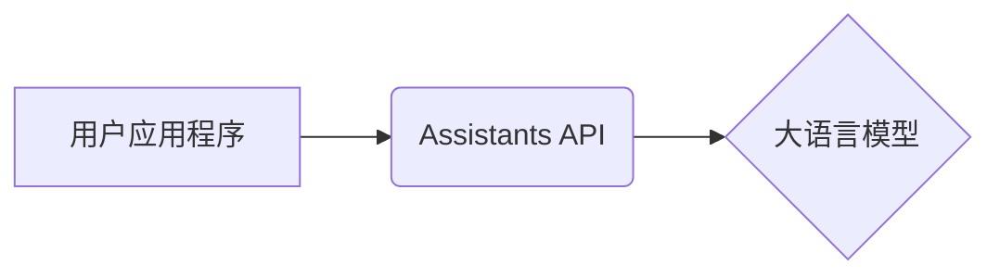

## 1. 背景介绍

### 1.1 人工智能的新纪元：大语言模型的崛起

近年来，人工智能领域取得了突破性进展，其中最引人瞩目的莫过于大语言模型（LLM）的崛起。LLM 是一种基于深度学习的模型，经过海量文本数据的训练，能够理解和生成人类语言。它们在自然语言处理（NLP）任务中表现出色，例如：

* 文本生成：撰写文章、诗歌、代码等
* 机器翻译：将一种语言翻译成另一种语言
* 问答系统：回答用户提出的问题
* 对话生成：与用户进行自然流畅的对话

### 1.2 Assistants API：释放大语言模型的潜力

为了让开发者更方便地利用 LLM 的强大能力，各大科技公司纷纷推出了自己的 Assistants API。这些 API 提供了简单易用的接口，让开发者可以轻松地将 LLM 集成到自己的应用程序中，无需深入了解底层的模型结构和训练细节。

### 1.3 本文目标：全面解析 Assistants API

本文将深入探讨 Assistants API 的核心概念、工作原理、使用方法以及实际应用场景。通过阅读本文，读者将能够：

* 理解 Assistants API 的基本概念和工作原理
* 掌握使用 Assistants API 构建智能应用程序的方法
* 了解 Assistants API 的实际应用场景和未来发展趋势

## 2. 核心概念与联系

### 2.1  Assistants API 的基本架构

Assistants API 通常采用基于 RESTful API 的设计风格，提供了一组 API 接口，用于与 LLM 进行交互。其基本架构如下图所示：



用户应用程序通过调用 Assistants API 提供的接口，将用户的请求发送给 LLM。LLM 根据用户的请求进行处理，并将结果返回给用户应用程序。

### 2.2 关键概念

* **Prompt（提示）**: 指用户输入给 LLM 的文本，用于引导 LLM 生成符合预期结果的文本。Prompt 的质量直接影响着 LLM 生成结果的质量。
* **Completion（补全）**: 指 LLM 根据用户提供的 Prompt 生成的文本。
* **Temperature（温度）**:  用于控制 LLM 生成文本的随机性。温度越高，生成的文本越随机；温度越低，生成的文本越确定性。
* **Top_k**: 用于控制 LLM 生成文本的多样性。Top_k 越大，生成的文本越多样化；Top_k 越小，生成的文本越集中。

### 2.3 Assistants API 与 LLM 的关系

Assistants API 是连接用户应用程序和 LLM 的桥梁，它提供了一套标准化的接口，让开发者可以方便地使用 LLM 的强大功能，而无需关注底层的模型训练和部署细节。

## 3. 核心算法原理具体操作步骤

### 3.1 Prompt 工程

Prompt 工程是指设计和优化 Prompt 的过程，其目标是引导 LLM 生成符合预期结果的文本。优秀的 Prompt 工程可以显著提高 LLM 的性能。

#### 3.1.1  Prompt 的类型

Prompt 可以分为以下几种类型：

* **指令型 Prompt**: 明确告诉 LLM 要做什么，例如“翻译以下英文句子：”。
* **示例型 Prompt**: 给出一些示例，让 LLM 学习如何完成任务，例如“输入：苹果，输出：水果”。
* **角色扮演型 Prompt**:  为 LLM 设置一个角色，让它以该角色的身份进行对话，例如“你是一位经验丰富的程序员，请帮我解决以下代码问题”。

#### 3.1.2 Prompt 设计原则

* **清晰明确**:  Prompt 应该清晰明确地表达用户的意图，避免使用模糊的语言。
* **简洁明了**:  Prompt 应该尽可能简洁明了，避免包含无关的信息。
* **上下文相关**: Prompt 应该提供足够的上下文信息，帮助 LLM 理解用户的意图。
* **迭代优化**:  Prompt 设计是一个迭代优化的过程，需要不断尝试和调整，才能找到最佳的 Prompt。

### 3.2  LLM 的文本生成过程

LLM 的文本生成过程可以简单地概括为以下几个步骤：

1. **编码**:  将 Prompt 转换为 LLM 可以理解的向量表示。
2. **解码**:  根据 Prompt 的向量表示，生成一系列候选词。
3. **排序**:  根据一定的策略，对候选词进行排序。
4. **输出**:  选择排名最高的词作为输出。


## 4. 数学模型和公式详细讲解举例说明

### 4.1  Transformer 模型

大多数 LLM 都基于 Transformer 模型，它是一种基于自注意力机制的神经网络模型。Transformer 模型的核心是自注意力机制，它可以让模型关注输入序列中所有位置的信息，从而更好地理解上下文关系。

#### 4.1.1 自注意力机制

自注意力机制的计算公式如下：

$$ Attention(Q, K, V) = softmax(\frac{QK^T}{\sqrt{d_k}})V $$

其中：

* Q：查询矩阵
* K：键矩阵
* V：值矩阵
* $d_k$：键矩阵的维度

#### 4.1.2 Transformer 模型的结构

Transformer 模型由编码器和解码器组成，编码器负责将输入序列编码成向量表示，解码器负责根据编码器的输出生成目标序列。


### 4.2  概率语言模型

LLM 本质上是一种概率语言模型，它可以计算一个句子出现的概率。

#### 4.2.1  语言模型

语言模型的定义如下：

$$ P(w_1, w_2, ..., w_n) = \prod_{i=1}^{n}P(w_i|w_1, w_2, ..., w_{i-1}) $$

其中：

* $w_1, w_2, ..., w_n$：一个句子中的词
* $P(w_i|w_1, w_2, ..., w_{i-1})$：词 $w_i$ 在给定前文 $w_1, w_2, ..., w_{i-1}$ 的条件下出现的概率

#### 4.2.2  N-gram 语言模型

N-gram 语言模型是一种简单的语言模型，它假设一个词出现的概率只与其前面的 n-1 个词有关。

例如，2-gram 语言模型的公式如下：

$$ P(w_i|w_1, w_2, ..., w_{i-1}) \approx P(w_i|w_{i-1}) $$

### 4.3  举例说明

假设我们有一个 2-gram 语言模型，训练语料库如下：

```
我喜欢吃苹果
我喜欢喝咖啡
```

我们可以计算出以下概率：

* P(我|<s>) = 1.0
* P(喜欢|我) = 1.0
* P(吃|喜欢) = 0.5
* P(喝|喜欢) = 0.5
* P(苹果|吃) = 1.0
* P(咖啡|喝) = 1.0

现在，我们想要计算句子“我喜欢吃苹果”的概率，可以使用以下公式：

$$ P(我喜欢吃苹果) = P(我|<s>) * P(喜欢|我) * P(吃|喜欢) * P(苹果|吃) = 1.0 * 1.0 * 0.5 * 1.0 = 0.5 $$

## 5. 项目实践：代码实例和详细解释说明

### 5.1 使用 Python 调用 Assistants API

以下代码演示了如何使用 Python 调用 Assistants API 生成文本：

```python
import os
import openai

# 设置 API 密钥
openai.api_key = os.getenv("OPENAI_API_KEY")

# 定义 Prompt
prompt = "请帮我写一首关于春天的诗歌。"

# 调用 API 生成文本
response = openai.Completion.create(
  engine="text-davinci-003",
  prompt=prompt,
  max_tokens=1024,
  n=1,
  stop=None,
  temperature=0.7,
)

# 打印生成的文本
print(response.choices[0].text)
```

### 5.2 代码解释

* 首先，我们需要导入 `openai` 库，并设置 API 密钥。
* 然后，我们需要定义 Prompt，即用户输入给 LLM 的文本。
* 接下来，我们调用 `openai.Completion.create()` 方法生成文本。该方法接受以下参数：
    * `engine`:  使用的 LLM 模型。
    * `prompt`:  用户输入的 Prompt。
    * `max_tokens`:  生成文本的最大长度。
    * `n`:  生成文本的数量。
    * `stop`:  停止生成的条件。
    * `temperature`:  控制生成文本的随机性。
* 最后，我们打印生成的文本。

## 6. 实际应用场景

Assistants API 在各个领域都有着广泛的应用，以下列举一些典型的应用场景：

### 6.1  智能客服

Assistants API 可以用于构建智能客服系统，自动回答用户提出的问题，提供更加高效、便捷的客户服务体验。

### 6.2  虚拟助手

Assistants API 可以用于构建虚拟助手，例如 Siri、Alexa 等，帮助用户完成各种任务，例如播放音乐、设置闹钟、发送邮件等。

### 6.3  内容创作

Assistants API 可以用于辅助内容创作，例如生成文章、诗歌、剧本等，提高内容创作效率和质量。

### 6.4  教育

Assistants API 可以用于构建智能教育平台，例如自动批改作业、提供个性化学习建议等，提高教育教学质量。

## 7. 总结：未来发展趋势与挑战

### 7.1 未来发展趋势

* **更大规模的模型**:  随着计算能力的提升和训练数据的增多，LLM 的规模将会越来越大，能力也会越来越强。
* **多模态理解与生成**:  未来的 LLM 将能够理解和生成多种模态的数据，例如文本、图像、音频、视频等。
* **个性化定制**:  未来的 Assistants API 将提供更加个性化的定制功能，满足不同用户和应用场景的需求。

### 7.2 面临的挑战

* **模型的可解释性**:  LLM 的决策过程通常是一个黑盒，缺乏可解释性，这限制了其在一些领域的应用。
* **数据安全和隐私**:  LLM 的训练需要海量的数据，如何保证数据的安全和隐私是一个重要的问题。
* **伦理和社会影响**:  LLM 的应用可能会带来一些伦理和社会问题，例如算法歧视、虚假信息传播等。

## 8. 附录：常见问题与解答

### 8.1  如何选择合适的 Assistants API？

选择 Assistants API 需要考虑以下因素：

* **模型能力**:  不同 API 提供的 LLM 模型的能力有所差异，需要根据具体的应用场景选择合适的模型。
* **易用性**:  不同 API 的接口设计和文档质量有所差异，需要选择易于使用和集成的 API。
* **价格**:  不同 API 的价格有所差异，需要根据预算选择合适的 API。

### 8.2  如何提高 LLM 生成文本的质量？

提高 LLM 生成文本的质量可以从以下几个方面入手：

* **优化 Prompt**:  设计清晰明确、简洁明了、上下文相关的 Prompt。
* **调整参数**:  根据实际情况调整 `temperature`、`top_k` 等参数。
* **微调模型**:  使用特定领域的数据对 LLM 进行微调，可以提高其在该领域的性能。
