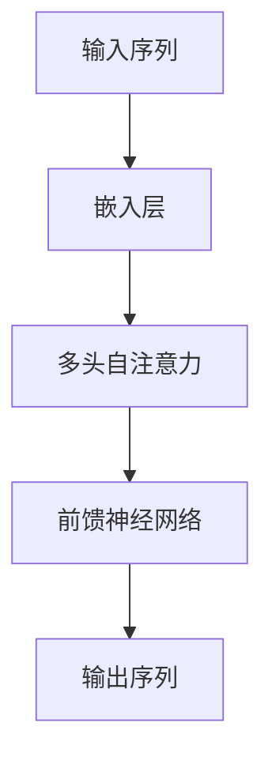

# 大语言模型应用指南：什么是自然语言处理

作者：禅与计算机程序设计艺术

## 1. 背景介绍

### 1.1 自然语言处理的起源与发展

自然语言处理（Natural Language Processing, NLP）是计算机科学、人工智能以及语言学领域中的一个重要分支，旨在研究和开发能够理解、生成和处理人类语言的计算机系统。NLP 的起源可以追溯到 1950 年代，当时艾伦·图灵提出了著名的图灵测试，试图通过对话的方式来检验机器是否具有智能。

随着计算机技术的发展，NLP 也经历了多个阶段的演变。从早期的基于规则的方法，到统计学习方法，再到近年来的深度学习和大语言模型（Large Language Models, LLMs）的兴起，NLP 逐渐成为人工智能领域的核心技术之一。

### 1.2 大语言模型的崛起

大语言模型的出现是 NLP 领域的一次革命性进展。基于深度学习的技术，尤其是 Transformer 架构的引入，使得训练大规模的语言模型成为可能。诸如 GPT-3 和 BERT 等大语言模型在多种 NLP 任务上表现出色，推动了 NLP 应用的广泛普及。

### 1.3 本文的目的

本文旨在为读者提供一份全面的 NLP 应用指南，涵盖核心概念、算法原理、数学模型、项目实践、实际应用场景、工具和资源推荐等内容。希望通过本文，读者能够深入理解 NLP 的基础知识，并掌握如何在实际项目中应用大语言模型。

## 2. 核心概念与联系

### 2.1 自然语言处理的基本概念

#### 2.1.1 语音识别与合成

语音识别（Speech Recognition）是将人类的语音转换为文本的过程，而语音合成（Speech Synthesis）则是将文本转换为语音。两者都是 NLP 的重要应用领域。

#### 2.1.2 机器翻译

机器翻译（Machine Translation）是利用计算机将一种语言的文本自动翻译成另一种语言。近年来，基于神经网络的翻译系统（如 Google Translate）取得了显著的进步。

#### 2.1.3 情感分析

情感分析（Sentiment Analysis）是通过分析文本中的情感信息来判断其情感倾向（如正面、负面或中性）。这在社交媒体监控、市场分析等领域有广泛应用。

### 2.2 大语言模型的核心概念

#### 2.2.1 预训练与微调

大语言模型通常采用预训练和微调（Fine-tuning）相结合的策略。预训练是在大规模语料库上进行的无监督学习，而微调则是在特定任务上的有监督学习。

#### 2.2.2 Transformer 架构

Transformer 是大语言模型的核心架构。与传统的循环神经网络（RNN）不同，Transformer 采用自注意力机制（Self-Attention），能够更有效地捕捉序列中的长距离依赖关系。



### 2.3 核心概念之间的联系

自然语言处理的各个子领域和大语言模型的核心概念之间有着密切的联系。例如，语音识别和机器翻译都可以利用预训练和微调策略来提升性能；情感分析可以通过自注意力机制更好地理解文本中的情感信息。

## 3. 核心算法原理具体操作步骤

### 3.1 预处理步骤

在 NLP 项目中，数据预处理是至关重要的一步。常见的预处理步骤包括：

#### 3.1.1 分词

分词是将文本分割成单独的词或子词。常见的分词方法有基于规则的分词、统计分词和子词分割（如 BPE）。

#### 3.1.2 词向量表示

词向量表示（Word Embedding）是将词语转换为稠密向量的过程。常见的方法有 Word2Vec、GloVe 和 FastText。

### 3.2 模型训练步骤

#### 3.2.1 数据准备

在模型训练之前，需要准备好训练数据和验证数据。数据集的质量和多样性对模型的性能有重要影响。

#### 3.2.2 模型选择

选择合适的模型架构是成功的关键。常见的 NLP 模型包括 RNN、LSTM、GRU 和 Transformer。

#### 3.2.3 超参数调优

超参数调优（Hyperparameter Tuning）是优化模型性能的重要步骤。常见的超参数包括学习率、批量大小和网络层数等。

### 3.3 模型评估步骤

#### 3.3.1 评价指标

常见的 NLP 评价指标包括准确率（Accuracy）、精确率（Precision）、召回率（Recall）和 F1-score。

#### 3.3.2 交叉验证

交叉验证（Cross-Validation）是评估模型性能的常用方法。通过将数据集划分为多个子集，可以更全面地评估模型的泛化能力。

## 4. 数学模型和公式详细讲解举例说明

### 4.1 词向量表示的数学原理

词向量表示是 NLP 中的基础技术之一，其核心思想是将词语映射到高维向量空间中。常见的词向量表示方法有：

#### 4.1.1 Word2Vec

Word2Vec 通过训练一个浅层神经网络来生成词向量。其核心思想是通过上下文词语来预测目标词语，或者通过目标词语来预测上下文词语。

$$
L = -\sum_{t=1}^{T} \log P(w_t | w_{t-k}, \ldots, w_{t+k})
$$

#### 4.1.2 GloVe

GloVe（Global Vectors for Word Representation）通过统计词语共现矩阵来生成词向量。其核心思想是通过最小化词语共现概率的差异来学习词向量。

$$
J = \sum_{i,j=1}^{V} f(X_{ij})(w_i^T \tilde{w}_j + b_i + \tilde{b}_j - \log X_{ij})^2
$$

### 4.2 Transformer 的数学原理

Transformer 的核心是自注意力机制，其数学原理如下：

#### 4.2.1 自注意力机制

自注意力机制通过计算输入序列中每个位置的注意力权重来捕捉序列中的长距离依赖关系。

$$
\text{Attention}(Q, K, V) = \text{softmax}\left(\frac{QK^T}{\sqrt{d_k}}\right)V
$$

其中，$Q$、$K$ 和 $V$ 分别表示查询矩阵、键矩阵和值矩阵，$d_k$ 表示键矩阵的维度。

#### 4.2.2 多头自注意力

多头自注意力通过并行计算多个自注意力机制来提升模型的表达能力。

$$
\text{MultiHead}(Q, K, V) = \text{Concat}(\text{head}_1, \ldots, \text{head}_h)W^O
$$

其中，每个 $\text{head}_i$ 表示一个自注意力机制的输出，$W^O$ 表示输出权重矩阵。

## 5. 项目实践：代码实例和详细解释说明

### 5.1 使用 Hugging Face 进行文本分类

Hugging Face 是一个流行的 NLP 库，提供了丰富的预训练模型和工具。下面是一个使用 Hugging Face 进行文本分类的示例：

```python
from transformers import BertTokenizer, BertForSequenceClassification
from transformers import Trainer, TrainingArguments
import torch

# 加载预训练的 BERT 模型和分词器
tokenizer = BertTokenizer.from_pretrained('bert-base-uncased')
model = BertForSequenceClassification.from_pretrained('bert-base-uncased')

# 准备数据集
texts = ["I love programming.", "I hate bugs."]
labels = [1, 0]
inputs = tokenizer(texts, padding=True, truncation=True, return_tensors="pt")
inputs['labels'] = torch.tensor(labels)

# 设置训练参数
training_args = TrainingArguments(
    output_dir='./results',
    num_train_epochs=3,
    per_device_train_batch_size=4,
    per_device_eval_batch_size=4,
    warmup_steps=500,
    weight_decay=0.01,
    logging_dir='./logs',
)

# 创建 Trainer 实