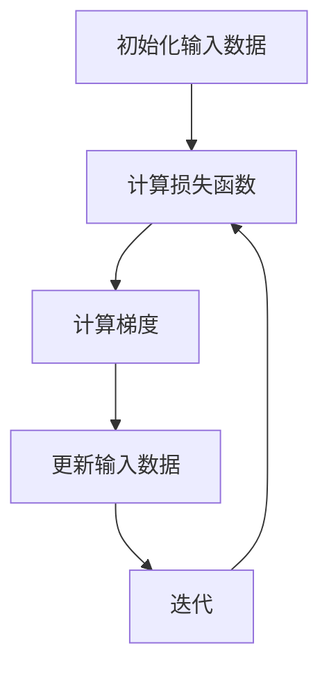
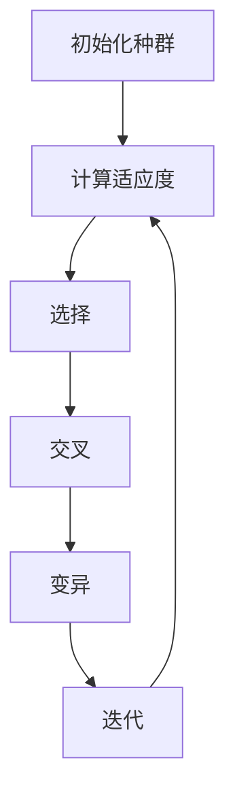

# 大语言模型应用指南：对抗样本

作者：禅与计算机程序设计艺术

## 1. 背景介绍

### 1.1 大语言模型的兴起

大语言模型（Large Language Models，LLMs）近年来迅速崛起，成为人工智能领域的热点。基于深度学习技术，这些模型通过海量数据训练，展现出卓越的自然语言处理能力。著名的模型如GPT-3、BERT、T5等，已经在翻译、文本生成、问答系统等多个领域取得了显著成果。

### 1.2 对抗样本的概念

对抗样本（Adversarial Examples）是指通过对输入数据进行微小的、通常是人类不可察觉的扰动，使得模型产生错误或意外的输出。这种现象在图像识别领域被广泛研究，但在自然语言处理（NLP）领域也同样重要。对抗样本不仅揭示了模型的脆弱性，也为模型的安全性和鲁棒性提出了新的挑战。

### 1.3 本文的目的

本文旨在深入探讨大语言模型中的对抗样本，从核心概念、算法原理、数学模型、项目实践、实际应用、工具和资源等多个方面进行详细分析，帮助读者全面理解这一领域，并提供实用的指导和建议。

## 2. 核心概念与联系

### 2.1 对抗样本的定义

对抗样本是在输入数据上施加微小扰动，使得模型产生错误输出的样本。具体在NLP领域，这些扰动可以是单词替换、句法结构改变等。

### 2.2 对抗攻击与防御

对抗攻击（Adversarial Attack）是指通过生成对抗样本来攻击模型，使其产生错误输出。相应地，对抗防御（Adversarial Defense）则是指通过各种技术手段来增强模型的鲁棒性，抵御对抗攻击。

### 2.3 对抗样本在NLP中的特殊性

与图像识别不同，NLP中的对抗样本具有其独特性。首先，语言的离散性使得对抗样本的生成更加复杂。其次，语言的语义和语法要求对抗样本在保持原意的同时进行微小扰动。

### 2.4 对抗样本的分类

对抗样本可以根据攻击目标、攻击方式等进行分类。常见的分类包括：

- **白盒攻击（White-box Attack）**：攻击者掌握模型的全部信息。
- **黑盒攻击（Black-box Attack）**：攻击者只能通过输入输出关系进行攻击。
- **目标攻击（Targeted Attack）**：攻击者希望模型输出特定错误结果。
- **非目标攻击（Non-targeted Attack）**：攻击者只希望模型输出错误结果，而不关心具体内容。

## 3. 核心算法原理具体操作步骤

### 3.1 基本算法原理

对抗样本的生成通常基于优化算法，通过迭代调整输入数据，使得模型输出发生预期的变化。常用的方法包括：

- **梯度下降法（Gradient Descent）**：通过计算损失函数的梯度，逐步调整输入数据。
- **遗传算法（Genetic Algorithm）**：通过模拟自然选择和遗传变异，生成对抗样本。
- **粒子群优化（Particle Swarm Optimization）**：通过模拟群体行为，优化输入数据。

### 3.2 具体操作步骤

#### 3.2.1 梯度下降法

1. **初始化输入数据**：从原始数据开始。
2. **计算损失函数**：定义目标函数，如模型的预测错误率。
3. **计算梯度**：使用反向传播算法计算损失函数关于输入数据的梯度。
4. **更新输入数据**：根据梯度信息，调整输入数据。
5. **迭代**：重复步骤2-4，直到损失函数达到预期目标。

#### 3.2.2 遗传算法

1. **初始化种群**：随机生成一组输入数据。
2. **计算适应度**：评估每个输入数据的效果。
3. **选择**：根据适应度选择部分数据进行复制。
4. **交叉**：对选择的数据进行交叉操作，生成新数据。
5. **变异**：对新数据进行随机变异。
6. **迭代**：重复步骤2-5，直到达到预期目标。

### 3.3 常用对抗攻击算法

#### 3.3.1 快速梯度符号法（FGSM）

快速梯度符号法（Fast Gradient Sign Method，FGSM）是一种简单而有效的对抗攻击方法。其基本思想是通过一次梯度计算，快速生成对抗样本。

$$
x_{adv} = x + \epsilon \cdot \text{sign}(\nabla_x J(\theta, x, y))
$$

其中，$x_{adv}$ 是对抗样本，$x$ 是原始输入，$\epsilon$ 是扰动幅度，$\text{sign}$ 表示符号函数，$\nabla_x J(\theta, x, y)$ 是损失函数 $J$ 对输入 $x$ 的梯度。

#### 3.3.2 投影梯度下降法（PGD）

投影梯度下降法（Projected Gradient Descent，PGD）是FGSM的扩展，通过多次迭代生成对抗样本。

$$
x_{adv}^{t+1} = \text{Proj}_{\epsilon}(x_{adv}^t + \alpha \cdot \text{sign}(\nabla_x J(\theta, x_{adv}^t, y)))
$$

其中，$\text{Proj}_{\epsilon}$ 表示将输入数据投影到 $\epsilon$ 范围内，$\alpha$ 是每次更新的步长。

## 4. 数学模型和公式详细讲解举例说明

### 4.1 对抗样本生成的数学模型

对抗样本的生成可以形式化为一个优化问题。假设有一个模型 $f(x)$，输入数据 $x$ 和标签 $y$，生成对抗样本的目标是找到一个扰动 $\delta$，使得模型在输入 $x + \delta$ 时输出错误结果。

$$
\text{minimize}_{\delta} \quad J(\theta, x + \delta, y) \quad \text{subject to} \quad ||\delta|| \leq \epsilon
$$

其中，$J$ 是损失函数，$\theta$ 是模型参数，$\epsilon$ 是扰动的最大幅度。

### 4.2 FGSM的数学推导

快速梯度符号法（FGSM）通过一次梯度计算来生成对抗样本。其基本思想是沿着损失函数梯度的方向，施加一个小幅度的扰动。

$$
x_{adv} = x + \epsilon \cdot \text{sign}(\nabla_x J(\theta, x, y))
$$

推导过程如下：

1. **计算损失函数的梯度**：使用反向传播算法，计算损失函数 $J$ 对输入 $x$ 的梯度 $\nabla_x J(\theta, x, y)$。
2. **符号函数**：对梯度取符号，得到扰动方向 $\text{sign}(\nabla_x J(\theta, x, y))$。
3. **施加扰动**：沿着扰动方向，施加一个幅度为 $\epsilon$ 的扰动，得到对抗样本 $x_{adv}$。

### 4.3 PGD的数学推导

投影梯度下降法（PGD）通过多次迭代生成对抗样本。其基本思想是每次沿着梯度方向施加小幅度扰动，并将结果投影到 $\epsilon$ 范围内。

$$
x_{adv}^{t+1} = \text{Proj}_{\epsilon}(x_{adv}^t + \alpha \cdot \text{sign}(\nabla_x J(\theta, x_{adv}^t, y)))
$$

推导过程如下：

1. **初始化**：从原始输入 $x$ 开始，设置初始对抗样本 $x_{adv}^0 = x$。
2. **迭代**：在每次迭代中，计算当前对抗样本