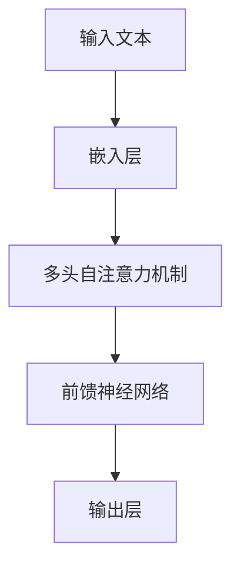

# 大语言模型应用指南：编码与无损压缩

作者：禅与计算机程序设计艺术

## 1. 背景介绍

### 1.1 大语言模型的兴起

在过去的十年里，随着计算能力的提升和数据量的爆炸性增长，人工智能领域迎来了大语言模型（Large Language Models, LLMs）的快速发展。大语言模型，如OpenAI的GPT系列和Google的BERT，已经在自然语言处理（NLP）任务中展示了卓越的性能。它们能够生成高质量的文本，进行复杂的语言理解和生成任务，使得它们在诸多应用场景中大放异彩。

### 1.2 数据压缩的需求

随着大语言模型的应用越来越广泛，如何有效地存储和传输这些庞大的模型和数据成为了一个重要的问题。无损压缩技术能够在不丢失信息的前提下，显著减少数据的存储空间和传输带宽，从而提升系统的效率和性能。因此，研究大语言模型中的编码与无损压缩技术具有重要的现实意义。

## 2. 核心概念与联系

### 2.1 大语言模型的基本结构

大语言模型通常基于深度学习中的Transformer架构。Transformer通过自注意力机制（Self-Attention Mechanism）来捕捉输入序列中的长距离依赖关系，从而实现高效的语言建模。



### 2.2 编码与压缩的基本概念

#### 2.2.1 编码

编码是将数据从一种形式转换为另一种形式的过程。在大语言模型中，常见的编码技术包括词嵌入（Word Embedding）、位置编码（Positional Encoding）等。

#### 2.2.2 无损压缩

无损压缩是一种数据压缩方法，能够在不丢失任何信息的前提下，减少数据的体积。常见的无损压缩算法有Huffman编码、LZ77、LZ78等。

### 2.3 大语言模型与压缩技术的联系

大语言模型生成的文本数据通常具有高度的冗余性，这为无损压缩提供了很大的空间。同时，压缩技术也可以用于模型参数的压缩，从而减少模型的存储和计算成本。

## 3. 核心算法原理具体操作步骤

### 3.1 编码技术

#### 3.1.1 词嵌入

词嵌入是将词语映射到高维向量空间的过程。常见的词嵌入方法有Word2Vec、GloVe等。这些方法通过捕捉词语之间的语义关系，将相似的词语映射到相近的向量。

#### 3.1.2 位置编码

位置编码用于表示输入序列中各个词语的位置信息。Transformer模型中常用的正弦和余弦函数来生成位置编码。

### 3.2 无损压缩算法

#### 3.2.1 Huffman编码

Huffman编码是一种基于字符频率的无损压缩算法。它通过构建霍夫曼树，将高频字符用短码表示，低频字符用长码表示，从而实现压缩。

#### 3.2.2 LZ77和LZ78

LZ77和LZ78是两种基于字典的无损压缩算法。它们通过查找重复的字符串模式，将其替换为指向之前出现位置的指针，从而实现压缩。

## 4. 数学模型和公式详细讲解举例说明

### 4.1 词嵌入数学模型

词嵌入的目标是将词语映射到高维向量空间。假设词汇表中有$V$个词，每个词映射到一个$d$维向量，则词嵌入矩阵$W \in \mathbb{R}^{V \times d}$。对于词汇表中的每个词$i$，其对应的向量表示为$W_i$。

### 4.2 Huffman编码数学模型

Huffman编码通过构建霍夫曼树来实现压缩。假设字符集中的每个字符$i$的频率为$p_i$，则霍夫曼树的构建过程如下：

1. 将每个字符作为一个叶节点，构建一个优先队列，按$p_i$从小到大排序。
2. 从队列中取出两个最小频率的节点，构建一个新的父节点，其频率为两个子节点频率之和。
3. 将新节点插入队列，并重复步骤2，直到队列中只剩一个节点。

霍夫曼编码的期望码长为：

$$
E[L] = \sum_{i=1}^n p_i \cdot l_i
$$

其中，$l_i$为字符$i$的码长。

### 4.3 LZ77和LZ78数学模型

LZ77和LZ78通过查找重复的字符串模式来实现压缩。假设输入字符串为$S$，其长度为$n$。LZ77的压缩过程如下：

1. 初始化一个空的字典和一个空的输出缓冲区。
2. 从输入字符串中读取一个字符，并查找其在字典中的最长匹配。
3. 将匹配的长度和位置写入输出缓冲区，并将未匹配的字符添加到字典中。
4. 重复步骤2和3，直到处理完所有字符。

LZ78的压缩过程类似，但它将每个匹配的字符串作为一个新的字典条目，从而构建一个动态字典。

## 5. 项目实践：代码实例和详细解释说明

### 5.1 词嵌入代码实例

以下是使用Gensim库进行Word2Vec词嵌入的示例代码：

```python
from gensim.models import Word2Vec

# 训练数据
sentences = [["I", "love", "machine", "learning"],
             ["Word2Vec", "is", "a", "great", "tool"]]

# 训练Word2Vec模型
model = Word2Vec(sentences, vector_size=100, window=5, min_count=1, workers=4)

# 获取词向量
vector = model.wv['machine']
print(vector)
```

### 5.2 Huffman编码代码实例

以下是使用Python实现Huffman编码的示例代码：

```python
import heapq
from collections import defaultdict

class HuffmanNode:
    def __init__(self, char, freq):
        self.char = char
        self.freq = freq
        self.left = None
        self.right = None

    def __lt__(self, other):
        return self.freq < other.freq

def build_huffman_tree(frequencies):
    heap = [HuffmanNode(char, freq) for char, freq in frequencies.items()]
    heapq.heapify(heap)
    
    while len(heap) > 1:
        node1 = heapq.heappop(heap)
        node2 = heapq.heappop(heap)
        merged = HuffmanNode(None, node1.freq + node2.freq)
        merged.left = node1
        merged.right = node2
        heapq.heappush(heap, merged)
    
    return heap[0]

def generate_huffman_codes(node, prefix="", codebook={}):
    if node is not None:
        if node.char is not None:
            codebook[node.char] = prefix
        generate_huffman_codes(node.left, prefix + "0", codebook)
        generate_huffman_codes(node.right, prefix + "1", codebook)
    return codebook

# 字符频率
frequencies = defaultdict(int)
text = "this is an example for huffman encoding"
for char in text:
    frequencies[char] += 1

# 构建霍夫曼树
huffman_tree = build_huffman_tree(frequencies)

# 生成霍夫曼编码
huffman_codes = generate_huffman_codes(huffman_tree)
print(huffman_codes)
```

### 5.3 LZ77和LZ78代码实例

以下是使用Python实现LZ77压缩的示例代码：

```python
def lz77_compress(input_string, window_size=20):
    i = 0
    output_buffer = []
    
    while i < len(input_string):
        match = None
        for j in range(max(0, i - window_size), i):
            k = 0
            while i + k < len(input_string) and input_string[j + k] == input_string[i + k]:
                k += 1
            if match is None or k > match[2]:
                match = (i - j, k, input_string[i + k] if i + k < len(input_string) else None)
        
        if match and match[2] > 1:
            output_buffer