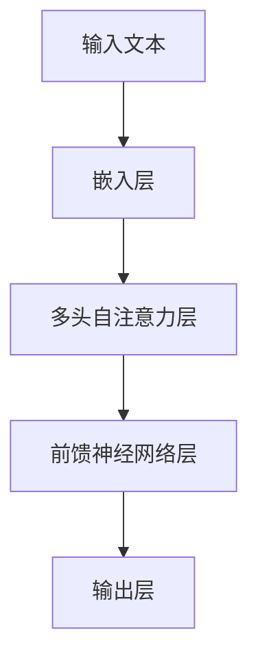

# 大语言模型应用指南：高效微调总结

作者：禅与计算机程序设计艺术

## 1.背景介绍

### 1.1 大语言模型的兴起

自从OpenAI发布了GPT-3以来，大语言模型（Large Language Models, LLMs）在自然语言处理（NLP）领域掀起了一场革命。LLMs因其在生成文本、翻译语言、回答问题等任务中的卓越表现，迅速成为研究和工业界的焦点。

### 1.2 微调的重要性

尽管预训练的大语言模型已经展示了强大的能力，但在特定任务或领域中直接应用这些模型并不能总是达到最佳效果。微调（Fine-Tuning）成为了一个关键步骤，通过在特定任务数据集上进一步训练模型，可以显著提升其在该任务上的性能。

### 1.3 本文目的

本文旨在提供一份详尽的指南，介绍如何高效地对大语言模型进行微调。我们将从核心概念、算法原理、数学模型、项目实践、实际应用场景、工具和资源推荐等多个方面进行深入探讨，帮助读者全面掌握大语言模型微调的技术和方法。

## 2.核心概念与联系

### 2.1 预训练与微调

预训练（Pre-Training）是指在大规模通用数据集上训练模型，使其学习语言的基本结构和常识知识。微调则是在预训练模型的基础上，利用特定任务的数据进行进一步训练，以提升模型在该任务上的表现。

### 2.2 迁移学习

微调实际上是迁移学习（Transfer Learning）的一种应用。通过将预训练模型的知识迁移到特定任务上，微调可以在相对较少的数据和计算资源下，达到较高的性能。

### 2.3 模型架构

大语言模型通常采用Transformer架构。Transformer通过自注意力机制（Self-Attention）来捕捉句子中词与词之间的关系，从而在处理长文本时表现出色。



### 2.4 损失函数与优化器

微调过程中常用的损失函数包括交叉熵损失（Cross-Entropy Loss），优化器则常采用Adam或其变种，如AdamW。选择合适的损失函数和优化器对微调效果至关重要。

## 3.核心算法原理具体操作步骤

### 3.1 数据准备

#### 3.1.1 数据集选择

选择一个适合目标任务的数据集是微调的第一步。数据集应包含足够的样本，以便模型能够学习到任务的特定模式。

#### 3.1.2 数据预处理

数据预处理包括文本清洗、分词、标注等步骤。这些步骤有助于提高数据的质量，从而提升模型的微调效果。

### 3.2 模型初始化

#### 3.2.1 预训练模型选择

选择一个适合任务的预训练模型，如GPT-3、BERT等。不同的预训练模型在不同任务上的表现有所不同，选择合适的模型可以事半功倍。

#### 3.2.2 模型参数设置

在微调之前，需要设置模型的超参数，包括学习率、批量大小、训练轮数等。这些参数对微调的效果有重要影响。

### 3.3 微调过程

#### 3.3.1 损失函数计算

在每个训练步骤中，计算模型的预测结果与真实标签之间的损失。常用的损失函数是交叉熵损失。

```latex
L = -\sum_{i=1}^{N} y_i \log(\hat{y}_i)
```

#### 3.3.2 反向传播与参数更新

通过反向传播算法计算损失函数对模型参数的梯度，并使用优化器更新模型参数。

```latex
\theta_{t+1} = \theta_t - \eta \nabla_\theta L(\theta_t)
```

#### 3.3.3 模型评估

在每个训练周期结束后，使用验证集评估模型的性能，并根据评估结果调整训练策略。

### 3.4 早停与模型保存

为了防止过拟合，可以采用早停（Early Stopping）策略。当验证集性能不再提升时，停止训练并保存最佳模型。

## 4.数学模型和公式详细讲解举例说明

### 4.1 自注意力机制

自注意力机制是Transformer模型的核心，通过计算输入序列中每个词与其他词的相关性来捕捉句子中的依赖关系。

```latex
\text{Attention}(Q, K, V) = \text{softmax}\left(\frac{QK^T}{\sqrt{d_k}}\right) V
```

其中，$Q$、$K$、$V$分别表示查询（Query）、键（Key）和值（Value）矩阵，$d_k$是键的维度。

### 4.2 多头自注意力

多头自注意力通过并行计算多个自注意力来捕捉不同的依赖关系。

```latex
\text{MultiHead}(Q, K, V) = \text{Concat}(\text{head}_1, \text{head}_2, \ldots, \text{head}_h) W^O
```

其中，每个头的计算方式如下：

```latex
\text{head}_i = \text{Attention}(Q W_i^Q, K W_i^K, V W_i^V)
```

### 4.3 前馈神经网络

前馈神经网络（Feed-Forward Neural Network, FFN）在每个Transformer层中起到非线性变换的作用。

```latex
\text{FFN}(x) = \max(0, xW_1 + b_1) W_2 + b_2
```

### 4.4 位置编码

由于Transformer模型不具备顺序信息，需要通过位置编码（Positional Encoding）来引入序列的位置信息。

```latex
PE_{(pos, 2i)} = \sin\left(\frac{pos}{10000^{2i/d_{model}}}\right)
```

```latex
PE_{(pos, 2i+1)} = \cos\left(\frac{pos}{10000^{2i/d_{model}}}\right)
```

## 4.项目实践：代码实例和详细解释说明

### 4.1 环境配置

#### 4.1.1 安装依赖

在开始微调之前，需要安装必要的依赖库，如Transformers、PyTorch等。

```bash
pip install transformers torch
```

#### 4.1.2 数据集下载

下载并准备好所需的数据集，可以使用Hugging Face的datasets库。

```python
from datasets import load_dataset

dataset = load_dataset('imdb')
```

### 4.2 模型加载与初始化

```python
from transformers import AutoModelForSequenceClassification, AutoTokenizer

model_name = "bert-base-uncased"
model = AutoModelForSequenceClassification.from_pretrained(model_name, num_labels=2)
tokenizer = AutoTokenizer.from_pretrained(model_name)
```

### 4.3 数据预处理

```python
def preprocess_function(examples):
    return tokenizer(examples['text'], truncation=True, padding='max_length')

encoded_dataset = dataset.map(preprocess_function, batched=True)
```

### 4.4 训练与微调

```python
from transformers import Trainer, TrainingArguments

training_args = TrainingArguments(
    output_dir='./results',
    evaluation_strategy="epoch",
    learning_rate=2e-5,
    per_device_train_batch_size=16,
    per_device_eval_batch_size=16,
    num_train_epochs=3,
    weight_decay=0.01,
)

trainer = Trainer(
    model=model,
    args=training_args,
    train_dataset=encoded_dataset['train'],
    eval_dataset=encoded_dataset['test'],
)

trainer.train()
```

### 4.5 模型评估

```python
results = trainer.evaluate()
print(results)
```

## 5.实际应用场景

### 5.1 文本分类

微调后的大语言模型可以用于各种文本分类任务，如情感分析、垃圾邮件检测等。

### 5.2 问答系统

通过微调，模型可以在特定领域的问答系统中表现出色，提供准确的答案。

### 5.3 机器翻译

微调后的模型可以应用于特定领域的机器翻译任务，提高翻译的准确性和流畅性。

### 5.4 文本生成

在新闻生成、内容创作等领域，微调后的大语言模型可以生成高质量的文本内容。

## 6.工具和资源推荐

### 6.1 Hugging Face Transformers

Hugging