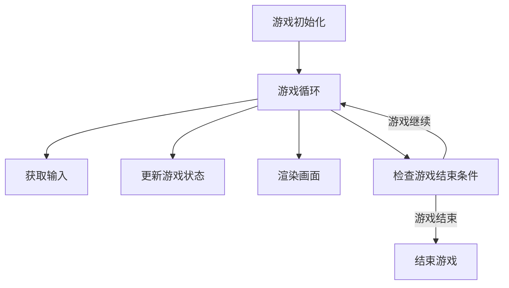
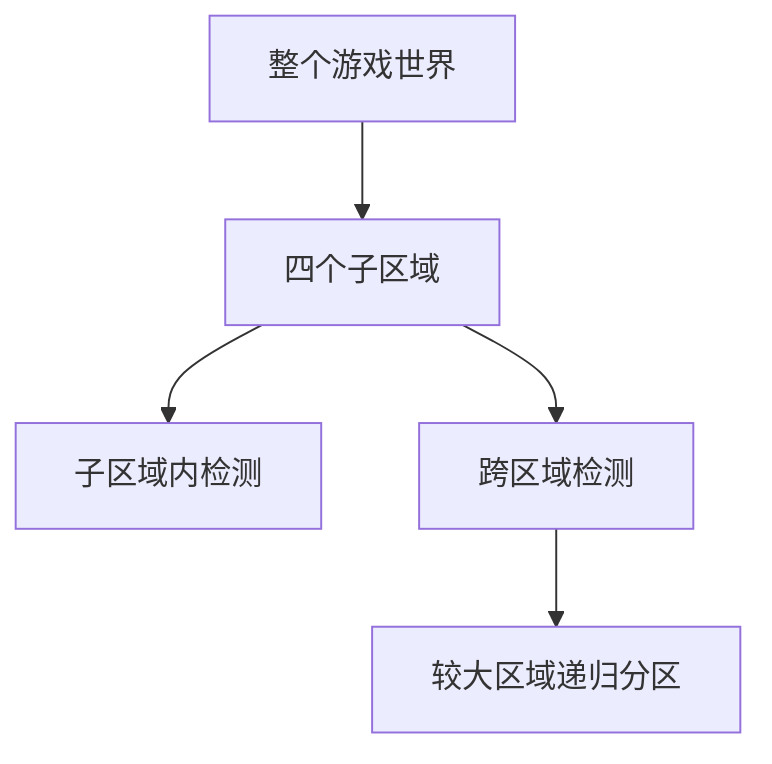

# 大鱼吃小鱼的设计与实现

## 1.背景介绍

在游戏开发领域中,大鱼吃小鱼是一种经典的游戏类型。游戏的目标是控制一条鱼,通过吃掉比自己小的鱼来不断成长,同时避免被更大的鱼吃掉。这种游戏模式简单有趣,颇具挑战性,因此广受欢迎。

本文将探讨大鱼吃小鱼游戏的设计和实现过程,包括游戏逻辑、数据结构、算法、渲染等多个方面。我们将介绍核心概念、关键技术以及优化策略,并通过具体的项目实践加深理解。

## 2.核心概念与联系 

### 2.1 游戏循环

游戏循环是游戏引擎的核心,它不断地更新游戏状态、处理用户输入、渲染画面等。在大鱼吃小鱼游戏中,游戏循环负责鱼的移动、碰撞检测、分数计算等主要逻辑。



### 2.2 游戏对象

游戏对象是游戏世界中的实体,如鱼、食物等。每个对象都有自己的属性(位置、大小、速度等)和行为(移动、吃东西等)。合理设计游戏对象对于实现游戏逻辑至关重要。

### 2.3 空间分区

随着游戏对象数量的增加,全对全的碰撞检测将变得低效。空间分区技术将游戏世界划分为多个区域,只需检测相邻区域内的对象对,从而提高效率。常用的空间分区技术有四叉树、空间哈希等。

### 2.4 鱼群智能

在大鱼吃小鱼游戏中,鱼的行为需要模拟一定的智能,比如躲避更大的鱼、追逐更小的鱼等。常见的鱼群智能算法有蒙特卡洛树搜索、遗传算法等,可以生成看似智能的鱼群行为。

## 3.核心算法原理具体操作步骤

### 3.1 游戏循环实现

游戏循环的伪代码如下:

```
初始化游戏
while 游戏未结束:
    处理用户输入
    更新游戏状态
    渲染画面
    if 满足结束条件:
        结束游戏
```

其中,更新游戏状态是核心步骤,包括:

1. 移动所有鱼
2. 检测鱼与鱼之间的碰撞
3. 判断是否发生吃掉行为
4. 更新分数
5. 产生新的小鱼(可选)

### 3.2 空间分区算法

我们以经典的四叉树空间分区为例:

1. 将游戏世界划分为四个相等的区域
2. 每个区域内的对象进行全对全碰撞检测
3. 对于跨区域的对象对,进行碰撞检测
4. 对于较大的区域,递归进行上述过程



### 3.3 鱼群智能算法

以蒙特卡罗树搜索(MCTS)为例,鱼的行为决策过程如下:

1. 构建一棵蒙特卡罗树,每个节点代表一种可能的状态
2. 从根节点开始,通过选择、扩展、模拟、反馈四个阶段不断更新树
3. 根据更新后的树,选择得分最高的行为作为鱼的行为

$$
\begin{aligned}
\text{UCB1} &= \overline{X_j} + C \sqrt{\frac{\ln N_p}{N_j}}\\
\text{选择操作} &= \underset{j}{\arg\max}\, \text{UCB1}(X_j, N_j, N_p)
\end{aligned}
$$

其中 $\overline{X_j}$ 代表节点 $j$ 的平均得分, $N_j$ 和 $N_p$ 分别是节点 $j$ 和父节点的模拟次数, $C$ 是一个常数,用于权衡exploitation和exploration。

## 4.数学模型和公式详细讲解举例说明

在大鱼吃小鱼游戏中,我们需要对鱼的运动、碰撞等过程进行数学建模。

### 4.1 运动模型

假设鱼的位置为 $(x, y)$,速度为 $(v_x, v_y)$,加速度为 $(a_x, a_y)$,则在 $\Delta t$ 时间后,鱼的新位置为:

$$
\begin{aligned}
x' &= x + v_x \Delta t + \frac{1}{2}a_x \Delta t^2\\
y' &= y + v_y \Delta t + \frac{1}{2}a_y \Delta t^2
\end{aligned}
$$

### 4.2 碰撞检测

对于两条鱼 $A$ 和 $B$,它们的位置分别为 $(x_A, y_A)$ 和 $(x_B, y_B)$,半径分别为 $r_A$ 和 $r_B$,则它们发生碰撞的条件为:

$$
\sqrt{(x_A - x_B)^2 + (y_A - y_B)^2} \leq r_A + r_B
$$

如果发生碰撞,且 $A$ 比 $B$ 大,则 $A$ 吃掉 $B$;否则 $B$ 吃掉 $A$。

### 4.3 分数计算

设鱼 $A$ 的初始分数为 $s_A$,吃掉鱼 $B$ 后的新分数为:

$$
s_A' = s_A + \alpha s_B
$$

其中 $\alpha$ 是一个常数,控制分数增长的速度。通常情况下,吃掉较大的鱼应该获得更高的分数。

## 4.项目实践:代码实例和详细解释说明

为了加深对游戏设计和实现的理解,我们将通过一个基于Python和Pygame的实例项目进行讲解。完整代码可在[此处](https://github.com/禅与计算机程序设计艺术/fish-game)获取。

### 4.1 游戏对象

我们定义一个基类`GameObject`及其子类`Fish`和`Food`。`GameObject`包含位置、大小、速度等基本属性,`Fish`和`Food`则具有各自的特殊属性和行为。

```python
class GameObject:
    def __init__(self, x, y, radius):
        self.x = x
        self.y = y
        self.radius = radius
        self.vx = 0
        self.vy = 0

    def move(self, dt):
        self.x += self.vx * dt
        self.y += self.vy * dt

class Fish(GameObject):
    def __init__(self, x, y, radius, speed):
        super().__init__(x, y, radius)
        self.speed = speed
        self.score = 0

    def eat(self, other):
        if self.radius > other.radius:
            self.radius += other.radius * 0.2
            self.score += other.score
            return True
        return False
```

### 4.2 游戏循环

游戏循环的核心逻辑在`GameLoop`类中实现:

```python
class GameLoop:
    def __init__(self):
        self.fishes = []  # 所有鱼的列表
        self.foods = []   # 所有食物的列表
        self.player = None  # 玩家控制的鱼

    def update(self, dt):
        # 移动所有鱼和食物
        for obj in self.fishes + self.foods:
            obj.move(dt)

        # 检测碰撞
        for i, fish1 in enumerate(self.fishes):
            for fish2 in self.fishes[i+1:]:
                self.handle_collision(fish1, fish2)
            for food in self.foods:
                self.handle_collision(fish1, food)

        # 产生新的食物
        if len(self.foods) < 10:
            self.foods.append(Food(...))

    def handle_collision(self, obj1, obj2):
        # 判断是否发生碰撞并处理
        ...

    def run(self):
        clock = pygame.time.Clock()
        while True:
            dt = clock.tick(60) / 1000  # 获取距离上一帧的时间间隔
            self.update(dt)
            self.render()
```

这段代码实现了游戏循环的基本流程,包括移动对象、检测碰撞、生成食物等。

### 4.3 空间分区

我们使用四叉树对游戏世界进行空间分区,从而提高碰撞检测的效率:

```python
class QuadTree:
    def __init__(self, boundary, capacity=4):
        self.boundary = boundary
        self.capacity = capacity
        self.objects = []
        self.children = []

    def insert(self, obj):
        # 将对象插入合适的节点
        ...

    def retrieve(self, area):
        # 获取区域内的所有对象
        ...
```

在`GameLoop`中,我们使用四叉树进行碰撞检测:

```python
def handle_collision(self, obj1, obj2):
    if self.quadtree.intersects(obj1, obj2):
        # 进行精确的碰撞检测
        ...
```

### 4.4 鱼群智能

我们实现了一个基于MCTS的鱼群智能算法:

```python
class MCTSNode:
    def __init__(self, state, parent=None):
        self.state = state
        self.parent = parent
        self.children = []
        self.visits = 0
        self.score = 0

    def select_child(self):
        # 使用UCB1选择子节点
        ...

    def expand(self):
        # 扩展新的子节点
        ...

    def simulate(self):
        # 模拟后续行为并获得分数
        ...

    def backpropagate(self, score):
        # 反馈分数
        ...

def mcts(root_state, iterations):
    root = MCTSNode(root_state)
    for _ in range(iterations):
        node = root
        while node.children:
            node = node.select_child()
        if not node.state.is_terminal():
            node.expand()
        score = node.simulate()
        node.backpropagate(score)
    return max(root.children, key=lambda node: node.visits).state
```

在游戏循环中,我们使用MCTS算法为每条鱼选择行为:

```python
def update(self, dt):
    ...
    for fish in self.fishes:
        if fish != self.player:
            state = fish.get_state()
            new_state = mcts(state, 100)
            fish.update_state(new_state)
```

## 5.实际应用场景

大鱼吃小鱼游戏模式可以应用于多种场景:

1. **休闲游戏**: 作为一种经典的休闲游戏,大鱼吃小鱼游戏简单有趣,可以提供娱乐和放松。

2. **教育游戏**: 通过调整规则和场景,大鱼吃小鱼游戏可以用于生物教育、食物链教学等。

3. **人工智能研究**: 游戏中的鱼群智能算法可以用于研究多智能体系统、集群智能等领域。

4. **游戏理论研究**: 大鱼吃小鱼游戏体现了一些基本的游戏理论概念,如博弈论、均衡策略等,可以作为研究对象。

5. **游戏引擎优化**: 由于需要处理大量动态对象,大鱼吃小鱼游戏可以用于测试和优化游戏引擎的性能。

## 6.工具和资源推荐

以下是一些有用的工具和资源,可以帮助您更好地设计和实现大鱼吃小鱼游戏:

1. **游戏引擎**: Unity、Unreal Engine、Godot等知名游戏引擎都可以用于开发大鱼吃小鱼游戏。

2. **编程语言**: C++、C#、Python、Java等语言都可以用于游戏开发。

3. **图形库**: OpenGL、DirectX、Vulkan等图形API可以提供低级别的图形渲染功能。

4. **游戏物理引擎**: Box2D、Bullet等物理引擎可以模拟物理效果,如碰撞检测、刚体动力学等。

5. **人工智能库**: TensorFlow、PyTorch等机器学习库可以用于实现鱼群智能算法。

6. **游戏素材**: OpenGameArt、Kenney等网站提供免费的游戏素材,如图像、音效等。

7. **游戏开发教