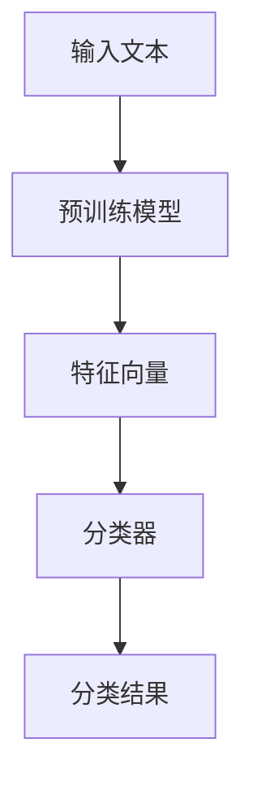

# 如何使用Midjourney进行文本分类

作者：禅与计算机程序设计艺术

## 1. 背景介绍

### 1.1 近年来文本分类的挑战

文本分类是自然语言处理（NLP）中的一个重要任务，涉及将文本数据分配到预定义的类别中。随着互联网和社交媒体的普及，文本数据的生成速度和数量都呈现爆炸式增长，如何高效准确地对这些文本进行分类成为一个巨大的挑战。传统的文本分类方法依赖于手工特征提取和机器学习算法，但在处理大规模和多样化的文本数据时，往往显得力不从心。

### 1.2 Midjourney的崛起

Midjourney是一种基于深度学习的新型文本分类方法，它利用先进的神经网络架构和大规模预训练模型，能够自动从文本中提取特征，并进行高效准确的分类。与传统方法相比，Midjourney在处理复杂和大规模文本数据时表现出色，逐渐成为文本分类领域的主流技术。

### 1.3 本文的目标

本文旨在详细介绍如何使用Midjourney进行文本分类，包括其核心概念、算法原理、具体操作步骤、数学模型、代码实例、实际应用场景、工具和资源推荐，以及未来发展趋势与挑战。通过本文，读者将能够深入理解Midjourney的工作机制，并掌握其在文本分类中的应用方法。

## 2. 核心概念与联系

### 2.1 文本分类的基本概念

文本分类是指将文本数据分配到一个或多个预定义类别中的过程。常见的文本分类任务包括情感分析、垃圾邮件检测、主题分类等。文本分类的关键在于如何有效地表示文本数据，并通过分类器进行预测。

### 2.2 Midjourney的基本概念

Midjourney是基于深度学习的文本分类方法，其核心在于使用预训练语言模型（如BERT、GPT-3）进行特征提取，并通过神经网络进行分类。这些预训练模型在大规模文本数据上进行训练，能够捕捉到丰富的语言信息，从而提高分类的准确性。

### 2.3 Midjourney与传统文本分类方法的对比

传统的文本分类方法通常依赖于手工特征提取和浅层机器学习算法，如支持向量机（SVM）、朴素贝叶斯（Naive Bayes）等。相比之下，Midjourney利用深度学习和预训练模型，能够自动从文本中提取特征，并进行高效准确的分类。其主要优势包括：

- 自动特征提取：无需手工设计特征，减少了人为干扰和工作量。
- 高准确性：预训练模型在大规模数据上进行训练，能够捕捉到丰富的语言信息，提高分类的准确性。
- 适应性强：能够处理多样化和复杂的文本数据，适应性强。

## 3. 核心算法原理具体操作步骤

### 3.1 数据预处理

在进行文本分类之前，首先需要对文本数据进行预处理。常见的预处理步骤包括：

- **文本清洗**：去除标点符号、停用词、特殊字符等。
- **分词**：将文本划分为单词或词组。
- **词向量表示**：将文本转换为向量表示，如词袋模型（Bag-of-Words）、TF-IDF、词嵌入（Word Embedding）等。

### 3.2 特征提取

Midjourney利用预训练语言模型进行特征提取。常用的预训练模型包括BERT、GPT-3、RoBERTa等。这些模型在大规模文本数据上进行训练，能够捕捉到丰富的语言信息，并生成高维特征向量。



### 3.3 分类器构建

在特征提取之后，需要构建分类器进行预测。常用的分类器包括全连接神经网络、卷积神经网络（CNN）、循环神经网络（RNN）等。分类器的选择取决于具体的任务和数据特点。

### 3.4 模型训练

在构建好分类器之后，需要对模型进行训练。训练过程包括：

- **数据划分**：将数据划分为训练集、验证集和测试集。
- **模型训练**：使用训练集对模型进行训练，并在验证集上进行调优。
- **模型评估**：在测试集上评估模型的性能，常用的评估指标包括准确率、精确率、召回率、F1值等。

### 3.5 模型优化

为了提高模型的性能，可以进行模型优化。常见的优化方法包括：

- **超参数调优**：调整模型的超参数，如学习率、批量大小、网络结构等。
- **正则化**：使用L1、L2正则化或Dropout等方法，防止模型过拟合。
- **数据增强**：通过数据增强技术，如随机裁剪、旋转、翻转等，增加训练数据的多样性，提高模型的泛化能力。

## 4. 数学模型和公式详细讲解举例说明

### 4.1 预训练语言模型的数学基础

预训练语言模型的核心在于通过大规模文本数据学习词语之间的关系。以BERT为例，其训练目标是通过遮蔽语言模型（Masked Language Model, MLM）和下一句预测（Next Sentence Prediction, NSP）来捕捉语言信息。

#### 4.1.1 遮蔽语言模型（MLM）

MLM的目标是预测被遮蔽的词语。假设输入序列为 $X = \{x_1, x_2, \ldots, x_n\}$，其中 $x_i$ 为第 $i$ 个词语，模型通过最大化以下目标函数进行训练：

$$
\mathcal{L}_{MLM} = - \sum_{i=1}^{n} \log P(x_i | X_{\setminus i})
$$

其中，$X_{\setminus i}$ 表示去掉第 $i$ 个词语后的序列。

#### 4.1.2 下一句预测（NSP）

NSP的目标是预测两段文本是否连续。假设输入为两段文本 $A$ 和 $B$，模型通过最大化以下目标函数进行训练：

$$
\mathcal{L}_{NSP} = - \log P(B | A)
$$

### 4.2 分类器的数学基础

分类器的核心在于通过特征向量进行分类。以全连接神经网络为例，其输出为 $y$，输入为特征向量 $X$，网络的权重和偏置分别为 $W$ 和 $b$，则输出可以表示为：

$$
y = \sigma(WX + b)
$$

其中，$\sigma$ 表示激活函数，如ReLU、Sigmoid等。

### 4.3 损失函数和优化方法

分类任务常用的损失函数包括交叉熵损失（Cross-Entropy Loss）和均方误差（Mean Squared Error, MSE）。以交叉熵损失为例，其定义为：

$$
\mathcal{L}_{CE} = - \sum_{i=1}^{n} y_i \log \hat{y}_i
$$

其中，$y_i$ 表示真实标签，$\hat{y}_i$ 表示预测概率。

优化方法常用的包括随机梯度下降（SGD）、Adam等。以SGD为例，其更新公式为：

$$
W_{t+1} = W_t - \eta \nabla \mathcal{L}(W_t)
$$

其中，$W_t$ 表示第 $t$ 次迭代的权重，$\eta$ 表示学习率，$\nabla \mathcal{L}(W_t)$ 表示损失函数的梯度。

## 5. 项目实践：代码实例和详细解释说明

### 5.1 环境准备

在进行项目实践之前，需要准备好开发环境。本文以Python为例，使用的主要库包括TensorFlow、Keras、Transformers等。

```python
# 安装所需库
!pip install tensorflow keras transformers
```

### 5.2 数据加载与预处理

首先，需要加载并预处理文本数据。以IMDB电影评论数据集为例：

```python
import tensorflow as tf
from tensorflow.keras.preprocessing.sequence import pad_sequences
from transformers import BertTokenizer

# 加载IMDB数据集
imdb = tf.keras.datasets.imdb
(x_train, y_train), (x_test, y_test) = imdb.load_data(num_words=10000)

# 数据预处理
tokenizer = BertTokenizer.from_pretrained('bert-base-uncased')
x_train = pad_sequences(x_train, maxlen=256)
