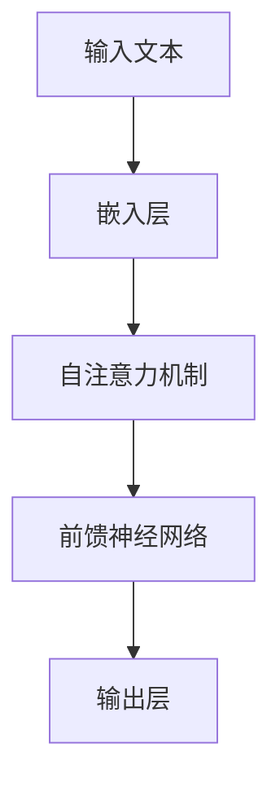
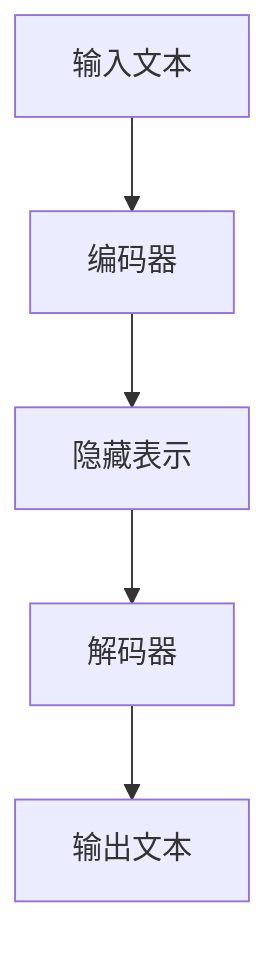

# 如何利用AI LLM优化自然语言处理任务

作者：禅与计算机程序设计艺术

## 1. 背景介绍

### 1.1 自然语言处理的发展历程
自然语言处理（NLP）是人工智能领域中最具挑战性和最具前景的分支之一。其目标是使计算机能够理解、解释和生成人类语言。NLP的发展历程可以追溯到20世纪50年代，但直到近几年，随着深度学习和大规模语言模型（LLM）的兴起，NLP才取得了突破性进展。

### 1.2 大规模语言模型（LLM）的崛起
大规模语言模型（LLM），如GPT-3和BERT，通过在大规模数据集上进行训练，展示了前所未有的语言理解和生成能力。LLM的出现使得许多NLP任务，如文本生成、翻译、情感分析等，得到了显著提升。

### 1.3 本文的目标
本文旨在探讨如何利用AI大规模语言模型（LLM）来优化自然语言处理任务。我们将详细介绍LLM的核心概念、算法原理、数学模型，并通过实际项目实践展示其应用。最后，我们将讨论未来的发展趋势与挑战，并提供一些常见问题的解答。

## 2. 核心概念与联系

### 2.1 自然语言处理（NLP）概述
自然语言处理是计算机科学、人工智能和语言学的交叉领域，涉及计算机对人类（自然）语言的处理。NLP的核心任务包括语言理解、语言生成、语言转换等。

### 2.2 大规模语言模型（LLM）概述
大规模语言模型是通过在大规模文本数据上进行训练，能够生成和理解自然语言的深度学习模型。LLM的代表性模型包括GPT系列、BERT、T5等。

### 2.3 LLM在NLP中的应用
LLM在NLP中的应用非常广泛，包括但不限于：
- 文本生成：自动生成高质量的文本内容。
- 机器翻译：将文本从一种语言翻译成另一种语言。
- 情感分析：分析文本中的情感和情绪。
- 问答系统：基于文本数据回答用户的问题。

## 3. 核心算法原理具体操作步骤

### 3.1 预训练与微调
大规模语言模型的训练过程通常分为两个阶段：预训练和微调。

#### 3.1.1 预训练
预训练阶段，模型在大规模的无标签文本数据上进行训练，学习语言的基本结构和语义关系。预训练的目标是使模型能够生成具有连贯语法和语义的文本。

#### 3.1.2 微调
微调阶段，模型在特定任务的数据集上进行训练，使其能够更好地适应特定任务的需求。微调的目标是提升模型在特定任务上的性能。

### 3.2 Transformer架构
大规模语言模型通常采用Transformer架构。Transformer通过自注意力机制（Self-Attention）和多头注意力机制（Multi-Head Attention）来捕捉文本中的长距离依赖关系。



### 3.3 自注意力机制
自注意力机制是Transformer的核心组件，它通过计算输入序列中每个位置的注意力权重来捕捉全局信息。

$$
\text{Attention}(Q, K, V) = \text{softmax}\left(\frac{QK^T}{\sqrt{d_k}}\right)V
$$

### 3.4 多头注意力机制
多头注意力机制通过并行计算多个自注意力来捕捉不同子空间的信息。

$$
\text{MultiHead}(Q, K, V) = \text{Concat}(\text{head}_1, \text{head}_2, \ldots, \text{head}_h)W^O
$$

### 3.5 编码器-解码器架构
Transformer模型通常采用编码器-解码器架构，编码器负责将输入文本编码成隐藏表示，解码器负责将隐藏表示解码成输出文本。



## 4. 数学模型和公式详细讲解举例说明

### 4.1 预训练目标
预训练目标通常包括语言模型目标和掩码语言模型目标。

#### 4.1.1 语言模型目标
语言模型目标是通过预测下一个词来训练模型。

$$
P(w_t | w_{t-1}, \ldots, w_1) = \text{softmax}(W_h h_t)
$$

#### 4.1.2 掩码语言模型目标
掩码语言模型目标是通过预测被掩码的词来训练模型。

$$
P(w_i | w_1, \ldots, w_{i-1}, [MASK], w_{i+1}, \ldots, w_n) = \text{softmax}(W_h h_i)
$$

### 4.2 损失函数
预训练阶段的损失函数通常是交叉熵损失函数。

$$
L = -\sum_{i=1}^N \log P(w_i | w_1, \ldots, w_{i-1})
$$

### 4.3 优化算法
常用的优化算法包括Adam和LAMB。

#### 4.3.1 Adam优化算法
Adam优化算法通过自适应学习率来加速收敛。

$$
m_t = \beta_1 m_{t-1} + (1 - \beta_1) g_t
$$

$$
v_t = \beta_2 v_{t-1} + (1 - \beta_2) g_t^2
$$

$$
\hat{m}_t = \frac{m_t}{1 - \beta_1^t}
$$

$$
\hat{v}_t = \frac{v_t}{1 - \beta_2^t}
$$

$$
\theta_t = \theta_{t-1} - \alpha \frac{\hat{m}_t}{\sqrt{\hat{v}_t} + \epsilon}
$$

#### 4.3.2 LAMB优化算法
LAMB优化算法通过对权重进行自适应缩放来提高大规模模型的训练效率。

$$
r_t = \frac{\| \theta_t \|}{\| g_t \|}
$$

$$
\theta_{t+1} = \theta_t - \alpha r_t g_t
$$

## 5. 项目实践：代码实例和详细解释说明

### 5.1 环境准备
首先，我们需要准备好开发环境。常用的开发环境包括Python、TensorFlow和PyTorch。

```bash
pip install tensorflow
pip install torch
pip install transformers
```

### 5.2 数据准备
我们需要准备好训练数据。常用的数据集包括WikiText、OpenWebText等。

```python
from transformers import GPT2Tokenizer, GPT2LMHeadModel

tokenizer = GPT2Tokenizer.from_pretrained('gpt2')
model = GPT2LMHeadModel.from_pretrained('gpt2')

text = "自然语言处理是人工智能领域中最具挑战性和最具前景的分支之一。"
inputs = tokenizer(text, return_tensors="pt")
outputs = model(**inputs)
```

### 5.3 模型训练
我们需要定义训练过程，并进行模型训练。

```python
from transformers import Trainer, TrainingArguments

training_args = TrainingArguments(
    output_dir='./results',
    num_train_epochs=3,
    per_device_train_batch_size=4,
    per_device_eval_batch_size=4,
    warmup_steps=500,
    weight_decay=0.01,
    logging_dir='./logs',
)

trainer = Trainer(
    model=model,
    args=training_args,
    train_dataset=train_dataset,
    eval_dataset=eval_dataset,
)

trainer.train()
```

### 5.4 模型评估
训练完成后，我们需要对模型进行评估。

```python
results = trainer.evaluate()
print(results)
```

### 5.5 模型应用
最后，我们可以将训练好的模型应用到实际任务中。

```python
text = "请生成一段关于自然语言处理的介绍。"
inputs = tokenizer(text, return_tensors="pt")
outputs = model.generate(**inputs)
generated_text = tokenizer.decode(outputs[0], skip_special_tokens=True)
print(generated_text)
```

## 6. 实际应用场景

### 6.1 文本生成
大规模语言模型在文本生成任务中表现出色，可以用于自动生成新闻、小说、技术文档等。

### 6.2 机器翻译
通过微调，大规模语言模型可以