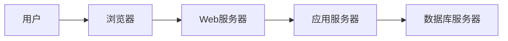
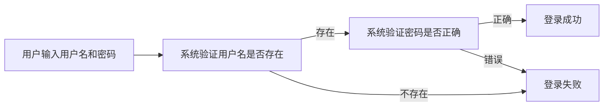
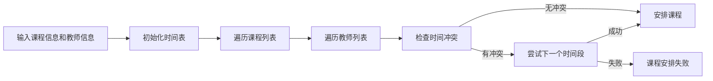

## 学校教学管理系统详细设计与具体代码实现

作者：禅与计算机程序设计艺术

## 1. 背景介绍

### 1.1 教育信息化发展趋势

随着信息技术的快速发展和教育理念的不断更新，教育信息化已成为推动教育改革和发展的重要力量。学校教学管理系统作为教育信息化的重要组成部分，对提高学校管理效率、提升教学质量起着至关重要的作用。

### 1.2 学校教学管理系统需求分析

传统的学校教学管理模式存在着许多弊端，例如：信息传递效率低下、数据统计分析困难、教师工作量大等。为了解决这些问题，开发一套功能完善、操作便捷、安全可靠的学校教学管理系统势在必行。

### 1.3 本文目标

本文旨在介绍一种基于现代软件工程方法的学校教学管理系统的设计与实现方案，并提供详细的代码示例。该系统将涵盖学生管理、教师管理、课程管理、成绩管理、排课管理、系统管理等核心功能模块，旨在为学校提供一个高效、便捷、智能的教学管理平台。

## 2. 核心概念与联系

### 2.1 系统架构设计

本系统采用 B/S 架构，即浏览器/服务器架构，用户可以通过浏览器访问系统，服务器端负责处理业务逻辑和数据存储。

#### 2.1.1 系统层次结构



#### 2.1.2 模块划分

系统主要分为以下几个模块：

*   **用户管理模块:** 负责管理系统用户，包括用户注册、登录、权限管理等功能。
*   **学生管理模块:** 负责管理学生信息，包括学生基本信息、成绩信息、考勤信息等。
*   **教师管理模块:** 负责管理教师信息，包括教师基本信息、课程信息、授课信息等。
*   **课程管理模块:** 负责管理课程信息，包括课程基本信息、教学计划、教学资源等。
*   **成绩管理模块:** 负责管理学生成绩，包括成绩录入、成绩查询、成绩统计分析等。
*   **排课管理模块:** 负责安排课程表，包括教室安排、教师安排、时间安排等。
*   **系统管理模块:** 负责系统配置、日志管理、数据备份等功能。

### 2.2 数据库设计

系统采用关系型数据库 MySQL 存储数据，数据库设计如下：

#### 2.2.1 用户表 (user)

| 字段名      | 数据类型 | 备注                  |
| :---------- | :------- | :-------------------- |
| id          | int      | 主键，自增            |
| username    | varchar  | 用户名，唯一           |
| password    | varchar  | 密码，加密存储       |
| role        | int      | 角色，1-管理员，2-教师，3-学生 |

#### 2.2.2 学生表 (student)

| 字段名     | 数据类型 | 备注     |
| :--------- | :------- | :------- |
| id         | int      | 主键，自增 |
| user\_id   | int      | 用户 ID  |
| name       | varchar  | 姓名     |
| gender     | int      | 性别，1-男，2-女 |
| birthday   | date     | 出生日期 |
| class\_id | int      | 班级 ID  |

#### 2.2.3 教师表 (teacher)

| 字段名     | 数据类型 | 备注     |
| :--------- | :------- | :------- |
| id         | int      | 主键，自增 |
| user\_id   | int      | 用户 ID  |
| name       | varchar  | 姓名     |
| gender     | int      | 性别，1-男，2-女 |
| title      | varchar  | 职称     |
| department | varchar  | 部门     |

#### 2.2.4 课程表 (course)

| 字段名      | 数据类型 | 备注     |
| :---------- | :------- | :------- |
| id          | int      | 主键，自增 |
| name        | varchar  | 课程名称 |
| credit      | int      | 学分     |
| description | text     | 课程描述 |

## 3. 核心算法原理具体操作步骤

### 3.1 用户登录认证

#### 3.1.1 流程图



#### 3.1.2 算法描述

1.  用户输入用户名和密码。
2.  系统根据用户名查询数据库，判断用户是否存在。
    *   如果用户不存在，则登录失败。
    *   如果用户存在，则继续验证密码。
3.  系统将用户输入的密码进行加密，与数据库中存储的密码进行比对。
    *   如果密码正确，则登录成功。
    *   如果密码错误，则登录失败。

### 3.2  课程安排算法

#### 3.2.1 流程图



#### 3.2.2 算法描述

1.  输入课程信息（课程名称、上课时间、上课地点等）和教师信息（教师姓名、可上课时间等）。
2.  初始化一个二维数组表示时间表，数组的行表示时间段，列表示教室。
3.  遍历课程列表，对每门课程：
    *   遍历教师列表，找到可以教授该课程的教师。
    *   对每个教师，检查该教师在该课程的上课时间段内是否有时间冲突。
        *   如果没有冲突，则将该课程安排给该教师，并将时间表中对应的时间段和教室标记为已占用。
        *   如果有冲突，则尝试下一个时间段，直到找到一个没有冲突的时间段或者所有时间段都尝试完毕。
4.  如果所有课程都安排成功，则输出课程表；否则，输出课程安排失败信息。

## 4. 数学模型和公式详细讲解举例说明

本系统中未使用复杂的数学模型和公式。

## 5. 项目实践：代码实例和详细解释说明

### 5.1 开发环境搭建

#### 5.1.1 操作系统：Windows 10

#### 5.1.2 开发工具：IntelliJ IDEA

#### 5.1.3 数据库：MySQL 8.0

#### 5.1.4 后端框架：Spring Boot

#### 5.1.5 前端框架：Vue.js

### 5.2 代码示例

#### 5.2.1 用户登录接口

```java
@RestController
@RequestMapping("/api/user")
public class UserController {

    @Autowired
    private UserService userService;

    @PostMapping("/login")
    public Result login(@RequestBody UserLoginRequest request) {
        String username = request.getUsername();
        String password = request.getPassword();

        // 参数校验
        if (StringUtils.isEmpty(username) || StringUtils.isEmpty(password)) {
            return Result.fail("用户名或密码不能为空");
        }

        // 登录认证
        User user = userService.login(username, password);
        if (user == null) {
            return Result.fail("用户名或密码错误");
        }

        // 生成 token
        String token = JwtUtil.createToken(user.getId(), user.getUsername());

        // 返回结果
        return Result.success(token);
    }
}
```

#### 5.2.2 课程安排接口

```java
@RestController
@RequestMapping("/api/course")
public class CourseController {

    @Autowired
    private CourseService courseService;

    @PostMapping("/arrange")
    public Result arrange(@RequestBody CourseArrangeRequest request) {
        // 获取课程信息和教师信息
        // ...

        // 调用课程安排算法进行排课
        List<CourseSchedule> scheduleList = courseService.arrange(courseList, teacherList);

        // 返回结果
        return Result.success(scheduleList);
    }
}
```

## 6. 实际应用场景

### 6.1 教学管理

*   学校可以通过系统进行学生信息管理、教师信息管理、课程信息管理、成绩管理等，提高教学管理效率。

### 6.2 教学评价

*   系统可以记录学生的学习过程数据，为教师提供数据支持，帮助教师进行教学评价。

### 6.3 家校沟通

*   学校可以通过系统发布通知公告、学生成绩等信息，方便家长及时了解学生在校情况。

## 7. 总结：未来发展趋势与挑战

### 7.1 未来发展趋势

*   **人工智能技术应用:** 将人工智能技术应用于教学管理系统，例如：智能排课、智能阅卷、个性化学习推荐等。
*   **大数据分析:** 收集和分析教学过程数据，为学校决策提供数据支持。
*   **移动互联网技术应用:** 开发移动端教学管理系统，方便师生随时随地访问系统。

### 7.2 面临的挑战

*   **数据安全和隐私保护:** 如何保障学生和教师的隐私信息安全。
*   **系统稳定性和可靠性:** 如何保证系统稳定运行，避免出现故障。
*   **用户体验:** 如何提升系统的易用性和用户体验。

## 8. 附录：常见问题与解答

### 8.1 问：如何修改密码？

答：登录系统后，点击个人中心，进入修改密码页面，输入原密码、新密码和确认密码即可修改密码。

### 8.2 问：如何添加学生信息？

答：登录系统后，进入学生管理模块，点击添加学生按钮，填写学生信息后提交即可。

### 8.3 问：如何查看课程表？

答：登录系统后，进入课程表模块，选择相应的学期和班级即可查看课程表。
