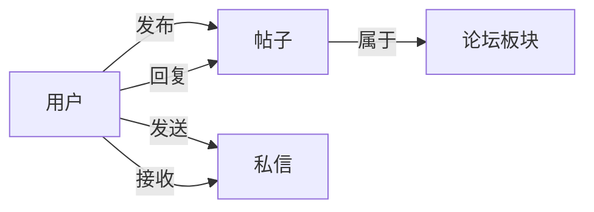

## 1. 背景介绍

### 1.1 学生交流论坛的兴起与意义

随着互联网技术的快速发展和普及，网络社交已经成为人们生活中不可或缺的一部分。对于学生群体而言，传统的线下交流方式已经无法满足其日益增长的交流需求，学生交流论坛应运而生。这类论坛为学生提供了一个开放、自由、便捷的线上交流平台，方便学生们分享学习经验、讨论学术问题、组织校园活动、结交志同道合的朋友。

学生交流论坛的出现，不仅丰富了学生的课余生活，也为学生学习和成长提供了新的途径。通过论坛，学生可以接触到更广泛的知识和信息，拓展视野，激发学习兴趣。同时，论坛也为学生提供了一个锻炼沟通能力、表达能力和团队协作能力的平台，有助于学生综合素质的提升。

### 1.2 本系统的设计目标和功能概述

本系统旨在设计和实现一个功能完善、安全可靠、易于使用和维护的学生交流论坛系统，为学生提供一个高质量的线上交流平台。

**主要功能包括：**

* **用户管理：** 包括用户注册、登录、个人信息管理、密码修改等功能。
* **论坛板块管理：** 支持创建、删除、编辑论坛板块，以及设置板块权限等功能。
* **帖子管理：** 用户可以发布、回复、查看、搜索、收藏帖子，以及对帖子进行点赞、评论等操作。
* **私信功能：** 用户之间可以发送私信进行交流。
* **管理员后台管理：** 管理员可以对用户、论坛板块、帖子等进行管理，以及查看系统运行日志等。

### 1.3 本文结构安排

本文将从以下几个方面详细介绍学生交流论坛系统的详细设计和具体代码实现：

* **第二章：核心概念与联系**：介绍系统中涉及到的核心概念，以及它们之间的联系。
* **第三章：核心算法原理具体操作步骤**：详细介绍系统中使用的核心算法，并给出具体的代码实现。
* **第四章：数学模型和公式详细讲解举例说明**：对系统中涉及到的数学模型和公式进行详细讲解，并给出具体的例子进行说明。
* **第五章：项目实践：代码实例和详细解释说明**：给出系统核心功能的代码实例，并进行详细的解释说明。
* **第六章：实际应用场景**：介绍学生交流论坛系统的实际应用场景。
* **第七章：工具和资源推荐**：推荐一些开发学生交流论坛系统常用的工具和资源。
* **第八章：总结：未来发展趋势与挑战**：总结学生交流论坛系统的发展现状，并展望其未来发展趋势和挑战。
* **第九章：附录：常见问题与解答**：列举一些学生交流论坛系统开发过程中常见的技术问题，并给出相应的解答。

## 2. 核心概念与联系

### 2.1 用户

用户是学生交流论坛系统的核心，所有功能都是围绕用户展开的。用户可以注册账号，登录系统，发布帖子，回复帖子，发送私信等。

### 2.2 论坛板块

论坛板块是帖子的分类，用户可以根据自己的兴趣爱好选择不同的板块进行浏览和发帖。

### 2.3 帖子

帖子是用户发布的信息，可以包含文字、图片、视频等内容。

### 2.4 回复

回复是对帖子的评论，用户可以在帖子下方发表自己的观点或回复其他用户的评论。

### 2.5 私信

私信是用户之间进行私下交流的信息，只有发送方和接收方可以看到。

### 2.6 核心概念之间的联系



## 3. 核心算法原理具体操作步骤

### 3.1 用户注册与登录

#### 3.1.1 用户注册

1. 用户填写注册信息，包括用户名、密码、邮箱等。
2. 系统校验用户输入的信息是否合法。
3. 如果信息合法，则将用户信息存储到数据库中，并发送激活邮件到用户邮箱。
4. 用户点击激活链接，激活账号。

#### 3.1.2 用户登录

1. 用户输入用户名和密码。
2. 系统校验用户名和密码是否匹配。
3. 如果匹配，则生成一个token，并将token返回给用户。
4. 用户后续请求接口时，需要携带token进行身份验证。

### 3.2 帖子发布与回复

#### 3.2.1 帖子发布

1. 用户选择要发布帖子的板块。
2. 用户填写帖子标题和内容。
3. 系统校验用户输入的信息是否合法。
4. 如果信息合法，则将帖子信息存储到数据库中。

#### 3.2.2 帖子回复

1. 用户点击帖子下方的回复按钮。
2. 用户填写回复内容。
3. 系统校验用户输入的信息是否合法。
4. 如果信息合法，则将回复信息存储到数据库中。

## 4. 数学模型和公式详细讲解举例说明

本系统中未使用复杂的数学模型和公式。

## 5. 项目实践：代码实例和详细解释说明

### 5.1 技术选型

* 后端语言：Java
* 数据库：MySQL
* Web框架：Spring Boot
* ORM框架：MyBatis
* 前端框架：Vue.js

### 5.2 代码实例

#### 5.2.1 用户注册接口

```java
@PostMapping("/register")
public Result register(@RequestBody User user) {
    // 校验用户信息
    if (!validateUser(user)) {
        return Result.fail("用户信息不合法");
    }

    // 保存用户信息到数据库
    userService.save(user);

    // 发送激活邮件
    emailService.sendActivationEmail(user);

    return Result.success("注册成功，请前往邮箱激活账号");
}
```

#### 5.2.2 帖子发布接口

```java
@PostMapping("/posts")
public Result createPost(@RequestBody Post post) {
    // 校验帖子信息
    if (!validatePost(post)) {
        return Result.fail("帖子信息不合法");
    }

    // 保存帖子信息到数据库
    postService.save(post);

    return Result.success("帖子发布成功");
}
```

## 6. 实际应用场景

学生交流论坛系统可以应用于各种类型的学校，例如：

* **大学：** 学生可以使用论坛交流学习经验，讨论学术问题，组织社团活动等。
* **中学：** 学生可以使用论坛交流学习方法，分享学习资料，组织班级活动等。
* **小学：** 学生可以使用论坛交流兴趣爱好，分享课外读物，组织游戏活动等。

## 7. 工具和资源推荐

* **IDE：** IntelliJ IDEA、Eclipse
* **数据库管理工具：** Navicat、DataGrip
* **版本控制工具：** Git
* **代码托管平台：** GitHub、GitLab、Gitee
* **在线学习平台：** 慕课网、Bilibili

## 8. 总结：未来发展趋势与挑战

### 8.1 未来发展趋势

* **个性化推荐：** 根据用户的兴趣爱好和历史行为，为用户推荐感兴趣的帖子和用户。
* **人工智能技术应用：** 利用自然语言处理、机器学习等技术，实现帖子内容的自动分类、情感分析、垃圾信息识别等功能。
* **移动端优先：** 随着移动互联网的普及，学生交流论坛系统需要更加注重移动端的体验，开发功能更加完善的移动端应用。

### 8.2 面临的挑战

* **信息安全：** 学生交流论坛系统需要保障用户信息和内容的安全，防止恶意攻击和数据泄露。
* **内容质量：** 学生交流论坛系统需要引导用户发布高质量的内容，避免出现垃圾信息、虚假信息等。
* **用户粘性：** 学生交流论坛系统需要不断创新功能，提升用户体验，增强用户粘性。


## 9. 附录：常见问题与解答

### 9.1 如何防止用户注册时使用虚假信息？

* 可以使用手机号码验证、邮箱验证等方式来验证用户的身份信息。
* 可以使用第三方数据服务来校验用户填写的姓名、身份证号码等信息是否真实有效。

### 9.2 如何防止用户发布垃圾信息？

* 可以使用关键词过滤、敏感词识别等技术来过滤用户发布的垃圾信息。
* 可以建立用户举报机制，鼓励用户积极举报垃圾信息。
* 可以对发布垃圾信息的用户进行警告、封号等处理。
