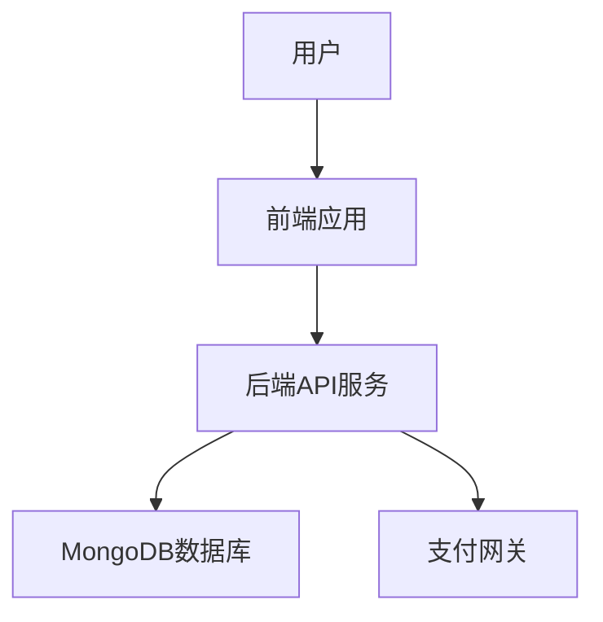

# 学生交费管理系统详细设计与具体代码实现

作者：禅与计算机程序设计艺术

## 1.背景介绍

### 1.1 项目背景

在现代教育系统中，学生的交费管理是一个至关重要的环节。它不仅涉及到学校的财务管理，还影响到学生的学业进展和学校的整体运营效率。传统的交费管理方式通常依赖于人工操作，容易出现错误和遗漏，且效率较低。因此，开发一个高效、准确的学生交费管理系统显得尤为重要。

### 1.2 需求分析

一个完善的学生交费管理系统应具备以下基本功能：
- 学生信息管理
- 交费记录管理
- 费用查询与统计
- 支付功能集成
- 报表生成与导出

### 1.3 技术选型

为了实现上述需求，本系统将采用以下技术：
- 前端：React.js
- 后端：Node.js + Express
- 数据库：MongoDB
- 支付网关：Stripe

## 2.核心概念与联系

### 2.1 系统架构

系统架构是指系统各部分的组织和相互关系。本系统采用前后端分离的架构，前端使用React.js框架构建用户界面，后端使用Node.js和Express框架提供API服务，数据存储采用MongoDB数据库。



### 2.2 数据模型

数据模型是指系统中数据的组织方式。本系统的数据模型主要包括以下几部分：
- 学生信息：包含学生的基本信息，如姓名、学号、班级等。
- 费用项目：包含各类费用项目的详细信息，如学费、住宿费等。
- 交费记录：记录每次交费的详细信息，包括交费时间、金额、支付方式等。

### 2.3 功能模块

系统的功能模块包括：
- 学生信息管理模块
- 费用项目管理模块
- 交费记录管理模块
- 支付功能模块
- 报表生成模块

## 3.核心算法原理具体操作步骤

### 3.1 学生信息管理

学生信息管理模块的核心算法包括学生信息的增删改查操作。具体操作步骤如下：
1. 添加学生信息：接收用户输入的学生信息，验证数据合法性，存储到数据库。
2. 修改学生信息：根据学生ID查找对应的学生信息，更新数据库中的记录。
3. 删除学生信息：根据学生ID删除数据库中的记录。
4. 查询学生信息：根据查询条件从数据库中检索学生信息。

### 3.2 费用项目管理

费用项目管理模块的核心算法包括费用项目的增删改查操作。具体操作步骤如下：
1. 添加费用项目：接收用户输入的费用项目信息，验证数据合法性，存储到数据库。
2. 修改费用项目：根据费用项目ID查找对应的费用项目信息，更新数据库中的记录。
3. 删除费用项目：根据费用项目ID删除数据库中的记录。
4. 查询费用项目：根据查询条件从数据库中检索费用项目信息。

### 3.3 交费记录管理

交费记录管理模块的核心算法包括交费记录的增删改查操作。具体操作步骤如下：
1. 添加交费记录：接收用户输入的交费记录信息，验证数据合法性，存储到数据库。
2. 修改交费记录：根据交费记录ID查找对应的交费记录信息，更新数据库中的记录。
3. 删除交费记录：根据交费记录ID删除数据库中的记录。
4. 查询交费记录：根据查询条件从数据库中检索交费记录信息。

### 3.4 支付功能集成

支付功能集成模块的核心算法包括支付请求的发起与响应处理。具体操作步骤如下：
1. 发起支付请求：接收用户输入的支付信息，调用支付网关API，生成支付订单。
2. 处理支付响应：接收支付网关的支付结果通知，更新交费记录状态。

### 3.5 报表生成

报表生成模块的核心算法包括费用统计与报表生成。具体操作步骤如下：
1. 费用统计：根据交费记录统计各类费用的总额。
2. 报表生成：生成费用统计报表，支持导出为Excel或PDF格式。

## 4.数学模型和公式详细讲解举例说明

### 4.1 费用统计模型

费用统计模型用于统计各类费用的总额。假设系统中有 $n$ 个交费记录，每个交费记录包含费用类型和金额信息。统计各类费用总额的数学模型如下：

$$
T_i = \sum_{j=1}^{n} A_{ij}
$$

其中，$T_i$ 表示第 $i$ 类费用的总额，$A_{ij}$ 表示第 $j$ 个交费记录中第 $i$ 类费用的金额。

### 4.2 报表生成模型

报表生成模型用于生成费用统计报表。假设系统中有 $m$ 个费用类型，每个费用类型的总额为 $T_i$。生成报表的数学模型如下：

$$
R = \{(F_i, T_i) \mid i = 1, 2, \ldots, m\}
$$

其中，$R$ 表示费用统计报表，$F_i$ 表示第 $i$ 类费用的名称，$T_i$ 表示第 $i$ 类费用的总额。

## 5.项目实践：代码实例和详细解释说明

### 5.1 学生信息管理模块

#### 5.1.1 添加学生信息

```javascript
// 后端代码：添加学生信息
const express = require('express');
const router = express.Router();
const Student = require('../models/student');

// 添加学生信息
router.post('/add', async (req, res) => {
    try {
        const student = new Student(req.body);
        await student.save();
        res.status(201).send(student);
    } catch (error) {
        res.status(400).send(error);
    }
});

module.exports = router;
```

#### 5.1.2 修改学生信息

```javascript
// 后端代码：修改学生信息
router.patch('/update/:id', async (req, res) => {
    try {
        const student = await Student.findByIdAndUpdate(req.params.id, req.body, { new: true, runValidators: true });
        if (!student) {
            return res.status(404).send();
        }
        res.send(student);
    } catch (error) {
        res.status(400).send(error);
    }
});
```

#### 5.1.3 删除学生信息

```javascript
// 后端代码：删除学生信息
router.delete('/delete/:id', async (req, res) => {
    try {
        const student = await Student.findByIdAndDelete(req.params.id);
        if (!student) {
            return res.status(404).send();
        }
        res.send(student);
    } catch (error) {
        res.status(500).send(error);
    }
});
```

#### 5.1.4 查询学生信息

```javascript
// 后端代码：查询学生信息
router.get('/list', async (req, res) => {
    try {
        const students = await Student.find(req.query);
        res.send(students);
    } catch (error) {
        res.status(500).send(error);
    }
});
```

### 5.2 费用项目管理模块

#### 5.2.1 添加费用项目

```javascript
// 后端代码：添加费用项目
const FeeItem = require('../models/feeItem');

router.post('/add', async (req, res) => {
    try {
        const feeItem = new FeeItem(req.body);
        await feeItem.save();
        res.status(201).send(feeItem);
    } catch (error) {
        res.status(400).send(error);
    }
});
```

#### 5.2.2 修改费用项目

```javascript
// 后端代码：修改费用项目
router.patch('/update/:id', async (req, res) => {
    try {
        const feeItem = await FeeItem.findByIdAndUpdate(req.params.id, req.body, { new: true, runValidators: true });
        if (!feeItem) {
            return res.status(404).send();
        }
        res.send(feeItem);
    } catch (error) {
        res.status(400).send(error);
    }
});
```

#### 5.2.3 删除费用项目

```javascript
// 后端代码：删除费用项目
router.delete('/delete/:id', async (req, res) => {
    try {
        const feeItem = await FeeItem.findByIdAndDelete(req.params.id);
        if (!feeItem) {
            return res.status(404).send();
        }
        res.send(feeItem);
    } catch (error) {
        res.status(500).send(error);
    }
});
```

#### 5.2.