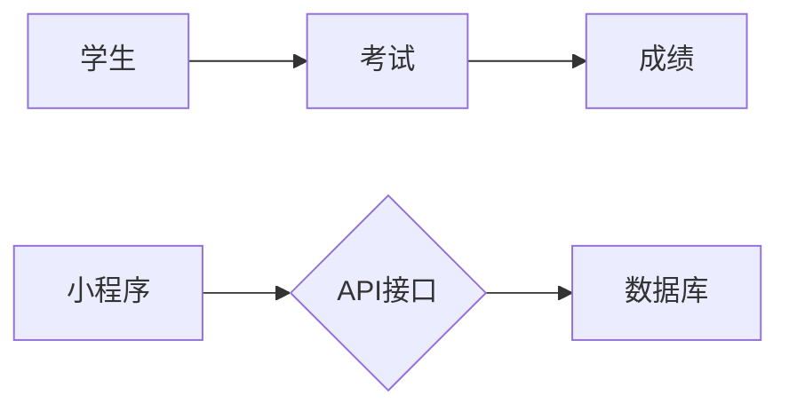

##  学生学习情况考试查询小程序

### 1. 背景介绍

#### 1.1 教育信息化的浪潮

近年来，随着互联网技术的飞速发展和智能手机的普及，教育领域正在经历着一场前所未有的信息化浪潮。传统的教育模式正在被打破，取而代之的是更加高效、便捷、个性化的在线教育模式。为了适应这一趋势，越来越多的学校和教育机构开始探索利用信息技术来提升教学质量和管理效率，其中，学生学习情况考试查询小程序应运而生，成为了连接学校、教师、学生和家长之间的重要桥梁。

#### 1.2 学生学习情况考试查询小程序的价值

学生学习情况考试查询小程序的出现，为学生、家长和教师带来了诸多便利：

* **对学生而言:** 可以随时随地查询自己的考试成绩、排名、错题分析等信息，及时了解自己的学习情况，并根据自身情况制定相应的学习计划。
* **对家长而言:** 可以方便地了解孩子的学习状况，及时发现孩子的薄弱环节，并与老师进行沟通交流，共同帮助孩子提高学习成绩。
* **对教师而言:** 可以通过小程序发布考试通知、成绩查询、错题分析等信息，减轻工作负担，提高工作效率。同时，还可以利用小程序收集学生学习数据，进行数据分析，为教学提供参考依据。

#### 1.3 本文目标

本文旨在介绍学生学习情况考试查询小程序的设计与实现，并探讨其在教育领域中的应用价值和发展趋势。文章将从以下几个方面展开：

* 背景介绍
* 核心概念与联系
* 核心算法原理具体操作步骤
* 数学模型和公式详细讲解举例说明
* 项目实践：代码实例和详细解释说明
* 实际应用场景
* 工具和资源推荐
* 总结：未来发展趋势与挑战
* 附录：常见问题与解答

### 2. 核心概念与联系

#### 2.1 小程序

小程序是一种不需要下载安装即可使用的应用，它实现了应用“触手可及”的梦想，用户扫一扫或者搜一下即可打开应用。小程序具有以下特点：

* **无需安装:** 用户无需下载安装即可使用，体验更便捷。
* **功能丰富:** 支持多种功能，例如地图、支付、语音识别等，可以满足用户的多样化需求。
* **开发成本低:** 相比于传统的 App 开发，小程序的开发成本更低，开发周期更短。
* **易于推广:** 小程序可以通过微信、QQ 等社交平台进行推广，传播速度更快，范围更广。

#### 2.2 数据库

数据库是按照数据结构来组织、存储和管理数据的仓库，是存储和管理数据的核心技术。在本项目中，我们将使用关系型数据库来存储学生信息、考试信息、成绩信息等数据。

#### 2.3 API 接口

API 接口是应用程序编程接口，是一些预先定义的函数，目的是提供应用程序与开发人员基于某软件或硬件得以访问一组例程的能力，而又无需访问源码，或理解内部工作机制的细节。在本项目中，我们将使用 API 接口来实现小程序与数据库之间的数据交互。

#### 2.4 核心概念关系图



### 3. 核心算法原理具体操作步骤

#### 3.1 用户登录

1. 用户打开小程序，进入登录页面。
2. 用户输入账号和密码，点击登录按钮。
3. 小程序将用户输入的账号和密码发送到服务器。
4. 服务器验证用户账号和密码是否正确。
5. 如果验证通过，则返回登录成功信息，并将用户信息存储在本地缓存中。
6. 如果验证失败，则返回登录失败信息，并提示用户重新输入账号和密码。

#### 3.2 查询考试成绩

1. 用户登录成功后，进入考试成绩查询页面。
2. 用户选择考试类型、考试科目等查询条件。
3. 小程序将用户选择的查询条件发送到服务器。
4. 服务器根据用户选择的查询条件，从数据库中查询相应的考试成绩信息。
5. 服务器将查询到的考试成绩信息返回给小程序。
6. 小程序将考试成绩信息展示给用户。

#### 3.3 查看错题分析

1. 用户在考试成绩查询页面，点击“查看错题分析”按钮。
2. 小程序将用户选择的考试信息发送到服务器。
3. 服务器根据用户选择的考试信息，从数据库中查询相应的错题分析信息。
4. 服务器将查询到的错题分析信息返回给小程序。
5. 小程序将错题分析信息展示给用户。

### 4. 数学模型和公式详细讲解举例说明

#### 4.1 成绩排名算法

假设有 n 个学生参加考试，每个学生的成绩分别为 $s_1, s_2, ..., s_n$，则可以使用以下公式计算每个学生的排名：

$$
rank_i = 1 + \sum_{j=1}^{n} I(s_j > s_i)
$$

其中，$I(x)$ 是指示函数，当 $x$ 为真时，$I(x)=1$，否则 $I(x)=0$。

**举例说明:**

假设有 5 个学生参加考试，他们的成绩分别为：80，90，70，85，95。则可以使用上述公式计算每个学生的排名：

* 学生 1 的排名：$rank_1 = 1 + I(90 > 80) + I(70 > 80) + I(85 > 80) + I(95 > 80) = 3$
* 学生 2 的排名：$rank_2 = 1 + I(80 > 90) + I(70 > 90) + I(85 > 90) + I(95 > 90) = 2$
* 学生 3 的排名：$rank_3 = 1 + I(80 > 70) + I(90 > 70) + I(85 > 70) + I(95 > 70) = 5$
* 学生 4 的排名：$rank_4 = 1 + I(80 > 85) + I(90 > 85) + I(70 > 85) + I(95 > 85) = 4$
* 学生 5 的排名：$rank_5 = 1 + I(80 > 95) + I(90 > 95) + I(70 > 95) + I(85 > 95) = 1$

#### 4.2 错题分析算法

错题分析算法可以帮助学生找出自己在考试中经常出错的知识点，并针对性地进行复习。常用的错题分析算法包括：

* **频率统计法:** 统计每个知识点在考试中出现的次数和错误次数，并计算错误率。
* **关联规则挖掘:** 挖掘不同知识点之间的关联规则，例如，如果学生在知识点 A 上经常出错，那么他/她很有可能在知识点 B 上也会出错。

**举例说明:**

假设某次考试共有 10 道题，涵盖了 5 个知识点，每个知识点对应 2 道题。学生的答题情况如下表所示：

| 题号 | 知识点 | 正确/错误 |
|---|---|---|
| 1 | A | 正确 |
| 2 | A | 错误 |
| 3 | B | 正确 |
| 4 | B | 正确 |
| 5 | C | 错误 |
| 6 | C | 错误 |
| 7 | D | 正确 |
| 8 | D | 错误 |
| 9 | E | 正确 |
| 10 | E | 正确 |

则可以使用频率统计法计算每个知识点的错误率：

* 知识点 A 的错误率：1/2 = 50%
* 知识点 B 的错误率：0/2 = 0%
* 知识点 C 的错误率：2/2 = 100%
* 知识点 D 的错误率：1/2 = 50%
* 知识点 E 的错误率：0/2 = 0%

### 5. 项目实践：代码实例和详细解释说明

#### 5.1 技术选型

* **小程序开发框架:** 微信小程序
* **数据库:** MySQL
* **后端语言:** Node.js
* **API 接口文档工具:** Swagger

#### 5.2 数据库设计

```sql
-- 学生表
CREATE TABLE student (
  id INT PRIMARY KEY AUTO_INCREMENT,
  name VARCHAR(255) NOT NULL,
  studentId VARCHAR(255) UNIQUE NOT NULL,
  password VARCHAR(255) NOT NULL
);

-- 考试表
CREATE TABLE exam (
  id INT PRIMARY KEY AUTO_INCREMENT,
  name VARCHAR(255) NOT NULL,
  startTime DATETIME NOT NULL,
  endTime DATETIME NOT NULL
);

-- 成绩表
CREATE TABLE score (
  id INT PRIMARY KEY AUTO_INCREMENT,
  studentId INT NOT NULL,
  examId INT NOT NULL,
  score INT NOT NULL,
  FOREIGN KEY (studentId) REFERENCES student(id),
  FOREIGN KEY (examId) REFERENCES exam(id)
);
```

#### 5.3 API 接口设计

| 接口名称 | 请求方式 | 请求路径 | 请求参数 | 返回参数 |
|---|---|---|---|---|
| 用户登录 | POST | /api/login | username, password | token |
| 查询考试列表 | GET | /api/exams |  | examList |
| 查询考试成绩 | GET | /api/scores | examId | scoreList |
| 查询错题分析 | GET | /api/errors | examId | errorList |

#### 5.4 代码实例

```javascript
// 用户登录接口
router.post('/login', async (req, res) => {
  const { username, password } = req.body;
  const user = await User.findOne({ where: { username } });
  if (user && user.password === password) {
    const token = jwt.sign({ userId: user.id }, 'secret');
    res.send({ token });
  } else {
    res.status(401).send({ message: 'Invalid username or password' });
  }
});

// 查询考试成绩接口
router.get('/scores', async (req, res) => {
  const { examId } = req.query;
  const scores = await Score.findAll({ where: { examId } });
  res.send(scores);
});
```

### 6. 实际应用场景

#### 6.1 学校场景

学生学习情况考试查询小程序可以应用于学校的各个方面，例如：

* **考试成绩查询:** 学生可以通过小程序查询自己的考试成绩、排名等信息。
* **错题分析:** 学生可以通过小程序查看自己的错题分析，找出自己在考试中经常出错的知识点，并进行针对性地复习。
* **学习情况分析:** 教师可以通过小程序收集学生的学习数据，进行数据分析，了解学生的学习情况，并根据学生的学习情况调整教学计划。
* **家校沟通:** 家长可以通过小程序了解孩子的学习情况，并与老师进行沟通交流，共同帮助孩子提高学习成绩。

#### 6.2 培训机构场景

学生学习情况考试查询小程序也可以应用于培训机构，例如：

* **学员学习情况跟踪:** 培训机构可以通过小程序跟踪学员的学习情况，了解学员的学习进度和薄弱环节，并根据学员的学习情况调整教学计划。
* **考试成绩管理:** 培训机构可以通过小程序管理学员的考试成绩，并根据学员的考试成绩进行排名，激励学员学习。
* **家校沟通:** 家长可以通过小程序了解孩子的学习情况，并与培训机构进行沟通交流，共同帮助孩子提高学习成绩。

### 7. 工具和资源推荐

#### 7.1 小程序开发工具

* **微信开发者工具:** https://developers.weixin.qq.com/miniprogram/dev/devtools/download.html

#### 7.2 数据库管理工具

* **Navicat for MySQL:** https://www.navicat.com/en/products/navicat-for-mysql

#### 7.3 API 接口文档工具

* **Swagger:** https://swagger.io/

### 8. 总结：未来发展趋势与挑战

#### 8.1 未来发展趋势

随着人工智能、大数据等技术的不断发展，学生学习情况考试查询小程序将在以下几个方面迎来更广阔的发展空间：

* **个性化学习推荐:** 利用人工智能技术，根据学生的学习情况和兴趣爱好，为学生推荐个性化的学习内容和学习路径。
* **智能错题分析:** 利用大数据技术，对学生的错题进行深度分析，挖掘出学生知识掌握的薄弱环节，并提供针对性的学习建议。
* **虚拟现实/增强现实技术应用:** 利用虚拟现实/增强现实技术，为学生打造更加沉浸式的学习体验，提高学生的学习兴趣和效率。

#### 8.2 面临的挑战

* **数据安全和隐私保护:** 学生学习情况考试查询小程序收集了大量的学生学习数据，如何确保数据的安全和隐私是一个重要的挑战。
* **技术更新迭代速度快:** 小程序开发技术更新迭代速度快，开发人员需要不断学习新的技术，才能跟上技术发展的步伐。
* **市场竞争激烈:** 学生学习情况考试查询小程序市场竞争激烈，如何打造出具有竞争力的产品是一个重要的挑战。

### 9. 附录：常见问题与解答

#### 9.1 如何注册小程序账号？

开发者可以登录微信公众平台（https://mp.weixin.qq.com/）注册小程序账号。

#### 9.2 如何获取小程序 AppID？

登录微信公众平台，进入小程序管理后台，在“开发” -> “开发设置”中可以找到小程序 AppID。

#### 9.3 如何发布小程序？

开发者完成小程序开发后，可以在微信开发者工具中点击“上传”按钮，将小程序代码上传至微信公众平台进行审核。审核通过后，即可发布小程序。