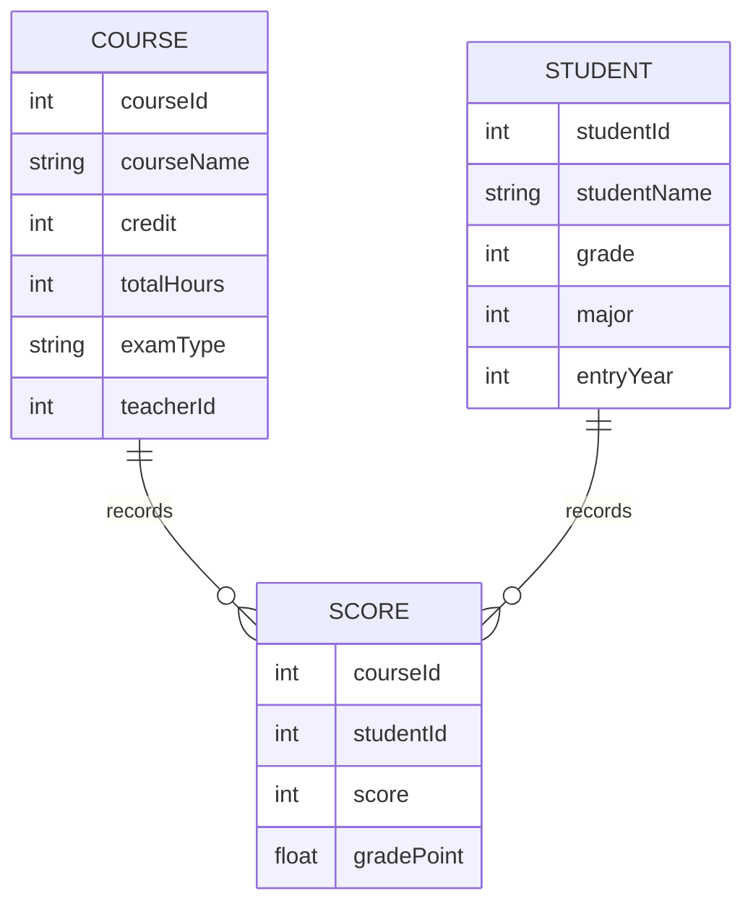
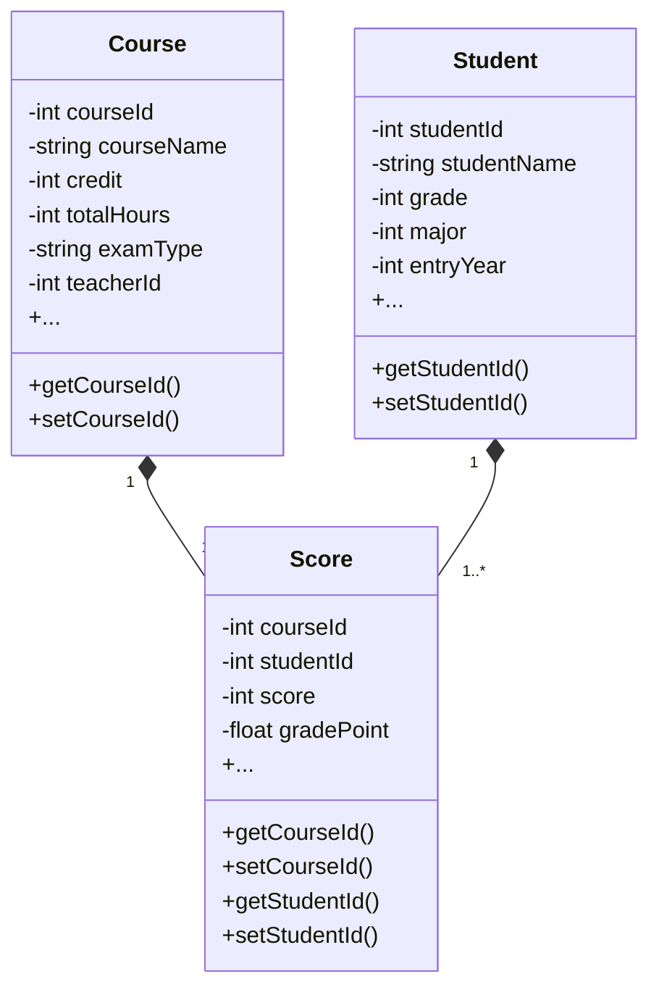
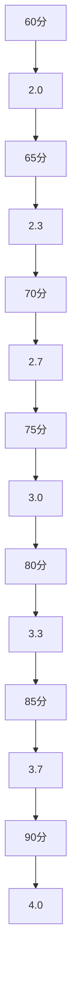

# 学生成绩学分制管理系统详细设计与具体代码实现

## 1.背景介绍

### 1.1 学生成绩管理系统的重要性

在现代教育体系中,学生成绩管理系统扮演着至关重要的角色。它不仅是记录和跟踪学生学业表现的关键工具,更是确保教育质量和公平性的重要保证。高效、准确的成绩管理有助于教师更好地评估学生的学习进度,及时发现和解决问题,从而提高教学质量。同时,它也为学校管理层提供了宝贵的数据支持,有助于制定合理的教学策略和资源分配方案。

### 1.2 传统管理方式的缺陷

传统的学生成绩管理通常依赖于手工记录和计算,这种方式不仅效率低下,而且容易出现人为错误。随着学生人数和课程数量的不断增加,手工管理的弊端更加显著。另一方面,纸质档案的保存和查询也给管理工作带来了诸多不便。因此,构建一个自动化、标准化的学生成绩管理系统就显得尤为迫切。

### 1.3 学分制概念

学分制(Credit System)是当代国际通行的一种课程管理模式。在这种模式下,每门课程都被赋予一定的学分值,学生需要修满规定的总学分方可毕业。学分制强调以学生的学习过程和实际学习效果为本,注重培养学生的自主学习能力和综合素质。相比传统的课程管理模式,学分制更加灵活和人性化,有利于激发学生的学习主动性和创新精神。

## 2.核心概念与联系  

### 2.1 课程信息

课程是学生成绩管理系统的核心组成部分。每门课程都需要详细记录如下信息:

- 课程编号
- 课程名称
- 开课学期
- 课程学分
- 总学时
- 考核方式(考试/考查)
- 任课教师

这些信息对于统计学生的总修课学分、计算绩点等操作至关重要。

### 2.2 学生信息

学生是系统的另一个关键实体。需要记录的学生信息包括:

- 学号
- 姓名
- 所属年级
- 所属专业
- 入学年份

学生信息不仅用于标识不同学生,还可用于统计分析不同年级、专业的学习情况。

### 2.3 成绩信息

成绩信息是连接课程和学生的纽带,包含以下几个要素:

- 课程编号
- 学号
- 分数
- 绩点(根据分数换算)

通过关联课程信息和学生信息,成绩信息能够完整地反映每个学生在每门课程的学习表现。

### 2.4 核心关系

以上三类信息息息相关,构成了系统的核心数据结构:

- 每个学生可修读多门课程,每门课程也可由多个学生选修
- 一个学生在一门课程上只能有一个成绩记录
- 课程的学分、总学时等信息决定了学生所需修满的学分总量

这种多对多的关系需要合理设计数据库模型来有效存储和管理。

## 3.核心算法原理具体操作步骤

### 3.1 总体设计思路

学生成绩管理系统的核心功能包括:

1. 课程信息管理
2. 学生信息管理
3. 成绩录入和计算
4. 成绩查询和统计分析

系统设计遵循模块化原则,将这些功能划分为相对独立的模块,有利于代码复用和后期维护。同时,需要注意不同模块之间的接口设计,确保数据的正确流转。

在具体实现时,我们将采用面向对象的设计思想,将课程、学生、成绩等实体对象化,并在对象之间定义合理的关系,以反映它们在现实世界中的关联。

### 3.2 数据库设计

根据前面分析的核心概念和关系,我们可以设计如下数据库模型:



该模型中:

- `COURSE`表存储课程基本信息
- `STUDENT`表存储学生基本信息  
- `SCORE`表存储每个学生在每门课程的具体成绩,是连接课程和学生的纽带
- `COURSE`和`STUDENT`表之间为多对多关系,通过`SCORE`表建立关联

这种设计可以有效规避数据冗余,并方便实现各种查询和统计需求。

### 3.3 核心类设计

在面向对象设计中,我们可以定义如下核心类:



- `Course`类对应课程实体,包含课程基本信息
- `Student`类对应学生实体,包含学生基本信息
- `Score`类对应成绩实体,包含课程编号、学号、分数和绩点
- `Course`和`Student`与`Score`之间为一对多的关联关系

通过对象之间的关联,我们可以方便地完成各种操作,如:

- 查询一门课程的所有学生成绩
- 查询一个学生在所有课程的成绩
- 统计学生的总绩点和平均绩点
- 等等

### 3.4 核心算法

#### 3.4.1 绩点计算算法

根据教育部的规定,绩点的计算方法为:

$$
\text{绩点}(G) = \begin{cases}
4.0 & \text{(成绩在90分及以上)} \\
3.7 & \text{(85分及以上,90分以下)} \\
3.3 & \text{(80分及以上,85分以下)} \\
3.0 & \text{(75分及以上,80分以下)} \\
2.7 & \text{(70分及以上,75分以下)} \\
2.3 & \text{(65分及以上,70分以下)} \\
2.0 & \text{(60分及以上,65分以下)} \\
0 & \text{(60分以下)}
\end{cases}
$$

该算法可以用如下代码实现:

```python
def calculate_grade_point(score):
    if score >= 90:
        return 4.0
    elif score >= 85:
        return 3.7
    elif score >= 80:
        return 3.3
    elif score >= 75:
        return 3.0
    elif score >= 70:
        return 2.7
    elif score >= 65:
        return 2.3
    elif score >= 60:
        return 2.0
    else:
        return 0
```

#### 3.4.2 总学分计算算法

学生的总学分是所修课程学分的累加和,可以用如下算法计算:

```python
total_credits = 0
for score in student.scores:
    course = score.get_course()
    total_credits += course.credit
```

其中`student.scores`是该生的所有成绩记录,`score.get_course()`获取该门课程的对象,`course.credit`即为该课程的学分值。

#### 3.4.3 平均绩点计算算法 

学生的平均绩点(GPA)等于所有课程绩点的加权平均值,计算公式为:

$$
GPA = \frac{\sum_{i=1}^{n}(G_i \times C_i)}{\sum_{i=1}^{n}C_i}
$$

其中:
- $n$为总课程门数
- $G_i$为第$i$门课程的绩点
- $C_i$为第$i$门课程的学分数

用代码实现为:

```python
total_product = 0
total_credits = 0
for score in student.scores:
    course = score.get_course()
    total_product += score.grade_point * course.credit
    total_credits += course.credit
gpa = total_product / total_credits
```

这里首先计算所有课程绩点与学分的乘积之和,以及总的修课学分数,最后相除即可得到GPA。

以上三个算法是系统中最为核心的算法,它们分别实现了绩点的计算、总学分的统计以及GPA的计算,为系统的其他功能模块提供了算力支持。

## 4.数学模型和公式详细讲解举例说明

在上一节中,我们已经给出了绩点计算、总学分计算和GPA计算的具体公式。现在我们来详细解释一下其中的数学原理。

### 4.1 绩点计算公式解析

绩点的计算公式为:

$$
\text{绩点}(G) = \begin{cases}
4.0 & \text{(成绩在90分及以上)} \\
3.7 & \text{(85分及以上,90分以下)} \\
3.3 & \text{(80分及以上,85分以下)} \\
3.0 & \text{(75分及以上,80分以下)} \\
2.7 & \text{(70分及以上,75分以下)} \\
2.3 & \text{(65分及以上,70分以下)} \\
2.0 & \text{(60分及以上,65分以下)} \\
0 & \text{(60分以下)}
\end{cases}
$$

这是一个分段函数,根据分数的不同区间,给出了不同的绩点值。我们可以将其视为一个非连续的分段线性函数:

$$
G(x) = \begin{cases}
4.0 & \text{(当 $x \geq 90$)} \\
3.7 & \text{(当 $85 \leq x < 90$)} \\
3.3 & \text{(当 $80 \leq x < 85$)} \\
3.0 & \text{(当 $75 \leq x < 80$)} \\
2.7 & \text{(当 $70 \leq x < 75$)} \\
2.3 & \text{(当 $65 \leq x < 70$)} \\
2.0 & \text{(当 $60 \leq x < 65$)} \\
0 & \text{(当 $x < 60$)}
\end{cases}
$$

其函数图像如下所示:



可以看到,该函数将分数区间与绩点值一一映射,是一个典型的分段常值函数。这种设计旨在将百分制的原始分数转化为更具评价意义的绩点值,方便后续的加权平均计算。

### 4.2 总学分计算公式解析

总学分的计算公式为:

$$
\text{总学分} = \sum_{i=1}^{n}C_i
$$

其中:
- $n$为修读课程的门数
- $C_i$为第$i$门课程的学分值

这是一个求和公式,即将每门课程的学分值累加,得到学生修读的总学分数。

例如,假设一个学生修读了3门课程,课程及其学分值分别为:

- 计算机原理: 3学分
- 高等数学: 4学分 
- 大学英语: 2学分

那么该生的总学分就是:

$$
\begin{aligned}
\text{总学分} &= \sum_{i=1}^3 C_i \\
            &= 3 + 4 + 2 \\
            &= 9
\end{aligned}
$$

总学分的计算是一个简单的线性运算,但在实际应用中却是一个非常重要的指标,它决定了学生是否能够满足毕业的学分要求。

### 4.3 平均绩点(GPA)计算公式解析

平均绩点(GPA)的计算公式为:

$$
GPA