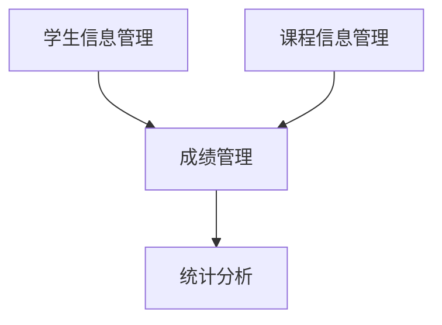

# 学生成绩管理系统详细设计与具体代码实现

作者：禅与计算机程序设计艺术

## 1. 背景介绍

### 1.1 项目背景

随着教育信息化的不断推进，学生成绩管理系统在各类教育机构中的应用变得越来越普遍。传统的成绩管理方式往往依赖于纸质记录和手工输入，存在效率低下、易出错、数据统计困难等问题。现代化的成绩管理系统通过信息化手段，实现了学生成绩的电子化管理，极大地提高了管理效率和准确性。

### 1.2 项目目标

本项目旨在设计并实现一个学生成绩管理系统，主要功能包括学生信息管理、课程信息管理、成绩录入与查询、成绩统计与分析等。系统将采用现代软件工程方法，确保其功能完备、性能优良、易于维护和扩展。

### 1.3 项目范围

- **学生信息管理**：包括学生基本信息的录入、修改、删除和查询。
- **课程信息管理**：包括课程基本信息的录入、修改、删除和查询。
- **成绩管理**：包括成绩录入、修改、删除和查询。
- **统计分析**：包括成绩统计、成绩分析和报表生成。

## 2. 核心概念与联系

### 2.1 学生信息管理

学生信息管理是整个系统的基础模块，主要负责学生基本信息的管理。它包括学生的学号、姓名、性别、出生日期、班级等信息。

### 2.2 课程信息管理

课程信息管理模块主要负责课程基本信息的管理，包括课程编号、课程名称、学分、授课教师等信息。

### 2.3 成绩管理

成绩管理模块是系统的核心功能，负责学生成绩的录入、修改、查询和删除。每个学生的成绩信息包括学号、课程编号、成绩等。

### 2.4 统计分析

统计分析模块提供对成绩数据的统计和分析功能，包括平均成绩计算、成绩分布情况、排名等功能。

### 2.5 模块之间的联系

各个模块之间通过学生编号和课程编号进行关联，实现数据的统一管理和操作。下图展示了各模块之间的关系：



## 3. 核心算法原理具体操作步骤

### 3.1 数据库设计

学生成绩管理系统的核心在于数据库设计。我们采用关系型数据库，设计如下几张核心表：

- **学生表（Student）**：存储学生基本信息。
- **课程表（Course）**：存储课程基本信息。
- **成绩表（Grade）**：存储学生成绩信息。

#### 3.1.1 学生表

```sql
CREATE TABLE Student (
    student_id INT PRIMARY KEY,
    name VARCHAR(100),
    gender CHAR(1),
    birth_date DATE,
    class VARCHAR(50)
);
```

#### 3.1.2 课程表

```sql
CREATE TABLE Course (
    course_id INT PRIMARY KEY,
    course_name VARCHAR(100),
    credits INT,
    teacher VARCHAR(100)
);
```

#### 3.1.3 成绩表

```sql
CREATE TABLE Grade (
    student_id INT,
    course_id INT,
    grade FLOAT,
    PRIMARY KEY (student_id, course_id),
    FOREIGN KEY (student_id) REFERENCES Student(student_id),
    FOREIGN KEY (course_id) REFERENCES Course(course_id)
);
```

### 3.2 核心算法

#### 3.2.1 平均成绩计算

计算某个学生的平均成绩：

```sql
SELECT AVG(grade) AS average_grade
FROM Grade
WHERE student_id = ?;
```

#### 3.2.2 成绩分布统计

统计某门课程的成绩分布情况：

```sql
SELECT grade, COUNT(*) AS count
FROM Grade
WHERE course_id = ?
GROUP BY grade;
```

#### 3.2.3 成绩排名

计算某门课程的成绩排名：

```sql
SELECT student_id, grade, RANK() OVER (ORDER BY grade DESC) AS rank
FROM Grade
WHERE course_id = ?;
```

## 4. 数学模型和公式详细讲解举例说明

### 4.1 平均成绩计算公式

平均成绩的计算公式为：

$$
\text{Average Grade} = \frac{\sum_{i=1}^{n} G_i}{n}
$$

其中，$G_i$ 表示第 $i$ 门课程的成绩，$n$ 表示课程总数。

### 4.2 成绩分布统计

成绩分布统计可以通过直方图来表示，横轴表示成绩区间，纵轴表示人数。假设成绩分布为：

$$
\text{Grade Distribution} = \{(G_1, N_1), (G_2, N_2), \ldots, (G_m, N_m)\}
$$

其中，$G_i$ 表示第 $i$ 个成绩区间，$N_i$ 表示该区间内的人数。

### 4.3 成绩排名

成绩排名可以通过排序算法来实现，假设有 $n$ 个学生的成绩为 $G_1, G_2, \ldots, G_n$，则排名可以表示为：

$$
\text{Rank}(G_i) = \sum_{j=1}^{n} \mathbb{I}(G_j \geq G_i)
$$

其中，$\mathbb{I}$ 是指示函数，当 $G_j \geq G_i$ 时，$\mathbb{I}(G_j \geq G_i) = 1$，否则为 0。

## 5. 项目实践：代码实例和详细解释说明

### 5.1 技术选型

本项目采用以下技术栈：

- **前端**：HTML5、CSS3、JavaScript、React
- **后端**：Java、Spring Boot
- **数据库**：MySQL
- **开发工具**：IntelliJ IDEA、Visual Studio Code

### 5.2 前端代码实现

#### 5.2.1 学生信息管理界面

```jsx
import React, { useState, useEffect } from 'react';
import axios from 'axios';

const StudentManagement = () => {
    const [students, setStudents] = useState([]);

    useEffect(() => {
        axios.get('/api/students')
            .then(response => setStudents(response.data))
            .catch(error => console.error('Error fetching students:', error));
    }, []);

    return (
        <div>
            <h1>学生信息管理</h1>
            <table>
                <thead>
                    <tr>
                        <th>学号</th>
                        <th>姓名</th>
                        <th>性别</th>
                        <th>出生日期</th>
                        <th>班级</th>
                    </tr>
                </thead>
                <tbody>
                    {students.map(student => (
                        <tr key={student.student_id}>
                            <td>{student.student_id}</td>
                            <td>{student.name}</td>
                            <td>{student.gender}</td>
                            <td>{student.birth_date}</td>
                            <td>{student.class}</td>
                        </tr>
                    ))}
                </tbody>
            </table>
        </div>
    );
};

export default StudentManagement;
```

### 5.3 后端代码实现

#### 5.3.1 学生信息管理接口

```java
@RestController
@RequestMapping("/api/students")
public class StudentController {

    @Autowired
    private StudentService studentService;

    @GetMapping
    public List<Student> getAllStudents() {
        return studentService.getAllStudents();
    }

    @PostMapping
    public void addStudent(@RequestBody Student student) {
        studentService.addStudent(student);
    }

    @PutMapping("/{id}")
    public void updateStudent(@PathVariable int id, @RequestBody Student student) {
        studentService.updateStudent(id, student);
    }

    @DeleteMapping("/{id}")
    public void deleteStudent(@PathVariable int id) {
        studentService.deleteStudent(id);
    }
}
```

#### 5.3.2 学生信息服务层

```java
@Service
public class StudentService {

    @Autowired
    private StudentRepository studentRepository;

    public List<Student> getAllStudents() {
        return studentRepository.findAll();
    }

    public void addStudent(Student student) {
        studentRepository.save(student);
    }

    public void updateStudent(int id, Student student) {
        Student existingStudent = studentRepository.findById(id).orElseThrow(() -> new ResourceNotFoundException("Student not found"));
        existingStudent.setName(student.getName());
        existingStudent.setGender(student.getGender());
        existingStudent.setBirthDate(student.getBirthDate());
        existingStudent.setClass(student.getClass());
        studentRepository.save(existingStudent);
    }

    public void deleteStudent(int id) {
        studentRepository.deleteById(id);
    }
}
```

### 5.4 数据库操作

#### 5.4.1 学生信息查询

```java
public interface StudentRepository extends JpaRepository<Student, Integer> {
}
