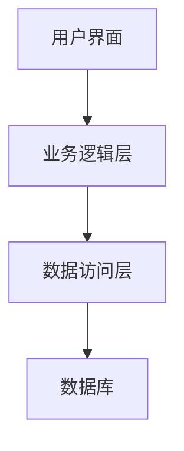

# 学生社团管理系统设计与实现

作者：禅与计算机程序设计艺术

## 1. 背景介绍

### 1.1 学生社团的意义与挑战

学生社团在高校生活中扮演着重要角色，它们不仅提供了丰富的课外活动，还为学生提供了锻炼领导能力、团队合作和组织管理能力的平台。然而，随着社团数量和活动的增加，社团管理面临着越来越多的挑战。传统的手工管理方式效率低下，数据易丢失，信息传递不及时，无法满足现代社团管理的需求。

### 1.2 需求分析

为了提高社团管理的效率和规范性，迫切需要一个信息化的管理系统。该系统应当具备以下功能：

- **成员管理**：包括成员信息录入、修改、删除等。
- **活动管理**：包括活动的创建、审批、通知、总结等。
- **财务管理**：包括经费申请、审批、使用记录等。
- **信息发布**：包括公告、通知、新闻等发布功能。
- **权限管理**：不同角色（如管理员、社长、成员）具有不同的操作权限。

### 1.3 技术选型

在进行系统设计时，需要选择合适的技术栈以确保系统的稳定性、扩展性和易维护性。考虑到系统的需求和现有技术的发展，本文选择以下技术：

- **前端技术**：React.js
- **后端技术**：Node.js + Express.js
- **数据库**：MongoDB
- **其他**：Git进行版本控制，Docker进行容器化部署

## 2. 核心概念与联系

### 2.1 系统架构设计

学生社团管理系统采用典型的三层架构设计，即表示层、业务逻辑层和数据访问层。每一层之间通过接口进行通信，确保系统的模块化和可维护性。



### 2.2 模块划分

系统主要分为以下几个模块：

- **用户管理模块**：处理用户的注册、登录、权限分配等。
- **社团管理模块**：处理社团的创建、修改、删除等。
- **活动管理模块**：处理活动的创建、审批、通知等。
- **财务管理模块**：处理经费的申请、审批、使用记录等。
- **信息发布模块**：处理公告、通知、新闻的发布等。

### 2.3 数据库设计

数据库采用MongoDB，主要包括以下几个集合：

- **用户集合**：存储用户的基本信息和权限信息。
- **社团集合**：存储社团的基本信息。
- **活动集合**：存储活动的基本信息。
- **财务集合**：存储财务的申请、审批和使用记录。
- **公告集合**：存储发布的公告和通知。

## 3. 核心算法原理具体操作步骤

### 3.1 用户认证与权限管理

用户认证采用JWT（JSON Web Token）技术，确保用户身份的唯一性和安全性。权限管理通过角色与权限的映射实现，确保不同角色只能执行其权限范围内的操作。

#### 3.1.1 用户注册与登录

用户注册时，系统会将用户信息存储到数据库中，并生成唯一的用户ID。用户登录时，系统会验证用户的用户名和密码，验证成功后生成JWT令牌，返回给客户端。

```javascript
const jwt = require('jsonwebtoken');
const bcrypt = require('bcrypt');
const User = require('../models/User');

async function register(req, res) {
    const { username, password } = req.body;
    const hashedPassword = await bcrypt.hash(password, 10);
    const user = new User({ username, password: hashedPassword });
    await user.save();
    res.status(201).send('User registered');
}

async function login(req, res) {
    const { username, password } = req.body;
    const user = await User.findOne({ username });
    if (!user || !await bcrypt.compare(password, user.password)) {
        return res.status(401).send('Invalid credentials');
    }
    const token = jwt.sign({ userId: user._id }, 'secretKey');
    res.send({ token });
}
```

#### 3.1.2 权限管理

权限管理通过中间件实现，确保只有具有相应权限的用户才能访问特定的接口。

```javascript
function authorize(role) {
    return (req, res, next) => {
        const token = req.headers.authorization.split(' ')[1];
        const decoded = jwt.verify(token, 'secretKey');
        const user = await User.findById(decoded.userId);
        if (user.role !== role) {
            return res.status(403).send('Forbidden');
        }
        next();
    };
}
```

### 3.2 活动管理

活动管理模块包括活动的创建、审批和通知等功能。活动创建时，系统会将活动信息存储到数据库中，并通知相关人员进行审批。

#### 3.2.1 活动创建

```javascript
const Activity = require('../models/Activity');

async function createActivity(req, res) {
    const { name, description, date, clubId } = req.body;
    const activity = new Activity({ name, description, date, clubId, status: 'pending' });
    await activity.save();
    res.status(201).send('Activity created');
}
```

#### 3.2.2 活动审批

```javascript
async function approveActivity(req, res) {
    const { activityId } = req.body;
    const activity = await Activity.findById(activityId);
    if (!activity) {
        return res.status(404).send('Activity not found');
    }
    activity.status = 'approved';
    await activity.save();
    res.send('Activity approved');
}
```

### 3.3 财务管理

财务管理模块包括经费的申请、审批和使用记录等功能。经费申请时，系统会将申请信息存储到数据库中，并通知相关人员进行审批。

#### 3.3.1 经费申请

```javascript
const Finance = require('../models/Finance');

async function applyFinance(req, res) {
    const { amount, purpose, clubId } = req.body;
    const finance = new Finance({ amount, purpose, clubId, status: 'pending' });
    await finance.save();
    res.status(201).send('Finance application submitted');
}
```

#### 3.3.2 经费审批

```javascript
async function approveFinance(req, res) {
    const { financeId } = req.body;
    const finance = await Finance.findById(financeId);
    if (!finance) {
        return res.status(404).send('Finance application not found');
    }
    finance.status = 'approved';
    await finance.save();
    res.send('Finance application approved');
}
```

## 4. 数学模型和公式详细讲解举例说明

### 4.1 数据库查询优化

在系统设计中，数据库查询的效率至关重要。MongoDB提供了多种查询优化策略，例如索引、聚合管道等。以下是一些常见的优化策略及其数学模型。

#### 4.1.1 索引

索引是提高查询效率的关键。MongoDB支持多种索引类型，包括单字段索引、复合索引、地理空间索引等。索引的选择和设计需要根据查询的频率和复杂度进行优化。

$$
\text{查询时间复杂度} = O(\log n)
$$

#### 4.1.2 聚合管道

聚合管道是一种高效的数据处理方式，可以用于数据的过滤、分组、排序等操作。聚合管道的设计需要考虑数据量和操作的复杂度。

$$
\text{聚合管道效率} = \frac{\text{处理时间}}{\text{数据量}}
$$

### 4.2 系统性能优化

系统性能优化包括前端性能优化和后端性能优化。前端性能优化主要包括减少HTTP请求、使用CDN、代码压缩等。后端性能优化主要包括数据库优化、缓存机制、负载均衡等。

#### 4.2.1 前端性能优化

前端性能优化的目标是减少页面加载时间，提高用户体验。常用的方法包括：

- 减少HTTP请求：合并CSS和JavaScript文件，使用图片精灵等。
- 使用CDN：将静态资源托管到CDN，提高资源加载速度。
- 代码压缩：使用工具对CSS、JavaScript进行压缩，减少文件大小。

#### 4.2.2 后端性能优化

后端性能优化的目标是提高服务器的响应速度和处理能力。常用的方法包括：

- 数据库优化：使用索引、优化查询语句、分库分表等。
- 缓存机制：使用Redis等缓存技术，减少数据库访问次数。
- 负载均衡：使用Nginx等负载均衡技术，分散服务器压力。

## 5. 项目实践：代码实例和详细解释