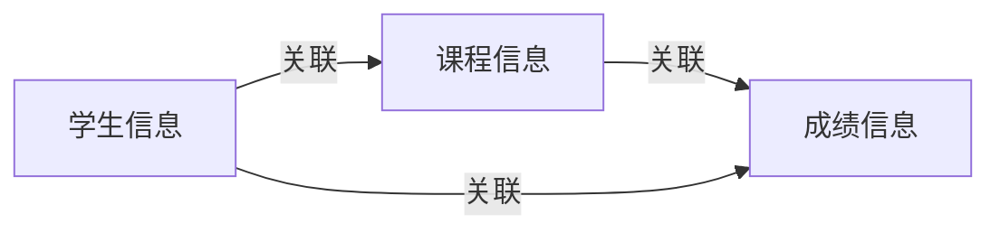

## 1.背景介绍

在当前的教育环境中，学生信息管理已经成为了一项日常必须的工作。特别是在大型的教育机构中，对学生的课程信息和成绩信息进行有效的管理，不仅能够提高教育质量，还能够帮助教师和管理者更好地理解学生的学习状况。在这种背景下，学生课程与成绩管理系统应运而生。

## 2.核心概念与联系

学生课程与成绩管理系统是一个涵盖了学生的基本信息、课程信息和成绩信息的综合性管理系统。其核心概念主要包括学生信息、课程信息和成绩信息，这三者之间存在着密切的关联。

- 学生信息：包括学生的基本信息，如姓名、学号、班级等。

- 课程信息：包括课程的基本信息，如课程号、课程名称、学分等。

- 成绩信息：包括学生的成绩信息，如课程成绩、总成绩等。

这三者之间的关系可以用下面的图示表示：



## 3.核心算法原理具体操作步骤

学生课程与成绩管理系统的核心算法主要涉及到数据库的增删改查操作，下面我们将具体介绍这些操作的步骤。

### 3.1 增加数据

- 首先，我们需要创建一个新的学生、课程或成绩的实例。

- 然后，将这个实例的信息添加到相应的数据库表中。

- 最后，提交这个操作，将数据持久化到数据库中。

### 3.2 删除数据

- 首先，我们需要找到需要删除的学生、课程或成绩的实例。

- 然后，将这个实例从相应的数据库表中删除。

- 最后，提交这个操作，将数据的变化持久化到数据库中。

### 3.3 修改数据

- 首先，我们需要找到需要修改的学生、课程或成绩的实例。

- 然后，修改这个实例的信息。

- 最后，提交这个操作，将数据的变化持久化到数据库中。

### 3.4 查询数据

- 首先，我们需要根据查询条件，从数据库中找到相应的学生、课程或成绩的实例。

- 然后，获取这些实例的信息。

- 最后，将这些信息返回给用户。

## 4.数学模型和公式详细讲解举例说明

在学生课程与成绩管理系统中，我们需要对学生的总成绩进行计算。这需要使用到加权平均数的数学模型。

加权平均数是一种常用的数学模型，用于计算一组数值的平均值，其中每个数值有一个对应的权重。加权平均数的计算公式如下：

$$
\bar{x} = \frac{\sum_{i=1}^{n} w_i x_i}{\sum_{i=1}^{n} w_i}
$$

其中，$x_i$表示第$i$个数值，$w_i$表示第$i$个数值的权重，$n$表示数值的总数量。

在我们的系统中，每个课程的成绩都会有一个对应的权重，即课程的学分。因此，我们可以使用上面的公式来计算学生的总成绩。

## 4.项目实践：代码实例和详细解释说明

下面我们将使用Python和SQLite数据库，来实现一个简单的学生课程与成绩管理系统。为了简化问题，我们假设每个学生只选修了一门课程，并且每门课程只有一个成绩。

首先，我们需要创建一个SQLite数据库，并创建学生、课程和成绩三个表：

```python
import sqlite3

conn = sqlite3.connect('student.db')

c = conn.cursor()

c.execute('''
CREATE TABLE students (
    id INTEGER PRIMARY KEY,
    name TEXT
)
''')

c.execute('''
CREATE TABLE courses (
    id INTEGER PRIMARY KEY,
    name TEXT,
    credit INTEGER
)
''')

c.execute('''
CREATE TABLE scores (
    student_id INTEGER,
    course_id INTEGER,
    score INTEGER,
    PRIMARY KEY (student_id, course_id),
    FOREIGN KEY (student_id) REFERENCES students (id),
    FOREIGN KEY (course_id) REFERENCES courses (id)
)
''')

conn.commit()
```

然后，我们可以添加一些学生、课程和成绩的数据：

```python
c.execute("INSERT INTO students (name) VALUES ('Alice')")
c.execute("INSERT INTO students (name) VALUES ('Bob')")

c.execute("INSERT INTO courses (name, credit) VALUES ('Math', 3)")
c.execute("INSERT INTO courses (name, credit) VALUES ('English', 2)")

c.execute("INSERT INTO scores (student_id, course_id, score) VALUES (1, 1, 85)")
c.execute("INSERT INTO scores (student_id, course_id, score) VALUES (1, 2, 90)")
c.execute("INSERT INTO scores (student_id, course_id, score) VALUES (2, 1, 80)")
c.execute("INSERT INTO scores (student_id, course_id, score) VALUES (2, 2, 95)")

conn.commit()
```

最后，我们可以查询学生的总成绩：

```python
c.execute('''
SELECT students.name, SUM(courses.credit * scores.score) / SUM(courses.credit)
FROM students, courses, scores
WHERE students.id = scores.student_id AND courses.id = scores.course_id
GROUP BY students.id
''')

for row in c:
    print(row)

conn.close()
```

## 5.实际应用场景

学生课程与成绩管理系统在实际中有广泛的应用。例如：

- 在大型的教育机构中，管理者可以使用这个系统来追踪和分析学生的学习状况，进而制定更有效的教育策略。

- 在线教育平台可以使用这个系统来为学生提供个性化的学习体验，例如推荐适合的课程，或者提供成绩回馈。

- 研究人员可以使用这个系统来收集和分析教育数据，进而进行教育研究。

## 6.工具和资源推荐

- SQLite：一种轻量级的关系型数据库，非常适合用于小型的项目或者学习数据库的基本概念。

- Python：一种通用的高级编程语言，有丰富的库和框架，可以方便地进行数据库操作。

- SQLAlchemy：一种Python的ORM框架，可以使数据库操作更加简洁和高效。

## 7.总结：未来发展趋势与挑战

随着教育技术的发展，学生课程与成绩管理系统面临着新的发展趋势和挑战。

- 大数据和数据分析：随着教育数据的不断增长，如何有效地收集、存储和分析这些数据，将是一个重要的问题。

- 个性化教育：如何根据学生的个性和需求，提供个性化的教育服务，将是一个重要的趋势。

- 隐私和安全：如何保护学生的隐私和数据的安全，将是一个重要的挑战。

## 8.附录：常见问题与解答

- 问：学生课程与成绩管理系统如何处理学生的选课操作？

答：在学生选课操作中，我们首先需要获取学生的学号和选课的课程号，然后在成绩表中新增一条记录，其中学生ID和课程ID分别为学生的学号和选课的课程号，成绩暂时可以设为NULL。

- 问：学生课程与成绩管理系统如何处理成绩的修改操作？

答：在成绩的修改操作中，我们首先需要获取学生的学号、课程的课程号和新的成绩，然后在成绩表中找到对应的记录，并将成绩修改为新的成绩。

- 问：学生课程与成绩管理系统如何处理成绩的查询操作？

答：在成绩的查询操作中，我们首先需要获取学生的学号，然后在成绩表中找到所有学生ID为学生学号的记录，最后将这些记录的信息返回给用户。