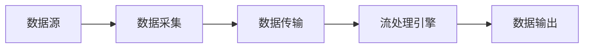

# 实时数据处理 原理与代码实例讲解

作者：禅与计算机程序设计艺术

## 1. 背景介绍

### 1.1. 什么是实时数据处理？

在当今信息爆炸的时代，数据以前所未有的速度产生和积累。如何及时有效地处理这些海量数据，从中提取有价值的信息，已经成为各个领域亟待解决的关键问题。实时数据处理系统应运而生，它能够在数据生成的同时进行处理，并在极短的时间内返回结果，为决策提供依据。

与传统的批处理系统相比，实时数据处理具有以下优势：

* **低延迟：** 数据处理时间极短，通常在毫秒或秒级，能够满足实时性要求较高的应用场景。
* **高吞吐：** 能够处理海量数据，每秒处理的数据量可达数百万甚至上亿条。
* **持续性：**  系统能够7x24小时不间断地运行，保证数据的实时性。

### 1.2. 实时数据处理的应用场景

实时数据处理技术已经渗透到各行各业，以下列举一些典型的应用场景：

* **金融领域：** 实时欺诈检测、风险评估、高频交易等。
* **电商领域：**  实时推荐系统、个性化营销、库存管理等。
* **社交网络：**  实时趋势分析、用户行为分析、垃圾信息过滤等。
* **物联网：**  传感器数据采集、设备监控、远程控制等。

### 1.3. 实时数据处理面临的挑战

实时数据处理虽然优势明显，但也面临着一些挑战：

* **数据量大、速度快：**  如何高效地处理海量高速数据流是实时数据处理系统的关键挑战。
* **数据多样性：**  实时数据来源广泛，格式多样，如何进行有效的数据清洗和转换也是一个难题。
* **系统复杂性：**  实时数据处理系统通常由多个组件构成，如何保证系统的可靠性、稳定性和可扩展性是系统设计的难点。

## 2. 核心概念与联系

### 2.1. 数据流模型

实时数据处理通常采用数据流模型来描述数据的流动和处理过程。数据流模型将数据视为一个连续的、无限的数据序列，数据处理系统对数据流进行实时处理，并将处理结果输出到下游系统。

### 2.2. 流处理引擎

流处理引擎是实时数据处理系统的核心组件，负责接收、处理和输出数据流。常见的流处理引擎包括：

* **Apache Storm:**  一个分布式、容错的实时计算系统。
* **Apache Spark Streaming:**  基于Spark平台的实时数据处理框架。
* **Apache Flink:**  一个低延迟、高吞吐的流处理引擎。
* **Apache Kafka:**  一个高吞吐量、低延迟的消息队列系统，常用于实时数据管道。

### 2.3. 数据管道

数据管道是指将数据从数据源传输到数据处理系统，以及将处理结果输出到目标系统的过程。实时数据管道通常由以下组件构成：

* **数据源：**  例如传感器、数据库、应用程序等。
* **数据采集：**  将数据从数据源收集到数据管道中，例如使用Flume、Logstash等工具。
* **数据传输：**  将数据传输到流处理引擎，例如使用Kafka、RabbitMQ等消息队列系统。
* **数据处理：**  使用流处理引擎对数据进行实时处理。
* **数据输出：**  将处理结果输出到目标系统，例如数据库、可视化平台等。

### 2.4. 核心概念之间的联系

下图展示了实时数据处理系统中各个核心概念之间的联系：



## 3. 核心算法原理具体操作步骤

### 3.1. 数据窗口

由于数据流是无限的，为了方便对数据进行处理，通常需要将数据流划分为有限大小的数据窗口。常见的数据窗口类型包括：

* **时间窗口：**  按照时间间隔划分数据窗口，例如每1分钟、每1小时等。
* **计数窗口：**  按照数据条数划分数据窗口，例如每1000条数据。
* **滑动窗口：**  时间窗口的一种变体，窗口可以滑动，例如每1分钟统计过去10分钟的数据。

### 3.2. 聚合操作

聚合操作是对数据窗口内的数据进行统计分析，例如计算总数、平均值、最大值、最小值等。常见的聚合操作包括：

* `count`：统计数据条数。
* `sum`：计算数据总和。
* `avg`：计算数据平均值。
* `max`：计算数据最大值。
* `min`：计算数据最小值。

### 3.3. 连接操作

连接操作是将两个或多个数据流按照一定的条件合并成一个新的数据流。常见的连接类型包括：

* **内连接：**  只保留满足连接条件的数据。
* **外连接：**  保留所有数据，对于不满足连接条件的数据，使用空值填充。

### 3.4. 具体操作步骤

以下以使用Apache Flink进行实时数据处理为例，说明核心算法的具体操作步骤：

1. **定义数据源：**  指定数据流的来源，例如Kafka topic。
2. **定义数据窗口：**  指定数据窗口的类型和大小，例如使用时间窗口，每1分钟统计一次数据。
3. **定义聚合操作：**  指定对数据窗口内的数据进行哪些聚合操作，例如计算总数、平均值等。
4. **定义输出：**  指定将处理结果输出到哪里，例如控制台、数据库等。

## 4. 数学模型和公式详细讲解举例说明

### 4.1. 滑动窗口模型

滑动窗口模型是一种常用的数据窗口类型，它可以根据时间或数据条数滑动，从而实现对数据流的实时统计分析。

滑动窗口模型可以用以下公式表示：

```
窗口大小 = w
滑动步长 = s

窗口 i 的数据范围 = [i * s, i * s + w)
```

其中：

* `w` 表示窗口大小。
* `s` 表示滑动步长。
* `i` 表示窗口的编号，从0开始。

例如，假设窗口大小为10分钟，滑动步长为5分钟，则第一个窗口的数据范围为 [0, 10)，第二个窗口的数据范围为 [5, 15)，以此类推。

### 4.2. 指数加权移动平均（EWMA）

指数加权移动平均是一种常用的时间序列分析方法，它可以用于平滑时间序列数据，并突出显示数据的趋势。

EWMA 的计算公式如下：

```
EWMA(t) = α * X(t) + (1 - α) * EWMA(t-1)
```

其中：

* `EWMA(t)` 表示时间 t 的 EWMA 值。
* `X(t)` 表示时间 t 的实际值。
* `α` 表示平滑因子，取值范围为 0 到 1 之间。

α 值越大，则越重视近期的数据；α 值越小，则越重视历史数据。

### 4.3. 举例说明

假设有一个传感器每秒钟产生一个温度数据，我们想要使用滑动窗口模型和 EWMA 算法来实时计算温度的 5 秒钟平均值和 10 秒钟的趋势。

**滑动窗口模型：**

* 窗口大小：5 秒
* 滑动步长：1 秒

**EWMA 算法：**

* 平滑因子：0.3

以下代码演示了如何使用 Apache Flink 实现上述功能：

```java
// 定义数据源
DataStream<Integer> temperatureStream = ...;

// 定义滑动窗口
DataStream<Tuple2<Long, Double>> avgTemperatureStream = temperatureStream
        .keyBy(value -> 1)
        .timeWindow(Time.seconds(5), Time.seconds(1))
        .apply(new AverageAggregateFunction());

// 定义 EWMA
DataStream<Tuple2<Long, Double>> ewmaTemperatureStream = temperatureStream
        .keyBy(value -> 1)
        .map(new RichMapFunction<Integer, Tuple2<Long, Double>>() {
            private transient ValueState<Double> ewmaState;

            @Override
            public void open(GlobalJobParameters globalJobParameters) throws Exception {
                ewmaState = getRuntimeContext().getState(
                        new ValueStateDescriptor<>("ewma", Double.class));
            }

            @Override
            public Tuple2<Long, Double> map(Integer value) throws Exception {
                Double ewma = ewmaState.value();
                if (ewma == null) {
                    ewma = (double) value;
                } else {
                    ewma = 0.3 * value + 0.7 * ewma;
                }
                ewmaState.update(ewma);
                return Tuple.of(System.currentTimeMillis(), ewma);
            }
        });

// 输出结果
avgTemperatureStream.print("Average Temperature");
ewmaTemperatureStream.print("EWMA Temperature");
```

## 5. 项目实践：代码实例和详细解释说明

本节将以一个具体的项目为例，演示如何使用 Apache Flink 实现一个实时数据处理系统。

### 5.1. 项目背景

假设我们是一家电商公司，我们想要实时监控用户的购买行为，并根据用户的实时购买记录推荐相关的商品。

### 5.2. 数据源

用户的购买记录存储在 Kafka 中，每条记录包含以下字段：

* `user_id`：用户 ID。
* `item_id`：商品 ID。
* `timestamp`：购买时间戳。

### 5.3. 数据处理流程

1. 从 Kafka 中读取用户的购买记录。
2. 按照用户 ID 对数据进行分组。
3. 使用滑动窗口模型，每 1 分钟统计一次每个用户购买的商品列表。
4. 根据用户的购买历史，使用协同过滤算法推荐相关的商品。
5. 将推荐结果写入 Redis 中。

### 5.4. 代码实现

```java
// 定义 Kafka 数据源
Properties properties = new Properties();
properties.setProperty("bootstrap.servers", "localhost:9092");
properties.setProperty("group.id", "user-purchase-group");
DataStream<String> purchaseStream = env.addSource(new FlinkKafkaConsumer<>("user-purchase", new SimpleStringSchema(), properties));

// 解析数据
DataStream<PurchaseRecord> recordStream = purchaseStream
        .map(new MapFunction<String, PurchaseRecord>() {
            @Override
            public PurchaseRecord map(String value) throws Exception {
                String[] fields = value.split(",");
                return new PurchaseRecord(Long.parseLong(fields[0]), Long.parseLong(fields[1]), Long.parseLong(fields[2]));
            }
        });

// 按照用户 ID 分组
KeyedStream<PurchaseRecord, Long> keyedStream = recordStream.keyBy(record -> record.userId);

// 定义滑动窗口
DataStream<List<Long>> purchaseHistoryStream = keyedStream
        .timeWindow(Time.minutes(1), Time.seconds(10))
        .aggregate(new AggregateFunction<PurchaseRecord, List<Long>, List<Long>>() {
            @Override
            public List<Long> createAccumulator() {
                return new ArrayList<>();
            }

            @Override
            public List<Long> add(PurchaseRecord value, List<Long> accumulator) {
                accumulator.add(value.itemId);
                return accumulator;
            }

            @Override
            public List<Long> getResult(List<Long> accumulator) {
                return accumulator;
            }

            @Override
            public List<Long> merge(List<Long> a, List<Long> b) {
                a.addAll(b);
                return a;
            }
        });

// 使用协同过滤算法推荐商品
DataStream<List<Long>> recommendationStream = purchaseHistoryStream
        .map(new MapFunction<List<Long>, List<Long>>() {
            @Override
            public List<Long> map(List<Long> value) throws Exception {
                // 调用协同过滤算法推荐商品
                return recommendItems(value);
            }
        });

// 将推荐结果写入 Redis
recommendationStream
        .addSink(new RedisSink<>(
                new FlinkJedisPoolConfig.Builder().setHost("localhost").build(),
                new RecommendationRedisMapper()
        ));

// 执行任务
env.execute("User Purchase Recommendation");
```

## 6. 工具和资源推荐

### 6.1. 流处理引擎

* **Apache Storm:**  [https://storm.apache.org/](https://storm.apache.org/)
* **Apache Spark Streaming:**  [https://spark.apache.org/streaming/](https://spark.apache.org/streaming/)
* **Apache Flink:**  [https://flink.apache.org/](https://flink.apache.org/)

### 6.2. 消息队列系统

* **Apache Kafka:**  [https://kafka.apache.org/](https://kafka.apache.org/)
* **RabbitMQ:**  [https://www.rabbitmq.com/](https://www.rabbitmq.com/)

### 6.3. 数据可视化工具

* **Grafana:**  [https://grafana.com/](https://grafana.com/)
* **Kibana:**  [https://www.elastic.co/kibana/](https://www.elastic.co/kibana/)

## 7. 总结：未来发展趋势与挑战

### 7.1. 未来发展趋势

* **边缘计算：**  随着物联网的快速发展，越来越多的数据将在边缘设备上产生，边缘计算将成为实时数据处理的重要趋势。
* **人工智能：**  人工智能技术将与实时数据处理技术深度融合，实现更智能化的数据分析和决策。
* **云原生：**  实时数据处理系统将更加云原生化，利用云计算的弹性和可扩展性优势。

### 7.2. 面临的挑战

* **数据安全和隐私保护：**  实时数据处理涉及大量敏感数据，如何保证数据的安全和隐私保护是一个重要挑战。
* **系统复杂性：**  实时数据处理系统通常由多个组件构成，如何降低系统的复杂性，提高系统的可维护性是一个挑战。
* **人才短缺：**  实时数据处理领域需要大量专业人才，如何培养和吸引更多人才是一个挑战。

## 8. 附录：常见问题与解答

### 8.1. 什么是数据倾斜？如何解决数据倾斜问题？

数据倾斜是指数据在不同分区上的分布不均匀，导致部分分区的数据量过大，从而影响系统的性能。解决数据倾斜问题的方法包括：

* **数据预处理：**  对数据进行预处理，例如过滤掉异常数据、对数据进行分桶等。
* **调整并行度：**  增加数据倾斜的分区的并行度，将数据分散到更多的节点上进行处理。
* **使用自定义分区器：**  根据数据的特点，自定义分区器，将数据均匀地分配到不同的分区上。

### 8.2. 什么是反压机制？

反压机制是指当数据处理系统的下游处理速度跟不上上游数据生产速度时，上游系统会降低数据生产速度，以防止系统崩溃。反压机制可以有效地保证系统的稳定性。

### 8.3. 如何监控实时数据处理系统的性能？

可以使用各种监控工具来监控实时数据处理系统的性能，例如：

* **系统监控工具：**  例如 Ganglia、Nagios 等，可以监控系统的 CPU、内存、网络等指标。
* **流处理引擎自带的监控工具：**  例如 Apache Flink 提供了 Web UI 和指标监控等功能。
* **第三方监控工具：**  例如 Prometheus、Grafana 等，可以收集和可视化系统的各种指标。