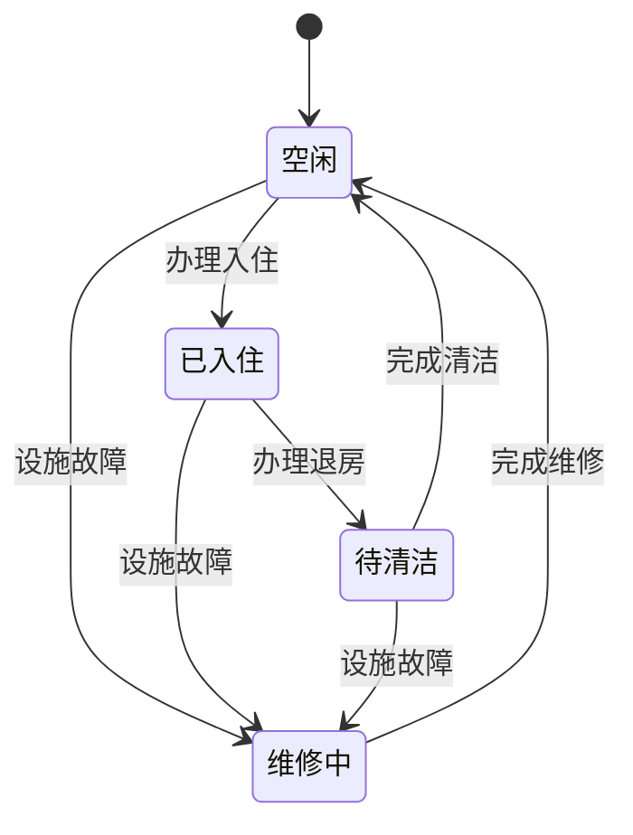

##  客房信息管理系统详细设计与具体代码实现

**作者：禅与计算机程序设计艺术**

## 1. 背景介绍

### 1.1 酒店管理的现状与挑战

随着旅游业的蓬勃发展和人们生活水平的提高，酒店行业近年来发展迅速。然而，传统的酒店管理模式已经难以满足日益增长的客户需求和激烈的市场竞争。传统的酒店管理模式主要依赖人工操作，存在着效率低下、易出错、信息不透明等问题。

### 1.2 客房信息管理系统的重要性

为了提高酒店管理效率、提升客户满意度、增强市场竞争力，越来越多的酒店开始采用信息化手段进行管理。客房信息管理系统作为酒店信息化管理的核心模块之一，扮演着至关重要的角色。

### 1.3 本文的目标和结构

本文旨在详细介绍客房信息管理系统的需求分析、系统设计、代码实现以及应用场景等方面的内容，为酒店管理者、软件开发人员以及对客房信息管理系统感兴趣的读者提供参考和借鉴。

## 2. 核心概念与联系

### 2.1 客房信息

客房信息是客房信息管理系统的核心数据，包括但不限于以下内容：

*   客房编号
*   客房类型
*   客房状态（空闲、已入住、待清洁等）
*   客房价格
*   客房设施
*   入住客人信息

### 2.2 用户角色

客房信息管理系统涉及的用户角色主要包括：

*   管理员：负责系统设置、用户管理、数据统计等操作。
*   前台接待员：负责办理入住登记、退房结算、客房预订等业务。
*   客房服务员：负责客房清洁、整理、维护等工作。

### 2.3 系统功能模块

客房信息管理系统主要包括以下功能模块：

*   系统管理模块：用户管理、角色权限管理、系统日志等。
*   客房管理模块：客房信息添加、修改、删除、查询、状态变更等。
*   预订管理模块：客房预订、取消预订、入住登记、退房结算等。
*   报表统计模块：客房入住率统计、收入统计等。

## 3. 核心算法原理具体操作步骤

### 3.1 客房状态管理算法

客房状态管理是客房信息管理系统的核心算法之一，其主要目的是实时跟踪和更新客房状态，为酒店前台接待员提供准确的客房信息。

#### 3.1.1 状态定义

客房状态一般分为以下几种：

*   空闲：客房已清洁完毕，可供客人入住。
*   已入住：客房已被客人入住。
*   待清洁：客人已退房，客房需要进行清洁。
*   维修中：客房设施出现故障，需要进行维修。

#### 3.1.2 状态转换规则

客房状态之间的转换规则如下：

*   空闲 -> 已入住：客人办理入住登记后，客房状态由“空闲”变更为“已入住”。
*   已入住 -> 待清洁：客人办理退房结算后，客房状态由“已入住”变更为“待清洁”。
*   待清洁 -> 空闲：客房服务员完成客房清洁后，客房状态由“待清洁”变更为“空闲”。
*   空闲/已入住/待清洁 -> 维修中：客房设施出现故障时，客房状态可由任意状态变更为“维修中”。
*   维修中 -> 空闲：客房设施维修完成后，客房状态由“维修中”变更为“空闲”。

#### 3.1.3 状态转换图



### 3.2 客房价格计算算法

客房价格计算算法是客房信息管理系统的另一个核心算法，其主要目的是根据客房类型、入住时间、预订渠道等因素计算客房价格。

#### 3.2.1 影响因素

影响客房价格的因素主要包括：

*   客房类型：不同类型的客房价格不同，例如标准间、豪华套房等。
*   入住时间：淡季和旺季的客房价格不同，周末和工作日的客房价格也可能不同。
*   预订渠道：酒店官网、第三方平台等不同预订渠道的客房价格可能不同。
*   会员等级：酒店会员可以享受不同的折扣优惠。

#### 3.2.2 计算公式

客房价格计算公式可以根据酒店的实际情况进行设置，例如：

```
客房价格 = 基础价格 + 浮动价格 - 优惠金额

其中：

*   基础价格：根据客房类型确定的固定价格。
*   浮动价格：根据入住时间、预订渠道等因素计算的动态价格。
*   优惠金额：根据会员等级、促销活动等因素计算的优惠金额。
```

## 4. 数学模型和公式详细讲解举例说明

### 4.1 客房入住率统计模型

客房入住率是衡量酒店经营状况的重要指标之一，其计算公式如下：

```
客房入住率 = 已入住客房数 / 可出租客房数 * 100%
```

**举例说明：**

假设某酒店共有100间客房，其中80间客房已入住，则该酒店的客房入住率为：

```
客房入住率 = 80 / 100 * 100% = 80%
```

### 4.2 客房平均出租率统计模型

客房平均出租率是指一段时间内酒店客房的平均出租情况，其计算公式如下：

```
客房平均出租率 = ∑(每日已出租客房数) / (统计天数 * 可出租客房数) * 100%
```

**举例说明：**

假设某酒店共有100间客房，统计最近7天的客房出租情况如下：

| 日期   | 已出租客房数 |
| :----- | :------------- |
| 第一天  | 80            |
| 第二天  | 85            |
| 第三天  | 90            |
| 第四天  | 75            |
| 第五天  | 80            |
| 第六天  | 90            |
| 第七天  | 85            |

则该酒店最近7天的客房平均出租率为：

```
客房平均出租率 = (80 + 85 + 90 + 75 + 80 + 90 + 85) / (7 * 100) * 100% = 83.57%
```

## 5. 项目实践：代码实例和详细解释说明

### 5.1 技术选型

*   编程语言：Java
*   数据库：MySQL
*   Web框架：Spring Boot
*   前端框架：Vue.js

### 5.2 数据库设计

```sql
-- 创建客房信息表
CREATE TABLE room (
  id INT PRIMARY KEY AUTO_INCREMENT,
  room_no VARCHAR(20) NOT NULL UNIQUE,
  room_type VARCHAR(20) NOT NULL,
  status VARCHAR(20) NOT NULL DEFAULT '空闲',
  price DECIMAL(10, 2) NOT NULL,
  remark VARCHAR(255)
);

-- 创建客人信息表
CREATE TABLE guest (
  id INT PRIMARY KEY AUTO_INCREMENT,
  name VARCHAR(50) NOT NULL,
  id_card VARCHAR(18) NOT NULL UNIQUE,
  phone VARCHAR(20) NOT NULL,
  remark VARCHAR(255)
);

-- 创建订单信息表
CREATE TABLE orders (
  id INT PRIMARY KEY AUTO_INCREMENT,
  room_id INT NOT NULL,
  guest_id INT NOT NULL,
  check_in_date DATE NOT NULL,
  check_out_date DATE NOT NULL,
  total_price DECIMAL(10, 2) NOT NULL,
  status VARCHAR(20) NOT NULL DEFAULT '未付款',
  remark VARCHAR(255),
  FOREIGN KEY (room_id) REFERENCES room(id),
  FOREIGN KEY (guest_id) REFERENCES guest(id)
);
```

### 5.3 代码实现

#### 5.3.1 客房管理模块

##### 5.3.1.1 客房信息添加

```java
@PostMapping("/rooms")
public Room addRoom(@RequestBody Room room) {
  return roomService.addRoom(room);
}
```

##### 5.3.1.2 客房信息修改

```java
@PutMapping("/rooms/{id}")
public Room updateRoom(@PathVariable Integer id, @RequestBody Room room) {
  return roomService.updateRoom(id, room);
}
```

##### 5.3.1.3 客房信息删除

```java
@DeleteMapping("/rooms/{id}")
public void deleteRoom(@PathVariable Integer id) {
  roomService.deleteRoom(id);
}
```

#### 5.3.2 预订管理模块

##### 5.3.2.1 客房预订

```java
@PostMapping("/orders")
public Order createOrder(@RequestBody Order order) {
  return orderService.createOrder(order);
}
```

##### 5.3.2.2  客房入住登记

```java
@PutMapping("/orders/{id}/check-in")
public Order checkIn(@PathVariable Integer id) {
  return orderService.checkIn(id);
}
```

##### 5.3.2.3 客房退房结算

```java
@PutMapping("/orders/{id}/check-out")
public Order checkOut(@PathVariable Integer id) {
  return orderService.checkOut(id);
}
```

## 6. 实际应用场景

### 6.1 酒店前台

酒店前台接待员可以使用客房信息管理系统进行客房预订、入住登记、退房结算等操作，提高工作效率和服务质量。

### 6.2 酒店客房部

酒店客房服务员可以使用客房信息管理系统查看客房清洁状态、更新客房状态等，方便快捷地完成客房清洁工作。

### 6.3 酒店管理层

酒店管理层可以使用客房信息管理系统查看客房入住率、收入统计等报表，了解酒店经营状况，为经营决策提供数据支持。

## 7. 总结：未来发展趋势与挑战

### 7.1 未来发展趋势

*   智能化：随着人工智能技术的不断发展，客房信息管理系统将会更加智能化，例如智能推荐客房、智能客服等。
*   移动化：随着移动互联网的普及，客房信息管理系统将会更加移动化，例如手机APP、微信小程序等。
*   数据化：客房信息管理系统将会更加注重数据分析，为酒店经营决策提供更加精准的数据支持。

### 7.2 面临的挑战

*   数据安全：客房信息管理系统存储着大量的客户隐私信息，如何保障数据安全是一个重要挑战。
*   系统集成：客房信息管理系统需要与酒店其他系统进行集成，例如财务系统、餐饮系统等，如何实现无缝集成是一个挑战。
*   用户体验：客房信息管理系统的用户体验至关重要，如何设计简洁易用的操作界面是一个挑战。

## 8. 附录：常见问题与解答

### 8.1 如何添加新客房？

1.  登录客房信息管理系统，进入“客房管理”模块。
2.  点击“添加客房”按钮，填写客房信息，例如客房编号、客房类型、客房价格等。
3.  点击“保存”按钮，完成客房添加。

### 8.2 如何修改客房信息？

1.  登录客房信息管理系统，进入“客房管理”模块。
2.  找到需要修改的客房信息，点击“修改”按钮。
3.  修改客房信息，例如客房类型、客房价格等。
4.  点击“保存”按钮，完成客房信息修改。

### 8.3 如何删除客房信息？

1.  登录客房信息管理系统，进入“客房管理”模块。
2.  找到需要删除的客房信息，点击“删除”按钮。
3.  在弹出的确认框中点击“确定”，完成客房信息删除。