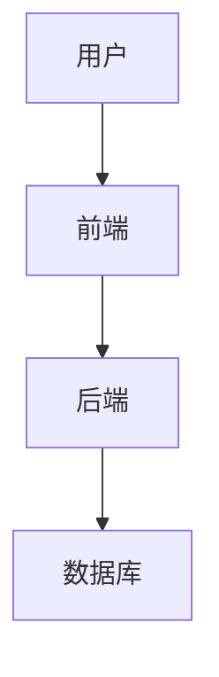
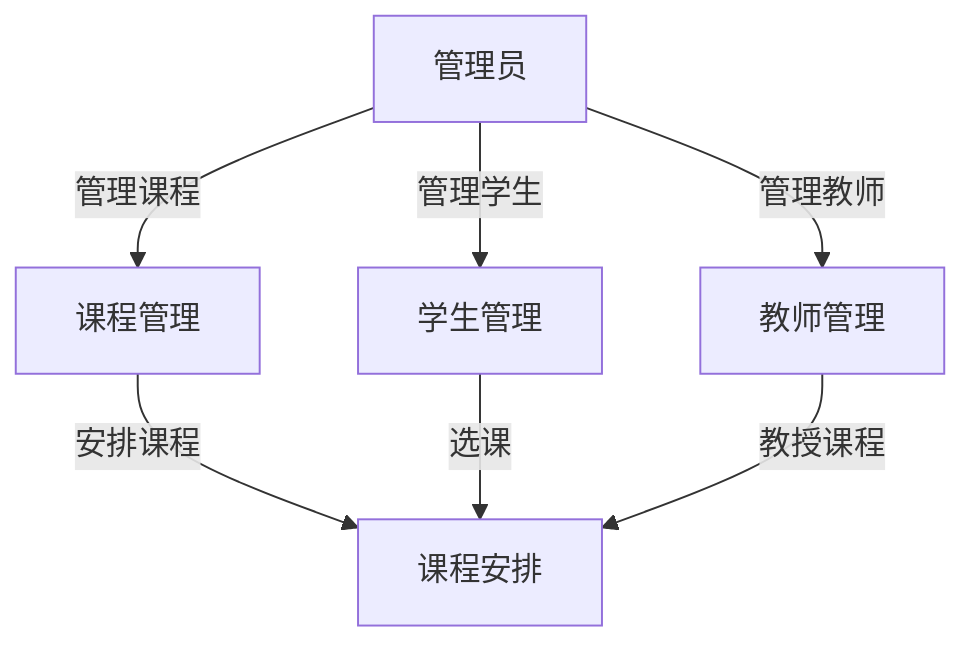

# 小型课程信息管理系统详细设计与具体代码实现

作者：禅与计算机程序设计艺术

## 1. 背景介绍

### 1.1 项目背景

在现代教育体系中，课程信息管理系统（Course Information Management System, CIMS）是一个至关重要的工具。它能够帮助教育机构有效地管理课程信息、学生信息、教师信息，以及课程安排等。随着教育规模的扩大和信息化需求的增加，开发一个高效、可靠的小型课程信息管理系统变得尤为重要。

### 1.2 需求分析

在设计和实现一个小型课程信息管理系统之前，首先需要明确系统的主要需求，包括但不限于以下几点：

- **课程管理**：包括课程的创建、修改、删除及查询。
- **学生管理**：包括学生信息的录入、修改、删除及查询。
- **教师管理**：包括教师信息的录入、修改、删除及查询。
- **课程安排**：包括课程时间、地点、教师和学生的安排。
- **用户权限管理**：不同用户（如管理员、教师、学生）需要有不同的权限。

### 1.3 技术选型

为了实现上述功能，本项目将采用以下技术：

- **前端**：HTML、CSS、JavaScript、React.js
- **后端**：Node.js、Express.js
- **数据库**：MongoDB
- **版本控制**：Git

## 2. 核心概念与联系

### 2.1 系统架构

小型课程信息管理系统的整体架构可以分为前端、后端和数据库三部分。前端负责用户界面的展示和交互，后端负责业务逻辑的处理和数据的管理，数据库负责数据的存储和检索。



### 2.2 数据模型

在设计数据模型时，需要考虑系统的各个实体及其关系。主要的实体包括课程、学生、教师和用户。

- **课程（Course）**：包含课程ID、课程名称、课程描述、教师ID等信息。
- **学生（Student）**：包含学生ID、姓名、年龄、性别、所选课程等信息。
- **教师（Teacher）**：包含教师ID、姓名、年龄、性别、教授课程等信息。
- **用户（User）**：包含用户ID、用户名、密码、角色等信息。

### 2.3 业务流程

系统的主要业务流程包括课程管理、学生管理、教师管理和课程安排。以下是一个简单的业务流程图：



## 3. 核心算法原理具体操作步骤

### 3.1 用户认证与权限管理

用户认证是系统安全的基础。我们采用JWT（JSON Web Token）进行用户认证和权限管理。具体步骤如下：

1. 用户登录时，系统验证用户名和密码。
2. 验证通过后，系统生成一个JWT，并将其返回给用户。
3. 用户在后续请求中携带该JWT，系统验证JWT的有效性和权限。

### 3.2 数据库操作

对于数据库操作，我们采用MongoDB作为数据库，使用Mongoose进行数据模型的定义和操作。以下是几个主要操作的具体步骤：

#### 3.2.1 创建课程

1. 接收前端发送的课程信息。
2. 验证课程信息的合法性。
3. 将课程信息存储到数据库中。

#### 3.2.2 查询课程

1. 接收前端发送的查询请求。
2. 根据查询条件从数据库中检索课程信息。
3. 将检索到的课程信息返回给前端。

### 3.3 课程安排算法

课程安排是系统的一个关键功能，涉及到多个约束条件，如课程时间冲突、教师时间冲突等。我们采用贪心算法进行课程安排，具体步骤如下：

1. 将所有课程按优先级排序。
2. 依次为每个课程分配时间和地点。
3. 检查分配的时间和地点是否满足所有约束条件。
4. 如果满足，则分配成功；否则，回溯并重新分配。

## 4. 数学模型和公式详细讲解举例说明

### 4.1 课程安排问题的数学模型

课程安排问题可以抽象为一个优化问题。设 $C = \{c_1, c_2, ..., c_n\}$ 表示所有课程的集合，$T = \{t_1, t_2, ..., t_m\}$ 表示所有时间段的集合，$R = \{r_1, r_2, ..., r_k\}$ 表示所有教室的集合。

目标是找到一个分配函数 $f: C \to T \times R$，使得所有约束条件都得到满足。

### 4.2 约束条件

1. 每个课程只能在一个时间段和一个教室进行：
   $$
   \forall c_i \in C, \exists (t_j, r_k) \in T \times R \text{ such that } f(c_i) = (t_j, r_k)
   $$

2. 同一时间段内，一个教室只能安排一门课程：
   $$
   \forall t_j \in T, \forall r_k \in R, \text{ if } f(c_i) = (t_j, r_k) \text{ and } f(c_l) = (t_j, r_k), \text{ then } c_i = c_l
   $$

3. 教师时间冲突约束：
   $$
   \forall t_j \in T, \forall t_l \in T, \text{ if } f(c_i) = (t_j, r_k) \text{ and } f(c_m) = (t_l, r_n) \text{ and } \text{teacher}(c_i) = \text{teacher}(c_m), \text{ then } t_j \neq t_l
   $$

### 4.3 举例说明

假设有三门课程 $C = \{c_1, c_2, c_3\}$，两个时间段 $T = \{t_1, t_2\}$，两个教室 $R = \{r_1, r_2\}$。我们需要为这三门课程安排时间和教室。

1. 初始状态：
   - $f(c_1) = ?$
   - $f(c_2) = ?$
   - $f(c_3) = ?$

2. 第一步，分配 $c_1$：
   - $f(c_1) = (t_1, r_1)$

3. 第二步，分配 $c_2$：
   - $f(c_2) = (t_1, r_2)$

4. 第三步，分配 $c_3$：
   - $f(c_3) = (t_2, r_1)$

最终结果是：
- $f(c_1) = (t_1, r_1)$
- $f(c_2) = (t_1, r_2)$
- $f(c_3) = (t_2, r_1)$

## 5. 项目实践：代码实例和详细解释说明

### 5.1 项目结构

项目采用前后端分离的架构，目录结构如下：

```
course-management-system/
├── backend/
│   ├── controllers/
│   ├── models/
│   ├── routes/
│   ├── app.js
│   ├── config.js
│   └── package.json
├── frontend/
│   ├── src/
│   ├── public/
│   ├── package.json
│   └── webpack.config.js
└── README.md
```

### 5.2 后端代码实现

#### 5.2.1 数据模型定义

在 `models` 目录下定义课程、学生、教师和用户的数据模型。以下是课程模型的示例代码：

```javascript
// models/Course.js
const mongoose = require('mongoose');

const courseSchema = new mongoose.Schema({
  courseId: { type: String, required: true, unique: true },
  name: { type: String, required: true },
  description: { type: String },
  teacherId: { type: mongoose.Schema.Types.ObjectId, ref: 'Teacher' },
  students: [{ type: mongoose.Schema.Types.ObjectId, ref: 'Student' }]
});

module.exports = mongoose.model('Course', courseSchema);
```

#### 5.2.2 控制器实现

在 `controllers` 目录下实现各个实体的业务逻辑。以下是课程控制器的示例代码：

```javascript
// controllers/courseController