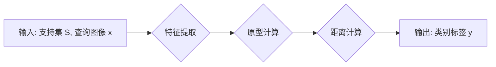

# 小样本语义分割：精细划分图像区域

作者：禅与计算机程序设计艺术

## 1. 背景介绍

### 1.1 图像分割的意义

图像分割是计算机视觉领域的一项基础性任务，其目标是将图像划分为多个具有语义意义的区域。这项技术在许多领域都有着广泛的应用，例如：

* **自动驾驶:**  识别道路、车辆、行人等，为车辆提供安全行驶的环境感知信息。
* **医疗影像分析:**  分割肿瘤、器官等，辅助医生进行诊断和治疗。
* **遥感图像分析:**  识别土地利用类型、水体、植被等，用于环境监测和资源管理。
* **工业检测:**  识别产品缺陷，提高产品质量和生产效率。

### 1.2 语义分割与实例分割

图像分割任务根据分割粒度的不同，可以分为语义分割和实例分割两种类型：

* **语义分割:**  对图像中的每个像素进行分类，为其分配一个预定义的类别标签，例如：人、车、树木等。
* **实例分割:**  不仅要对每个像素进行分类，还要区分同一类别的不同个体，例如：识别图像中的三个人，并分别用不同颜色标记出来。

### 1.3 小样本学习的兴起

传统的深度学习模型通常需要大量的标注数据才能取得良好的性能，而在许多实际应用场景中，获取大量的标注数据往往非常困难且成本高昂。为了解决这个问题，小样本学习应运而生。

小样本学习的目标是利用少量标注数据训练出能够泛化到新类别上的模型。近年来，小样本学习在图像分类、目标检测等领域取得了显著的进展，并逐渐应用于语义分割任务中。

## 2. 核心概念与联系

### 2.1 小样本语义分割

小样本语义分割是指在仅有少量标注数据的情况下，训练出能够对新类别进行语义分割的模型。

### 2.2 元学习

元学习是一种模拟人类学习方式的机器学习方法，其核心思想是“学习如何学习”。元学习模型通过学习大量不同任务的经验，从而具备快速适应新任务的能力。

### 2.3 度量学习

度量学习的目标是学习一个能够衡量样本之间相似度的度量函数。在小样本语义分割中，度量学习可以用于比较查询图像和支持集图像之间的相似度，从而将查询图像中的像素分类到正确的类别中。

## 3. 核心算法原理具体操作步骤

### 3.1 基于度量学习的小样本语义分割

基于度量学习的小样本语义分割方法通常包含以下步骤：

1. **特征提取:**  使用预训练的深度神经网络（例如：ResNet、VGG）提取查询图像和支持集图像的特征。
2. **原型生成:**  根据支持集图像的特征，生成每个类别的原型表示。
3. **相似度计算:**  计算查询图像特征与每个类别原型之间的相似度。
4. **像素分类:**  根据相似度得分，将查询图像中的每个像素分类到最相似的类别中。

### 3.2 具体算法示例：原型网络（Prototypical Networks）

原型网络是一种经典的基于度量学习的小样本学习算法，其核心思想是利用支持集图像的特征计算每个类别的原型表示，然后根据查询图像特征与原型之间的距离进行分类。

**操作步骤：**

1. **输入:**  一个包含 C 个类别的支持集 S，每个类别包含 K 个样本，以及一个查询图像 x。
2. **特征提取:**  使用预训练的深度神经网络提取支持集图像和查询图像的特征，分别表示为 $f(s_i)$ 和 $f(x)$。
3. **原型计算:**  计算每个类别的原型表示，即该类别所有样本特征的平均值：

$$
c_k = \frac{1}{K} \sum_{i: y_i = k} f(s_i)
$$

4. **距离计算:**  计算查询图像特征与每个类别原型之间的距离，例如欧氏距离：

$$
d(f(x), c_k) = \|f(x) - c_k\|_2
$$

5. **分类:**  将查询图像分类到距离最近的类别中：

$$
y = \arg\min_k d(f(x), c_k)
$$

### 3.3  Mermaid 流程图



## 4. 数学模型和公式详细讲解举例说明

### 4.1  交叉熵损失函数

在训练小样本语义分割模型时，通常使用交叉熵损失函数来衡量模型预测结果与真实标签之间的差异。

假设查询图像 $x$ 的真实标签为 $y$，模型预测的类别概率分布为 $\hat{y}$，则交叉熵损失函数可以表示为：

$$
L(y, \hat{y}) = -\sum_{i=1}^C y_i \log \hat{y}_i
$$

其中，$C$ 表示类别数量，$y_i$ 表示真实标签中第 $i$ 个类别的概率，$\hat{y}_i$ 表示模型预测的第 $i$ 个类别的概率。

**举例说明：**

假设有一个三分类问题，真实标签为 $[1, 0, 0]$，模型预测的类别概率分布为 $[0.8, 0.1, 0.1]$，则交叉熵损失函数的值为：

$$
\begin{aligned}
L(y, \hat{y}) &= -(1 \times \log 0.8 + 0 \times \log 0.1 + 0 \times \log 0.1) \\
&\approx 0.322
\end{aligned}
$$

### 4.2 Softmax 函数

Softmax 函数通常用于将模型输出的 logits 转换为概率分布。

假设模型输出的 logits 为 $z = [z_1, z_2, ..., z_C]$，则 Softmax 函数可以表示为：

$$
\hat{y}_i = \frac{\exp(z_i)}{\sum_{j=1}^C \exp(z_j)}
$$

其中，$\hat{y}_i$ 表示第 $i$ 个类别的概率。

**举例说明：**

假设模型输出的 logits 为 $[2, 1, 0]$，则 Softmax 函数的输出为：

$$
\begin{aligned}
\hat{y}_1 &= \frac{\exp(2)}{\exp(2) + \exp(1) + \exp(0)} \approx 0.731 \\
\hat{y}_2 &= \frac{\exp(1)}{\exp(2) + \exp(1) + \exp(0)} \approx 0.245 \\
\hat{y}_3 &= \frac{\exp(0)}{\exp(2) + \exp(1) + \exp(0)} \approx 0.024
\end{aligned}
$$

## 5. 项目实践：代码实例和详细解释说明

### 5.1 Python 代码示例

```python
import torch
import torch.nn as nn

class PrototypicalNetwork(nn.Module):
    def __init__(self, backbone, num_classes):
        super(PrototypicalNetwork, self).__init__()
        self.backbone = backbone
        self.num_classes = num_classes

    def forward(self, support_images, support_labels, query_images):
        # 特征提取
        support_features = self.backbone(support_images)
        query_features = self.backbone(query_images)

        # 原型计算
        prototypes = torch.zeros(self.num_classes, support_features.shape[1]).to(support_features.device)
        for i in range(self.num_classes):
            prototypes[i] = support_features[support_labels == i].mean(dim=0)

        # 距离计算
        distances = torch.cdist(query_features, prototypes)

        # 返回距离矩阵
        return distances
```

### 5.2 代码解释

* `backbone`:  用于提取图像特征的预训练深度神经网络。
* `num_classes`:  类别数量。
* `forward()`:  模型的前向传播函数。
    * `support_images`:  支持集图像。
    * `support_labels`:  支持集图像的标签。
    * `query_images`:  查询图像。
    * 该函数首先使用 `backbone` 提取支持集图像和查询图像的特征。
    * 然后，根据支持集图像的标签计算每个类别的原型表示。
    * 最后，计算查询图像特征与每个类别原型之间的距离，并返回距离矩阵。

## 6. 实际应用场景

### 6.1 医学影像分析

在医学影像分析领域，小样本语义分割可以用于分割肿瘤、器官等，辅助医生进行诊断和治疗。例如，可以使用小样本语义分割技术，利用少量标注数据训练出能够识别肺部结节的模型，从而辅助医生进行肺癌的早期诊断。

### 6.2 自动驾驶

在自动驾驶领域，小样本语义分割可以用于识别道路、车辆、行人等，为车辆提供安全行驶的环境感知信息。例如，可以使用小样本语义分割技术，利用少量标注数据训练出能够识别不同类型车辆的模型，从而提高自动驾驶系统的安全性。

### 6.3 遥感图像分析

在遥感图像分析领域，小样本语义分割可以用于识别土地利用类型、水体、植被等，用于环境监测和资源管理。例如，可以使用小样本语义分割技术，利用少量标注数据训练出能够识别不同类型农作物的模型，从而辅助农业生产管理。

## 7. 总结：未来发展趋势与挑战

### 7.1 未来发展趋势

* **更强大的特征表示:**  研究更强大的特征表示方法，例如：Transformer、图神经网络等，以提高模型的性能。
* **更有效的元学习算法:**  探索更有效的元学习算法，例如：基于优化的元学习、基于图的元学习等，以提高模型的泛化能力。
* **与其他技术的结合:**  将小样本语义分割与其他技术相结合，例如：弱监督学习、半监督学习等，以进一步提高模型的性能和效率。

### 7.2 面临的挑战

* **数据稀缺:**  小样本语义分割需要解决数据稀缺的问题，如何利用有限的数据训练出高性能的模型仍然是一个挑战。
* **模型泛化:**  小样本语义分割模型需要具备良好的泛化能力，能够对未见过的类别进行准确的分割。
* **计算效率:**  小样本语义分割模型的训练和推理效率需要进一步提高，以满足实时应用的需求。

## 8. 附录：常见问题与解答

### 8.1 什么是小样本学习？

小样本学习是指利用少量标注数据训练出能够泛化到新类别上的模型。

### 8.2 小样本语义分割与传统语义分割有什么区别？

传统语义分割通常需要大量的标注数据才能取得良好的性能，而小样本语义分割的目标是在仅有少量标注数据的情况下，训练出能够对新类别进行语义分割的模型。

### 8.3 小样本语义分割有哪些应用场景？

小样本语义分割在医学影像分析、自动驾驶、遥感图像分析等领域都有着广泛的应用。