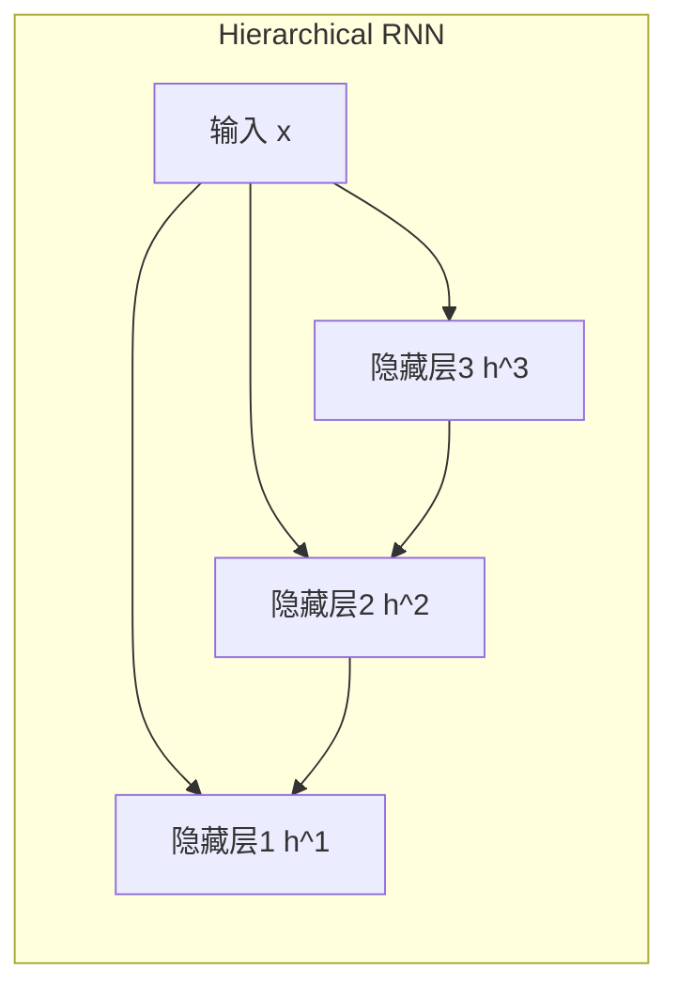
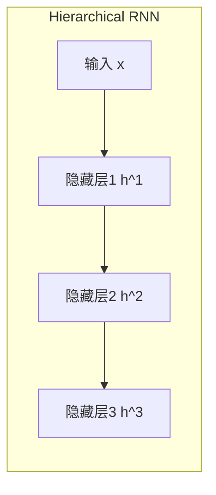

# 层次化RNN:捕捉层次结构信息

## 1.背景介绍

### 1.1 序列建模的重要性

在自然语言处理、语音识别、机器翻译等诸多领域中,序列建模扮演着关键角色。传统的机器学习模型如隐马尔可夫模型(HMM)和条件随机场(CRF)在处理定长序列时表现不错,但对于变长序列就力有未逮。循环神经网络(RNN)由于其递归特性,能够有效地对序列数据进行建模,成为序列建模的主流方法。

### 1.2 RNN在序列建模中的局限性  

尽管RNN在处理序列数据方面表现出色,但它仍然存在一些固有的缺陷和局限性:

1. **长期依赖问题**: 在很长的序列中,RNN难以有效捕捉远距离的依赖关系,会导致梯度消失或爆炸。
2. **缺乏层次结构建模**: 许多序列数据本身具有内在的层次结构,如自然语言的词、短语、句子和段落等层次。传统RNN将整个序列视为扁平的结构,无法很好地利用这些层次信息。
3. **缺乏结构化输出**: 有些任务需要生成具有内部结构的输出,如语法树、知识图谱等。传统RNN难以直接生成这种结构化输出。

为了解决上述问题,研究人员提出了层次化RNN(Hierarchical RNN)模型,试图更好地捕捉序列数据的层次结构信息。

## 2.核心概念与联系

### 2.1 层次化RNN的基本思想

层次化RNN的核心思想是将序列分解为多个层次,并在每个层次上使用RNN进行建模。通过这种分层建模方式,模型能够更好地捕捉序列数据内在的层次结构信息,从而提高模型的表现力。

### 2.2 层次化RNN与其他模型的关系

层次化RNN可以看作是以下几种模型的扩展和综合:

1. **RNN**: 层次化RNN在每个层次上都使用RNN作为基本建模单元。
2. **树形RNN**: 树形RNN将数据建模为树状结构,层次化RNN可以看作是一种扁平化的树形RNN。
3. **注意力机制**: 注意力机制赋予模型选择性关注输入的不同部分的能力,层次化RNN通过分层的方式达到类似的效果。
4. **生成式模型**: 层次化RNN可用于生成具有内部结构的输出,如语法树等。

通过融合以上模型的优点,层次化RNN期望能够更好地挖掘序列数据中的层次结构信息。

## 3.核心算法原理具体操作步骤

在介绍层次化RNN的具体算法之前,我们先定义一些符号:

- $\mathbf{x}_t$表示时刻t的输入向量
- $\mathbf{h}_t^l$表示第l层次上时刻t的隐藏状态向量
- $\mathbf{o}_t^l$表示第l层次上时刻t的输出向量

层次化RNN的核心思想是在每个层次上使用标准RNN单元(如LSTM或GRU)进行建模,同时层次之间通过一定的连接方式传递信息。根据层次之间信息流动的方向,可将层次化RNN分为两大类:自顶向下(top-down)和自底向上(bottom-up)。

### 3.1 自顶向下层次化RNN

在自顶向下层次化RNN中,高层次的隐藏状态将作为低层次的输入,信息自上而下流动。具体计算步骤如下:

1. 最顶层(第L层)的隐藏状态直接由输入计算:
   $$\mathbf{h}_t^L = \phi(\mathbf{W}^L\mathbf{x}_t + \mathbf{b}^L)$$
   其中$\phi$是非线性激活函数,如tanh或ReLU。

2. 中间层(第l层,L>l>1)的隐藏状态由上层隐藏状态和当前输入计算:
   $$\mathbf{h}_t^l = \text{RNN}(\mathbf{h}_{t-1}^l, [\mathbf{h}_t^{l+1};\mathbf{x}_t])$$
   即将上层隐藏状态$\mathbf{h}_t^{l+1}$与当前输入$\mathbf{x}_t$拼接,作为当前层RNN的输入。

3. 最底层(第1层)只由输入计算隐藏状态:
   $$\mathbf{h}_t^1 = \text{RNN}(\mathbf{h}_{t-1}^1, \mathbf{x}_t)$$
   
4. 在每一层次,可根据需要从隐藏状态计算输出:
   $$\mathbf{o}_t^l = \mathbf{W}_o^l\mathbf{h}_t^l + \mathbf{b}_o^l$$

上述计算过程可用以下公式统一表示:

$$\mathbf{h}_t^l = \begin{cases}
\phi(\mathbf{W}^L\mathbf{x}_t + \mathbf{b}^L) &\text{if }l=L\\
\text{RNN}(\mathbf{h}_{t-1}^l, [\mathbf{h}_t^{l+1};\mathbf{x}_t]) &\text{if }1<l<L\\
\text{RNN}(\mathbf{h}_{t-1}^1, \mathbf{x}_t) &\text{if }l=1
\end{cases}$$

自顶向下层次化RNN的计算图如下所示:

### 3.2 自底向上层次化RNN  

在自底向上层次化RNN中,低层次的隐藏状态将作为高层次的输入,信息自下而上流动。具体计算步骤如下:  

1. 最底层(第1层)的隐藏状态直接由输入计算:
   $$\mathbf{h}_t^1 = \text{RNN}(\mathbf{h}_{t-1}^1, \mathbf{x}_t)$$

2. 中间层(第l层,L>l>1)的隐藏状态由下层隐藏状态计算: 
   $$\mathbf{h}_t^l = \text{RNN}(\mathbf{h}_{t-1}^l, \mathbf{h}_t^{l-1})$$
   即将下层隐藏状态$\mathbf{h}_t^{l-1}$作为当前层RNN的输入。

3. 最顶层(第L层)的隐藏状态由最底层隐藏状态计算:
   $$\mathbf{h}_t^L = \text{RNN}(\mathbf{h}_{t-1}^L, \mathbf{h}_t^1)$$
   
4. 在每一层次,可根据需要从隐藏状态计算输出:
   $$\mathbf{o}_t^l = \mathbf{W}_o^l\mathbf{h}_t^l + \mathbf{b}_o^l$$

上述计算过程可用以下公式统一表示:  

$$\mathbf{h}_t^l = \begin{cases}
\text{RNN}(\mathbf{h}_{t-1}^1, \mathbf{x}_t) &\text{if }l=1\\
\text{RNN}(\mathbf{h}_{t-1}^l, \mathbf{h}_t^{l-1}) &\text{if }1<l\leq L\\
\end{cases}$$

自底向上层次化RNN的计算图如下所示:

自顶向下和自底向上层次化RNN的主要区别在于信息流动的方向。前者是将高层次信息传递到低层次,后者则是将低层次信息传递到高层次。在实际应用中,可根据具体任务的特点选择合适的层次化RNN结构。

## 4.数学模型和公式详细讲解举例说明

在前面的章节中,我们已经介绍了层次化RNN的核心计算步骤。现在让我们通过一个具体的例子,进一步解释层次化RNN模型中的数学表达式和公式。

### 4.1 问题描述

假设我们有一个具有层次结构的序列数据,包含单词(word)、短语(phrase)和句子(sentence)三个层次。我们的目标是对给定的句子序列进行建模和预测。为了简化说明,我们将使用自底向上的层次化RNN模型。

### 4.2 符号说明

- $\mathbf{x}_t^w$表示时刻t的单词输入向量
- $\mathbf{h}_t^w$表示单词层次的隐藏状态向量
- $\mathbf{h}_t^p$表示短语层次的隐藏状态向量  
- $\mathbf{h}_t^s$表示句子层次的隐藏状态向量
- $\mathbf{W}^w, \mathbf{W}^p, \mathbf{W}^s$分别表示单词、短语和句子层次的权重矩阵
- $\mathbf{b}^w, \mathbf{b}^p, \mathbf{b}^s$分别表示单词、短语和句子层次的偏置向量

### 4.3 模型计算过程

根据前面介绍的自底向上层次化RNN计算步骤,我们可以将本例中的模型计算过程描述为:

1. 单词层次:
   $$\mathbf{h}_t^w = \text{RNN}(\mathbf{h}_{t-1}^w, \mathbf{x}_t^w)$$
   
   这一层的隐藏状态直接由当前单词输入向量计算,可使用LSTM或GRU等RNN单元。

2. 短语层次:
   $$\mathbf{h}_t^p = \text{RNN}(\mathbf{h}_{t-1}^p, \mathbf{h}_t^w)$$
   
   这一层的隐藏状态由下层(单词层次)的隐藏状态计算。

3. 句子层次:
   $$\mathbf{h}_t^s = \text{RNN}(\mathbf{h}_{t-1}^s, \mathbf{h}_t^p)$$
   
   这一层的隐藏状态由下层(短语层次)的隐藏状态计算。

4. 输出计算:
   在每一层次,我们都可以根据需要从隐藏状态计算输出,例如:
   
   $$\mathbf{o}_t^w = \mathbf{W}^w\mathbf{h}_t^w + \mathbf{b}^w$$
   $$\mathbf{o}_t^p = \mathbf{W}^p\mathbf{h}_t^p + \mathbf{b}^p$$
   $$\mathbf{o}_t^s = \mathbf{W}^s\mathbf{h}_t^s + \mathbf{b}^s$$

通过以上计算过程,层次化RNN能够在不同的层次上捕捉序列数据的结构信息,从而提高模型的表现力。

### 4.4 示例计算

为了更好地理解层次化RNN的工作原理,我们给出一个简单的数值计算示例。假设我们有一个长度为3的单词序列"the"、"cat"和"sat",每个单词用一个one-hot向量表示,即:

$$\mathbf{x}_1^w = \begin{bmatrix}1\\0\\0\end{bmatrix}, \mathbf{x}_2^w = \begin{bmatrix}0\\1\\0\end{bmatrix}, \mathbf{x}_3^w = \begin{bmatrix}0\\0\\1\end{bmatrix}$$

我们使用一个单层LSTM作为RNN单元,并忽略偏置项,权重矩阵设为:

$$\mathbf{W}^w = \begin{bmatrix}
0.1 & 0.2 & 0.3\\
0.4 & 0.5 & 0.6\\
0.7 & 0.8 & 0.9
\end{bmatrix}$$

$$\mathbf{W}^p = \begin{bmatrix}
0.2 & 0.4 & 0.6\\
0.8 & 0.7 & 0.6\\
0.5 & 0.1 & 0.3
\end{bmatrix}$$

$$\mathbf{W}^s = \begin{bmatrix}
0.3 & 0.6 & 0.9\\
0.2 & 0.4 & 0.6\\
0.1 & 0