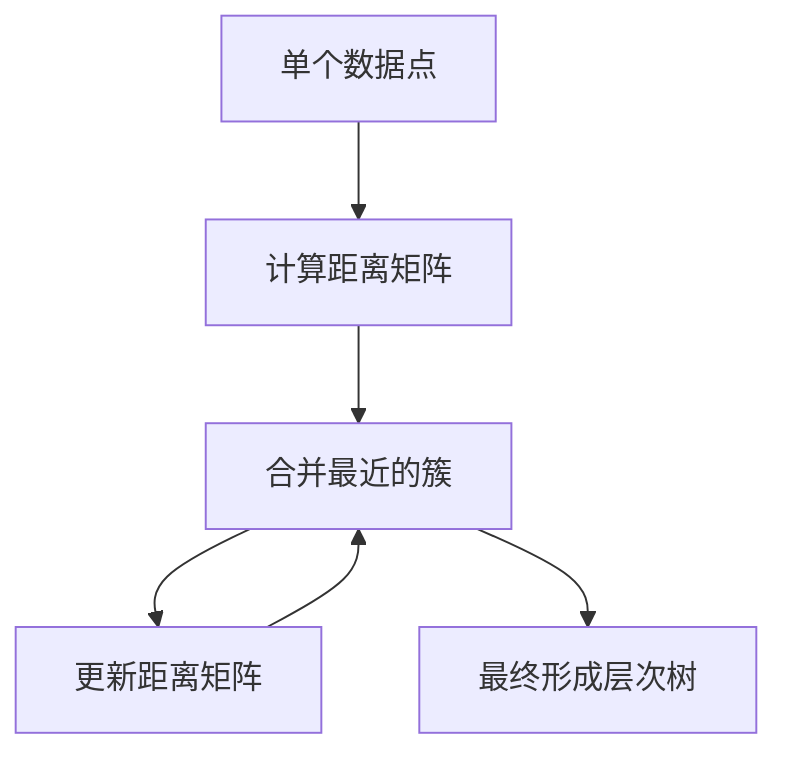

# 层次聚类：探索数据间的层次关系

作者：禅与计算机程序设计艺术

## 1. 背景介绍

### 1.1 数据聚类的意义
聚类分析是一种重要的无监督学习方法，通过将数据集划分为若干个组或簇，使得同一簇内的数据点彼此相似，而不同簇之间的数据点差异显著。它在数据挖掘、模式识别、图像分析等领域有广泛应用。层次聚类（Hierarchical Clustering）作为聚类分析的一种方法，通过构建层次树（dendrogram）来揭示数据点之间的层次关系。

### 1.2 层次聚类的分类
层次聚类主要分为两类：凝聚层次聚类（Agglomerative Hierarchical Clustering）和分裂层次聚类（Divisive Hierarchical Clustering）。前者从单个数据点开始，不断合并最近的簇；后者从整体数据集开始，不断将最不相似的簇分裂。

### 1.3 层次聚类的优势
层次聚类的最大优势在于其结果的可解释性。通过层次树，研究者可以直观地观察数据点的聚类过程，理解数据点之间的层次关系。此外，层次聚类不需要预先指定簇的数量，这使得它在探索性数据分析中具有重要作用。

## 2. 核心概念与联系

### 2.1 距离度量
距离度量是聚类分析的基础。在层次聚类中，常用的距离度量包括欧氏距离、曼哈顿距离、切比雪夫距离等。选择合适的距离度量对聚类结果有重要影响。

### 2.2 聚类准则
聚类准则决定了如何合并或分裂簇。常见的聚类准则包括最短距离法（Single Linkage）、最长距离法（Complete Linkage）、平均距离法（Average Linkage）和中心点法（Centroid Linkage）。不同的聚类准则会产生不同的层次树。

### 2.3 层次树（Dendrogram）
层次树是层次聚类的结果，通过树状图展示数据点的聚类过程。树的根节点代表整个数据集，叶节点代表单个数据点。通过截取层次树的不同层次，可以得到不同数量的簇。

## 3. 核心算法原理具体操作步骤

### 3.1 凝聚层次聚类算法

#### 3.1.1 初始状态
将每个数据点视为一个单独的簇。

#### 3.1.2 计算距离矩阵
计算所有簇之间的距离矩阵。初始时，距离矩阵的元素是数据点之间的距离。

#### 3.1.3 合并最近的簇
找到距离矩阵中距离最小的两个簇，将它们合并为一个新的簇。

#### 3.1.4 更新距离矩阵
根据选定的聚类准则，更新距离矩阵中与新簇相关的距离。

#### 3.1.5 重复步骤
重复步骤3.1.3和3.1.4，直到所有数据点合并为一个簇为止。



### 3.2 分裂层次聚类算法

#### 3.2.1 初始状态
将所有数据点视为一个簇。

#### 3.2.2 选择分裂点
根据选定的准则，选择一个簇进行分裂。

#### 3.2.3 更新距离矩阵
分裂簇后，重新计算距离矩阵。

#### 3.2.4 重复步骤
重复步骤3.2.2和3.2.3，直到每个数据点成为单独的簇为止。

## 4. 数学模型和公式详细讲解举例说明

### 4.1 距离度量公式

#### 4.1.1 欧氏距离
欧氏距离是最常用的距离度量，定义为两个点之间的直线距离。

$$
d(x, y) = \sqrt{\sum_{i=1}^{n} (x_i - y_i)^2}
$$

#### 4.1.2 曼哈顿距离
曼哈顿距离是两个点在各坐标轴上的绝对距离之和。

$$
d(x, y) = \sum_{i=1}^{n} |x_i - y_i|
$$

#### 4.1.3 切比雪夫距离
切比雪夫距离是两个点在各坐标轴上距离的最大值。

$$
d(x, y) = \max_{i} |x_i - y_i|
$$

### 4.2 聚类准则公式

#### 4.2.1 最短距离法
最短距离法定义两个簇之间的距离为簇中最近两个点之间的距离。

$$
d(A, B) = \min_{a \in A, b \in B} d(a, b)
$$

#### 4.2.2 最长距离法
最长距离法定义两个簇之间的距离为簇中最远两个点之间的距离。

$$
d(A, B) = \max_{a \in A, b \in B} d(a, b)
$$

#### 4.2.3 平均距离法
平均距离法定义两个簇之间的距离为簇中所有点对之间距离的平均值。

$$
d(A, B) = \frac{1}{|A||B|} \sum_{a \in A} \sum_{b \in B} d(a, b)
$$

#### 4.2.4 中心点法
中心点法定义两个簇之间的距离为簇中点的中心点之间的距离。

$$
d(A, B) = d(C_A, C_B)
$$

其中，$C_A$ 和 $C_B$ 分别为簇 A 和簇 B 的中心点。

### 4.3 示例说明

假设有四个数据点 $A, B, C, D$，其坐标分别为 $(1, 2), (2, 3), (3, 4), (5, 6)$。计算它们之间的欧氏距离矩阵如下：

$$
\begin{bmatrix}
0 & 1.41 & 2.83 & 5.66 \\
1.41 & 0 & 1.41 & 4.24 \\
2.83 & 1.41 & 0 & 2.83 \\
5.66 & 4.24 & 2.83 & 0 \\
\end{bmatrix}
$$

根据最短距离法，首先合并距离最小的两个点 $A$ 和 $B$，然后更新距离矩阵，重复这个过程直到所有点合并为一个簇。

## 4. 项目实践：代码实例和详细解释说明

### 4.1 Python实现层次聚类

#### 4.1.1 导入必要的库
```python
import numpy as np
import matplotlib.pyplot as plt
from scipy.cluster.hierarchy import dendrogram, linkage
```

#### 4.1.2 创建数据集
```python
data = np.array([[1, 2], [2, 3], [3, 4], [5, 6]])
```

#### 4.1.3 计算距离矩阵并进行层次聚类
```python
Z = linkage(data, method='single', metric='euclidean')
```

#### 4.1.4 绘制层次树
```python
plt.figure(figsize=(10, 7))
dendrogram(Z, labels=['A', 'B', 'C', 'D'])
plt.title("Dendrogram")
plt.xlabel("Data Points")
plt.ylabel("Distance")
plt.show()
```

### 4.2 代码解释

- `linkage` 函数用于计算数据点之间的层次关系，`method` 参数指定聚类准则，`metric` 参数指定距离度量。
- `dendrogram` 函数用于绘制层次树，通过 `labels` 参数指定数据点的标签。

## 5. 实际应用场景

### 5.1 生物信息学
在生物信息学中，层次聚类常用于基因表达数据分析。通过层次树，可以揭示基因之间的共表达关系，帮助研究者理解基因功能和调控机制。

### 5.2 图像处理
在图像处理领域，层次聚类用于图像分割和特征提取。通过层次树，可以将图像划分为不同的区域，帮助识别图像中的目标物