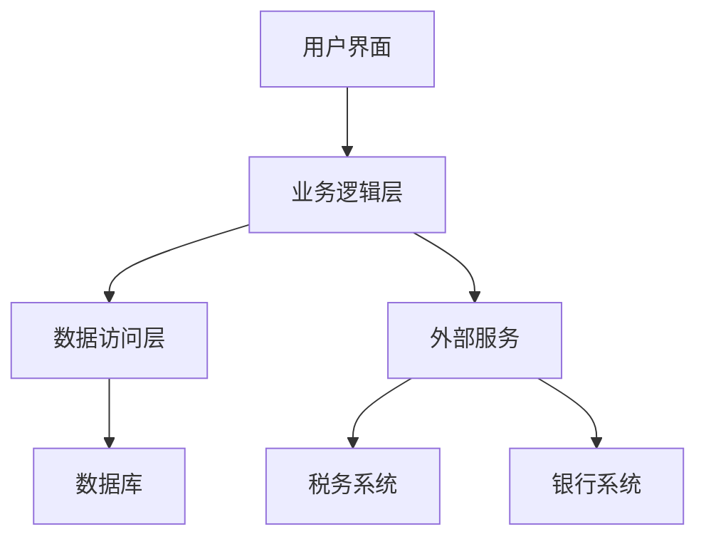

# 工资管理系统详细设计与具体代码实现

作者：禅与计算机程序设计艺术

## 1. 背景介绍

### 1.1 工资管理系统的意义

工资管理系统是企业人力资源管理中的核心模块，负责处理员工的薪资计算、发放和记录。一个高效的工资管理系统不仅可以提高企业的运营效率，还能确保薪资发放的准确性和及时性，减少人工操作带来的错误和工作量。

### 1.2 当前市场需求

随着企业规模的不断扩大和员工数量的增加，传统的手工工资管理方式已经难以满足需求。现代企业需要一个自动化、智能化的工资管理系统来处理复杂的薪资计算、税务处理和报表生成等任务。

### 1.3 设计目标

本项目的目标是设计并实现一个高效、可靠、可扩展的工资管理系统。系统应具备以下功能：
- 员工信息管理
- 工资计算与发放
- 税务处理
- 报表生成
- 用户权限管理

## 2. 核心概念与联系

### 2.1 系统架构

工资管理系统的整体架构设计如下：



### 2.2 模块划分

系统主要分为以下几个模块：
- 用户界面：提供友好的操作界面，供用户进行系统操作。
- 业务逻辑层：处理工资计算、税务处理等核心业务逻辑。
- 数据访问层：负责与数据库进行交互，存储和读取数据。
- 外部服务：与外部税务系统和银行系统进行交互，完成税务申报和工资发放。

### 2.3 数据库设计

数据库是工资管理系统的核心部分，负责存储员工信息、工资记录、税务数据等。数据库设计包括以下几个主要表：
- 员工表（Employee）
- 工资表（Salary）
- 税务表（Tax）
- 用户表（User）

## 3. 核心算法原理具体操作步骤

### 3.1 工资计算算法

工资计算是工资管理系统的核心功能，主要包括基本工资、加班工资、奖金、扣款等的计算。具体步骤如下：
1. 读取员工的基本信息和工资标准。
2. 计算基本工资。
3. 计算加班工资。
4. 计算奖金和其他津贴。
5. 计算扣款，如社保、公积金等。
6. 汇总计算应发工资和实发工资。

### 3.2 税务处理算法

税务处理主要包括个税计算和税务申报。具体步骤如下：
1. 读取员工的工资数据。
2. 根据国家税法计算个税。
3. 生成税务申报表。
4. 与税务系统进行交互，完成税务申报。

### 3.3 报表生成算法

报表生成主要包括工资单、税务报表、年度汇总报表等。具体步骤如下：
1. 读取相关数据。
2. 根据报表模板生成报表。
3. 将报表导出为PDF或Excel格式。

## 4. 数学模型和公式详细讲解举例说明

### 4.1 工资计算公式

工资计算涉及多个变量和公式，主要包括以下几个部分：

#### 基本工资计算
$$
基本工资 = 月基本工资
$$

#### 加班工资计算
$$
加班工资 = 加班小时数 \times 加班工资率
$$

#### 奖金计算
$$
奖金 = 绩效奖金 + 年终奖
$$

#### 社保和公积金扣款计算
$$
社保扣款 = 基本工资 \times 社保比例
$$
$$
公积金扣款 = 基本工资 \times 公积金比例
$$

#### 应发工资计算
$$
应发工资 = 基本工资 + 加班工资 + 奖金 - 社保扣款 - 公积金扣款
$$

#### 个税计算
个税计算较为复杂，需要根据国家税法进行分段计算。假设税率表如下：

| 税率 | 起征点 | 速算扣除数 |
| --- | --- | --- |
| 3% | 0 | 0 |
| 10% | 3000 | 210 |
| 20% | 12000 | 1410 |
| 25% | 25000 | 2660 |
| 30% | 35000 | 4410 |
| 35% | 55000 | 7160 |
| 45% | 80000 | 15160 |

个税计算公式为：
$$
应纳税所得额 = 应发工资 - 起征点
$$
$$
个税 = 应纳税所得额 \times 税率 - 速算扣除数
$$

#### 实发工资计算
$$
实发工资 = 应发工资 - 个税
$$

### 4.2 举例说明

假设某员工的月基本工资为10000元，加班小时数为10小时，加班工资率为50元/小时，绩效奖金为2000元，年终奖为5000元，社保比例为10%，公积金比例为5%。

根据上述公式计算：

1. 基本工资：10000元
2. 加班工资：10 \times 50 = 500元
3. 奖金：2000 + 5000 = 7000元
4. 社保扣款：10000 \times 10\% = 1000元
5. 公积金扣款：10000 \times 5\% = 500元
6. 应发工资：10000 + 500 + 7000 - 1000 - 500 = 16000元
7. 应纳税所得额：16000 - 3000 = 13000元
8. 个税：13000 \times 10\% - 210 = 1090元
9. 实发工资：16000 - 1090 = 14910元

## 5. 项目实践：代码实例和详细解释说明

### 5.1 系统环境配置

在开始代码实现之前，需要配置开发环境。本文以Python和Django框架为例，进行工资管理系统的实现。

#### 环境依赖
- Python 3.8+
- Django 3.2+
- MySQL 5.7+

#### 安装步骤
1. 安装Python和Django：
    ```bash
    pip install django
    ```
2. 安装MySQL：
    ```bash
    sudo apt-get install mysql-server
    ```

### 5.2 数据库模型设计

#### 员工模型
```python
from django.db import models

class Employee(models.Model):
    employee_id = models.AutoField(primary_key=True)
    name = models.CharField(max_length=100)
    position = models.CharField(max_length=100)
    base_salary = models.DecimalField(max_digits=10, decimal_places=2)
    hire_date = models.DateField()

    def __str__(self):
        return self.name
```

#### 工资模型
```python
class Salary(models.Model):
    salary_id = models.AutoField(primary_key=True)
    employee = models.ForeignKey(Employee, on_delete=models.CASCADE)
    month = models.DateField()
    base_salary = models.DecimalField(max_digits=10, decimal_places=2)
    overtime_hours = models.DecimalField(max_digits=5, decimal_places=2)
    overtime_pay = models.DecimalField(max_digits=10, decimal_places=2)
    bonus = models.DecimalField(max_digits=10, decimal_places=2)
    deductions = models.DecimalField(max_digits=10, decimal_places=2)
    tax = models.DecimalField(max_digits=10, decimal_places=2)
    net_salary = models.DecimalField(max_digits=10, decimal_places=2)

    def __str__(self):
        return f"{self.employee.name} - {self.month}"
```

### 5.3 工资计算代码实现

#### 工资计算函数
```python
def calculate_salary(employee, overtime_hours, bonus):
    base_salary = employee.base_salary
    overtime_pay = overtime_hours * 50  # 假设加班工资率为50元/小时
    deductions = base_salary * 0.15  # 假设社保和公积金总扣款比例为15%
    gross_salary = base_salary + overtime_pay + bonus - deductions

    # 计算个税
    taxable_income = gross_salary - 3000  # 假设起征点为3000元
    if taxable_income <= 0:
        tax = 0
    elif taxable_income <= 12000:
        tax = taxable_income * 0.03
    elif taxable_income <= 25000:
        tax = taxable_income * 0.10 - 210
    elif taxable_income <= 35000:
        tax = taxable_income * 0.20 - 1410
    elif taxable_income <= 550