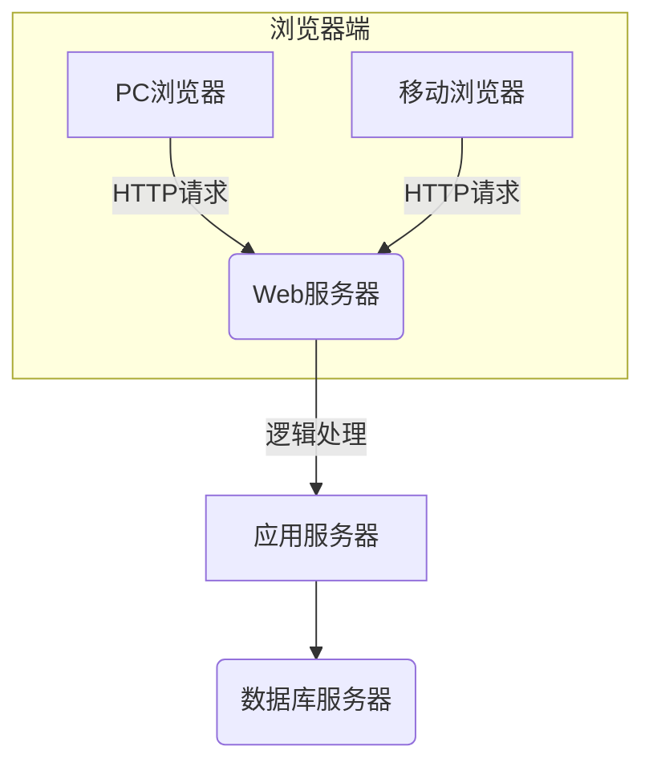
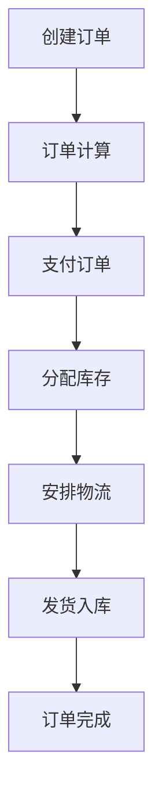

# 建材销售管理系统详细设计与具体代码实现

## 1. 背景介绍

### 1.1 建材销售行业概况

建材销售行业是一个巨大的市场,涉及房地产建筑、装修装饰、基础设施等多个领域。随着城镇化进程的加快和基础设施投资的持续增长,建材销售市场需求旺盛。然而,传统的建材销售模式存在诸多痛点:

- 信息不对称,买家难以及时获取全面的建材信息
- 供需错配,建材生产商难以精准把握市场需求
- 物流配送低效,导致时间成本和运输成本较高
- 缺乏数字化管理,业务流程效率低下

因此,构建一套高效的建材销售管理系统,对于提高行业运营效率、降低交易成本、优化供应链管理具有重要意义。

### 1.2 系统定位

本文重点介绍一种基于B2B模式的建材销售管理系统,旨在打造一个线上线下相结合的建材销售平台。系统主要面向建材供应商、工程商、建筑公司等企业客户,为其提供集采购、销售、物流、财务等多功能于一体的一站式服务。

通过该系统,供应商可以线上展示建材产品,高效获取订单;买家可以方便比价、下单,掌握全面的建材信息;同时系统将优化物流配送,提升运营效率。

## 2. 核心概念与联系

### 2.1 系统架构

建材销售管理系统采用B/S架构,包括:

- 浏览器端:为用户提供操作界面,可在PC或移动端访问
- Web服务器:负责处理HTTP请求,如接收用户输入,返回网页等
- 应用服务器:负责业务逻辑处理,如订单计算、库存管理等
- 数据库服务器:存储系统所有数据,如用户信息、产品数据等



### 2.2 核心功能模块

系统的核心功能模块包括:

1. **用户管理**:实现注册、登录、权限管理等基础功能
2. **产品管理**:建材供应商维护产品信息,包括产品上架、修改、下架等
3. **订单管理**:买家下单、支付,系统处理订单并安排物流配送
4. **库存管理**:自动计算并更新建材库存,为订单分配库存
5. **物流管理**:集成物流服务商接口,高效处理订单配送
6. **财务管理**:实现应收应付功能,方便财务核算
7. **数据分析**:提供多维度的报表,辅助决策

## 3. 核心算法原理具体操作步骤

### 3.1 订单处理流程

订单处理是系统的核心流程,包括下列步骤:

1. **创建订单**:买家根据需求在线下单,选择建材种类、数量、收货地址等
2. **订单计算**:系统自动计算订单总金额、运费等费用
3. **支付订单**:买家完成支付
4. **分配库存**:系统从供应商处获取符合条件的库存,为订单分配库存
5. **安排物流**:系统自动与物流服务商对接,安排订单配送
6. **发货入库**:订单发货后,系统更新库存
7. **订单完成**:买家确认收货后,订单流程结束



### 3.2 库存分配算法

库存分配是订单处理的关键环节,系统需要从供应商处获取满足条件的库存。考虑到运输成本、时效性等因素,算法将优先选择距离买家最近、库存充足的供应商。

假设有N个供应商,M种建材,算法步骤如下:

1. 计算每个供应商到买家的距离$d_i(1 \le i \le N)$
2. 对每种建材,找到距离最近且库存充足的前K个供应商集合$S_j(1 \le j \le M)$
3. 在$S_j$中,按距离从近到远的顺序,依次分配所需建材库存,直至满足订单需求

该算法的时间复杂度为$O(N \log N + M \times K \log K)$,能较为高效地完成库存分配。

## 4. 数学模型和公式详细讲解举例说明

### 4.1 运输成本模型

合理的运输方案对于控制成本至关重要。我们建立如下运输成本模型:

设有N个供应商,M个收货地,运输成本由两部分组成:
1. 固定运输成本$c_0$,即承运商的基础收费
2. 变动运输成本$c_1$,与运输距离$d$和货物重量$w$成正比:

$$c_1 = \alpha d + \beta w$$

其中$\alpha,\beta$是系数。

则从供应商$i$运送货物到收货地$j$的总运输成本为:

$$C_{ij} = c_0 + \alpha d_{ij} + \beta w_{ij}$$

在实际应用中,我们可以通过优化算法求解$\min \sum_{i=1}^{N}\sum_{j=1}^{M}C_{ij}$,得到最优运输方案。

### 4.2 供应商评分模型

为提高服务质量,系统需要对供应商进行评分,筛选出优质供应商。我们建立如下评分模型:

设有N个供应商,评分由多个维度构成,如产品质量$q$、配送时效$t$、服务态度$s$等,则供应商$i$的总评分为:

$$\text{score}_i = \sum_{j=1}^{M}w_j \cdot f_j(x_{ij})$$

其中:
- $M$是评分维度总数
- $x_{ij}$是供应商$i$在第$j$个维度上的原始分数
- $f_j$是一个标准化函数,将原始分数$x_{ij}$映射到$[0,1]$区间内
- $w_j$是第$j$个维度的权重,满足$\sum_{j=1}^{M}w_j=1$

通过这一模型,系统可以计算出每个供应商的总评分,并根据评分进行排序、优选,从而提升供应链质量。

## 4. 项目实践:代码实例和详细解释说明 

### 4.1 订单处理模块

订单处理模块是系统的核心部分,我们以Java语言为例,展示其中的关键代码。

#### 4.1.1 订单创建

```java
// Order.java
public class Order {
    private String id;
    private User buyer;
    private List<OrderItem> items;
    // ...
}

// OrderItem.java 
public class OrderItem {
    private Product product;
    private int quantity;
    private double unitPrice;
    // ...
}

// OrderService.java
public class OrderService {
    public Order createOrder(User buyer, List<OrderItem> items) {
        Order order = new Order();
        order.setBuyer(buyer);
        order.setItems(items);
        // 计算订单总金额等
        return orderRepo.save(order);
    }
}
```

在创建订单时,需要获取买家信息、订单明细,并初始化一个Order对象。

#### 4.1.2 订单计算

```java
// OrderService.java
public double calculateTotal(Order order) {
    double total = 0;
    for (OrderItem item : order.getItems()) {
        total += item.getQuantity() * item.getUnitPrice();
    }
    // 计算运费等其他费用
    return total;
}
```

订单计算阶段,需要遍历订单明细,计算订单总金额、运费等费用。

#### 4.1.3 支付订单

```java
// PaymentService.java
public PaymentResult makePayment(Order order) {
    // 调用第三方支付接口,完成支付流程
    boolean success = callPaymentGateway(order);
    if (success) {
        order.setStatus(OrderStatus.PAID);
        return new PaymentResult(true, "");
    } else {
        return new PaymentResult(false, "Payment failed");
    }
}
```

支付订单时,需要与第三方支付机构对接,完成支付流程。支付成功后,更新订单状态。

#### 4.1.4 分配库存

```java
// InventoryService.java
public void allocateInventory(Order order) {
    List<OrderItem> items = order.getItems();
    for (OrderItem item : items) {
        Product product = item.getProduct();
        int quantity = item.getQuantity();
        // 根据距离、库存等因素选择最佳供应商
        Supplier bestSupplier = findBestSupplier(product, quantity);
        // 从供应商处分配库存
        allocate(bestSupplier, product, quantity);
    }
}
```

分配库存时,需要遍历订单明细,对每种建材,根据一定算法选择最佳供应商,并从供应商处分配所需库存。

### 4.2 库存管理模块

库存管理模块负责管理供应商的建材库存,包括入库、出库等操作。

```java
// Inventory.java
public class Inventory {
    private Supplier supplier;
    private Product product;
    private int quantity;
    // ...
}

// InventoryRepo.java
public interface InventoryRepo extends JpaRepository<Inventory, Long> {
    List<Inventory> findBySupplierAndProduct(Supplier supplier, Product product);
}

// InventoryService.java
@Service
public class InventoryService {
    
    @Autowired
    private InventoryRepo inventoryRepo;

    public void addInventory(Supplier supplier, Product product, int quantity) {
        Inventory inv = inventoryRepo.findBySupplierAndProduct(supplier, product)
                .orElse(new Inventory(supplier, product, 0));
        inv.setQuantity(inv.getQuantity() + quantity);
        inventoryRepo.save(inv);
    }

    public void removeInventory(Supplier supplier, Product product, int quantity) {
        Inventory inv = inventoryRepo.findBySupplierAndProduct(supplier, product)
                .orElseThrow(() -> new InventoryException("No inventory found"));
        if (inv.getQuantity() < quantity) {
            throw new InventoryException("Insufficient inventory");
        }
        inv.setQuantity(inv.getQuantity() - quantity);
        inventoryRepo.save(inv);
    }
}
```

在这个示例中:

- `Inventory`实体类表示一个供应商对应一种产品的库存
- `InventoryRepo`是一个Spring Data JPA Repository,用于存取库存数据
- `InventoryService`提供了添加库存和移除库存的方法

入库时,如果该供应商对应产品已有库存记录,则更新数量;否则创建新记录。出库时,需要先检查库存是否足够,然后减少相应数量。

通过这种方式,我们可以高效管理庞大的建材库存。

## 5. 实际应用场景

建材销售管理系统可广泛应用于建筑工程、装修装饰等领域,为建材供应商、工程商等企业提供高效的采购和销售渠道。

### 5.1 建筑工程应用场景

在大型建筑工程中,承包商需要大量采购各类建材,如钢材、水泥、砖块等。传统的采购模式效率低下,很难及时掌握全面的建材信息。

通过建材销售管理系统,承包商可以:

- 一站式比价采购,快速找到优质供应商
- 精准查看建材库存,避免断货延误工期
- 在线下单、支付,提高工作效率
- 优化物流方案,降低运输成本

该系统可以显著提升建筑工程的采购效率,控制材料成本,保证工程按期完工。

### 5.2 装修装饰应用场景

家装公司在进行房屋装修时,需要采购瓷砖、木地板、厨卫洁具等装修材料。由于装修材料种类繁多,采购过程往往效率低下。

借助建材销售管理系统,家装公司可以:

- 在线挑选心仪的装修材料,浏览产品展示
- 快速获取报价,比较不同供应商的价格
- 线上下单、支付,提高工作效率
- 掌握物流状态,确保装修材料按时到货

该系统可以简化家装公司的采购流程,提供多元化的装修材料选择,缩短装修周期,提升客户体验。

## 6. 工具和资源推荐

### 6.1 开发工具

在开发建材销售管理系统时,可以使用以下工具:

- **Java**:系统主要编程