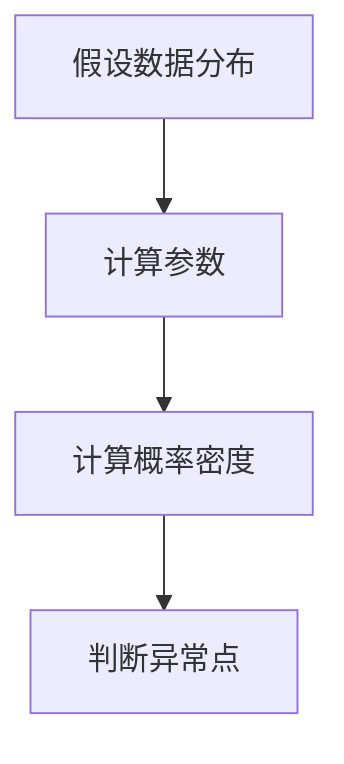
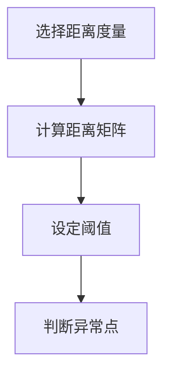
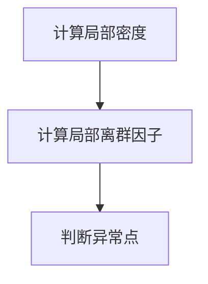
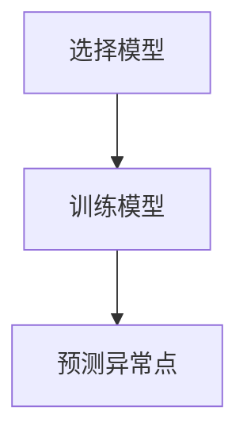

# 异常检测：处理噪声数据

作者：禅与计算机程序设计艺术

## 1. 背景介绍

### 1.1 异常检测的重要性

在当今数据驱动的世界中，异常检测（Anomaly Detection）在许多领域中扮演着至关重要的角色。无论是金融领域的欺诈检测、网络安全中的入侵检测，还是工业设备的故障预测，异常检测都能帮助我们及时发现潜在问题并采取相应措施。随着数据量的爆炸式增长，如何在大量数据中高效、准确地检测出异常点，成为了一个备受关注的研究课题。

### 1.2 噪声数据的挑战

在实际应用中，数据往往并不完美，常常包含各种噪声。这些噪声可能来自于数据采集过程中的误差、传输过程中的干扰，或者是由于数据本身的复杂性和多样性。噪声数据的存在给异常检测带来了极大的挑战，因为它们可能会掩盖真正的异常点，或者导致误报。因此，如何有效地处理噪声数据，是异常检测中的一个关键问题。

### 1.3 文章结构

本文将深入探讨异常检测在处理噪声数据中的方法和技术。我们将从核心概念出发，介绍几种常见的异常检测算法，并详细讲解其原理和操作步骤。接着，我们会通过数学模型和公式进行详细说明，并结合实际项目实例展示代码实现。最后，我们将讨论这些方法的实际应用场景，推荐一些常用的工具和资源，并展望未来的发展趋势与挑战。

## 2. 核心概念与联系

### 2.1 异常检测的定义

异常检测是指在数据集中识别出与大多数数据显著不同的数据点的过程。这些异常点通常被认为是潜在的错误、欺诈行为、故障或其他感兴趣的事件。

### 2.2 噪声数据的定义

噪声数据是指那些不符合预期模式的数据点，它们可能是由于各种原因引入的，如采集误差、传输干扰等。在异常检测中，噪声数据往往会干扰算法的正常运行，使得检测结果不准确。

### 2.3 异常与噪声的区别

虽然异常和噪声在某些情况下可能看起来相似，但它们有着本质的区别。异常是指那些具有实际意义的异常点，而噪声则是那些无意义的、随机的误差数据。有效的异常检测方法需要能够区分这两者，以提高检测的准确性。

### 2.4 异常检测与噪声处理的联系

在处理噪声数据时，异常检测与噪声处理往往是紧密结合的。通过有效的噪声处理技术，可以提高异常检测的精度。而通过异常检测，可以识别出那些可能是噪声的数据点，从而进一步优化数据质量。

## 3. 核心算法原理具体操作步骤

### 3.1 基于统计的方法

#### 3.1.1 算法原理

基于统计的方法是最早期的异常检测方法之一。这类方法通常假设数据服从某种已知的概率分布，通过计算数据点的概率密度来判断其是否为异常点。

#### 3.1.2 具体操作步骤

1. **假设数据分布**：假设数据服从某种已知的概率分布，如正态分布。
2. **计算参数**：根据数据计算分布的参数，如均值和标准差。
3. **计算概率密度**：对每个数据点，计算其在该分布下的概率密度。
4. **判断异常点**：设定阈值，低于该阈值的点被认为是异常点。

### 3.2 基于距离的方法

#### 3.2.1 算法原理

基于距离的方法通过计算数据点之间的距离来判断异常点。常见的距离度量包括欧几里得距离、曼哈顿距离等。

#### 3.2.2 具体操作步骤

1. **选择距离度量**：选择合适的距离度量，如欧几里得距离。
2. **计算距离矩阵**：计算所有数据点之间的距离矩阵。
3. **设定阈值**：根据距离矩阵设定阈值，超过该阈值的点被认为是异常点。

### 3.3 基于密度的方法

#### 3.3.1 算法原理

基于密度的方法通过计算数据点周围的密度来判断异常点。常见的方法包括LOF（Local Outlier Factor）等。

#### 3.3.2 具体操作步骤

1. **计算局部密度**：对每个数据点，计算其局部密度。
2. **计算局部离群因子**：根据局部密度计算局部离群因子。
3. **判断异常点**：设定阈值，超过该阈值的点被认为是异常点。

### 3.4 基于机器学习的方法

#### 3.4.1 算法原理

基于机器学习的方法通过训练模型来识别异常点。常见的方法包括支持向量机（SVM）、孤立森林（Isolation Forest）等。

#### 3.4.2 具体操作步骤

1. **选择模型**：选择合适的机器学习模型，如SVM、孤立森林。
2. **训练模型**：使用正常数据训练模型。
3. **预测异常点**：使用训练好的模型对新数据进行预测，识别异常点。

## 4. 数学模型和公式详细讲解举例说明

### 4.1 基于统计的方法

#### 4.1.1 正态分布模型

假设数据服从正态分布，可以使用以下公式计算概率密度：

$$
f(x) = \frac{1}{\sqrt{2\pi\sigma^2}} e^{-\frac{(x-\mu)^2}{2\sigma^2}}
$$

其中，$\mu$ 是均值，$\sigma$ 是标准差。

#### 4.1.2 示例

假设我们有一组数据，均值为10，标准差为2。对于一个数据点$x=15$，其概率密度为：

$$
f(15) = \frac{1}{\sqrt{2\pi \cdot 2^2}} e^{-\frac{(15-10)^2}{2 \cdot 2^2}}
$$

计算得：

$$
f(15) \approx 0.008
$$

如果设定阈值为0.01，则$x=15$ 被认为是异常点。

### 4.2 基于距离的方法

#### 4.2.1 欧几里得距离

欧几里得距离的计算公式为：

$$
d(x, y) = \sqrt{\sum_{i=1}^n (x_i - y_i)^2}
$$

其中，$x$ 和 $y$ 是两个数据点，$n$ 是数据的维度。

#### 4.2.2 示例

假设我们有两个数据点 $x = (1, 2)$ 和 $y = (4, 6)$，其欧几里得距离为：

$$
d(x, y) = \sqrt{(1-4)^2 + (2-6)^2} = \sqrt{9 + 16} = 5
$$

如果设定阈值为4，则 $x$ 和 $y$ 之间的距离超过了阈值，可以认为其中一个点是异常点。

### 4.3 基于密度的方法

#### 4.3.1 LOF（Local Outlier Factor）

LOF的计算涉及以下几个步骤：

1. **计算k距离**：对于每个数据点，找到其最近的k个邻居，计算k距离。
2. **计算局部可达密度**：对于每个数据点，计算其局部可达密度。
3. **计算局部离群因子**：对于每个数据点，计算其局部离群因子。

局部可达密度的计算公式为：

$$
LRD_k(p) = \frac{1