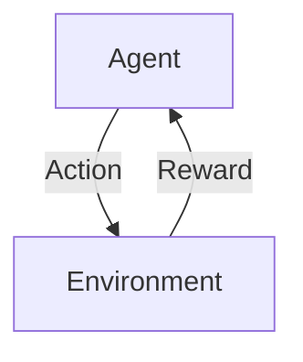

# 强化学习：未来人工智能法规的挑战

作者：禅与计算机程序设计艺术

## 1. 背景介绍

### 1.1 人工智能的发展现状

人工智能（AI）技术在过去的几十年中取得了显著的进展。从早期的专家系统到如今的深度学习和强化学习，AI已经在多个领域展现出其强大的能力。特别是强化学习（Reinforcement Learning, RL），作为一种能够在复杂环境中自主学习和决策的技术，正在引领新一代智能系统的发展。

### 1.2 强化学习的基本概念

强化学习是一种通过与环境的交互来学习策略的机器学习方法。其核心在于智能体（Agent）通过试错（Trial and Error）来获得最大化累积奖励（Cumulative Reward）的策略。与监督学习不同，强化学习不需要预先标注的数据，而是通过与环境的动态交互来学习。

### 1.3 强化学习在AI中的重要性

强化学习在许多领域中展现了其独特的优势，例如机器人控制、游戏AI、自动驾驶等。其能够在复杂和动态的环境中进行自主学习和决策，使得它成为未来智能系统的关键技术之一。然而，随着强化学习技术的广泛应用，相关的法规和伦理问题也逐渐浮出水面。

## 2. 核心概念与联系

### 2.1 强化学习的基本框架

强化学习的基本框架包括四个主要部分：智能体（Agent）、环境（Environment）、动作（Action）和奖励（Reward）。智能体在环境中执行动作，环境根据动作反馈奖励，智能体根据奖励调整策略。



### 2.2 马尔可夫决策过程（MDP）

强化学习通常基于马尔可夫决策过程（Markov Decision Process, MDP）进行建模。MDP由状态集（States）、动作集（Actions）、状态转移函数（State Transition Function）和奖励函数（Reward Function）组成。MDP的目标是找到一个策略，使得累积奖励最大化。

### 2.3 策略和价值函数

策略（Policy）是智能体在每个状态下选择动作的规则。价值函数（Value Function）用于评估每个状态的好坏，通常包括状态价值函数（State Value Function）和动作价值函数（Action Value Function）。

## 3. 核心算法原理具体操作步骤

### 3.1 值迭代和策略迭代

值迭代（Value Iteration）和策略迭代（Policy Iteration）是解决MDP的两种基本方法。值迭代通过更新价值函数来找到最优策略，而策略迭代则通过交替更新策略和价值函数来收敛到最优策略。

#### 3.1.1 值迭代算法步骤

1. 初始化价值函数 $V(s)$ 为任意值。
2. 对于每个状态 $s$，更新 $V(s)$ 为：
   $$
   V(s) = \max_a \sum_{s'} P(s'|s, a) [R(s, a, s') + \gamma V(s')]
   $$
3. 重复步骤2，直到价值函数收敛。

#### 3.1.2 策略迭代算法步骤

1. 初始化策略 $\pi(s)$ 为任意值。
2. 改进策略 $\pi(s)$，使得：
   $$
   \pi(s) = \arg\max_a \sum_{s'} P(s'|s, a) [R(s, a, s') + \gamma V(s')]
   $$
3. 评估策略 $\pi(s)$，计算价值函数 $V(s)$。
4. 重复步骤2和3，直到策略收敛。

### 3.2 Q学习和SARSA

Q学习和SARSA是两种常用的无模型强化学习算法。Q学习通过更新动作价值函数 $Q(s, a)$ 来找到最优策略，而SARSA则通过更新状态-动作对的价值来进行学习。

#### 3.2.1 Q学习算法步骤

1. 初始化 $Q(s, a)$ 为任意值。
2. 在每个时间步 $t$：
   1. 选择动作 $a$，根据 $\epsilon$-贪婪策略。
   2. 执行动作 $a$，观察奖励 $r$ 和下一个状态 $s'$。
   3. 更新 $Q(s, a)$：
      $$
      Q(s, a) \leftarrow Q(s, a) + \alpha [r + \gamma \max_{a'} Q(s', a') - Q(s, a)]
      $$
   4. 将状态更新为 $s \leftarrow s'$。
3. 重复步骤2，直到收敛。

#### 3.2.2 SARSA算法步骤

1. 初始化 $Q(s, a)$ 为任意值。
2. 在每个时间步 $t$：
   1. 选择动作 $a$，根据 $\epsilon$-贪婪策略。
   2. 执行动作 $a$，观察奖励 $r$ 和下一个状态 $s'$。
   3. 选择下一个动作 $a'$，根据 $\epsilon$-贪婪策略。
   4. 更新 $Q(s, a)$：
      $$
      Q(s, a) \leftarrow Q(s, a) + \alpha [r + \gamma Q(s', a') - Q(s, a)]
      $$
   5. 将状态更新为 $s \leftarrow s'$ 和 $a \leftarrow a'$。
3. 重复步骤2，直到收敛。

## 4. 数学模型和公式详细讲解举例说明

### 4.1 马尔可夫决策过程（MDP）的数学定义

一个马尔可夫决策过程可以用五元组 $(S, A, P, R, \gamma)$ 来表示：

- $S$：状态集
- $A$：动作集
- $P$：状态转移概率矩阵
- $R$：奖励函数
- $\gamma$：折扣因子

状态转移概率 $P(s'|s, a)$ 表示在状态 $s$ 执行动作 $a$ 后转移到状态 $s'$ 的概率。奖励函数 $R(s, a, s')$ 表示在状态 $s$ 执行动作 $a$ 并转移到状态 $s'$ 所获得的奖励。折扣因子 $\gamma$ 表示未来奖励的权重。

### 4.2 值迭代的数学推导

值迭代算法的核心是贝尔曼方程（Bellman Equation），其数学形式为：

$$
V(s) = \max_a \sum_{s'} P(s'|s, a) [R(s, a, s') + \gamma V(s')]
$$

通过反复迭代更新价值函数 $V(s)$，可以收敛到最优价值函数 $V^*(s)$。最优策略 $\pi^*(s)$ 可以通过以下公式得到：

$$
\pi^*(s) = \arg\max_a \sum_{s'} P(s'|s, a) [R(s, a, s') + \gamma V^*(s')]
$$

### 4.3 Q学习的数学推导

Q学习算法的核心是Q值的更新公式：

$$
Q(s, a) \leftarrow Q(s, a) + \alpha [r + \gamma \max_{a'} Q(s', a') - Q(s, a)]
$$

其中，$\alpha$ 是学习率，$\gamma$ 是折扣因子，$r$ 是即时奖励，$s'$ 是下一个状态，$a'$ 是在状态 $s'$ 下选择的动作。通过不断更新Q值，最终可以收敛到最优Q值 $Q^*(s, a)$，从而得到最优策略：

$$
\pi^*(s) = \arg\max_a Q^*(s, a)
```

## 5. 项目实践：代码实例和详细解释说明

### 5.1 环境设置和依赖安装

在进行强化学习项目实践之前，需要安装一些必要的依赖库，例如 `numpy`、`gym` 和 `tensorflow` 或 `pytorch`。以下是安装这些依赖的命令：

```bash
pip install numpy gym tensorflow
```

### 5.2 Q学习算法的实现

以下是一个简单的Q学习算法在OpenAI Gym环境中的实现示例：

```python
import gym
import numpy as np

env = gym.make('FrozenLake-v0')
n_states = env.observation_space.n
n_actions = env.action_space.n

Q = np.zeros((n_states, n_actions))
alpha = 0.1
gamma = 0.99
epsilon = 0.1
n_episodes = 1000

for episode in range(n_episodes):
    state = env.reset()
    done = False
    
    while