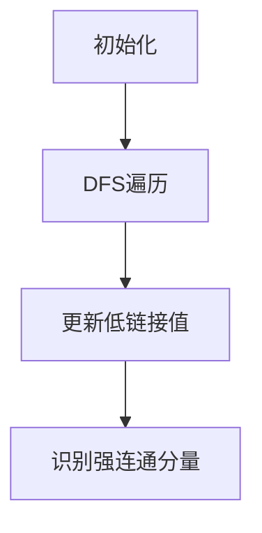
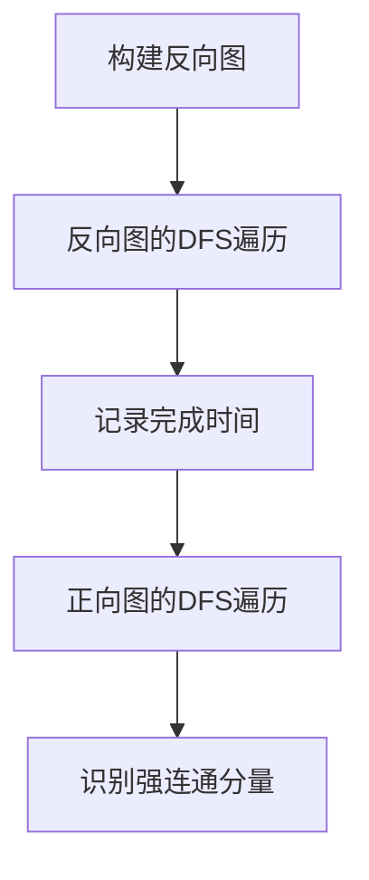

# 强连通分量算法的常见问题解答

作者：禅与计算机程序设计艺术

## 1. 背景介绍

在计算机科学和图论中，强连通分量（Strongly Connected Components, SCC）是有向图中的一个重要概念。它在许多实际应用中扮演着关键角色，如网络分析、社交网络分析、网页排名算法等。强连通分量的识别和分析可以帮助我们更好地理解图的结构和性质，从而在实际应用中做出更明智的决策。

### 1.1 什么是强连通分量

在一个有向图中，如果一个子图中的任意两个顶点之间都存在路径（无论路径的方向如何），那么这个子图就是一个强连通分量。换句话说，在强连通分量中，每个顶点都可以通过有向路径到达其他任意顶点。

### 1.2 强连通分量的应用

强连通分量在许多领域中都有广泛的应用，包括但不限于：

- **网络分析**：在社交网络中，强连通分量可以帮助识别紧密联系的用户群体。
- **网页排名**：如Google的PageRank算法中，强连通分量用于识别网页之间的互联关系。
- **编译器优化**：在程序控制流图中，强连通分量用于识别循环和优化代码块。

## 2. 核心概念与联系

### 2.1 有向图与强连通分量

有向图（Directed Graph）是由顶点和有向边组成的图结构。强连通分量是有向图中的子图，满足任意两个顶点之间都存在路径。

### 2.2 强连通分量与弱连通分量

弱连通分量（Weakly Connected Component）是将有向图中的所有有向边视为无向边后形成的连通分量。相比之下，强连通分量更严格，因为它要求路径的方向性。

### 2.3 强连通分量与拓扑排序

拓扑排序是对有向无环图（DAG）进行排序，使得对于图中的每一条有向边 $(u, v)$，顶点 $u$ 在顶点 $v$ 之前。强连通分量可以帮助识别图中的循环，从而帮助我们将图转化为DAG进行拓扑排序。

## 3. 核心算法原理具体操作步骤

### 3.1 Tarjan算法

Tarjan算法是一种经典的强连通分量算法，基于深度优先搜索（DFS）实现。该算法的时间复杂度为 $O(V + E)$，其中 $V$ 是顶点数，$E$ 是边数。

#### 3.1.1 算法步骤

1. **初始化**：为每个顶点分配一个唯一的索引，并初始化低链接值。
2. **DFS遍历**：从任意一个未访问的顶点开始进行DFS遍历。
3. **更新低链接值**：在DFS过程中，更新每个顶点的低链接值。
4. **识别强连通分量**：当发现一个强连通分量时，将其从栈中弹出。



### 3.2 Kosaraju算法

Kosaraju算法也是一种用于查找强连通分量的经典算法，同样具有 $O(V + E)$ 的时间复杂度。该算法分为两个主要步骤：

1. **反向图的DFS遍历**：对原图的反向图进行DFS遍历，并记录顶点的完成时间。
2. **正向图的DFS遍历**：按照完成时间的逆序对原图进行DFS遍历，识别强连通分量。

#### 3.2.1 算法步骤

1. **构建反向图**：将原图中的所有边反向。
2. **反向图的DFS遍历**：对反向图进行DFS遍历，并记录顶点的完成时间。
3. **正向图的DFS遍历**：按照完成时间的逆序对原图进行DFS遍历，识别强连通分量。



## 4. 数学模型和公式详细讲解举例说明

### 4.1 强连通分量的数学定义

在一个有向图 $G = (V, E)$ 中，强连通分量 $C$ 是满足以下条件的顶点子集：

$$
\forall u, v \in C, \exists \text{路径} \, u \rightarrow v \, \text{和} \, v \rightarrow u
$$

### 4.2 Tarjan算法的数学描述

Tarjan算法使用DFS遍历图，并维护两个数组：索引数组和低链接数组。索引数组记录每个顶点的DFS访问次序，低链接数组记录每个顶点能够访问到的最早的顶点。

$$
\text{LowLink}(v) = \min(\text{Index}(v), \text{LowLink}(w))
$$

其中 $w$ 是 $v$ 的后继顶点。

### 4.3 Kosaraju算法的数学描述

Kosaraju算法的核心思想是利用反向图的DFS遍历结果来指导正向图的DFS遍历。具体步骤如下：

1. 构建反向图 $G^R = (V, E^R)$，其中 $E^R$ 是将 $E$ 中的每条边反向后的集合。
2. 对 $G^R$ 进行DFS遍历，记录每个顶点的完成时间。
3. 按照完成时间的逆序对 $G$ 进行DFS遍历，识别强连通分量。

## 5. 项目实践：代码实例和详细解释说明

### 5.1 Tarjan算法的实现

以下是Python实现的Tarjan算法：

```python
class TarjanSCC:
    def __init__(self, graph):
        self.graph = graph
        self.index = 0
        self.stack = []
        self.indices = {}
        self.lowlink = {}
        self.on_stack = {}
        self.sccs = []

    def run(self):
        for node in self.graph:
            if node not in self.indices:
                self.strong_connect(node)
        return self.sccs

    def strong_connect(self, node):
        self.indices[node] = self.index
        self.lowlink[node] = self.index
        self.index += 1
        self.stack.append(node)
        self.on_stack[node] = True

        for neighbor in self.graph[node]:
            if neighbor not in self.indices:
                self.strong_connect(neighbor)
                self.lowlink[node] = min(self.lowlink[node], self.lowlink[neighbor])
            elif self.on_stack[neighbor]:
                self.lowlink[node] = min(self.lowlink[node], self.indices[neighbor])

        if self.lowlink[node] == self.indices[node]:
            scc = []
            while True:
                w = self.stack.pop()
                self.on_stack[w] = False
                scc.append(w)
                if w == node:
                    break
            self.sccs.append(scc)

# 示例使用
graph = {
    'A': ['B'],
    'B': ['C', 'E', 'F'],
    'C': ['D', 'G'],
    'D': ['C', 'H'],
    'E': ['A', 'F'],
    'F': ['G'],
    'G': ['F'],
    'H': ['D', 'G']
}

tarjan = TarjanSCC(graph)
print(tarjan.run())
```

### 5.2 Kosaraju算法的实现

以下是Python实现的Kosaraju算法：

```python
from collections import defaultdict

class KosarajuSCC:
    def __init__(self, graph):
        self.graph = graph
        self.reversed_graph = defaultdict(list)
        self.visited = set()
        self.stack = []
        self.sccs = []

    def reverse_graph(self):
        for src in self.graph:
            for dest in self.graph[src]:
                self.reversed_graph[dest].append(src)

    def fill_order(self, node):
        self.visited.add(node)
        for neighbor in self.graph[node]:
            if neighbor not in self.visited:
                self.fill_order(neighbor)
        self.stack.append(node)

    def dfs(self, graph, node, scc):
        self.visited.add(node)
        scc.append(node)
        for neighbor in graph[node]:
            if neighbor not in self.visited:
                self.dfs(graph, neighbor, scc)

    def run(self):
        for node in self.graph:
            if node