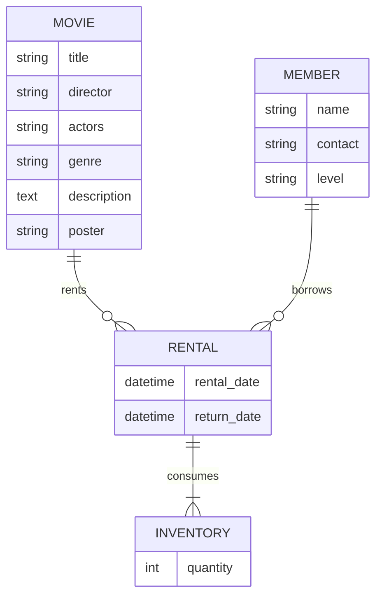

## 1. 背景介绍

### 1.1 影片租赁行业现状

随着互联网和流媒体技术的快速发展，传统的影片租赁行业正面临着前所未有的挑战。消费者越来越倾向于选择便捷、多样化的在线流媒体服务，而传统的线下租赁店则面临着客流量下降、运营成本上升等问题。

### 1.2 影片租赁系统的设计目标

为了应对市场变化，提升竞争力，开发一套高效、稳定的影片租赁系统势在必行。该系统应具备以下目标：

*   **用户友好**:  系统界面简洁易用，用户可以方便地浏览影片信息、租赁影片、归还影片等。
*   **功能完善**: 系统应提供影片信息管理、会员管理、租赁管理、库存管理、统计报表等功能，满足影片租赁业务的各种需求。
*   **安全可靠**: 系统应具备完善的安全机制，保障用户信息和交易安全。
*   **易于维护**: 系统应采用模块化设计，易于扩展和维护。

## 2. 核心概念与联系

### 2.1 系统架构

本系统采用经典的三层架构设计，即表现层、业务逻辑层和数据访问层，各层之间相互独立，职责清晰。

*   **表现层**: 负责用户界面展示和用户交互，可以使用Web技术实现。
*   **业务逻辑层**: 负责处理业务逻辑，例如会员注册、影片租赁、库存管理等。
*   **数据访问层**: 负责与数据库交互，进行数据的增删改查操作。

### 2.2 核心实体

系统中涉及的几个核心实体包括：

*   **影片**: 包含影片名称、导演、演员、类型、简介、海报等信息。
*   **会员**: 包含会员姓名、联系方式、会员等级、租赁记录等信息。
*   **租赁**: 记录每次租赁的影片、会员、租赁时间、归还时间等信息。
*   **库存**: 记录每部影片的库存数量。

### 2.3 实体关系图



## 3. 核心算法原理具体操作步骤

### 3.1 影片租赁流程

1.  会员登录系统。
2.  会员浏览影片信息，选择要租赁的影片。
3.  系统检查影片库存，如果库存充足，则生成租赁订单。
4.  会员支付租金。
5.  系统扣减影片库存，更新租赁订单状态。
6.  会员归还影片。
7.  系统检查影片是否损坏，更新库存和租赁订单状态。

### 3.2 库存管理

系统采用先进先出（FIFO）的原则进行库存管理，即先入库的影片先出租。当影片归还时，系统会自动将影片添加到库存队列的末尾。

## 4. 数学模型和公式详细讲解举例说明

本系统不涉及复杂的数学模型和公式。

## 5. 项目实践：代码实例和详细解释说明

### 5.1 技术选型

*   后端语言: Python
*   Web框架: Django
*   数据库: MySQL
*   ORM框架: Django ORM

### 5.2 代码示例

#### 5.2.1 models.py

```python
from django.db import models

class Movie(models.Model):
    title = models.CharField(max_length=255)
    director = models.CharField(max_length=255)
    actors = models.CharField(max_length=255)
    genre = models.CharField(max_length=255)
    description = models.TextField()
    poster = models.ImageField(upload_to='posters/')

    def __str__(self):
        return self.title

class Member(models.Model):
    name = models.CharField(max_length=255)
    contact = models.CharField(max_length=255)
    level = models.CharField(max_length=255)

    def __str__(self):
        return self.name

class Rental(models.Model):
    movie = models.ForeignKey(Movie, on_delete=models.CASCADE)
    member = models.ForeignKey(Member, on_delete=models.CASCADE)
    rental_date = models.DateTimeField(auto_now_add=True)
    return_date = models.DateTimeField(null=True, blank=True)

    def __str__(self):
        return f"{self.movie} rented by {self.member}"

class Inventory(models.Model):
    movie = models.OneToOneField(Movie, on_delete=models.CASCADE)
    quantity = models.IntegerField(default=0)

    def __str__(self):
        return f"{self.movie} inventory: {self.quantity}"
```

#### 5.2.2 views.py

```python
from django.shortcuts import render, redirect, get_object_or_404
from .models import Movie, Member, Rental, Inventory

def index(request):
    movies = Movie.objects.all()
    return render(request, 'index.html', {'movies': movies})

def movie_detail(request, movie_id):
    movie = get_object_or_404(Movie, pk=movie_id)
    return render(request, 'movie_detail.html', {'movie': movie})

def rent_movie(request, movie_id):
    movie = get_object_or_404(Movie, pk=movie_id)
    inventory = Inventory.objects.get(movie=movie)
    if inventory.quantity > 0:
        inventory.quantity -= 1
        inventory.save()
        # 创建租赁记录
        rental = Rental(movie=movie, member=request.user)
        rental.save()
        return redirect('rental_list')
    else:
        return redirect('movie_detail', movie_id=movie_id)

def return_movie(request, rental_id):
    rental = get_object_or_404(Rental, pk=rental_id)
    rental.return_date = timezone.now()
    rental.save()
    # 增加库存
    inventory = Inventory.objects.get(movie=rental.movie)
    inventory.quantity += 1
    inventory.save()
    return redirect('rental_list')
```

## 6. 实际应用场景

*   **线下影片租赁店**: 可以使用该系统管理影片信息、会员信息、租赁信息、库存信息等，提高运营效率。
*   **在线影片租赁平台**: 可以使用该系统构建在线影片租赁平台，为用户提供在线影片租赁服务。
*   **企业内部影片库**: 可以使用该系统管理企业内部的影片资源，方便员工借阅。

## 7. 工具和资源推荐

*   **Django**: Python Web框架，提供了开发Web应用所需的各种组件。
*   **MySQL**: 关系型数据库管理系统，性能优异，使用广泛。
*   **Bootstrap**: 前端框架，提供了丰富的UI组件和样式，可以快速构建美观的Web界面。

## 8. 总结：未来发展趋势与挑战

### 8.1 未来发展趋势

*   **云计算**: 影片租赁系统可以部署到云平台上，实现弹性扩展和按需付费。
*   **大数据**: 可以利用大数据技术分析用户行为，推荐个性化影片。
*   **人工智能**: 可以使用人工智能技术实现影片自动分类、内容审核等功能。

### 8.2 面临的挑战

*   **版权保护**: 如何有效保护影片版权是一个重要问题。
*   **市场竞争**: 在线流媒体平台的竞争日益激烈，影片租赁系统需要不断创新才能保持竞争力。
*   **用户体验**: 影片租赁系统需要不断提升用户体验，才能吸引更多用户。

## 9. 附录：常见问题与解答

### 9.1 如何注册会员？

用户可以在系统首页点击“注册”按钮，填写相关信息即可注册成为会员。

### 9.2 如何租赁影片？

会员登录系统后，可以浏览影片列表，选择要租赁的影片，点击“租赁”按钮，系统会自动生成租赁订单。

### 9.3 如何归还影片？

会员可以在“我的租赁”页面查看已租赁的影片，点击“归还”按钮，系统会自动处理影片归还流程。