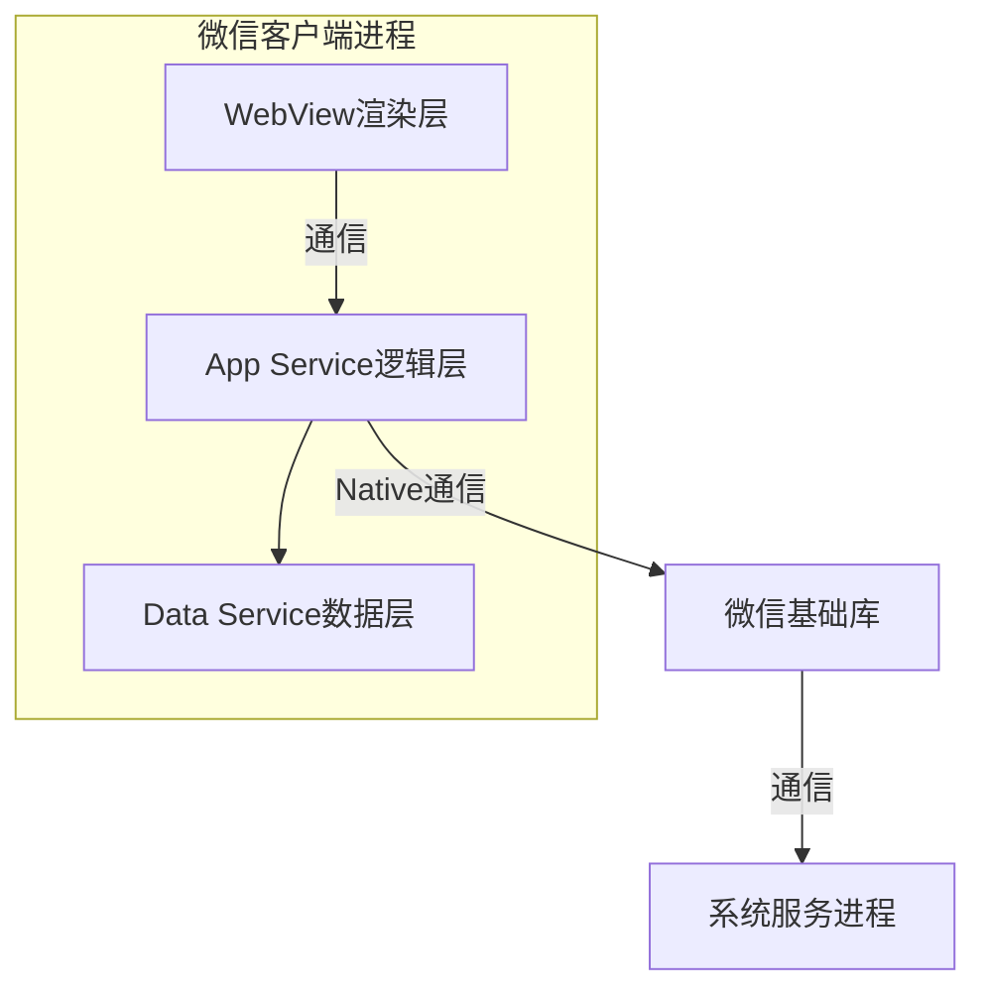
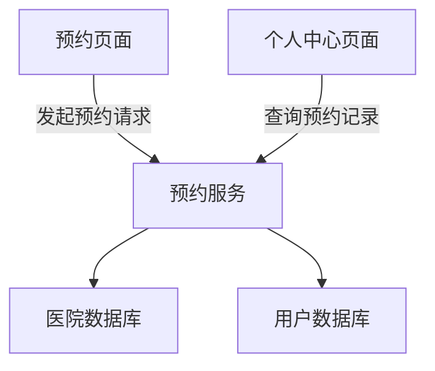

# 微信小程序健康体检预约

## 1.背景介绍

### 1.1 健康体检的重要性

健康是人类生存和发展的基础,定期进行健康体检对于及时发现潜在健康风险、监测身体状况、预防疾病至关重要。然而,传统的体检预约方式存在诸多不便,如需要拨打电话预约、现场排队等候等问题,给人们的生活带来诸多不便。

### 1.2 移动互联网时代的到来

随着移动互联网技术的飞速发展,智能手机已经深入到每个人的生活。移动应用程序(App)为人们获取信息和服务提供了极大便利。微信作为国内应用最广泛的移动社交应用,其开放的小程序生态为解决传统预约模式痛点提供了新的机遇。

### 1.3 微信小程序的优势

微信小程序是一种全新的连接用户与服务的技术手段,具有无需安装、极快渲染、可低功耗运行等优势。用户可通过扫一扫或者微信内搜索小程序即可快速获取服务,操作便捷,为健康体检预约提供了崭新的解决方案。

## 2.核心概念与联系

### 2.1 微信小程序架构

微信小程序采用了全新的软件架构,包括了渲染层(WebView)、逻辑层(App Service)、数据层(Data Service)等部分,通过系统服务进程与微信客户端通信。整体架构如下:



### 2.2 微信小程序开发模式

微信小程序采用了Web开发模式,开发者可使用HTML/CSS/JavaScript进行开发。但与传统Web开发有所不同,小程序遵循渐进增强原则,由一个描述小程序的JSON配置文件、若干个描述界面的WXML文件、若干个描述界面样式的WXSS文件和若干个描述业务逻辑的JS文件组成。

### 2.3 微信小程序生命周期

微信小程序的运行过程被分为不同的生命周期,开发者可在对应生命周期函数中编写代码逻辑,如下所示:

- 应用生命周期: onLaunch、onShow、onHide等
- 页面生命周期: onLoad、onReady、onShow、onHide、onUnload等
- 组件生命周期: created、attached、ready、moved等

了解生命周期有助于合理安排代码执行时机,优化程序性能。

## 3.核心算法原理具体操作步骤 

### 3.1 微信小程序开发准备

1. 注册小程序账号并完成相关配置
2. 下载小程序开发者工具
3. 熟悉小程序开发语法和API

### 3.2 项目架构设计



整个项目可划分为预约页面、预约服务、医院数据库、用户数据库和个人中心页面等模块。

### 3.3 预约页面开发

1. 使用WXML编写页面结构
2. 使用WXSS编写页面样式 
3. 在JS文件中编写页面交互逻辑
4. 调用微信小程序API获取用户信息
5. 发起网络请求与预约服务交互

### 3.4 预约服务开发

1. 搭建服务端环境(如Node.js)
2. 设计API接口
3. 连接医院和用户数据库
4. 编写预约业务逻辑
5. 返回预约结果给小程序

### 3.5 数据库设计与连接

1. 设计医院信息表、预约信息表等
2. 使用云开发/第三方服务连接数据库
3. 封装数据库操作函数 

### 3.6 个人中心页面开发

1. 页面布局与样式
2. 从服务端获取用户预约记录
3. 展示预约详情

### 3.7 测试与发布

1. 使用开发者工具进行测试
2. 体验审核并发布上线

## 4.数学模型和公式详细讲解举例说明

在实际项目开发中,可能需要使用一些数学模型和公式来优化体验或实现特定功能,例如:

### 4.1 预约时间段分配算法

为了平衡医院资源,可以使用数学模型对预约时间段进行合理分配:

$$
\begin{aligned}
& \underset{x}{\text{minimize}} & & \sum_{i=1}^{n}(x_i-\bar{x})^2\\
& \text{subject to} & & \sum_{i=1}^{n}x_i=C\\
&&& x_i\geq0,\quad i=1,\ldots,n
\end{aligned}
$$

其中:
- $x_i$表示第i个时间段的预约人数
- $\bar{x}$表示平均预约人数
- $C$表示总预约人数
- $n$表示时间段数量

求解上述最小二乘问题即可获得最优的时间段分配方案。

### 4.2 预约推荐算法

为了提高用户体验,可以基于协同过滤算法为用户推荐适合的预约项目:

$$
\operatorname{sim}(u, v)=\frac{\sum_{i \in I}\left(r_{u, i}-\bar{r}_{u}\right)\left(r_{v, i}-\bar{r}_{v}\right)}{\sqrt{\sum_{i \in I}\left(r_{u, i}-\bar{r}_{u}\right)^{2}} \sqrt{\sum_{i \in I}\left(r_{v, i}-\bar{r}_{v}\right)^{2}}}
$$

其中:
- $\operatorname{sim}(u, v)$表示用户u和用户v的相似度
- $r_{u, i}$表示用户u对项目i的评分
- $\bar{r}_{u}$表示用户u的平均评分
- $I$表示用户u和用户v共同评分过的项目集合

计算出用户相似度后,即可为目标用户推荐与其相似的其他用户喜欢的项目。

## 4.项目实践: 代码实例和详细解释说明

### 4.1 预约页面示例代码

```html
<!-- 预约页面结构 -->
<view>
  <picker bindchange="bindDateChange" value="{{date}}" mode="date">
    选择预约日期: {{date}}
  </picker>
  <picker bindchange="bindTimeChange" value="{{time}}" mode="time">
    选择预约时间: {{time}}
  </picker>
  <picker bindchange="bindHospitalChange" value="{{hospitalId}}" range="{{hospitals}}">
    选择医院: {{hospitals[hospitalId]}}
  </picker>
  <button bindtap="makeReservation">立即预约</button>
</view>
```

```javascript
// 预约页面逻辑
Page({
  data: {
    date: '2023-05-22', 
    time: '09:00',
    hospitalId: 0,
    hospitals: []
  },
  onLoad() {
    // 获取医院列表
    wx.request({
      url: 'https://example.com/api/hospitals',
      success: res => {
        this.setData({ hospitals: res.data })
      }
    })
  },
  bindDateChange(e) {
    this.setData({ date: e.detail.value })
  },
  bindTimeChange(e) {
    this.setData({ time: e.detail.value })
  },
  bindHospitalChange(e) {
    this.setData({ hospitalId: e.detail.value })
  },
  makeReservation() {
    wx.request({
      url: 'https://example.com/api/reservation',
      method: 'POST',
      data: {
        date: this.data.date,
        time: this.data.time,
        hospitalId: this.data.hospitalId
      },
      success: res => {
        console.log('预约成功', res.data)
      }
    })
  }
})
```

上述代码中:

1. 使用WXML构建预约表单界面
2. 使用picker组件让用户选择预约日期、时间和医院
3. 在onLoad生命周期中获取医院列表数据
4. 绑定事件处理函数更新表单数据
5. makeReservation函数发送预约请求到服务端

### 4.2 预约服务示例代码

```javascript
// 导入数据库操作模块
const db = require('./utils/db')

// 预约接口
app.post('/api/reservation', async (req, res) => {
  const { date, time, hospitalId } = req.body
  try {
    // 检查预约时间段是否可用
    const count = await db.checkTimeSlot(date, time, hospitalId)
    if (count >= 100) {
      return res.status(400).send('该时间段预约人数已满')
    }
    
    // 创建预约记录
    const reservation = await db.createReservation(date, time, hospitalId, req.user.id)
    res.send(reservation)
  } catch (err) {
    console.error(err)
    res.status(500).send('服务器错误')
  }
})

// 其他接口...
```

```javascript
// utils/db.js
const mysql = require('mysql')

// 创建数据库连接池
const pool = mysql.createPool({
  host: 'localhost',
  user: 'root',
  password: '123456',
  database: 'health_reservation'
})

// 检查预约时间段可用情况
exports.checkTimeSlot = (date, time, hospitalId) => {
  return new Promise((resolve, reject) => {
    pool.query('SELECT COUNT(*) AS count FROM reservations WHERE date = ? AND time = ? AND hospital_id = ?', 
      [date, time, hospitalId], (err, results) => {
        if (err) {
          return reject(err)
        }
        resolve(results[0].count)
      })
  })
}

// 创建预约记录
exports.createReservation = (date, time, hospitalId, userId) => {
  return new Promise((resolve, reject) => {
    pool.query('INSERT INTO reservations (date, time, hospital_id, user_id) VALUES (?, ?, ?, ?)',
      [date, time, hospitalId, userId], (err, result) => {
        if (err) {
          return reject(err)
        }
        resolve({ id: result.insertId, date, time, hospitalId, userId })
      })
  })
}
```

上述服务端代码:

1. 使用Node.js和Express框架搭建Web服务
2. 连接MySQL数据库
3. 实现/api/reservation接口
4. 检查预约时间段可用情况
5. 如可用则创建预约记录并返回

### 4.3 个人中心页面示例代码  

```html
<!-- 个人中心页面结构 -->
<view>
  <view wx:for="{{reservations}}" wx:key="id">
    <view>预约日期: {{item.date}}</view>
    <view>预约时间: {{item.time}}</view>
    <view>医院: {{hospitals[item.hospitalId]}}</view>
  </view>
</view>
```

```javascript
// 个人中心页面逻辑
Page({
  data: {
    reservations: [],
    hospitals: []
  },
  onLoad() {
    this.fetchReservations()
    this.fetchHospitals()
  },
  fetchReservations() {
    wx.request({
      url: 'https://example.com/api/reservations',
      success: res => {
        this.setData({ reservations: res.data })
      }
    })
  },
  fetchHospitals() {
    wx.request({
      url: 'https://example.com/api/hospitals',
      success: res => {
        this.setData({ hospitals: res.data })
      }
    })
  }
})
```

个人中心页面代码:

1. 使用WXML循环渲染预约记录列表
2. 在onLoad生命周期获取预约记录和医院列表数据
3. 发送请求到服务端获取用户预约记录和医院信息

通过以上示例代码,我们实现了微信小程序健康体检预约的核心功能,包括预约表单、预约服务、数据库交互和个人中心展示等,为用户提供了便捷的线上预约体验。

## 5.实际应用场景

### 5.1 医院健康体检服务

医院是微信小程序健康体检预约的主要应用场景。医院可通过开发此类小程序,为患者提供线上预约服务,解决传统方式的诸多不便,提高服务效率,优化资源利用。

### 5.2 企业员工体检

企业每年都需要为员工安排定期体检,传统的预约流程往往耗费大量人力物力。企业可开发此类小程序,为员工提供自助预约通道,有效降低管理成本。

### 5.3 医疗保健机构

除医院外,一些专业的医疗保健机构也可开发类似小程序,为用户提供体检预约等增值服务,提高用户粘性,拓展业务范围。

### 