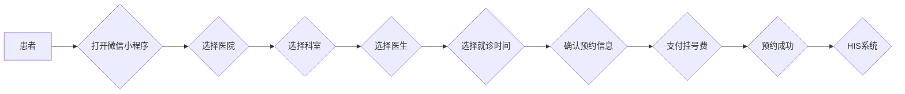

# 微信小程序大众医疗医院预约挂号服务系统

作者：禅与计算机程序设计艺术

## 1. 背景介绍

### 1.1 医疗资源分配不均衡的现状

随着我国经济的快速发展和人民生活水平的不断提高，人们对医疗服务的需求日益增长。然而，我国医疗资源长期存在着总量不足、分布不均的问题，优质医疗资源集中在大城市、大医院，而基层医疗机构的服务能力相对薄弱，导致“看病难、看病贵”的问题突出。

### 1.2 “互联网+医疗健康”的政策推动

为了解决上述问题，国家近年来积极推动“互联网+医疗健康”的发展，鼓励医疗机构利用互联网技术，优化医疗资源配置，提高医疗服务效率，改善患者就医体验。在此背景下，微信小程序作为一种轻量级应用，凭借其便捷性、易用性和广泛的用户基础，成为了医疗机构开展线上服务的理想平台。

### 1.3 微信小程序大众医疗医院预约挂号服务系统的意义

微信小程序大众医疗医院预约挂号服务系统旨在利用微信小程序的优势，为患者提供便捷、高效、优质的预约挂号服务，缓解“看病难”问题，提升患者就医体验，同时帮助医院优化医疗资源配置，提高医疗服务效率。

## 2. 核心概念与联系

### 2.1 核心概念

* **微信小程序：** 一种无需下载安装即可使用的应用，用户扫一扫或搜一下即可打开使用。
* **预约挂号：** 患者通过电话、网络等方式提前预约医院的医生号源，并按预约时间段到医院就诊的服务。
* **医院信息系统（HIS）：** 医院内部用于管理患者信息、医生排班、科室信息等数据的系统。
* **第三方平台：** 提供微信小程序开发、运营、推广等服务的平台。

### 2.2 概念间联系

微信小程序大众医疗医院预约挂号服务系统通过第三方平台接入医院的HIS系统，获取医生排班、科室信息、号源信息等数据，并将其展示在微信小程序中，供患者进行预约挂号操作。患者在小程序中选择科室、医生、就诊时间等信息，提交预约申请后，系统会自动与HIS系统进行对接，完成预约挂号操作。

### 2.3 核心流程



## 3. 核心算法原理具体操作步骤

### 3.1 获取医生排班信息

1. 通过接口调用HIS系统，获取指定日期范围内的医生排班信息。
2. 对获取到的排班信息进行解析，提取出医生姓名、科室、职称、擅长、出诊时间等关键信息。
3. 将解析后的排班信息存储到小程序数据库中，方便后续查询和展示。

### 3.2 查询可预约号源

1. 患者选择就诊日期、科室、医生后，系统根据这些条件查询数据库中对应的医生排班信息。
2. 根据医生的出诊时间和已预约号源情况，计算出可预约的时间段和剩余号源数量。
3. 将可预约时间段和剩余号源数量展示给患者，供其选择。

### 3.3 提交预约申请

1. 患者选择就诊时间段后，填写个人信息，包括姓名、性别、年龄、联系电话、身份证号等。
2. 系统对患者提交的信息进行校验，确保信息的完整性和准确性。
3. 校验通过后，系统将预约申请提交到HIS系统进行处理。

### 3.4 同步预约结果

1. HIS系统接收到预约申请后，根据预约规则进行处理，判断是否可以预约成功。
2. 如果预约成功，HIS系统会返回预约成功信息，包括预约号、就诊时间、就诊地址等。
3. 如果预约失败，HIS系统会返回预约失败原因，例如号源已满、医生停诊等。
4. 小程序接收到HIS系统返回的结果后，将预约结果同步给患者。

## 4. 数学模型和公式详细讲解举例说明

### 4.1 排队论模型

预约挂号系统可以使用排队论模型来模拟患者就诊流程，分析系统性能指标，例如平均等待时间、排队长度等。

**基本要素：**

* **到达过程：** 患者到达医院的时间间隔服从一定的概率分布，例如泊松分布。
* **服务时间：** 医生为每位患者提供服务的时间服从一定的概率分布，例如指数分布。
* **服务台数量：** 医院可同时接诊的医生数量。
* **排队规则：** 患者到达医院后排队的规则，例如先到先服务、优先级排队等。

**性能指标：**

* **平均等待时间：** 患者从到达医院到开始就诊的平均时间。
* **平均排队长度：** 医院排队等待就诊的平均人数。
* **服务利用率：** 医生提供服务的繁忙程度。

### 4.2 举例说明

假设某医院某科室每天有100位患者前来就诊，患者到达医院的时间间隔服从泊松分布，平均每小时到达20人。该科室有5名医生，每位医生为每位患者提供服务的平均时间为10分钟，服务时间服从指数分布。

**计算平均等待时间：**

```
平均到达率 λ = 20 人/小时
平均服务率 μ = 6 人/小时 (每位医生每小时可服务6人)
服务台数量 s = 5

平均等待时间 Wq = (λ / (μ * s)) * (ρ / (1 - ρ))

其中，ρ 为服务利用率，ρ = λ / (μ * s) = 20 / (6 * 5) = 2/3

代入公式计算可得：

平均等待时间 Wq = (20 / (6 * 5)) * (2/3 / (1 - 2/3)) = 20 / 9 ≈ 2.22 小时
```

## 5. 项目实践：代码实例和详细解释说明

### 5.1 技术选型

* **前端：** 微信小程序原生开发
* **后端：** Java + Spring Boot
* **数据库：** MySQL
* **缓存：** Redis

### 5.2 代码实例

**获取医生排班信息接口：**

```java
@RestController
@RequestMapping("/api/doctor")
public class DoctorController {

    @Autowired
    private DoctorService doctorService;

    @GetMapping("/schedule")
    public Result<List<DoctorScheduleVO>> getDoctorSchedule(
            @RequestParam("deptId") Long deptId,
            @RequestParam("date") String date) {
        List<DoctorScheduleVO> scheduleList = doctorService.getDoctorSchedule(deptId, date);
        return Result.success(scheduleList);
    }
}
```

**查询可预约号源接口：**

```java
@RestController
@RequestMapping("/api/appointment")
public class AppointmentController {

    @Autowired
    private AppointmentService appointmentService;

    @GetMapping("/available")
    public Result<List<AvailableAppointmentVO>> getAvailableAppointment(
            @RequestParam("scheduleId") Long scheduleId) {
        List<AvailableAppointmentVO> availableList = appointmentService.getAvailableAppointment(scheduleId);
        return Result.success(availableList);
    }
}
```

### 5.3 代码解释

* `DoctorController` 和 `AppointmentController` 是后端接口控制器，负责处理前端请求。
* `DoctorService` 和 `AppointmentService` 是业务逻辑层，负责处理具体的业务逻辑。
* `Result` 是统一的接口返回对象，包含状态码、提示信息、数据等。
* `DoctorScheduleVO` 和 `AvailableAppointmentVO` 是数据传输对象，用于封装接口返回数据。

## 6. 实际应用场景

* **医院：** 为患者提供便捷的预约挂号服务，优化医疗资源配置，提高医疗服务效率。
* **患者：** 节省就医时间，避免排队等待，提升就医体验。
* **第三方平台：** 为医疗机构提供线上服务平台，拓展业务范围，增加收入来源。

## 7. 总结：未来发展趋势与挑战

### 7.1 未来发展趋势

* **个性化服务：** 根据患者的就医历史、健康状况等信息，提供个性化的预约挂号服务。
* **智能导诊：** 利用人工智能技术，为患者提供智能导诊服务，帮助患者快速找到合适的医生和科室。
* **多渠道预约：** 支持微信、支付宝、医院官网等多种渠道预约挂号。
* **数据分析：** 利用患者就医数据进行分析，为医院提供决策支持。

### 7.2 面临挑战

* **数据安全：** 患者医疗信息属于敏感信息，需要加强数据安全防护，防止信息泄露。
* **系统稳定性：** 预约挂号系统需要保证7*24小时稳定运行，避免出现系统故障。
* **用户体验：** 需要不断优化系统功能和界面设计，提升用户体验。

## 8. 附录：常见问题与解答

### 8.1 问：预约挂号需要收费吗？

答：不同医院的收费标准不同，具体收费标准请咨询医院。

### 8.2 问：预约成功后可以取消吗？

答：可以取消，但需要在预约就诊时间前一定时间内取消，具体取消规则请咨询医院。

### 8.3 问：预约挂号后还需要排队吗？

答：预约挂号后可以减少排队等待时间，但部分医院可能还需要进行现场确认等流程，具体情况请咨询医院。
