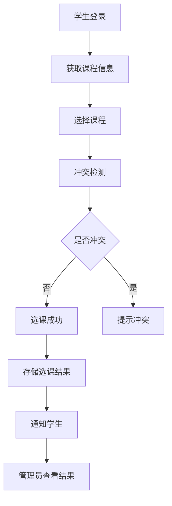
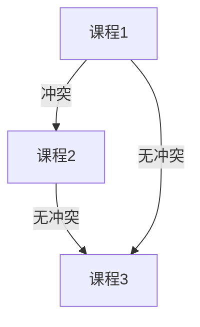

# 微信小程序的学生选课系统

作者：禅与计算机程序设计艺术

## 1. 背景介绍

### 1.1 微信小程序的兴起

微信小程序自2017年推出以来，迅速成为中国最流行的应用开发平台之一。小程序无需下载安装，用户可以通过微信直接访问，极大地方便了用户的使用体验。凭借其轻量级、跨平台和高效的特点，小程序在各行各业得到了广泛应用。

### 1.2 教育领域的数字化转型

在教育领域，数字化转型是大势所趋。越来越多的学校和教育机构开始利用信息技术来提升教学质量和管理效率。学生选课系统作为学校管理系统的重要组成部分，通过数字化手段能够极大地简化选课流程，提高管理效率。

### 1.3 选课系统的需求分析

学生选课系统是学校管理中一个关键环节，涉及课程信息发布、学生选课、课程冲突检测、选课结果统计等多个方面。一个高效的选课系统需要具备友好的用户界面、稳定的后台服务以及灵活的课程管理功能。微信小程序的出现，为学生选课系统提供了一个理想的平台。

## 2. 核心概念与联系

### 2.1 小程序架构概述

微信小程序的架构主要包括前端页面、后台服务和数据库三部分。前端页面使用WXML和WXSS进行开发，逻辑层使用JavaScript编写。后台服务可以选择Node.js、Java、Python等多种语言实现，数据库通常使用MySQL或MongoDB。

### 2.2 学生选课系统的功能模块

一个完整的学生选课系统通常包括以下几个功能模块：
- 用户管理：包括学生和管理员的注册、登录、权限控制等。
- 课程管理：包括课程的创建、修改、删除、查询等。
- 选课管理：包括学生选课、课程冲突检测、选课结果统计等。
- 通知管理：包括选课信息的发布、选课结果的通知等。

### 2.3 数据流与交互流程

学生选课系统的数据流和交互流程如下：
1. 学生登录系统，获取课程信息。
2. 学生选择课程，系统进行冲突检测。
3. 选课成功后，系统将选课结果存储到数据库。
4. 管理员可以查看选课结果并进行管理。

以下是一个简单的Mermaid流程图，展示了学生选课系统的基本流程：



## 3. 核心算法原理具体操作步骤

### 3.1 用户认证与权限管理

用户认证是系统安全的第一道防线。微信小程序可以利用微信提供的登录能力，通过微信的OAuth2.0协议进行用户认证。具体步骤如下：
1. 用户在小程序中点击登录按钮，小程序调用微信的 `wx.login` 接口获取临时登录凭证（code）。
2. 小程序将临时登录凭证发送到后台，后台调用微信的 `code2Session` 接口获取用户的OpenID和SessionKey。
3. 后台生成用户的登录态（如JWT）并返回给小程序，小程序保存登录态用于后续请求。

### 3.2 课程管理

课程管理模块主要包括课程的创建、修改、删除和查询。每个课程信息包括课程名称、课程代码、授课教师、上课时间、上课地点等。以下是课程管理的基本操作步骤：
1. 管理员登录系统，进入课程管理页面。
2. 管理员可以通过表单提交课程信息，系统将课程信息存储到数据库。
3. 管理员可以查看课程列表，进行修改或删除操作。

### 3.3 选课管理与冲突检测

选课管理是系统的核心功能之一。为了确保选课的合理性，需要进行课程冲突检测。具体操作步骤如下：
1. 学生登录系统，进入选课页面。
2. 学生选择课程，系统将选课请求发送到后台。
3. 后台接收到选课请求后，首先检查课程是否已满。
4. 如果课程未满，系统进行时间冲突检测，确保学生选择的课程时间不冲突。
5. 如果没有冲突，系统将选课结果存储到数据库，并返回选课成功信息。

### 3.4 通知管理

通知管理模块用于向学生发布选课信息和选课结果。具体操作步骤如下：
1. 管理员登录系统，进入通知管理页面。
2. 管理员可以通过表单提交通知信息，系统将通知信息存储到数据库。
3. 系统将通知信息推送到学生的微信小程序，学生可以在小程序中查看通知。

## 4. 数学模型和公式详细讲解举例说明

### 4.1 选课冲突检测的数学模型

选课冲突检测是选课系统中的一个重要环节。我们可以将选课冲突检测问题抽象为一个图的冲突检测问题。具体来说，每个课程可以看作一个节点，如果两个课程的上课时间有冲突，则在这两个节点之间添加一条边。选课冲突检测的目标是确保学生选择的课程所对应的节点之间没有边。

设 $G = (V, E)$ 是一个无向图，其中 $V$ 是节点集合，$E$ 是边集合。对于每个学生的选课请求，系统需要确保选课的节点集合 $V_s \subseteq V$ 中不存在边，即 $E_s = \{(u, v) \in E | u, v \in V_s\} = \emptyset$。

### 4.2 冲突检测算法

冲突检测算法的具体步骤如下：
1. 生成课程图 $G$，其中每个节点代表一个课程，每条边代表两个课程之间的时间冲突。
2. 对于每个学生的选课请求，获取选课的节点集合 $V_s$。
3. 遍历 $V_s$ 中的每个节点，检查它们之间是否存在边。
4. 如果存在边，则返回冲突信息；否则，返回选课成功信息。

### 4.3 举例说明

假设有三个课程 $C_1, C_2, C_3$，它们的上课时间如下：
- $C_1$：星期一 9:00-10:00
- $C_2$：星期一 9:30-10:30
- $C_3$：星期一 10:30-11:30

课程 $C_1$ 和 $C_2$ 的上课时间有重叠，因此在它们之间添加一条边。课程 $C_2$ 和 $C_3$ 的上课时间没有重叠，因此不添加边。课程 $C_1$ 和 $C_3$ 的上课时间也没有重叠，因此不添加边。

生成的课程图如下：



对于学生选择 $C_1$ 和 $C_2$ 的情况，系统检测到它们之间存在边，返回冲突信息。对于学生选择 $C_1$ 和 $C_3$ 的情况，系统检测到它们之间不存在边，返回选课成功信息。

## 5. 项目实践：代码实例和详细解释说明

### 5.1 项目结构

一个典型的微信小程序项目结构如下：

```
wxapp-course-selection/
├── app.js
├── app.json
├── app.wxss
├── pages/
│   ├── index/
│   │   ├── index.js
│   │   ├── index.json
│   │   ├── index.wxml
│   │   ├── index.wxss
│   ├── login/
│   │   ├── login.js
│   │   ├── login.json
│   │   ├── login.wxml
│   │   ├── login.wxss
│   ├── course/
│   │   ├── course.js
│   │   ├── course.json
│   │   ├── course.wxml
│   │   ├── course.wxss
├── utils/
│   ├── api.js
│   ├── util.js
├── project.config.json
```

### 5.2 用户认证代码示例

以下是用户认证的代码示例：

#### 前端代码（login.js）

```javascript
Page({
  data: {
